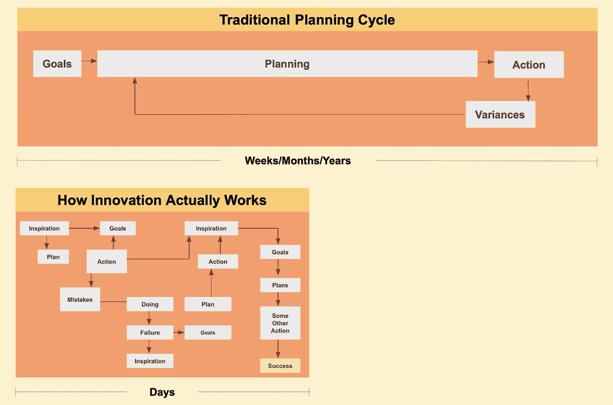

# 数据科学内部创业宣言

> 原文：<https://towardsdatascience.com/the-data-science-intrapreneuring-manifesto-3df16fe2fcfe?source=collection_archive---------39----------------------->

## 如何在一家因循守旧的公司内部成为一名数据科学企业家？

马克·帕尔默，www.techno-sapien.com

快讯:你不会在网飞、谷歌或亚马逊这样的超创新公司工作。但如果你本质上是一名企业家，你能在一家抵制变革的公司里茁壮成长吗？老牌公司的创新和初创公司的创新有什么不同？

吉福德·平肖特在他 1985 年的开创性著作《内部创业》中解决了这些问题。他研究了当时的大公司创新者，比如 AT & T、杜邦和 3M。他发现的原则[经受住了时间的考验](https://streambase.typepad.com/streambase_stream_process/2010/01/bigcompanyinnovation.html)。

如果你现在是一家大公司的数据科学家，那么你就是一名内部创业者——公司内部的创业者。因此，我更新了平肖的原则，为数据科学内部创业者撰写了一份宣言。

**1。愿意被解雇也要来工作。**超过 50%接受调查的内部创业者 Pinchot 表示，他们会为了自己的使命而拿自己的工作冒险。不，他没有鼓励令人愤慨的行为。他的意思是:要勇敢。

彼得·泰尔的[测试](https://fs.blog/2015/11/the-single-best-interview-question-you-can-ask/)是检验你是否有大胆设想的好方法:*关于*你相信没几个人认同你的说法是真的吗？内部创业者有一种打破常规的世界观，他们会努力捍卫这种世界观。

2.**做一个热心的(志愿者)冠军。**内部创业既是科学，也是福音。公司可能充满政治、无知和冷漠，所以内部创业者必须打破现状气球。平肖解释道:

> “当德州仪器(Texas Instruments)研究了 50 多个成功和不成功的新产品介绍时，一个惊人的事实出现了:每个失败的项目——无一例外——都缺少一个热情的志愿者支持者。缺少的是内部企业家。事实上，我们越关注创新，就越能发现内部创业者。”

志愿者这个词是必不可少的。没有人会要求你成为一名内部企业家；火来自内心。或者，正如休·麦克克劳德[解释的那样](https://mailchi.mp/gapingvoid/finally-the-secret-to-inclusion):告诉人们很容易；合作很难。内部创业者是一个想法的热心拥护者。一步一步来，不放弃，还是在。

[*休·麦克克劳德*](https://mailchi.mp/gapingvoid/finally-the-secret-to-inclusion) *。我经许可编辑了这篇文章。* [*原文*](https://mailchi.mp/gapingvoid/finally-the-secret-to-inclusion) *读作，“叫人上一门课，容易。”我扩大了措辞的范围，表明用数据进行观察很容易，但合作改变想法很难。*

3.**找只狐狸赞助你**。蜘蛛侠是一个隐藏在众目睽睽之下的超级英雄，随时准备出现并拯救世界。内部创业者需要一个企业蜘蛛侠。平肖称他们为赞助商。吉姆·霍尔登[称](https://www.oreilly.com/library/view/the-new-power/9781118240946/xhtml/sec22.html)为*狐狸*因为他们狡猾、强大，并且在幕后工作。

找赞助人不容易。像狐狸一样，他们并不总是在组织结构图的顶端。但他们有影响力、可信度和权威。他们和你一样热衷于你的想法。正如林·曼努尔·米兰达所说，“赞助商——他们完成工作。”找一个。

4.尽可能在地下工作——公开会触发公司的免疫系统。对许多人来说，数据科学是人工智能的代名词，是自动化的代名词，是消除就业的代名词，这造成了恐惧。恐惧产生了对数据科学等新思想的无形的公司抗体。所以尽可能长时间不被发现。宣传吸引了人们对平肖所说的企业免疫系统的关注。

西奥多·罗斯福在他 1910 年的精彩演讲中称这些人为“批评家”和“傀儡”。(我把*男人*这个词换成了*内部创业者——*女人还是男人！):

> “重要的不是批评家；不是指出内部企业家如何犯错，或者实干家在哪些地方可以做得更好的傀儡。功劳属于真正在竞技场上的内在企业家，他的脸上沾满了灰尘、汗水和鲜血；勇敢奋斗的人；谁犯错，谁一次次功亏一篑，因为没有不犯错误和缺点的努力；但是谁真正努力去做这些事情呢？谁知道伟大的热情，伟大的奉献；谁把自己花在有价值的事业上；谁最好知道最终高成就的胜利，谁最坏，如果他或她失败了，至少失败了，而大胆，所以他或她的位置永远不会与那些冷漠和胆小的灵魂不知道胜利和失败。”
> 
> -西奥多·罗斯福(“人”被“内部企业家”取代)

避免批评者和傀儡，直到需要扩大规模的时候(什么时候？#10).一开始，在后台安静地工作，像蜘蛛侠，像狐狸(#3)。

5.**规避旨在阻止你(和你的担保人)执行任务的命令**。传统的企业规划需要数月或数年时间；内部创业者一天要做几十个决定(见平肖的*内部创业者如何计划*，如下)。因此，内部创业者必须规避旨在减缓创新实际运作速度的命令。当你需要帮助时，请找你的担保人。记住，请求原谅比请求允许更容易。

*《内部创业者如何规划》，内部创业，吉福德·平肖特，1985 年*

6.做任何需要的工作，不管你的工作描述是什么。正如托马斯·爱迪生所说，“没有执行的愿景是幻觉。”

内部创业是肮脏的工作。传统的管理者倾向于授权；内部创业者偏爱行动。数据科学家搜寻数据或在数据丢失时创建数据。他们深刻理解数据。他们对利益相关者进行一对一的访谈。如果你先开火，后瞄准，你就拥有了内部企业家的 DNA。

7.**尊重你的赞助商，尊重你的数据。内部创业者出于正当的理由，恭敬地打破规则。当你走得太远时，通过让他们了解情况来尊重你的赞助商——让他们帮助你。那是他们的工作。**

8.跟随你对你选择的人的直觉，只和最好的人一起工作，坚持多样性。创业公司成功的部分原因是他们吸引了顶尖人才。现代内部企业家是技术意识的反叛者、牛仔和规则破坏者。他们在大公司里并不常见，但他们就在那里，像狐狸一样。

今天，多样性是必不可少的。正如雷德·霍夫曼所说，你团队的多样性就是它的遗传密码。所以如果你的团队是多元化的，你的选择会更好，更少偏颇。

因此，建立一个多元化的团队，团结起来，去吧。

9.除非你正在参加比赛，否则永远不要在比赛上下赌注。内部创业者都在。但他们在知道自己在跑哪场比赛之前不会全押。

再次考虑“内部创业者如何规划”的图表。请注意，有些目标被完全放弃了。这就像一家初创公司在发展过程中改变他们的商业模式，或者像疫情一样对突然的市场变化做出反应。

内部创业者在比赛之前会花时间定义比赛。然后他们拼命跑。

10.忠于你的目标，但对实现目标的方法要现实。每一个一夜成名都需要多年的努力。具有讽刺意味的是，虽然中层管理者倾向于抵制新想法，但大公司的许多高管却对这些想法过于兴奋，过于迅速。因此，在你进行内部创业时，记住风险投资的各个阶段是有帮助的——它们的融资水平对应于想法的成熟程度:

*   *种子轮*是概念阶段。对于内部创业者来说，当你决定跑哪场比赛以及如何跑的时候，呆在地下。
*   *首轮融资*是概念验证阶段。在大公司，团队会变得更大。但是不要过度推销你的想法。证明这个概念，不要告诉*每个人*这件事。培养新产品的早期采用者。
*   *B 轮*是为了上市。像大多数内部创业想法一样，大多数创业公司需要数年时间才能达到这个阶段。你已经证明了这个概念。你的产品有效。你有一个灯塔客户。这是你在大公司上市的时候。
*   *C 轮*为刻度。你的创新可以被整个公司采纳。

慢慢来。即使在大公司，新想法也需要数年才能形成规模。

**将所有这些放在一起**

在他的研究中，吉福德·平肖特发现，如果没有个人或小团体的热情投入，创新几乎不会发生。数据科学是当今创新最重要的催化剂之一，因此这一让数据发挥作用的现代化宣言值得更新、记忆和分享。

**尾注**

(1)我第一次开始实践内部创业是在 2005 年，2010 年[和 2021 年](https://streambase.typepad.com/streambase_stream_process/2010/01/bigcompanyinnovation.html)写了相关文章。

(2) *内部创业*绝版但值得寻找。你可以在亚马逊上找到用过的副本，或者在 LinkedIn 上联系我，我会分享我制作的总结它的 Powerpoint 幻灯片。