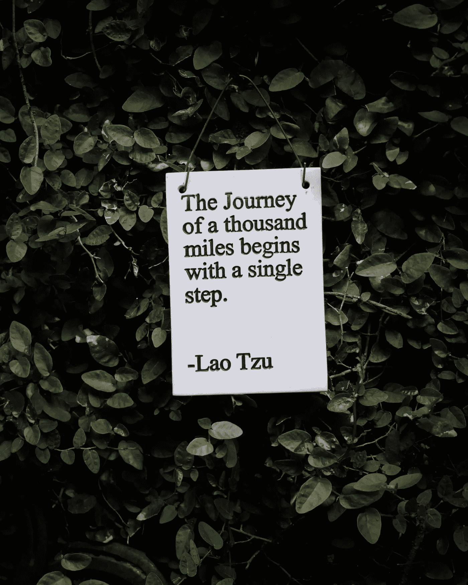

# 数据科学之旅

> 原文：<https://towardsdatascience.com/the-data-science-journey-1cac66791a?source=collection_archive---------27----------------------->

## 从新手到构建机器学习模型

照片由[海丝特·强](https://unsplash.com/@hesterqiang?utm_source=unsplash&utm_medium=referral&utm_content=creditCopyText)在 [Unsplash](https://unsplash.com/s/photos/journey?utm_source=unsplash&utm_medium=referral&utm_content=creditCopyText)

# 开始旅程

所有大胆踏上数据科学旅程的人都来自不同的背景和倾向。有些人倾向于数学，有些人有点编程或人工智能。可能对计算机科学有安慰，对统计学有恐惧，或者反之，或者两者都没有，或者两者都有。产生分歧的原因是数据科学不是必修课。所有追求数据科学的人，尽管背景不同或缺乏背景，都被一条主线团结在一起:致力于学习。

本文探索了数据科学之旅的三个阶段:Python、数据分析和机器学习。这个想法是为准备踏上旅程的学习者提供一个概述。这不是一篇技术文章(没有代码！)，而是一篇解释性的文章，强调在你大胆探索未知的过程中你可以期待什么。

# 第一段:Python

数据科学之旅通常从指南开始，无论是网站、书籍、课程、训练营、大学学位还是项目。最好的指南从 Python 开始，因为 Python 是机器学习的最佳语言，是我们最后一站要重温的数据科学之旅的终点。

代码是数据科学的语言，Python 可以说是学习如何编码的最佳语言，因为它无比清晰和简洁。Python 也是非常面向数学的，这使得它在数学人群中很流行，包括你的。它是所有流行的机器学习库的机器学习之王，包括 TensorFlow，keras，Pytorch 和 sklearn。最重要的是，Python 配备了 pandas，这是由 West McKinney 开发的最先进的数据分析库，可以快速高效地处理大数据。

有些程序，像[伯克利编码学院](https://www.berkeleycodingacademy.com/)，先教你如何编码，也就是说不假设你有计算机科学、编码或者 Python 的背景。如果你的数据科学指南需要你没有的编码背景，你可以通过 [W3schools](https://www.w3schools.com/python/) 等网站和[The Python Workshop](https://courses.packtpub.com/courses/python)*等在线课程来掌握 Python 基础知识。*现在有很多优秀的资源可以开始学习 Python，包括各种各样的电子书和 YouTube 教程。

然而，数据科学家本身并不是专业的程序员。数据科学家的任务是分析数据，并根据这些数据做出预测。他们对编程的使用很大程度上属于专门的数据科学库的领域，就像上面提到的那些，以提取洞察力并生成预测。

Python(如果你坚持的话，也可以是另一种编程语言)对于在旅程中获得动力是必不可少的。刚起步的时候，获得读写功能的舒适，就足够进步了。由于编程将在整个旅程中使用，并且专门的库在等待着，所以一点点的流畅性将大有帮助。

照片由克莱门斯·范·雷在 [Unsplash](https://unsplash.com/s/photos/journey?utm_source=unsplash&utm_medium=referral&utm_content=creditCopyText) 上拍摄

# 第二站:数据分析

在掌握了足够的 Python 基础之后，数据科学旅程的第二站就是数据分析。

数据科学侧重于大数据的分析。“大数据”是一个有多种解释的术语。多大才算大？我认为大数据是太多的数据，无法通过视觉进行分析。对于初学者来说，数万行和数十列是相当常见的。在企业和学术层面，数十亿行甚至可能被超越。

如上所述，在计算机上高效处理大数据需要像 pandas 这样的专业库。在读取数据之后，可以使用各种统计方法和图表来分析数据。新生学习一些方法，比如不管数据大小如何，如何生成散点图、回归线和直方图。在数据分析中，目标是使用图表和统计数据将大数据转化为有意义的见解。

在数据科学之旅的这一点上，房间里的大象，统计学，出现了。学习代码来生成有意义的图形是一回事；拥有分析这些图表的统计背景是另一个原因。根据指南的重点和经验，可以在这一点上获得基本的统计分析。深入体验统计学需要大学水平的课程。在第一次旅行中，学习足够的统计数据来揭示和交流要点，同时为以后打下基础通常就足够了。

许多数据科学之旅是短跑，而另一些则是马拉松。一些提供出色的统计处理，如统计学和数据科学中的 MITx MicroMasters 程序，而大多数都是初级的。我认为数据科学不是美化的统计学。从理论角度来看，统计学家是统计专家，而数据科学家是处理大数据的特定编程子集的专家。统计学家经常成为杰出的数据科学家，数据科学家应该学习更多的统计学。

让我说清楚:你知道的统计数字越多越好。如果你没有受过统计方面的训练，那也没关系，你可以一路收集要点。当你开始时，理解中位数和四分位数、均值和标准差、偏斜数据、直方图、散点图和回归线可能就足够了。专注的项目、额外的课程和教科书可以让你走得更远。

# 第三条腿:机器学习

你可以以数据分析师的身份分析数据，这是一个著名的职业，统计学在其中起着主导作用。然而，有一种区分技能将数据科学家和数据分析师区分开来:机器学习。它也更有价值:根据 PayScale(2021 年 5 月)的数据，[数据科学家的平均工资](https://www.payscale.com/research/US/Job=Data_Scientist/Salary)是 96，000 美元，而[数据分析师的平均工资](https://www.payscale.com/research/US/Job=Data_Analyst/Salary)是 61，000 美元，相差 35，000 美元。

数据科学之旅的最后一站，机器学习，是一切汇集的地方。Python 代码运行必须进行统计分析的机器学习模型。大公司经常使用机器学习来根据输入数据进行预测。从自动驾驶汽车到个人数字助理，推动我们经济发展的尖端人工智能使用机器学习算法来决定采取什么行动。

那么到底什么是机器学习呢？

洛根·韦弗在 [Unsplash](https://unsplash.com/s/photos/journey?utm_source=unsplash&utm_medium=referral&utm_content=creditCopyText) 上拍摄的照片

在机器学习之前，为自动驾驶汽车编程需要程序员初始化数千条规则，告诉汽车在特定情况下应该做什么:当发光的红灯进入摄像头时停下来。相比之下，机器学习不是由预先设定的规则编程的，而是由旨在优化和学习过去数据的算法编程的。

进一步延伸类比，你的大脑并没有预先设定好驾驶汽车的程序。相反，你的大脑每次在车上都会收集数据，并使用这些数据来做出未来的决定。我记得多年前看到谷歌的自动驾驶汽车行驶在湾区高速公路上，唯一的目的就是收集数据。机器学习算法，特别是神经网络，允许像你的大脑一样灵活地收集和实现数据。

作为一个已经建立了机器学习模型的人，我要告诉你一个小秘密:建立机器学习模型比显式编程更容易。为什么？机器学习算法为你做了繁重的工作。

关键是要理解如何使用和修改机器学习算法。像[跳板](http://springboard.com)这样的项目使这成为一个焦点，教给学生构建机器学习模型的实用路线，这些模型是令人难以置信的高效和强大。虽然学术界实践的建立机器学习模型的数学之旅对于那些从零开始建立模型的必要背景的人来说非常有价值，但没有必要完成你的第一次旅程。大多数专业数据科学家不会从零开始构建模型。他们运行、调整、解释、评估和比较世界上最好的机器学习算法。如果是别人写的，你可以用。

# 完成旅程

一旦你可以通过机器学习将原始数据转化为有意义的预测，你的第一次数据科学之旅就完成了！

一堂课，一个训练营，甚至一个完整的项目，都不是结束，而是开始。虽然你可以在就业市场一试身手，但更多的课程和项目通常是有保证的。事实上，原创项目可以将你与其他走过相同旅程的人区分开来。最好的指南会在第一时间包含原创项目。

数据科学之旅可能是有益的，也可能是痛苦的，而且速度惊人地快。挫折、恶化的错误和困惑威胁着进步。快乐的时刻、新获得的自豪感以及在强大的支持网络中工作会让你坚持下去。像许多旅程一样，你投入的和你得到的是相称的。导游应该给你指路，但是旅程是你自己承担的。

科里·韦德是伯克利编码学院<https://www.berkeleycodingacademy.com/>**的主管和创始人，他在这里向来自世界各地的青少年教授 Python、数据科学、机器学习和人工智能。他还是《Python 工作坊**[*的主要作者和《用 XGBoost 和 Scikit-learn*](https://courses.packtpub.com/courses/python) *进行渐变增强* [*的作者。*](https://www.amazon.com/gp/product/B08GSSGTYF/)**