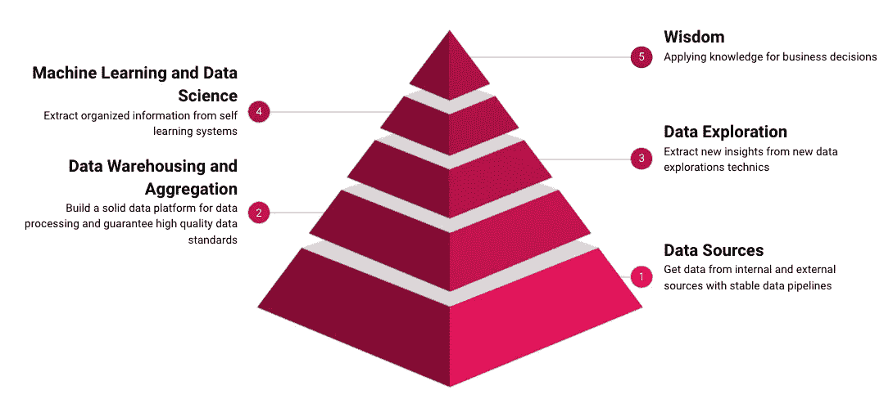

# 数据科学智慧金字塔

> 原文：<https://towardsdatascience.com/the-data-science-wisdom-pyramid-8e5d1d85ae82?source=collection_archive---------30----------------------->

## 如何建立一个数据驱动的公司

里卡多·戈麦斯·安吉尔在 [Unsplash](https://unsplash.com/s/photos/pyramid?utm_source=unsplash&utm_medium=referral&utm_content=creditCopyText) 上的照片

要了解数据科学、大数据等新主题，我建议阅读并理解一个名为数据科学金字塔的图形[1][2]。所描述的图表对每位顾问和数据驱动型员工都非常有帮助，并有助于解决各种问题，例如:

*   一家公司目前在数据相关话题上处于什么位置？
*   应该解决的大问题是什么？
*   下一个发展阶段会是什么？
*   前提条件是什么？…

因此，我想在下面的文章中提供一个易于采用的框架。

## 智慧金字塔

在看真正的智慧金字塔之前，第一步实际上可以在前面考虑。首先，当然，公司必须建立一个合适的基础设施。换句话说，应该建立一个可扩展但通常更具成本效益的云解决方案。在这里，特别是像 AWS，Google 和 Azure 这样的大公司提供了最好的条件。对于中小型公司来说，这通常是比自己构建一切更合适的方式。

智慧金字塔—作者图片

随后的阶段建立在彼此的基础上，可以被看作是独立的进化步骤。在敏捷的意义上，我们谈论的是主题，在任何情况下，在传统的意义上，我们谈论的是项目——即公司需要解决的更大的任务。

## 级别 1:数据源

之后，建立稳定的数据管道就提上了日程。在这里，我也推荐使用 Data Prep、talend 或 Alteryx 等知名且扎实的工具。由此产生的 ETL 和 ELT 过程应该在它们上线时被备份和监控——关于这个主题的更多信息可以在这里【3】阅读[。你应该永远记住，数据质量是一个非常重要的话题。否则，您可能会缺乏用户和业务部门的信任。](/five-best-practices-for-stable-data-processing-99304b18360e)

## 第 2 级:数据仓库和聚集

除了易于实施和可扩展的云服务之外，借助 ELT 等新范例，您可以非常快速地建立数据仓库、湖泊和枢纽。通过 ETL 过程和 OLAP 立方体构建一个传统的本地数据仓库经常会导致项目延期、额外的成本和 IT 经理的头痛。新的技术、方法和云让我们有可能减少设置时间，并提供更加灵活和可扩展的解决方案。此外，应避免影子 IT，并将 Excel 或其他解决方案中的功能转移到数据仓库和 BI 工具中。在为您的数据仓库或湖规划架构时，您还应该坚持最佳实践并遵循例外的层模型。

## 级别 3:数据探索

数据探索过程追求的目标是搜索和分析数据中隐含的有价值的信息。尤其是在数据量较大(大数据)的情况下，这个问题更加严重。在不丢失任何有趣内容的情况下获得要可视化的数据的概述的挑战正在增加。

照片由 [Unsplash](https://unsplash.com/s/photos/reporting?utm_source=unsplash&utm_medium=referral&utm_content=creditCopyText) 上的 [inlytics | LinkedIn 分析工具](https://unsplash.com/@inlytics?utm_source=unsplash&utm_medium=referral&utm_content=creditCopyText)拍摄

然后，数据分析师和科学家使用 Power Bi、Tableau 和其他系统等工具，以一种易于理解的方式获得新的见解或可视化信息。简而言之，这些问题如今都集中在一起，尤其是大数据带来的挑战。在这种情况下，可视化数据探索是有价值的，因为它极大地促进了对数据的洞察和知识的推导。

## 第 4 级:机器学习和数据科学

第四步包括先前获得的见解的自动化，如果必要的话，用自学系统丰富它们。今天，许多公司仍然使用初级的人工智能系统，其中一些是他们自己开发的，一些是他们购买的。在未来，这些系统将被优化，被更好的系统取代，或者完全重新思考。这需要良好的项目规划。在人工智能系统中，算法可能是科学上更有趣的部分，但在实践中，它主要是一个将系统集成到 it 基础设施和业务流程中的问题[4]。

## 第五级:智慧

> “我们在知识中失去的智慧在哪里？我们在信息中丢失的知识在哪里？”—托马斯·斯特尔那斯·艾略特

一个完全由数据驱动的公司的商业模式是基于信息的货币化。公司有[种不同的方法](/how-to-establish-new-data-driven-strategies-3797b451682a)将数据用于他们的商业案例。除了战略性地使用数据之外，企业还可以利用探索性的方法，如产生新的想法，甚至是进化性的方法，如数据仓库现代化或实施自助式 BI。无论一家公司使用什么方法从他们的数据中获得洞察力，这个过程都是不可避免的，因为只有通过理解和分析数据，企业才能成功地满足客户的需求。

## 结论

成为一家数据驱动型公司并根据数据做出决策需要五个步骤，这在所谓的智慧金字塔中有所描述。如果尚未建立适当的基础结构，甚至可能需要六个步骤。这些步骤是相互依存的，应该一个接一个地解决，因为每一步都是下一步的先决条件。这个框架曾经帮助并且仍然帮助我分析处于各自阶段的公司，并计划下一步，同时也注意到问题。

## 资料来源和进一步阅读

[1] John D. Kellner，Brendan Tierney，数据科学 s . 54–58(2018)

[2] Rowley，Jennifer，智慧层级:DIKW 层级的表示，*《信息与传播科学学报》第 163–180 页(2007 年)*

[3]克里斯蒂安·劳尔，[《数据整合——需要考虑的事情》](/data-integration-things-to-consider-d557ca97b2f1) (2021)

[4] t3n，[深度学习与数据科学](https://t3n.de/news/deep-learning-data-science-fuer-1259288/)