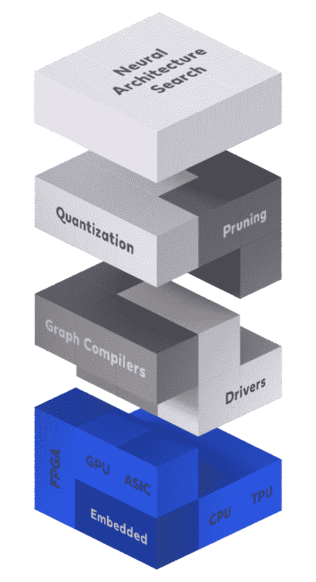
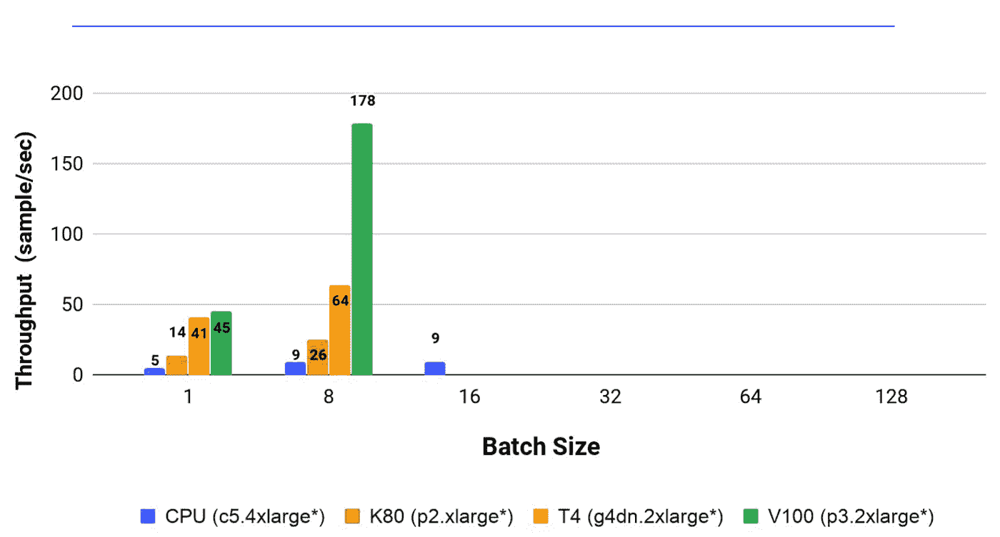
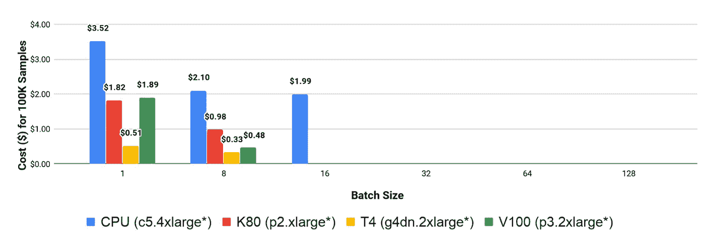

# 深度学习推理加速博客系列—第 2 部分—硬件

> 原文：<https://towardsdatascience.com/the-deep-learning-inference-acceleration-blog-series-part-2-hardware-a4d89042f5eb?source=collection_archive---------36----------------------->

深度神经网络已经成为许多机器学习应用中的常见实践。他们实现类似人类，甚至超人的准确性的能力使他们成为人工智能历史上的一个里程碑。然而，就计算能力而言，达到这样的精度水平是极其昂贵的。现代架构执行数十亿次浮点运算(FLOPs ),这给实际应用带来了巨大挑战。因此，许多优化技术已在硬件层面得到开发，以高性能和高功耗/能效处理这些模型，而不会影响其精度。难怪深度学习加速器市场火了。[英特尔最近以 20 亿美元收购了哈瓦那实验室](https://newsroom.intel.com/news-releases/intel-ai-acquisition/#gs.qa05jf)，而 [AMD 也准备以 350 亿美元收购 Xilinx](https://www.anandtech.com/show/16196/amd-in-35-billion-allstock-acquisition-of-xilinx) 。

在这篇文章中，我们继续我们的[深度学习推理加速系列](https://deci.ai/the-deep-learning-inference-acceleration-blog-series-part-1-introduction/)，并深入研究硬件加速，推理加速堆栈中的第一级(见图 1)。我们回顾了目前用于深度学习推理的几个硬件平台，描述了每个平台，并强调了它们的优缺点。

图 1:推理加速栈(图片由作者提供)

## **中央处理器**

CPU 是计算机的“大脑”,它处理指令以执行一系列要求的操作。我们通常把 CPU 分成四个组成部分:(1)控制单元——指导处理器操作的部件。它告诉其他组件如何响应发送给处理器的指令。(2)算术逻辑单元(ALU) —执行整数算术和按位逻辑运算的组件。(3)地址生成单元(AGU)—CPU 内部计算用于访问主内存的地址的组件。(4)内存管理单元(MMU) —这是指 CPU 用来分配内存的任何内存组件。

当今的 CPU 是重型硬件，包含数十亿个晶体管，设计和制造成本极高。它们包含强大的内核，能够处理大量的操作和内存消耗。这些 CPU 支持任何类型的操作，而不需要编写自定义程序。然而，它们广泛的普遍性也意味着它们包含多余的操作和逻辑验证。此外，他们没有充分利用深度学习中可用的并行机会。

**优点** —经济高效、适合通用、强大的内核、高内存容量

**缺点—** 没有充分利用并行性，吞吐量性能低

## **图形处理单元**

GPU 是一种专门的硬件组件，旨在同时执行许多简单的操作。最初，GPU 旨在加速实时计算机图形的图形渲染，尤其是游戏应用程序。GPU 的一般结构与 CPU 的结构有一些相似之处；它们都属于空间建筑家族。但是，与由几个针对顺序串行处理而优化的 alu 组成的 CPU 相比，GPU 由数千个 alu 组成，能够并行执行大量简单操作。这一惊人的属性使 GPU 成为深度学习执行的理想候选。例如，在计算机视觉应用的情况下，卷积运算的结构(其中在输入图像中的每个片上应用单个滤波器)能够有效地利用 GPU 设备的并行性。

尽管 GPU 目前是深度学习训练的黄金标准，但在进行推理时，情况并不那么清楚。GPU 的能耗使其无法在各种边缘设备上使用。例如，英伟达 GeForce GTX 590 的最大功耗为 365W。这一数量的能量不可能由智能手机、无人机和许多其他边缘设备提供。此外，从主机到设备的传输存在 IO 延迟，因此如果不能充分利用并行化，使用 GPU 就变得多余。

**优点** —高吞吐量性能，非常适合现代架构(ConvNets)

**缺点** —昂贵、耗能、IO 延迟、内存限制

## **现场可编程门阵列**

FPGA 是另一种类型的专用硬件，设计用于在制造后由用户进行配置。它包含一个可编程逻辑模块阵列和一个可配置互连层次结构，允许模块以不同配置互连。实际上，用户用硬件描述语言(HDL)编写代码，如 Verilog 或 VHDL。这个程序决定了什么样的连接，以及如何使用数字元件实现连接。近年来，FPGAs 开始支持越来越多的乘法和累加运算，使它们能够实现高度并行的电路。但另一方面，在实践中使用它们可能具有挑战性。例如，数据科学家在 GPU 上使用 Python 库(TensorFlow、Pytorch 等)训练他们的模型，并且仅使用 FPGAs 进行推理。事实是，HDL 本质上并不是一种编程语言；它是为定义硬件组件(如寄存器和计数器)而编写的代码。这意味着从 Python 库到 FPGA 代码的转换非常困难，必须由专家来完成。

**优点** —芯片、节能、灵活

**缺点** —极难使用，并不总是比 CPU/GPU 好

## **定制 AI 芯片(SoC 和 ASIC)**

到目前为止，我们描述了已经被改造以适合深度学习目的的硬件类型。定制人工智能芯片启动了一个快速发展的行业，为人工智能构建定制硬件。目前，全球有 100 多家公司正在开发用于深度学习应用的专用集成电路(ASICs)或片上系统(SOC)。此外，大型科技公司也在开发自己的解决方案，如谷歌的 TPU、亚马逊的推理、英伟达的 NVDLA、英特尔的哈瓦那实验室等。这些定制 AI 芯片的唯一目的是比现有解决方案(即 GPU)更快地执行深度学习操作。因为不同的芯片设计的目的不同，所以有训练用的芯片，也有推理用的芯片。例如，哈瓦那实验室正在开发用于训练的高迪芯片和用于推理的戈雅芯片。

制造一个人工智能芯片(ASIC 或 SoC)不是一件小事。这是一个昂贵、困难和漫长的过程，通常需要几十名工程师。另一方面，从定制人工智能芯片中获得的优势是巨大的，毫无疑问，在未来我们将看到这些芯片的广泛使用。

**优点** —显著提升推理性能的潜力

缺点**—昂贵且难以开发**

# ****我的 DL 推断应该使用哪种硬件？****

**有许多在线指南描述了如何选择 DL 硬件进行训练，但是很少有关于选择什么硬件进行推断的指南。就硬件而言，推理和训练可能是非常不同的任务。当面对选择哪种硬件进行推理的困境时，您应该问自己以下问题:我的推理性能(延迟/吞吐量)有多重要？我想最大化延迟还是吞吐量？我的平均批量是小还是大？我愿意用多少成本来换取性能？我使用的是哪个网络？**

**让我们看一个例子来演示我们如何选择推理硬件。假设我们的目标是使用 YOLO v3 执行对象检测，我们需要在四个 AWS 实例之间进行选择:CPU-c5.4xlarge、Nvidia Tesla-K80-p2.xlarge、Nvidia Tesla-T4-g4dn.2xlarge 和 Nvidia Tesla-V100- p3.2xlarge。我们首先评估吞吐量性能。图 2 显示了每个硬件选项实现的吞吐量。我们看到 V100 绝对主导了吞吐量性能，尤其是在使用大批量(本例中有 8 个图像)时。此外，由于 YOLO 模型中的并行化潜力巨大，CPU 在这一指标上不如 GPU。**

****

**图 2:四个硬件设备的批量大小与吞吐量的关系。*结果是在 AWS 机器上为 YOLO v3 测量的。**

**如果我们唯一的优先任务是优化吞吐量，那么我们已经完成了这里的工作，应该为我们的推理引擎选择 V100。然而，在大多数情况下，成本也是一个问题。为了衡量硬件的成本效益，我们用吞吐量性能除以 AWS 实例的价格，如图 3 所示。虽然 V100 实现了最佳的吞吐量性能，但它不是最具成本效益的硬件。在我们的例子中，T4 似乎是最具成本效益的硬件，尤其是如果我们使用小批量。**

****

**图 3:推断四个硬件设备的 10 万个样本的批量大小与成本。*结果是在 AWS 机器上为 YOLO v3 测量的。**

**显然，不同的模型会得到不同的结果。例如，为 CPU 设计的分类模型(如 MobileNet、EfficientNet 等。)，CPU 是性价比最高的硬件。在 Deci，只需按一下按钮，我们就可以为您生产这些基准，适用于每种型号，甚至是您的型号。你可以在这里找到更多细节[。](https://deci.ai/model-benchmark/)**

# ****结论****

**在深度学习加速系列的第二篇文章中，我们调查了用于加速深度学习推理的不同硬件解决方案。我们首先讨论了各种硬件机器的优缺点，然后解释了如何为您的推断场景选择硬件。毫无疑问，未来几年我们将看到深度学习硬件领域的热潮，特别是在定制人工智能芯片方面。**

**正如我们在上一篇文章中看到的，算法加速的改进潜力独立于硬件加速的潜力。这就是为什么在 Deci，我们决定走算法路线。我们的解决方案可以在任何硬件上使用，并且是硬件感知的，这意味着它考虑了目标硬件的不同方面。我们邀请您在我们的[白皮书](https://deci.ai/download/)中了解更多信息。敬请关注下一篇帖子。**

**最初发布于 https://deci.ai/resources/#blog[的](https://deci.ai/resources/#blog)**