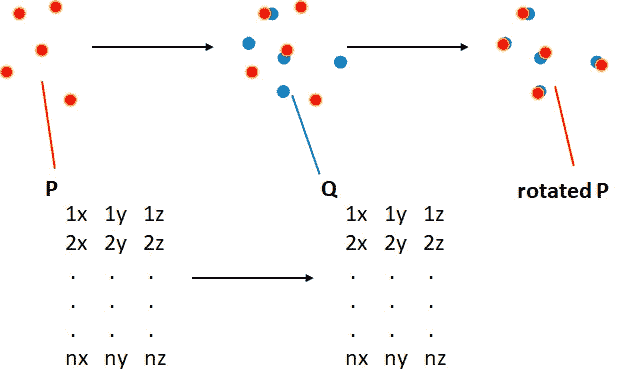

# 使用 Kabsch 算法对齐两组 3D 点的明确过程

> 原文：<https://towardsdatascience.com/the-definitive-procedure-for-aligning-two-sets-of-3d-points-with-the-kabsch-algorithm-a7ec2126c87e?source=collection_archive---------12----------------------->


对齐空间中的点集。卢西亚诺·阿布利亚塔。

## 使用 JAVASCRIPT 代码

## 上周我纠结于通过低级代码对齐两组原子坐标的问题。最终成功后，我写了这篇简短的教程，其中包含了底层的 JavaScript 代码，如果你需要的话，可以帮你减轻痛苦。

[Kabsch 算法](https://en.wikipedia.org/wiki/Kabsch_algorithm)是一种计算最佳平移和旋转的方法，可使两对点之间的均方根偏差( [RMSD](https://en.wikipedia.org/wiki/Root_mean_square) )最小化。它在结构生物信息学、分子模拟、分子建模和结构生物学研究中被大量用于叠加分子对。事实上，它被广泛使用，以至于我所知道的所有分子图形程序和库都已经包含了这方面的内置命令，通常具有丰富的特性。

但是对于我们的 moleculARweb 的虚拟建模工具包，我们需要从头开始编写代码，在较低的级别，并且最好没有外部数学库。这意味着我们需要在尽可能最基本的层次上执行所有的数学运算，而不是像在其他环境中那样调用“align()”或“kabsch()”函数。网上搜索有很多解释和代码片段；它们看起来都很简单，但是它们都有缺失的部分，或者步骤过于简单，或者干脆跳过一些步骤。

一旦我们做好了，我认为最好贴一个权威性的教程，你可以在这里找到它和 JavaScript 代码(我们的 web 应用程序需要它)。

# 用简单的数学术语来描述这个过程

给定 n 个点的 n×3 矩阵 P，其想要在 3D 空间中对准到参考矩阵 Q(相同大小)上:


用简单的方式陈述问题。下面的文本和代码描述了箭头的内容。卢西亚诺·阿布利亚塔。

主要步骤是:

**1。**将 P 居中于(0，0，0)，本质上是“从每个元素中减去整列的平均值”。那很简单。

**2。Q 也是一样，保存你减去的三个平均值，因为你在最后会用到它们。**

**3。**根据某种度量计算使 P(以 0 为中心)尽可能接近 Q(也以 0 为中心)的最佳旋转矩阵，然后对 P 进行旋转。在 Kabsch 的方法中，该度量包括最小化 Q 和旋转后的 P 之间的 RMSD

**4。**将旋转后的 P 偏移到原始 Q 所在的空间区域，只需添加第 2 步中保存的 x、y 和 z 的平均值即可。也容易。

因此，最难的部分是第二步:给定两组点 P 和 Q，每组都以(0，0，0)为中心，如何将 P 旋转到 Q 上以最小化产生的 RMSD？嗯步骤是:

**1。**把 Q 的转置乘以 p，我们把得到的矩阵叫做 H:

*H =乘法(转置(Q)，P)*

**2。**计算 H 的奇异值分解，保留第一个和第三个矩阵，在代数库中可用的大部分例程中常称为 U 和 V。**重要提示:**验证您使用的 SVD 程序是否给出了转置矩阵。大多数程序给你转置的形式，所以我称之为 Vt:

*[U，S，Vt]= SVD(H)；→我们将使用 U 和 Vt*

**3。**旋转矩阵 R 等于这个 Vt(或 V 的转置，如果 SVF 程序没有给出转置矩阵)乘以 U 矩阵的转置:

*var R = multiply(Vt，转置(U))；*

实际上，为了正确起见，您需要通过一个单位矩阵来缩放 U 的转置，如果 V x Ut 的行列式为负，则该单位矩阵的最后一个 1 被交换为-1:

*var R = multiply(Vt，multiply(eyematrixcorrectedifredentintwasnegypt，transpose(U))；*

但这很少适用于分子，事实上我们的软件中也不需要它。

**4。**最后，要得到旋转后的 P，你需要将 P 乘以旋转矩阵 R:

*var Protated = multiply(P，R)；*

请记住，在程序开始时，在最后将旋转 P 的所有元素移动到 Q 的平均 x、y 和 z 值。在 moleculARweb 中，Q 通过构造固有地以(0，0，0)为中心，因此旋转的 P 不需要平移。



总结:先平移，然后按描述旋转。卢西亚诺·阿布利亚塔。

# JavaScript 代码

有时候代码比解释更容易理解……让我们看看这一切在 JavaScript 中是如何进行的。

假设 P 和 Q 已经以(0，0，0)为中心，计算和应用旋转的 JavaScript 代码非常简单:

```
var H = multiply(transpose(Q), P);var svdH = SVDJS.SVD(H);var R = multiply(svdH.v, transpose(svdH.u));var Protated = multiply(P, R);
```

注意，这里使用了两个硬编码的函数:

```
function multiply(a, b) {
  var aNumRows = a.length,
    aNumCols = a[0].length,
    bNumRows = b.length,
    bNumCols = b[0].length,
    m = new Array(aNumRows); // initialize array of rows
  for (var r = 0; r < aNumRows; ++r) {
    m[r] = new Array(bNumCols); // initialize the current row
    for (var c = 0; c < bNumCols; ++c) {
      m[r][c] = 0; // initialize the current cell
      for (var i = 0; i < aNumCols; ++i) {
        m[r][c] += a[r][i] * b[i][c];
      }
    }
  }
  return m;
}

function transpose(matrix) {
  return matrix[0].map((col, i) => matrix.map((row) => row[i]));
}
```

还有来自 SVDJS 的 SVD 例程，来源于 svd-js 库中的 HTML，包含:

```
<script src=”[/lib/svd-js.min.js](https://molecularweb.epfl.ch/lib/svd-js.min.js)”></script>
```

<https://www.npmjs.com/package/svd-js>  

# 进一步阅读

*   解释这一过程的原始参考文献见 Kabsch 1976 年在《晶体学报:

[http://scripts.iucr.org/cgi-bin/paper?S0567739476001873](http://scripts.iucr.org/cgi-bin/paper?S0567739476001873)

*   要了解更多关于奇异值分解的知识，奇异值分解是 Kabsch 算法和许多其他计算(如主成分分析)的核心，请参见 Reza Bagheri 的文章:

</understanding-singular-value-decomposition-and-its-application-in-data-science-388a54be95d>  

*   要了解 moleculARweb 的 VMK 如何使用这些代码(消除扩散并突出内部分子动力学)，请打开该页面并查看其源代码，然后访问 main.js 并向下滚动，查找类似于 *svd* 的单词:

[https://molecular web . epfl . ch/modules/virtual-modeling-kit-2/index . html](https://molecularweb.epfl.ch/modules/virtual-modeling-kit-2/index.html)

*   要了解更多关于 moleculARweb 在浏览器中查看增强现实中的分子的应用程序，请查看:

<https://lucianosphere.medium.com/how-to-load-any-molecule-for-display-in-augmented-reality-on-molecularweb-5da0af4b64b2>  

我是一个自然、科学、技术、编程和 DIY 爱好者。生物技术专家和化学家，在潮湿的实验室和电脑前。我写我广泛兴趣范围内的一切。查看我的 [*列表*](https://lucianosphere.medium.com/lists) *了解更多故事。* [***成为中等会员***](https://lucianosphere.medium.com/membership) *访问其所有故事和* [***订阅获取我的新故事***](https://lucianosphere.medium.com/subscribe) ***通过电子邮件*** *(我为其获得小额收入的平台的原始附属链接，无需向您支付特殊费用)。*<https://lucianoabriata.altervista.org/office/donations.html>***通过各种方式捐赠到这里。* [***联系我这里的***](https://lucianoabriata.altervista.org/office/contact.html) *进行任何种类的询问。***

***到* ***咨询关于小工作*** *(关于编程、biotech+bio info 项目评估、科学推广+交流、分子数据分析与设计、分子图形学、摄影、私人课程与教程、私人课程、教学与辅导等。)查看我的* [***服务页面这里***](https://lucianoabriata.altervista.org/services/index.html) *。***