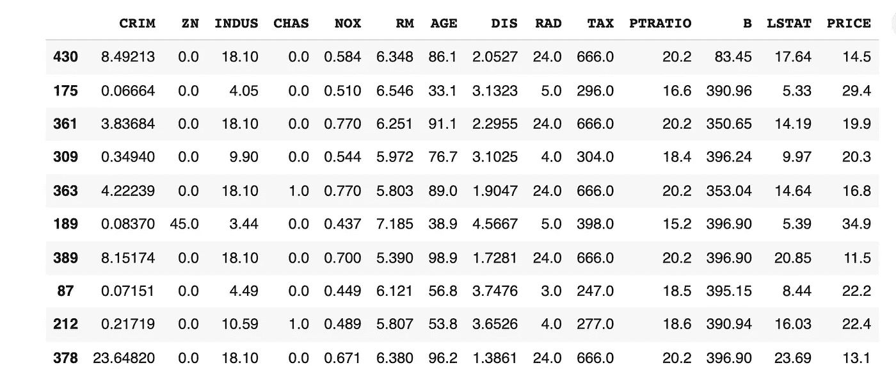

# 机器学习中处理连续变量的决定性方法

> 原文：<https://towardsdatascience.com/the-definitive-way-to-deal-with-continuous-variables-in-machine-learning-edb5472a2538?source=collection_archive---------5----------------------->

## 统计方法和工程学的结合是关键。让我们看看 KBinsDiscretizer 为什么以及如何成为 ML 工程师的朋友。


图片由来自 Unsplash.com[的](https://unsplash.com/)Pawel Czerwinski 拍摄

数据分析可以看作是一个装置(或者说是一个黑匣子；或者一个[中文教室](https://en.wikipedia.org/wiki/Chinese_room)，给定一些输入，提供输出。基于规则和基于统计(又名机器学习)的主要区别在于，前者接受训练示例和规则(“算法”)作为输入，给出**预测**作为输出，而后者期望训练示例和标签作为输入，给出**规则**作为输出。也就是说，在机器学习中，规则是从输入数据和标签之间的关系中推断出来的，而在经典方法中，规则是预先确定的，通常由人类花费数年时间试图弄清楚它们。这种差异并不像人们想象的那样微妙:例如，在科学中，这些规则通常被编码在程序中，这些程序模拟被研究的物理系统(例如[地球的气候](http://www.buildyourownearth.com/)或[粒子之间的相互作用](https://atlas.cern/tags/simulation))。另一方面，如果事先不知道这些规则是预先存在的理论框架，另一种选择可能是唯一有意义的选择。值得一提的是，在一些值得注意的案例中，如[蛋白质折叠](https://en.wikipedia.org/wiki/Protein_folding)，一种称为 [AlphaFold](https://deepmind.com/blog/article/alphafold-a-solution-to-a-50-year-old-grand-challenge-in-biology) 的机器学习方法被证明至少与更传统的方法一样成功，开启了[新的令人兴奋的可能性](https://www.nature.com/articles/d41586-020-03348-4)。

关注机器学习方法，一个非常常见的问题是如何处理**异构数据**。在大多数情况下，最终得到的输入集合要么是**分类的**标签(*例如*猫/狗/鱼，雇佣/解雇)并且可能是互斥的，要么是**连续的** ( *例如*薪水、温度、距离、身高、体重……)。如果你认为这两个群体由于其固有的性质必须以不同的方式对待，请三思或继续阅读。

首先，让我们简单回顾一下分类输入是如何处理的。最直接的方法是给每个类别贴上一个数字(整数)标签，*例如*`dog = 1``cat = 2`和`fish = 3`。虽然这个*在原则上可能*起作用，但在实践中众所周知的是，统计模型(以下简称*模型*)可能会发现一个虚构的模式，因为*例如* `fish > dog`(因为`3 > 1`)，这不太可能有任何意义。为了避免这样的问题，通常建议使用*一键*编码。在这种方法中，每个类别由一个包含 *N* 个元素(其中 N =类别数)的向量表示，除了位于对应于给定类别的索引处的 *1* 之外，这些元素都是 *0* 的。在我们的例子中`dog = (1,0,0)`、`cat = (0,1,0)`和`fish = (0,0,1)`。在这种情况下，您需要将分类特征扩展为 *N* 二元特征(如果“虚拟变量陷阱”或“[多重共线性](/multi-collinearity-in-regression-fe7a2c1467ea)”可能是所考虑问题中的一个问题，则扩展为 N-1)。然而，这并不是故事的结尾。这些指数将在**查找表**中使用，这些元素将由模型进一步处理，以匹配训练期间呈现的输出。如果您不熟悉这个概念，查找表是一个 *NxM* 矩阵，其中行数与类别数 *N* 相匹配，并且 *M* 列跨越一个通常称为*向量嵌入空间*的参数空间。查找表被称为*嵌入矩阵*。例如，如果矩阵是:

```
A = [
     [0.1, -0.2, 0.3], 
     [-0.2, 0.3, 0.1],
     [0.7, -0.4, -0.2]
]
```

那么 cat 的矢量嵌入就是`(-0.2, 0.3, 0.1)`。简而言之，该过程将*稀疏分类*转换为*密集*表示，可以根据数据的性质，通过[递归](https://en.wikipedia.org/wiki/Recurrent_neural_network)或[卷积](https://en.wikipedia.org/wiki/Convolutional_neural_network)神经网络对其进行进一步的数值处理*，例如*。至于嵌入矩阵本身，要么是在训练时学习的，要么是通过其他方式在别处计算的(这里说的是 [*预训练*](/pre-trained-word-embeddings-or-embedding-layer-a-dilemma-8406959fd76c) )。

现在，让我们回到我们最初的连续变量问题。如果你的模型是基于[决策树](https://en.wikipedia.org/wiki/Decision_tree)的，那么你可能不需要任何操作就能很好地完成。如果模型是基于神经网络，事情就不那么清楚了。一般来说，神经网络不喜欢非标准化数字数据是常识，因此某种标准化是合适的。具体做什么是一个讨论的问题，通常取决于许多因素。

首先，可以简单地将输入特征缩放(“最小-最大缩放”或“归一化”)到一个固定的范围，通常是`(0,1)`，然后将其向下游发送到模型的其余部分:


标准化公式。图片作者。

这是一种简单的方法，其主要缺点是，如果分布在整个范围内不均匀，它会将所有内容压缩到一个狭窄的范围内。很多时候，手册推荐另一个通常被称为*标准化*的程序，该程序需要减去分布的平均值并除以标准偏差:


标准化公式。图片作者。

为了使这个过程有意义，数据必须粗略地分布为高斯分布。在下面的例子中，假设的特征 *a* 可以被成功地规范化或标准化，但是特征 *b* 更有可能出现问题。


连续分布的两个例子。a)大致为高斯型，而 b)大致为指数型。图片作者。

还有一个方面必须考虑。一些特征可能是非负的，或者被限制在给定值以下，但是在其他情况下是无界的(*例如*薪金)。其他的可能是双向无界的(*例如*向左或向右的距离)，或者甚至呈现围绕 0 的对称性(如许多三角函数)。此外，训练数据在极端情况下可能没有足够数量的示例，因此缩放参数(平均值、最小值/最大值、标准值)可能不能代表较大的总体。推理时出现的任何异常值都不会被正确处理，可能会导致意外的行为或令人困惑的结果(对于`X > Xmax`有`X’>1`)。

## 一个规则来统治他们

我相信有一种强大的方法来标准化数据，这并不新鲜，但由于某种原因，在讨论这个话题时很少提到它。这些是步骤:

1.  将数据汇集到 *N* 个箱中，以构建特征的直方图。如果训练数据量允许，通过计算分布的[分位数](https://en.wikipedia.org/wiki/Quantile)找到最优边界(在这种情况下，仓将被不均匀地隔开)；
2.  用条柱索引替换输入特征，并将其视为分类输入(*即*)该值对应于哪个条柱？);
3.  使用查找表来提取每个箱的密集矢量嵌入；
4.  通过矢量嵌入下游。

如果您遵循这些简单的规则，那么输入要素是否具有不同的范围(*例如*工资和离工作地点的距离)、**异常值不会导致无效输出**并且不同要素之间的**相关性**在很大程度上得以保留。此外，直方图比数值更稳健还有一个理论上的动机。在现实生活中，连续输入特征是测量的结果，原则上伴随着不确定性，但为了简单起见，这一方面通常被忽略。即使事实并非如此(想想薪水)，直觉上，无论如何**将投入分成不同的类别**可能更有意义(例如*低收入对高收入)。还值得一提的是该方法的扩展，其中用函数形式(*例如*多项式或指数)拟合分布，然后**使用拟合函数的分位数代替直方图**。最后，通过这种方法，**回归任务变成了分类任务**:通过量化目标分布，游戏的名称是识别相应的 bin 而不是“精确的”数值。你可能听说过所有的分类问题实际上都是带有离散目标变量的回归问题，这当然是真的。但它的对立面也是如此。*

好消息是:在 [scikit-learn](https://scikit-learn.org/stable/) 库中有一个 [KBinsDiscretizer](https://scikit-learn.org/stable/modules/generated/sklearn.preprocessing.KBinsDiscretizer.html) 类，它实现了上面讨论的大部分内容。

## 使用 TensorFlow 2.x 实现

为了让事情更清楚，我准备了一个基于 [TensorFlow](https://www.tensorflow.org/) 2.x 的量化特征嵌入层的简单实现。要进行全面的测试，请随意使用[这款 Google Colab 笔记本](https://colab.research.google.com/drive/1Ja5C1vI6mEgahIUTuWEkRf9dV71TAZai?usp=sharing)。

首先，您需要量化输入要素。我强烈建议使用来自`scikit-learn`的`KBinsDiscretizer`类，但是同样的过程可以通过使用`numpy.quantile`函数重新创建。

输入要素可能如下所示:



原始输入特征。图片作者。

在对每个特征用 5 个箱进行量化之后，我们得到这样的结果:


量化输入特征。图片作者。

此时，我们需要从 TensorFlow / Keras 创建一个`[Embedding](https://www.tensorflow.org/api_docs/python/tf/keras/layers/Embedding)`层的扩展。在最初的实现中，嵌入矩阵是由令牌 id 索引的 2D 对象。在我们的例子中，我们需要一个额外的维度索引，这是嵌入所涉及的特征，所以总的来说这是一个 3D 张量。幸运的是，`gather_nd`函数允许我们使用 2D 张量索引从 3D 张量中选择条目。这听起来很复杂，但实际上并不复杂:它所做的只是选择嵌入在 2D 查找表中的向量，该查找表由(特征 id，令牌 id)索引:

您可以像使用常规嵌入层一样使用该层，例如:

用 100 个时期的每个特征 5 个箱来训练模型产生可接受的结果，在损失中有一些过度拟合的迹象，但是考虑到我们没有进行任何优化，仍然处于合理的水平。最终(稀疏)准确率在 65%左右。


每个特征有 5 个箱的模型的稀疏分类损失。图片作者。


每个特征有 5 个箱的模型的稀疏分类精度。图片作者。

此时，如果您想将预测的 bin 转换为实际数字(在本例中为房价)，您可以在 bin 的边界内抛出一个随机数(均匀或高斯)，或者只提供平均值(*即*bin 中心)。我们可以说，容器越多，最终预测就越准确，但是您还需要更多的训练示例来拟合更多的参数。

总而言之，特征量化(或离散化)是一种技术，它允许人们以一致的方式操纵连续的和可能无界的输入，并将回归问题转化为分类问题。

关于生成模型的最后一句话:我本人参与了一个项目，开发了一个 GAN 来模拟大型强子对撞机[ [JHEP08(2019)110](https://link.springer.com/article/10.1007/JHEP08(2019)110) ]上粒子之间的相互作用，其中一些输入特征跨越几个数量级，一些仅是正的但无界的，其他的是有界的并显示轴对称。当时，我并不知道这种技术。事后看来，特征量化可以省去我们许多思考和麻烦。同样，我怀疑这种方法对自动编码器[有用。](https://en.wikipedia.org/wiki/Autoencoder)