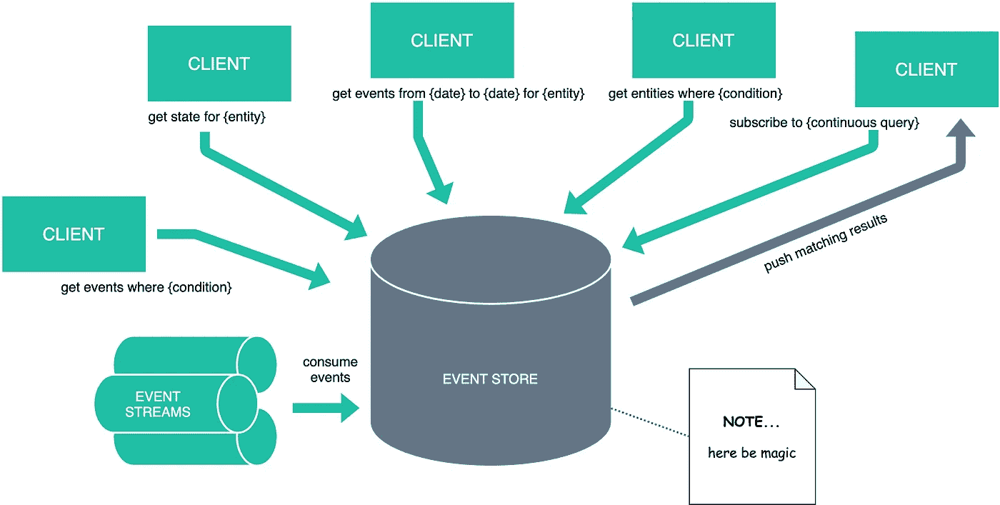
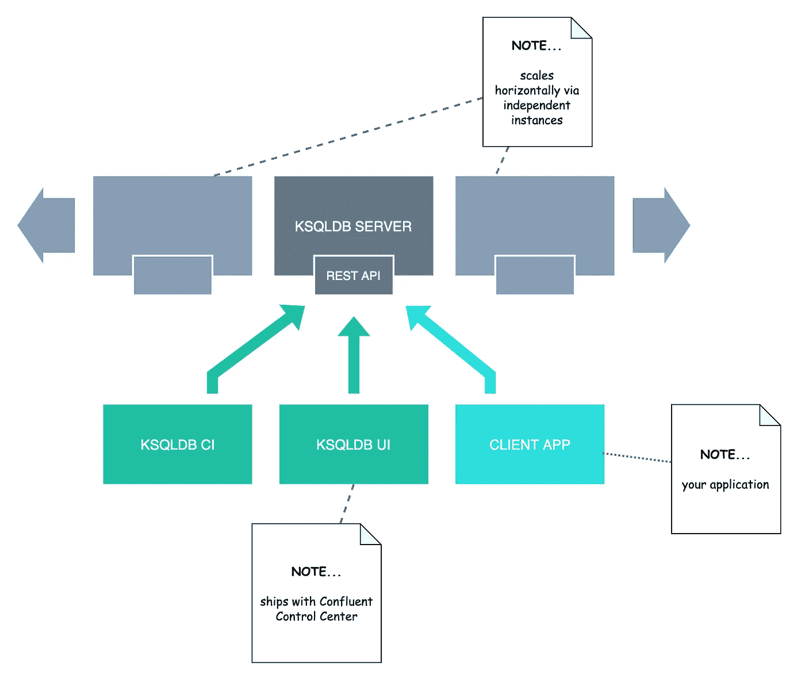
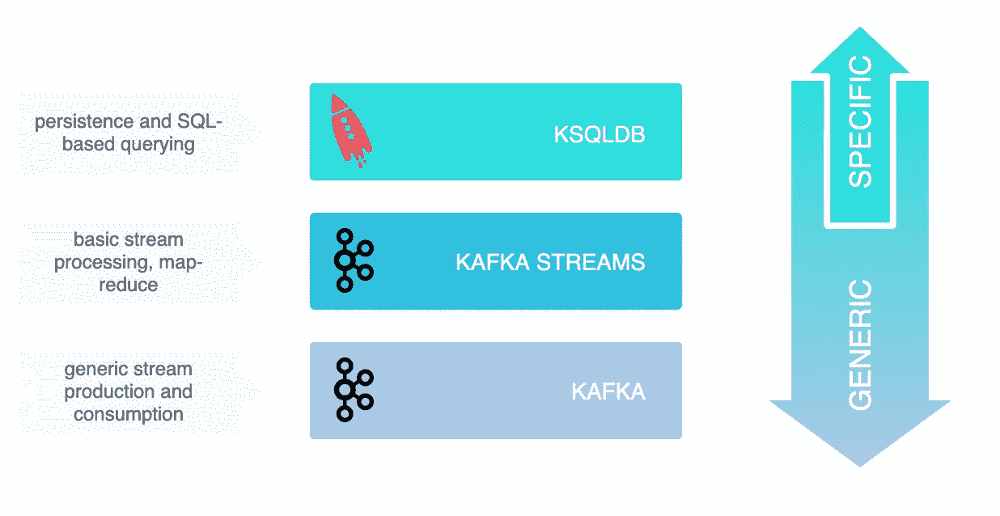
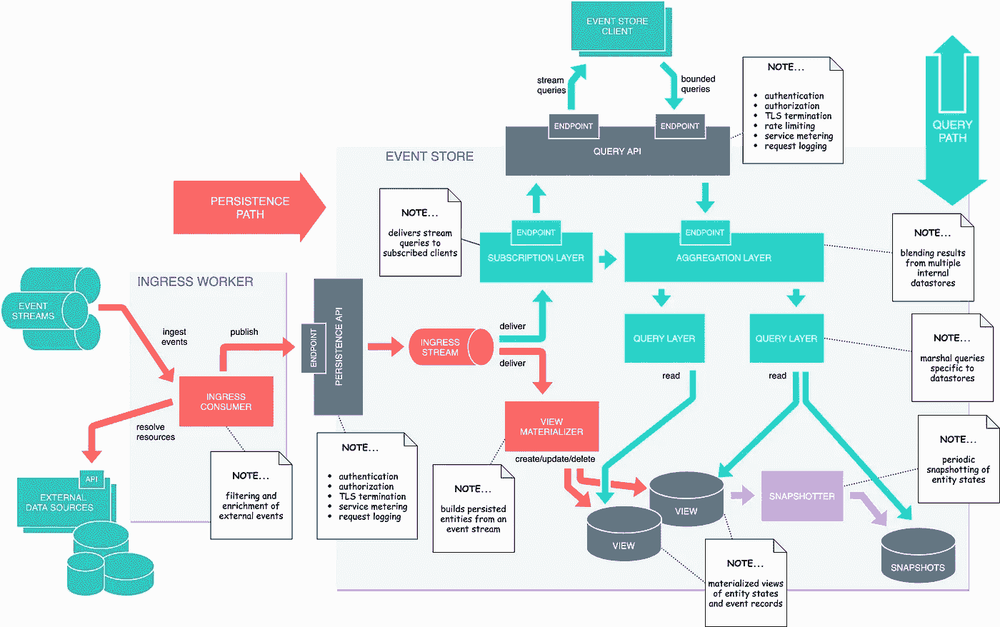

# 事件商店的设计

> 原文：<https://towardsdatascience.com/the-design-of-an-event-store-8c751c47db6f?source=collection_archive---------3----------------------->

## [理解大数据](https://towardsdatascience.com/tagged/making-sense-of-big-data)

## 超越事件采购之路

最近，“事件驱动架构”、“事件流处理”和“事件源”这两个主题引起了相当大的反响。虽然这些概念并不新鲜，但似乎直到现在，软件工程社区才开始意识到构建自治的、松散耦合的系统的能力和灵活性，这些系统能够智能地对事件做出反应，而不是被告知该做什么。

既然我们的行业已经赶上了事件驱动的潮流，我们中的一些人开始超越我们通常的构建模块——卡夫卡、脉冲星和 NATS 流——来解决长期持久性和智能检索事件的问题。当然，我们谈论的是一个**活动商店**。

# 近似的定义

当考虑事件商店时，我们应该问自己的第一个问题是:*什么是事件商店？*

目前，事件存储的规范定义还不存在。对于事件存储应该做什么，每个人都有不同的理解，尽管大多数从业者已经同意，鉴于我们对这种架构范式的持续投资，一个容易查询、长期持久的事件记录存储可能是合适的。

“事件记录库”本身听起来很难令人信服。实际上，像这样简单的事情可以很容易地用数据库或者甚至是 Kafka 本身来完成。(就此而言，还有其他事件流平台。)表面上，从业者不会创造一个术语，除非它有自己的价值。因此，我们将注意力转向“可查询”部分。

我们知道使数据库强大的一点是它的查询能力。有很多方法可以查询事件。回想一下，事件是过去某个时间点发生的一些(大概)有趣行为的不可变记录。因此，首先，我们可能希望按时间范围查询事件记录。接下来，我们可能希望通过某些属性或关系来过滤事件。例如，“查找引用客户 X 和 Y 的事件”。

通过观察一系列离散的、按时间顺序排列的事件，我们可以准确地重建这些事件所适用的实体的状态。至少，我们应该能够重建它的可观测状态。(其中“可观察到的”意味着一个特征，其变化由伴随的事件记录充分描述。重构可观测状态是事件源的本质。如果一个事件商店以某种方式增加了制定事件源的能力，难道不是很方便吗？

想象一个复杂的事件存储库，它不仅保存事件记录，而且知道如何从它们中获得有形的状态。这给查询增加了一个新的维度；我们不仅可能对原始事件感兴趣，还可能对应用这些事件的衍生产品感兴趣——最终的实体状态。假设有一个事件存储，它聚集了金融交易——客户账户的借贷。可以想象，像“查找余额大于 X 的所有客户”这样的查询确实非常引人注目。同样吸引人的可能是诸如“在时间 T 获得客户 X 的状态”的查询。

# 事件存储交互的心理模型

在上图的基础上，下图展示了与事件存储交互的概念性思维模型，描述了一些常见的用例。

与假设事件存储库交互的心理模型。[图片由作者提供]

上面的模型引入了一个全新的用例——一个之前没有讨论过的用例。到目前为止，查询都采用请求-响应的交互方式，其中*查询在有限的时间*内完成。但是，我们在这里处理的是事件，事件随时都有可能发生！本着事件驱动架构的精神，我们添加了另一个用例——**连续查询**。连续查询像常规的有界查询一样开始，返回包含那些在查询提交时匹配查询谓词的事件(和实体)的响应。不同之处在于，连续查询在返回其初始答案集时不会终止，而是提供满足查询谓词的附加答案，直到客户端显式关闭查询。

我们也没有谈到事件如何进入事件存储。在传统的数据库中，可以使用一个`INSERT`语句来填充记录，使用一个`UPDATE`语句来修改记录。根据他们的定义，**事件是不可改变的**——它们准确地描述了过去发生的事情，历史(令我们非常遗憾)是无法改变的。事实上，对于活动商店来说，没有一个类似于`UPDATE`的声明。当然，实体状态可能会被更新，但是只能作为插入到存储中的事件的直接结果。

事件记录进入事件存储有两种方式:

1.  **推送**方法，其中我们显式地将记录保存到事件存储中。这直接相当于一个`INSERT`语句。
2.  事件存储可能**从事件流中提取**记录。这种方法体现了事件驱动架构背后的“反应式”哲学。

# 卡夫卡——事件商店的候选者？

现在我们对什么是事件存储有了一个大概的了解，下一个逻辑问题可能是:【Kafka 可以用作事件存储吗？

**TL；博士:卡夫卡不是事件店；更确切地说，它是构建事件存储的推动者。**

对于最琐碎的用例，Kafka 对无限保留的支持，结合每个实体的记录键控、墓碑和主题压缩，可以用来构建一个非常基本的事件存储。此外， [KIP-405](https://cwiki.apache.org/confluence/display/KAFKA/KIP-405%3A+Kafka+Tiered+Storage) 目前正在考虑的分层存储功能突然意味着我们可以像老板一样自信地围绕*大数据*等术语开玩笑。压缩保留了记录消费的传统语义，并允许适度有效的记录重放，以从压缩的主题中重新构建状态快照。这就是*事件源*排序。但综合考虑所有因素，称 Kafka 为一般情况下的事件存储有点牵强:它没有将离散事件映射到持久实体，也没有提供什么查询方式。例如，如果不处理整个流，我们就无法查找特定的实体。这是为什么呢？

Kafka 是一个事件流平台，围绕精细事件的捕获和这些事件在多样化的消费者生态系统中的有效分发进行了优化。有效形容词是*高效*；Kafka 以惊人的速度移动数据，并支持大量连接的应用程序，但为了实现这一点，它做出了几项故意的设计妥协。我已经在本文中详细描述了它们，但是它们还是值得一提的。两个最相关的是(1)它的存储子系统的组织和(2)客户和经纪人之间不均衡的劳动分工。

在第一点上，Kafka 以一种简单的、日志结构的方式对事件数据进行排序，使用只附加日志段来实现记录持久性。自然，有一个主键的概念——记录的*偏移量*。还有一个不太为人所知且很少使用的非唯一二级索引—记录的*时间戳* —消费者客户端可以使用它来查找日志中的特定位置。除了时间戳索引之外，Kafka 没有用户可定义的二级索引的概念，这种索引可能有助于对关系数据库或 NoSQL 数据库自由执行的范围和谓词查询。

> ***注:*** *卡夫卡日志是否真实* append-only *看你问谁了。从生产者的角度来看，日志是仅附加的，因为它不能直接删除或修改现有记录。但是经纪人可以。作为制定保留和压缩策略的一部分，它可以修剪日志，甚至删除单个记录。*

关于第二点，Kafka 经纪人将超过公平份额的加工委托给客户——生产者和消费者。这包括在累加器中暂存记录、散列记录键以获得正确的分区索引、对记录进行校验和以及压缩记录批次。相反的情况发生在消费者身上。当数据到达代理时，它处于适合立即持久化的状态，代理只需要很少或不需要额外的处理。正是这种优化使*零拷贝*(无处理器 I/O)成为可能，并赋予 Kafka 其著名的吞吐量。

上面提到的设计决定意味着 Kafka 本质上是为低级记录流而优化的。Kafka 不仅缺乏成熟的事件存储所需的数据转换和索引功能，而且这些功能也极不可能被引入。(这样做会使第一点变得非常复杂，并与第二点相矛盾，这将与卡夫卡标志性的以表现为中心的品质相矛盾。)此外，在 Kafka 之上，其他框架已经做了一些这样的工作。言外之意:卡夫卡今天不是一个事件商店，将来也不太可能成为。

尽管听起来很可怕，但这不一定是件坏事。Kafka 没有强迫我们进入一个通用的现成事件存储库并相应地扭曲我们的应用程序架构，而是提供了我们需要的所有工具来实现一个根据我们的特定需求定制的事件存储库。从长远来看，这种方法可能会带来更好的结果，但它也不是没有代价的——上市时间是最显著的代价。我见过许多基于 Kafka 构建的定制的事件驱动系统，它们从长远来看非常成功。(我也见过一些其他类型的例子。)

# 考虑一个活动商店

所以，如果卡夫卡不是，那什么是？我们是否应该挑选一个 GitHub 明星最多的现成“活动商店”包，并让它发挥作用？

> ***注:*** *根据经验，无论出现什么问题，SAP 或 Oracle 总会向您提供一个令人放心的昂贵解决方案，并附带一份强制性的百万人年支持合同。出于对理性的尊重，我们还是解除这个选项吧。开源，自己开发，两者都有，或者什么都没有。*

评估活动商店(现成的解决方案或定制的设计)时，最好从您的业务和技术需求入手，特别要注意非功能性。

1.  您需要您的可查询投影有多细粒度？粗粒度的投影是否足够，或者是否需要子实体查询？
2.  数据将如何被消费？您期望同步请求-响应风格的访问模式，还是应该(近乎)实时地将数据推送给其消费者？后者的一个例子是*连续查询*，它实际上是一个谓词驱动的订阅模型，向客户端交付一系列更新。
3.  一个实体的最新状态是否足够，还是需要一个完整的突变历史？留任会受到限制吗？如果是，是按年限还是按消耗的存储空间？
4.  您将查询主键还是其他属性(包括元数据)？这些数据可以进行内容搜索吗？您需要地理空间索引吗？
5.  针对以上观点，数据是结构化的还是半结构化的？您将支持数据迁移和重新索引吗？(提示:答案几乎总是*‘是’*，即使一开始看起来可能不是这样。)
6.  您是否需要具有时间点和日期范围查询的突变的时间序列视图？需要开窗和聚合吗？
7.  你会使用流连接操作符吗？(来自多个流的更新被合并，很像关系数据库连接。)
8.  事件是独立的，还是要从多个外部数据源中丰富投影数据？如果这些资源不可用，会发生什么？
9.  实体会用简单的“补丁”逻辑重新构建，还是需要复杂的地图简化功能来构建投影？
10.  需要考虑数据的时间价值。实体是否无限期保留？您需要对失效的数据进行垃圾收集吗？
11.  您需要归档功能还是存储分层？(存储分层是将不经常访问的数据重新定位到较慢的 I/O 设备，以扩展容量，同时限制成本。)
12.  应该从一开始就考虑数据一致性模型，因为一致性保证是由基本设计决策支持的，这些决策很难(理解为:昂贵)逆转。连续读取应该是单调的吗？读取应该观察前面的写入吗？因果顺序是否足够，或者是否需要更强的顺序保证(例如 FIFO)？您将如何处理一个实体内的并发更新和原子性，以及跨多个实体的粗粒度事件？需要事务隔离和序列化语义吗？
13.  错误应该被容忍吗？更重要的是，哪些错误应该被容忍，代价是什么？例如，系统应该如何响应网络分区:应该牺牲*可用性*还是*一致性*？(如果你还不熟悉 CAP 定理，现在是个好时机。)
14.  您的组织中是否有具体的信息安全政策来约束数据的获取、处理、存储和向利益相关方展示的方式？断然的“不”很少是答案；即使您的组织缺乏专门的信息安全职能，最终也会有一个负责任的利益相关者充当事实上的数据保管人。
15.  您是希望有一个相当稳定的负载分布，还是希望系统能够弹性伸缩以适应变化的负载？在这方面，事件驱动的系统往往能力很强，尤其是围绕 CQRS 和事件源模式构建的应用程序，其中产生的预测遵循单个写入者原则。也就是说，以数据为中心的系统总是受到 I/O 的限制，任何数据存储都不能无限扩展。此外，可伸缩性不是免费的，并且通常要与其他非功能性进行权衡；比如一致性。一个可线性化的系统可以利用少得多的优化，并且比一个满足最终一致性的系统受到更多的约束。一个讲技术的高管会多次兜售“无限可伸缩性”议程，而没有对这意味着什么的基本理解；小心以这个坑为家的蛇。
16.  当您系统(或部分系统)出现故障时，您的恢复时间目标是什么？您希望系统通过冗余来解决故障，并在故障节点停止的地方继续处理吗？或者，您会容忍系统通过重放事件来重建故障前的状态吗？

这不是一个完整的列表，但足以说明问题的广度。无论是现成的解决方案还是定制的解决方案都不可能单独满足您的所有需求，尤其是考虑到上面概述的一些非功能性需求是相互排斥的。例如，一致性总是以可用性为代价，而我们对此无能为力。

# 通常的嫌疑人

虽然我们对活动商店的要求可能是定制的，但这并不意味着我们的问题不能用现成的解决方案来解决。根据个人需要，一些开源软件包可能符合要求。一个很好的例子是 [ksqlDB](https://github.com/confluentinc/ksql) :一个流处理框架，带有一个持久化和查询层，是为 Kafka 设计的。ksqlDB 允许您从原始事件流构建持久的投影。(ksqlDB 以前叫 KSQL。)您可以使用熟悉的类似 SQL 的语法查询这些投影，就像您通常使用关系数据库一样。它还允许您运行连续的查询，当查询结果到达时，就会推送到客户端。下图概述了 ksqlDB 架构和核心组件。

ksqlDB 架构和核心组件。[图片由作者提供]

关键组件包括:

*   **ksqlDB 引擎**:执行 SQL 语句和查询。通过编写 SQL 语句来定义应用程序逻辑，引擎在可用的 ksqlDB 服务器上构建并运行应用程序。每个 ksqlDB 服务器实例运行一个 ksqlDB 引擎。在底层，引擎解析您的 SQL 语句并构建相应的 Kafka Streams 拓扑。
*   **ksqlDB CLI** :为 ksqlDB 引擎提供一个带有命令行界面的控制台。使用 ksqlDB CLI 与 ksqlDB 服务器实例进行交互，并开发您的流应用程序。ksqlDB CLI 旨在为关系数据库(如 MySQL 和 Postgres)的用户所熟悉。
*   **REST 接口**:支持从任何 REST 客户端与 ksqlDB 引擎进行通信，包括 CLI。合流控制中心附带的 ksqlDB UI 也通过 REST 接口与 ksqlDB 交互。

当您部署 ksqlDB 应用程序时，它运行在相互独立的 ksqlDB 服务器实例上，可以容忍故障，并随着负载而扩展。

正如您所料，ksqlDB 并非没有局限性；其中一些相当值得注意。例如，您不能通过查询外部源来创建丰富事件的规则，也不能查询特定实体的事件历史。它也不支持状态快照(列表中的点*# 16*)—**节点故障可能需要相当长的时间来修复**。

[Kafka Streams](https://kafka.apache.org/documentation/streams/) 是 Kafka 的*事实上的*流处理库，与 Java 客户端库一起发布。它嵌入到 Java(或任何基于 JVM 的)应用程序中，负责传统的 map-reduce 风格的事件流处理。它为您提供了一个标准的 DSL，用于描述处理阶段和到您选择的接收器的流输出。碰巧的是，ksqlDB 是使用 Kafka 流构建的。Kafka Streams 在堆栈中的位置比 ksqlDB 低。后者是一个完整的产品，而前者是一个库。Kafka Streams 可以很好地补充 Kafka，以开发一个事件商店。Kafka、Kafka Streams 和 ksqlDB 之间的关系概述如下。

卡夫卡、卡夫卡流和 ksqlDB 的关系。[图片由作者提供]

我们可以继续。Kafka 兼容的流处理平台令人印象深刻，包括 Apache Flink、Spark 和整个 Hadoop 生态系统。它们可能是你工具箱里的好东西，但归根结底，它们只是工具。

设计事件存储的最佳方式是从外部查询需求开始，一直到持久层。从 API 和查询 DSL、聚合层、数据库和索引、事件消费和丰富开始。在你决策过程中的每一点都要持续关注非功能性。例如，如果您需要严格形式的一致性，那么面对网络分区，您可能会被排除在某些支持可用性的 NoSQL 数据库之外。

# 参考设计

一旦需求达成一致，所有不明确的地方都解决了，我们就需要开始设计我们的事件存储。虽然没有一个“放之四海而皆准”的设计可以让我们轻松采用，但架构师偶尔会求助于**参考模型**(或*参考架构*)来帮助引导设计过程的剩余部分。从本质上讲，参考模型是一种元设计，可以用来播种具体的设计。我们首先采用参考模型，丢弃不必要的部分，并根据我们的需要修改剩余部分。

下图描述了事件存储的参考模型。

事件存储的参考体系结构。[图片由作者提供]

# 坚持

从接收端开始，我们可能希望以“拉”的方式使用现有事件流中的数据，或者我们可能希望将数据“推”到事件存储中。该参考模型使用“推送”风格的**持久性 API** 对入口路径进行概括，其中记录被显式地插入到事件存储中。这种方法的好处是，它可以通过添加一个**入口工作器**来轻松适应“拉”模型，该工作器从事件总线(如 Kafka)或消息代理中拉出事件，将记录转换为某种标准化形式，并通过提供的 API 将它们推入事件存储。转型阶段可能相当复杂。例如，入口工作器可以通过从外部系统或数据库解析某些实体来丰富事件。由于是特定于应用程序的，所以不存在“通用”丰富器这样的东西；在除了最琐碎的应用程序之外的所有应用程序中，入口工人几乎肯定是定制的。因此，将入口阶段与事件存储体系结构的其余部分分开是有好处的。

持久性 API 充当各种网关，处理日常的入口问题，例如安全策略实施——身份验证和授权，以及 TLS 终止和请求日志记录。可以想象，您可能希望将自己新奇的事件存储作为服务提供，在这种情况下，持久性 API 可能需要实现某种形式的使用计量。

接下来，我们需要关注我们的持久性需求。这本质上是异步的，这意味着我们可以利用内部事件总线来持久地缓冲进行中的事件记录，直到它们最终在视图中具体化。这也考虑到了背压:API 可以立即响应客户端而不会阻塞，而不管积压事件的数量。

持久记录的异步性值得进一步说明。与传统的数据库记录不同，事件记录是不可变的。它们被附加到连续的日志中。不存在违反某些引用完整性或唯一性约束的问题，重复插入可以通过幂等性轻松处理。唯一需要考虑的潜在错误是插入带有冲突事件键的非重复记录。就这一点而言，我们的持久性 API 可能会提供一个异步钩子来通知客户端错误。方便的是，中间事件总线允许我们将*单写原则*应用于投影的更新，处理并发问题并通过串行化避免无序写入。

一旦记录在内部总线上，它们的后续处理分为以下独立阶段—

1.  跨事件存储内部的一个或多个持久性视图，创建或更新事件记录中描述的实体。我们说“一个或多个”是为了说明多模型持久性的前景；参考模型假设实体可能被写入不同的持久性堆栈(例如，键值*对*文档*对*图)，这取决于您的检索需求。
2.  通过查询订阅层过滤事件记录。这说明了任何开放的连续查询，其中查询谓词匹配所讨论的事件记录或实现所述记录的副作用。参考模型并没有具体说明如何在订阅层实现谓词匹配。

# 询问

我们现在将注意力转向**查询 API** 。这个 API 充当所有以查询为中心的活动的外观，促进了连续查询和常规查询。像持久性 API 一样，查询 API 也是一个网关。(实际上，您可能会使用一个现成的 API 网关产品来支持这两个 API。)两种查询类型的端点可以选择性地分开；例如，常规查询可能通过 HTTPS 提供，而连续查询可能使用安全 WebSockets (WSS)。可以使用 gRPC 之类的替代协议，并且可以将两种查询类型统一到单个端点中。gRPC 可能是一个很好的选择，因为它本身支持客户端发起的 RPC 样式和服务器发起的通信模式。

回想一下，参考模型允许事件和实体分散在几个视图中。因此，该模型包括一个聚合层，它将几个查询的结果合并成一个单一的、内聚的响应。实现聚合层的起点可能是 GraphQL 或 OData。紧接在聚合层下面的是特定于视图的查询层。查询层抽象了底层的数据持久性和相关的查询技术。

一个重要的注意事项:在这个参考模型中显示的分解纯粹是在逻辑层次上。总的来说，这里显示的组件是封装特定关注点的模块；没有假设这些模块是独立的服务、容器、传统的过程或类/功能/包。

# 给…拍快照

下一个用例可能看起来有点深奥，但是(根据经验)它在某些应用程序中是有用的。给定一系列最近的事件，查询被引用实体的更新状态是很自然的。但是，如果您正在查询某个实体(比如一个客户)一年前发生的历史事件的时间线，该怎么办呢？您可能想知道这些事件如何影响客户的状态—对于由时间间隔划分的有限事件序列，起始状态是什么，与结束状态相比如何。这个看似简单的查询很难计算。给定一个开始状态和一个相当短的事件序列，获得结束状态通常是微不足道的。然而，起始状态可能与客户的初始状态相差好几年；计算它需要对潜在的大量事件进行强力重放。

快照通过在特定时间点保存实体的“关键帧”快照，并将每个快照标记为用于具体化相应实体的最近事件，来加速事件的重放。为了计算实体在时间 *T* 的状态，用比 *T* 旧的最近可用快照 *S* 播种实体状态，并连续应用在 *S* 的标记事件和 *T* 之间发生的所有事件。快照的频率越高，我们就能越快地得出我们的起始状态。

> ***注:*** *“关键帧”比喻借用视频压缩。关键帧是视频流中一系列增量编码过渡帧之间交错的完整图像。尽管在不加区别地使用时不如仅存储增量有效，但关键帧允许在视频流中快速导航。为了最小化它们对视频流大小的影响，关键帧被战略性地放置在高信息熵的点上，在这些点上可以观察到图像的剧烈变化，例如当从一个相机镜头切换到另一个镜头时，在这些点上，delta 编码会产生相当或更差的帧大小。*

快照最明显的缺点是需要额外的空间来保存它们。实际上，快照不会是等间距的。根据局部性原则，查询更可能应用于最近的时间——快照越旧，就越不可能用作种子。因此，我们可以对较旧的快照应用更激进的修剪策略，以节省空间。我们还可以利用分层存储和压缩来更便宜、更紧凑地存储快照。快照可以被定时以与捕获的实体中的显著变化相一致，从视频压缩手册中吸取经验。也就是说，一些数据集可能太大，无法不加选择地进行快照；可能需要基于预期的访问模式有选择地拍摄实体的快照，该预期的访问模式可以通过周期性地分析过去的查询而根据经验获得。

快照的另一个好处是，它们可以在事件持久性的关键路径之外异步拍摄。因此，快照不会增加端到端延迟。快照还可以兼作备份策略—如果主数据存储出现故障，可以使用最近的快照进行快速恢复。

# “简化和提炼”原则

参考架构可以被视为一个乐于助人的门房——为您完成大部分设计工作。也可能不会。关键是要接受参考模型不是特定问题的具体解决方案；更确切地说，它是一个衍生解决方案的模板——很像一个设计模式，但是被放大到一个宏观尺度。您的问题总是不同的，您的理想解决方案可能与参考模型几乎没有相似之处。关键是只取那些需要的，简化和提炼剩下的，让它为你工作。

例如，您可能会发现单个数据存储适合您的问题。你可能也不需要抓拍。也许在这个阶段支持连续查询还为时过早。没有问题:剥离无关的组件，调整剩下的组件。相反，您可以在您的体系结构中为这些类型的关注留出一些空间，当(并且如果)需要它们的时候，展望充实详细的设计。

# 结论

你可能会认为这篇文章提出的问题比它回答的问题要多。你也不会完全错了。一个事件存储是一个无定形的野兽，似乎是必要的，但它可能有一个太多的头。如果有一个关键的收获，那就是你几乎总是会构建一个定制的解决方案。这并不意味着重新发明轮子，因为有许多有用的库和框架可以帮助解决一些繁重的工作。为了强调这一点，在有意义的地方建立现有的基础。从你需要的地方开始，选择一个最佳的起点，并根据需要进行调整。从小处着手，准备好做出改变。这是进化架构的精髓:将关键决定推迟到最后负责任的时刻，不要让自己陷入困境——这样的提升最终代价太大。

*这篇文章对你有用吗？我很想听听你的反馈，所以不要退缩。如果你对卡夫卡，Kubernetes，微服务，或者事件流感兴趣，或者只是有什么疑问，* [*在 Twitter 上关注我*](https://twitter.com/i/user/562466177) *。我也是*[*Kafdrop*](https://github.com/obsidiandynamics/kafdrop)*的维护者和* [*有效卡夫卡*](https://www.apachekafkabook.com/) *的作者。*