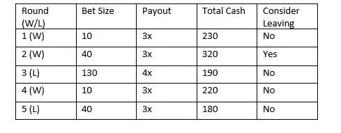
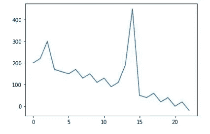
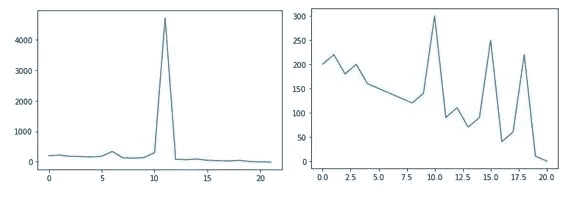
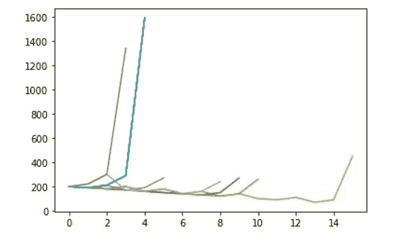

# 魔鬼轮盘:期望值的失败

> 原文：<https://towardsdatascience.com/the-devils-roulette-a-failure-of-expected-value-e0a4bae97302?source=collection_archive---------31----------------------->

随着数据、技术专家和有关统计的通俗读物的传播，越来越多的人熟悉期望值。对于门外汉来说，期望值是“平均值”，是随机过程的结果——统计学文本将其表示为 E[X]。有时这意味着最常见的结果。如果你随机选择一名计算机科学博士候选人，你会认为他们是男性，因为绝大多数计算机科学博士候选人是男性。有时这意味着最小化你的误差的值。如果你在美国随机抽取一个人，你会认为他们在 38 岁左右，这不是因为大多数人都 38 岁了，而是因为这样可以最大限度地减少你错过的平均年龄。

期望值在许多情况下是一个非常有用的概念。它会告诉你会发生什么。如果我们知道要期待什么，那么认为我们应该知道要做什么就不是不合理的。如果你打算冬天去冰岛，你应该预料到天气会很冷，带上外套。如果你去上医学院，你应该预计会积累 20 万美元的债务，也许只是成为一名软件工程师。如果有人给你一个有正预期回报的赌注，你应该接受。

本文的重点将放在最后一条语句上。一个很棒的面试问题肯定会让 quanty 项目的新毕业生感到困惑:你能设计出一个期望值为负但你肯定会赢的赌博游戏吗？有点令人惊讶的是，答案是肯定的，尽管这需要一些超自然的奇怪现象。我只想说，你永远不应该和魔鬼玩轮盘赌。

**走狗**

先介绍第一个角色。这个小丑是最近刚从某个著名机构获得的博士学位，该机构研究的领域包括政治学。这个傀儡熟悉统计和假设检验，并且坚信他们的力量。他们按照几条简单的格言生活:

1.如果一个事件的期望值是正的，就去做

2.尽可能承担最小的风险，这样你就可以再次玩这个游戏

3.如果有些事情看起来好得不像真的，那它很可能就是真的，所以要小心

似乎是很好的规则。第一，确保你不会像傻瓜买乐透彩票一样玩一场失败的游戏。第二个确保你倾向于捕捉一个事件的期望值，并减少你对方差的暴露。第三是尽职调查。

八月下旬，在密西西比三角洲附近进行了一整天的投票工作后，我们的主角开始前往酒店。如果你从未享受过在密西西比生活的乐趣，那里的八月会很热。民意测验专家想喝一杯。在酒店附近的一个十字路口，他看到了一个他之前没有注意到的酒吧，刚好有他最喜欢的啤酒，所以他进去了。

这家酒吧有点花哨，有一个穿着古怪的酒保、几个顾客和一台视频轮盘机。小丑坐在它旁边，好奇如何被骗的球员。这个游戏基本上和你想象的一样:表盘上有 38 个黑色和红色的数字(奇怪的是没有绿色)，赔率只有一点可怕。一个单一的数字赌注(1/38 的机会击中)支付 37 倍，1.00 美元的赌注往往会返回 0.97 美元…不太好。前 12 个(12/38 的命中机会)支付 3 倍，你的 1 美元可以让你收回 0.94 美元…仍然不好。任何熟悉赌场的人都知道，他们通过让每一个赌注都有利于赌场来赚钱，但只是一点点。

奇怪的是，颜色赌注(1/2 的机会击中)也能得到 3 倍的回报。小丑的兴趣被激起了。一美元赌注的期望值是 1.50 美元。它是一个胜利者。该机器由密西西比州精算测试和精确计数协会认证，该协会是博彩业中一个声誉良好的组织。彩注的赌注是 10 美元，其他的是几美分。

**一个奇怪的游戏**

我们的主角参考他的格言。支出是正数吗？当然，如果游戏公平的话，他今晚可以免费喝酒。风险小到他还能再玩吗？用 200 美元的旅行零用现金，他可以玩 20 次。是不是好得不像真的？是啊！即使有认证，游戏也可能被操纵。

小丑有一个解决办法，他拿出一美元，玩 50 轮赌单个数字记录红色和黑色的结果以及胜利。27 红 23 黑 2 胜。应用一个简单的 T-Test(一个关于想法真实性的统计测试),结果暗示了一个公平的游戏，或者至少是一个没有足够不利于玩家的游戏，使得颜色赌注没有吸引力。助手往机器里放了 200 美元。

他赢了第一局，赢了 30 美元。机器将彩色下注的下注金额更改为$40。再转一次，赢家，赢 120 美元。下注额再次变为$130。当小丑考虑走开时，机器上的支付提高到 4 倍。再转一圈，就亏了。他现在输了$10，游戏将下注额重置为$10，奖金重置为 3 倍。赌注还是很小，期望值还是正的，现在 Doc 卡住了。他再次旋转。

一个 5 轮游戏的例子

**恶魔每次都赢**

这个游戏一直持续到下注者没钱为止，最终他会一直没钱。请注意，这里的挑战是设计一个游戏，不仅仅是*倾向于*让魔鬼赢，而是保证它赢。保证意味着你最终会得到一个有绝对把握的结果，而倾向只意味着结果更有可能出现。这个游戏中可以保证的是，下注者最终会输。我们利用这一点，按照奖金的比例增加赌注，试图诱使对手破产。

这里的毁灭可能意味着一些事情。首先，它可以描述一个情况，其中走狗得到了非常不幸，失去了 20 个旋转在一排。这种可能性微乎其微，结果也没什么意思，所以我们会注意到它可能会发生，然后继续前进。其次，它可以描述当你赌得太多而输了的时候会发生什么，即使胜算看起来很大。无论哪种情况，你的钱包都会变得更薄。

一个游戏和缓慢向 0 前进的例子

如果我们更详细地分析这个游戏，我们会看到轮盘旋转本身是一个更大的实际游戏的循环子游戏。子游戏有正的期望值，你将有一半的机会是正确的，并因此获得超过 2 倍的奖金。循环博弈有负的期望值:你最终会输，当你输了，你会失去一切。

另一种解释是:虽然我们的主角有在不确定的世界中导航的经验法则，但他们没有风险管理的基础概念。在这里，一个体面的开始可能是添加第四条格言，即增加风险应该得到更多的回报。在投资方面，我们希望产生 alpha，在商业方面，我们希望得到正的风险调整 NPV。大多数人会选择游戏系列中的第二个赌注:40 美元，3 倍回报。让我们尝试一种策略，当支付乘数与下注额的比率小于 0.1 时，您可以退出。

几个风险意识停止的例子，你仍然会失去一切

不太好。你的对手可以增加支付让你继续玩下去，虽然你的回报更高——在一个上面的示例游戏中，你的钱包攀升到$4000 以上——但你最终还是会失去一切。

**知道何时走开**

这个游戏的另一种解释如下。魔鬼早早地给了这个走狗一笔额外费用，让他在稍后进行*自杀赌注*。自杀赌注是如此之大以至于导致破产的赌注。根据我的经验，避免自杀是个好主意。一种方法是不玩。不玩的期望值为 0，这比失去一切要好，但比第一次旋转后离开的策略更糟糕——期望回报为 15 美元。

如果你最终和魔鬼玩轮盘赌，你应该有两个目标。首先是不要破产，如果赌注超过某个低门槛，许多策略会让你走开。然而，花一美元买 1.5 美元的情况并不是每天都有，这就引出了第二个目标:在你能买的时候买你能买的东西。阈值方法不会这样做。相反，我们需要一种策略，用破产风险而不仅仅是损失风险来衡量回报。

几场凯利式的停球

上述运行是使用称为凯利标准的特定停止策略生成的。所有这些交易都以正回报结束，尽管凯利止损并不能保证一定会赢，但它确实会产生正回报。该公式的推导和历史超出了本文的范围，尽管它有很好的文档记录。然而，直觉也在范围之内。如果我们考虑风险、回报和毁灭，我们知道:

1.只有当我们失败时，我们才会毁灭

2.我们只在赢的时候领取奖金

3.随着支出的增加，我们想下更大的赌注

4.当我们的赌注相对于我们的钱包变得过大时，我们就破产了

如果我们把这些陈述变成一个公式，我们会希望根据输的可能性、支出和钱包的大小来限制我们的赌注。随着我们的钱包越来越鼓，支出越来越多，或者赢的可能性越来越大，我们会增加我们愿意下的最大赌注。当我们输钱的时候，回报会减少，或者我们输钱的机会会增加，我们会减少下注或者走开。最后，我们想要一个限制因素，即使支出变得任意大，也允许我们离开。凯利停止这样做是一种最佳的方式。

当然，在现实世界中，我们通常不知道收益，也不知道几率。我们从 MBBs 雇佣定量分析师、数据科学家、专家和深夜巫毒牧师来试图解决这些问题；当然，尽管他们的预测存在不确定性。不过，我们知道的一件事是，我们可以合理地失去什么，并继续前进。虽然概率和支出很重要，但对于任何足够长的游戏来说，与管理破产相比，它们都显得苍白无力。

*免责声明:本文表达的观点仅代表作者个人观点，不一定代表任何雇主、组织或其附属机构的观点。*

2021 道格拉斯·汉密尔顿