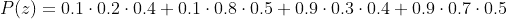
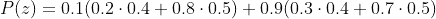
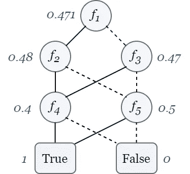
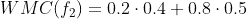

# Dice 语言可以帮助您实现精确的概率推理

> 原文：<https://towardsdatascience.com/the-dice-language-may-help-you-achieve-exact-probabilistic-inference-5147e5fbcd0a?source=collection_archive---------33----------------------->


图片来自 [Pixabay](https://pixabay.com/?utm_source=link-attribution&amp;utm_medium=referral&amp;utm_campaign=image&amp;utm_content=769344)

## 因式分解为离散概率程序提供了有效的推理

# 目标

这篇文章包括我对[学术论文](https://arxiv.org/abs/2005.09089)的总结和思考，该论文展示了 [Dice](http://dicelang.cs.ucla.edu/) ，这是一种概率编程语言，旨在解决离散概率模型的精确推理。读完这篇文章后，你应该知道为什么开发 Dice，以及它如何利用离散概率程序结构进行有效的推理。

# 介绍

概率编程语言(ppl)的数量正在迅速增长。它们被认为是概率建模的宝贵工具，概率建模是包括机器学习在内的一些科学和工程努力的关键成分。

推理是一种强大而普遍的工具，它有助于从概率模型中进行推理。在 PPLs 的上下文中，推理可以广义地认为是基于观察到的输出来计算程序输入的概率分布。虽然已经提出了几种算法来实现推理，但它通常被认为是一个计算困难的问题。在一般的连续情况下，推论是如此的困难，因为它可能涉及到计算繁重的积分。然而，并不是所有的概率模型都包含连续的随机变量…

输入[骰子](http://dicelang.cs.ucla.edu/)。

Dice 是一个专门设计的 PPL，用于在描述离散概率模型的程序上执行精确的推理[1]。*离散的*概率模型由离散的随机变量组成——它们的域有一个有限的大小。*精确*推断(与*近似*推断相反)意味着结果是真实的后验分布。

我们将讨论 Holtzen 等人的附带出版物。艾尔。[1]了解 Dice 如何巧妙地利用离散概率程序中的结构来执行易处理的推理。

# 先决背景

去读霍尔森等人的书。艾尔。的出版物，我建议读者具备以下概念的必备知识:

*   概率编程基础
*   概率推理
*   二元决策图
*   编译程序设计
*   计算复杂性分析

不管你对上述概念的熟悉程度如何(我自己不是专家)，这篇文章以一种通俗易懂的方式总结了主要贡献。

# 摘要

## 主要思想

Dice 不是一种为一般概率推理提供普遍支持的语言——作者并不这样认为。相反，作者敏锐地发现了一种方法，可以加速仅针对离散概率程序的推理。因此，如果你对连续的情况更感兴趣，你可能想现在停止阅读。我建议任何怀疑论者考虑离散案例中的各种各样的概率建模问题。应用领域的例子包括文本、网络和图形，以及排名和投票[1]。尽管远不是第一个实现离散概率程序推理的人，但作者声称 Dice 是不同的，因为它利用程序结构来执行*因式分解推理*。

这种“因子化推理”是什么？Dice 识别概率程序中的条件独立性，使用它们来构造可重用的组件，显著地减少推理的负担。它以一种受*知识汇编*推理方法启发的方式这样做。在离散情况下，重要的考虑因素是随机变量的值的可选分配的概率共享几个计算。Dice 的作者认识到，这些重复计算可以通过识别它们并将其表示为二元决策图(BDD)来避免。然后，BDDs 可以用于在线性时间内执行推理。

## 激励人心的例子


图片作者。

本文使用下面的例子来灌输因式分解推理如何工作的直觉。考虑这样一种情况，你一个接一个地投掷 3 枚有重量的硬币。每一次后续翻转的重量取决于当前翻转的结果(请暂停怀疑)。假设 *x，y，*和 *z* 是随机变量，分别对应第一枚、第二枚和第三枚硬币翻转的结果。我们任意地将“正面*”*结果指定为*真*，将“反面”结果指定为*假。*概率模型由下面的 Dice 代码片段描述，该代码片段出现在本文附带的博客文章[2]中。

```
let x = flip 0.1 in
let y = if x then flip 0.2 else flip 0.3 in
let z = if y then flip 0.4 else flip 0.5 in
z
```

实际上，“*翻转 p* ”对应于以概率 *p* 采样*真*的伯努利分布。我不知道创作者为什么不用“ *flip* ”作为关键词，而不用“ *roll* ”，考虑到语言的名字，但这是题外话。代码描述了以下情况:硬币 1 被夹住，结果分配给 *x.* 然后硬币 2 被翻转。如果硬币 1 正面朝上，那么硬币 2 正面朝上的概率为 0.2；另一方面，如果硬币 1 正面朝上，那么硬币 2 正面朝上的概率为 0.3。硬币 2 的翻转结果被分配给*y。*然后硬币 3 被翻转。如果硬币 2 正面朝上，那么硬币 3 正面朝上的概率为 0.4；否则，硬币 3 将以 0.5 的概率落在人头上。硬币 3 的投掷结果被分配给 *z* ，这是程序*的返回值。*

硬币 3 落在头上的概率可以表示为以下乘积之和:



等式 1:未分解的表示 *z* 为真的概率表达式

在快速浏览这个表达式后，我们意识到它也可以用这个因式分解来表示:



等式 1:z 为真的概率的分解表达式

因式分解的方程比原方程包含更少的运算，因此表达得更简洁。你可以想象枚举每一个可能的程序执行将如何成指数增长。一旦我们考虑域大于 *{heads，tails}* 的离散随机变量，这个问题会变得更糟！

## 编译成二元决策图

Dice 根据程序流为概率程序生成 BDD。通过利用因式分解的机会，我们避免了迭代所有可能的翻转结果。事实上，为每个程序员定义的函数都生成了单独的 BDD，以促进模块化。BDD 是加权布尔公式的简洁表示，通过利用概率程序中的条件独立性关系来构建。特定赋值集的权重(例如，翻转 1 返回正面，翻转 2 返回反面，翻转 3 返回正面)是每个变量的所有概率的乘积，对应于上面第一个等式中的一个乘积。



示例 Dice 程序的二元决策图。每个节点对应于一个翻转，并通过其相应的加权模型计数进行注释。如果父变量为真，则边为实线，否则为虚线。这个图应该从上往下看。例如，f3 对应于第一次投掷错误时硬币 2 的投掷。图片作者，改编自[1]图 1b。

概率程序中的条件独立性体现在 BDD 中节点的子树中。在上图中， *f₄* 是由 *f₂* 和 *f₃.的外出边共享的子树*直觉上这是有道理的，因为 *f₄* 是第三次抛硬币，第二次抛硬币的结果是“正面”。也就是说，如果第二次掷硬币的结果是“正面”，那么这次掷硬币有条件地独立于第一次掷硬币的结果。在提前构建 BDD 的过程中，在利用因式分解机会的同时，我们为推理做好了充分的准备。

注意，构建 BDD 在计算上很困难。这是骰子推断最重的计算负担。

## 通过加权模型计数进行推断

加权模型计数(WMC)是将每个模型的权重相加的过程。BDD 中每个节点的 wmc 可以通过对其子节点的 wmc 求和来计算，并由节点自身的概率分布进行加权。例如，为了计算节点 *f₂、*的 WMC，我们取节点 *f₄* 和 *f* ₅的 wmc 之和，用由 *f₂.表示的掷硬币结果的概率进行加权*



等式 3:节点 f2 的 WMC

为了对整个程序进行推理，我们计算 BDD 中每个节点的 WMCs，从叶子开始，一直到根。根的 WMC 是推论的结果。计算这个值构成了相对于 BDD 大小的线性复杂度。我们观察到，在节点之间共享子树可以极大地提高这种自底向上遍历的效率。

根据函数抽象的原则，为每个程序员定义的函数计算单独的 BDD，从而实现模块化编译。这种可回收的方法可以极大地限制变量赋值的数量，防止不同的变量被分配给不同的函数调用。

“ *observe* ”关键字根据程序员指定的条件固定程序中随机变量的值。继续我们正在运行的例子，考虑下面的程序，其中我们获得了证据表明 *y* 为假(即 flip 2 导致“tails”)。运行程序将返回一个均匀分布，因为观察到第二次抛硬币是“反面”导致第三次抛硬币是公平的。

```
let x = flip 0.1 in
let y = if x then flip 0.2 else flip 0.3 in
let z = if y then flip 0.4 else flip 0.5 in
let y_obs = observe !y
z
```

在骰子里，观测被认为是一等公民。为了考虑观察结果，必须在编译策略中增加一个额外的步骤。作者定义了*接受公式*，这是一个布尔公式，当程序中的所有观察语句都满足时，该公式为真。然后，后验分布由模型和接受公式的逻辑合取的 WMC 除以接受公式的 WMC 给出。

## 语言

Dice 程序由零个或多个非递归函数组成，后跟一个主表达式。该论文给出了 Dice 的语法和语义的全面概述和形式化，因此如果您想检查细节，请参考[1]。作者创建了一个网站来配合出版物，其中包括语法的简要描述，以及示例[3]。还有一个窗口允许您编写和运行 Dice 代码。这是你阅读报纸时了解语言的好方法！

该论文还包括一个部分，建立了通过 WMC 将 Dice 的推理方法简化为概率推理。给出并讨论了正式的编译规则。作者展示了他们的规则如何将加权布尔公式编译成 BDD。

## 实验

为了验证他们的实验，作者考虑了另外两个能够进行精确推理的最先进的 ppl:Psi[4]和 WebPPL [5]。Dice 和 Psi 的编译时间被用于相关研究中的基准推理任务。骰子几乎是单边快于 Psi。针对论文中定义的三个任务(凯撒密码分析、钻石网络和缩放)在一系列问题规模上对 Dice、Psi 和 WebPPL 进行比较的实验。戴斯的表现比其他人好几个数量级。然后，作者比较了每三种语言在多个基准贝叶斯网络上进行推理所需的时间。虽然 Psi 和 WebPPL 对大多数网络来说要花 2 个多小时，但 Dice 总是花不到 3 秒。

作为对 Dice 因式分解推理的最终验证，Dice 与 Ace [6]进行了比较，Ace 是一种最先进的贝叶斯网络求解器。这项任务尤其具有挑战性，因为目标是计算网络中所有变量的边际概率。尽管 Dice 通常比 Ace 需要更长的时间来解决网络问题，但它的表现相当这一事实本身就是一个值得注意的壮举，因为 Ace 不像 Dice 那样支持许多编程结构(它的重点仅限于解决贝叶斯网络)。

# 我的想法

## 优点

最重要的是，我非常欣赏作者在 PPL 开发中发现了一个很大程度上未被探索的领域。他们没有专注于近似连续的情况(像他们同时代的几个人一样)，而是将他们的注意力限制在离散的概率程序上，这些程序包含了各种各样的现实世界的问题。正如在论文中所讨论的，使用 WMCs 进行概率推理可能不是一个全新的想法，但是它在 PPL 环境中推理的应用是。我可以看到因式分解推理方法成为概率程序员工具箱中的主要工具。

分解推理方法明显加快了各种离散概率模型的推理速度。事实上，作者能够交付一个系统，该系统在针对各种实际问题的编译方面有显著的加速，这是令人难以置信的。

这篇论文本身非常详尽，对作者的观点进行了严格的推导。我还发现这是一种直觉式的组织。数字和表格信息丰富，视觉上吸引人。

## 限制

在讨论中，作者承认精确的骰子推断通常是 PSPACE-hard——也就是说，它需要多项式量的空间。附录中有一个证明。这意味着它要么和 NP 问题一样难，要么更难。其困难的主要原因是 BDD 的构建。那么，为什么骰子在实验中表现如此出色呢？事实证明，对于特定的程序结构，BDD 的构建效率要高得多，原因有二:

*   程序结构中存在的条件独立性关系可以分解
*   通过设计，本地项目结构的某些配置被有效地映射到 BDD

虽然上述情况可能很常见，但它们并没有涵盖各种各样的离散概率程序。使用 Dice 的开发人员可以设计他们的程序，以便利用上面列出的两种试探法。这需要一些关于 Dice 内部工作的知识，这对于编程新手来说是一个障碍。

最后，Dice 的程序表达能力受限于它不能处理递归函数、无界整数和无界迭代。然而，文件的结论表达了在未来消除这些障碍的愿望。

## 相关著作

在深入研究之前，让我们讨论一下这项工作如何融入与概率编程相关的不断增长的文献中。在他们的论文中，作者提供了相关作品的有组织的和全面的描述，但我们将出于本文的目的进行总结。作者声称，Dice 是第一个使用*加权模型计数*(稍后将详细介绍)在 PPL 中进行精确推理的尝试。加权模型计数(WMC)是一种基于路径的推理算法，这意味着推理是通过用实际值运行概率程序来进行的。Dice 使用的因式分解推理方法不同于其他采样和变分推理方法，因为它尽可能重用执行路径，而不是单独遍历整个路径。与这项工作类似的是*加权模型集成*，它本质上是应用于连续模型的 WMC，其中集成沿着程序路径发生【7】。概率逻辑程序的最新成果与戴斯的 WMC 策略非常相似。Bryant [8]和 Darwiche [9]把概率推理比作 WMC。前者使用二元决策图[8]，后者使用句子决策图[9]。基于这些方法，Dice 提供了普通编程语言中可用的结构，并在其编译策略中将观察视为一等公民。

# 我对未来的想法

对于保证离散概率程序的各种场景，嵌入骰子的推理方法具有内在价值。我认为，这个项目明智的下一步可能是将其对离散问题的精确推理包含到一个更通用的 PPL 中，该 PPL 也支持连续情况下的近似推理。

由于 Dice 的效率取决于程序和本地程序结构中存在的条件独立性关系，因此可以开发智能代码完成工具来鼓励开发人员的这种行为。也许这样的工具可以在代码编辑器中为开发人员提供语法建议。

# 供讨论的问题

如果你想和别人讨论这篇文章，这里有一些建议可以帮助你开始对话:

*   列举一些离散概率程序的应用领域
*   建议一个构建 BDD 会很有效的模型。
*   相反，提出一个模型，它的结构不适合 BDD 的有效构造
*   Dice 缺乏对递归函数、无界整数和无界迭代的支持限制有多大？在这些约束条件下，什么样的问题无法实现？

# 结论

Dice 是对开发者可用的日益增长的 ppl 主体的杰出贡献。它采用了一种推理方法，可以针对各种问题类型进行有效扩展。附带的文件是彻底的，并附有一个演示网站和开放源代码。我很想知道开发人员是如何接受这种语言的，并期待作者随后的文章。如果你的推理问题涉及离散随机变量，我建议在骰子上“碰碰运气”！


图片由 [anncapictures](https://pixabay.com/users/anncapictures-1564471/) 来自 [Pixabay](https://pixabay.com/?utm_source=link-attribution&amp;utm_medium=referral&amp;utm_campaign=image&amp;utm_content=2031512)

# 参考

[1] S. Holtzen，G. Van den Broeck 和 T. Millstein，[离散概率程序的缩放精确推理](https://arxiv.org/abs/2005.09089) (2020)，Proc .ACM Lang。(OOP SLA)【2】s . Holtzen，[离散概率程序的标度精确推理](https://blog.sigplan.org/2020/12/28/scaling-exact-inference-for-discrete-probabilistic-programs/) (2020)，PL Perspectives "
【3】s . Holtzen，G. Van den Broeck 和 T. Millstein，[dice 概率编程语言](http://dicelang.cs.ucla.edu/) (2020)，加州大学洛杉矶分校
【4】t . Gehr，S. Misailovic 和 M. Vechev， [Psi:概率程序的精确符号推理](https://link.springer.com/chapter/10.1007/978-3-319-41528-4_4)(10) [概率编程语言的设计与实现](http://dippl.org/)(2014)[http://dippl.org](http://dippl.org)
【6】m . cha vira 和 A. Darwiche，[关于加权模型计数的概率推理](https://doi.org/10.1016/j.artint.2007.11.002) (2008)，j .人工智能
【7】v . Belle，A. Passerini 和 G . Van den Broeck，[混合域中加权模型集成的概率推理](http://starai.cs.ucla.edu/papers/BelleIJCAI15.pdf) (2015)，Proc . 关于人工智能的 IJCAI

【8】r . Bryant，[基于图的布尔函数操作算法](https://doi.org/10.1109/TC.1986.1676819) (1986)，IEEE TC C-35
【9】A . Darwiche， [SDD:命题知识库的新规范表示](https://dl.acm.org/doi/10.5555/2283516.2283536) (2011)，ij Cai 会议录-国际联合会议