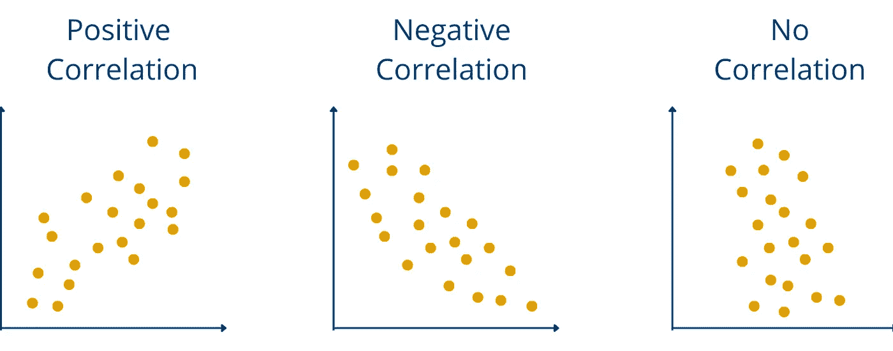

# 相关性和因果关系的区别

> 原文：<https://towardsdatascience.com/the-difference-between-correlation-and-causation-51d44c102789?source=collection_archive---------13----------------------->

## 你需要知道的关于偶然推断的一切

[粘土银行](https://unsplash.com/@claybanks?utm_source=medium&utm_medium=referral)在 [Unsplash](https://unsplash.com?utm_source=medium&utm_medium=referral) 拍摄的照片

**相关性**是指两个统计变量之间的关系。这两个变量相互依赖，一起变化。因此，两个变量的正相关意味着 A 的增加也会导致 b 的增加。这种关联是单向的。因此，在相反的情况下也是如此，变量 B 的增加也在相同程度上改变了 A 的斜率。

**因果关系**另一方面，描述了两个变量之间的因果关系。因此，A 和 B 之间的因果关系意味着 A 的增加也是 B 增加的原因。通过一个简单的例子，这种差异很快就变得清楚了:

一项研究很可能会发现一个人患皮肤癌的风险和他们去室外游泳池的次数之间存在正相关。因此，如果一个人经常去室外游泳池，那么他患皮肤癌的风险也会增加。明显的积极联系。但是去室外游泳池和皮肤癌之间也有因果关系吗？可能不会，因为那将意味着只有去室外游泳池才是增加皮肤癌风险的原因。

更有可能的是，花更多时间在室外游泳池的人也暴露在明显更多的阳光下。如果他们没有采取足够的防晒措施或类似措施，会发生更多的晒伤，这增加了皮肤癌的风险。很明显，去室外游泳池和皮肤癌风险之间没有因果关系。

去室外游泳池和皮肤癌之间有因果关系吗？|来源:作者

在[tylervigen.com](http://www.tylervigen.com/spurious-correlations)可以发现各种很可能不显示因果关系的奇怪相关性。

例如，在美国缅因州的离婚率和人造黄油的人均消费量之间有很高的关联。这是否也是因果关系值得怀疑。

# 相关的类型有哪些？

一般来说，可以区分两种类型的上下文:

1.  **线性或非线性**:如果变量 A 的变化总是触发变量 b 中常数因子的变化，则相关性是线性的。如果不是这种情况，则称相关性是非线性的。
2.  **正或负**:如果变量 A 的增加导致变量 B 的增加，那么就是正相关。另一方面，如果 A 的增加导致 B 的减少，那么相关性为负。

相关类型|来源:作者

# 相关系数是多少？

**相关系数**表示两个变量之间的关联有多强。在 tylervigen.com 的例子中，这种相关性非常强，达到 99.26%，这意味着这两个变量接近 1 比 1，即人造黄油消费量增加 10%，离婚率也会增加 10%。相关系数也可以假设为负值。

小于 0 的相关系数描述了**反相关**，并表示两个变量的行为方式相反。例如，当前年龄和剩余预期寿命之间存在负相关。一个人越老，他或她的剩余寿命就越短。

# 你如何证明因果关系？

为了可靠地证明因果关系，进行了科学实验。在这些实验中，人或测试对象被分成不同的组(你可以在我们关于[采样](http://www.databasecamp.de/en/statistics/population-and-sample)的文章中读到更多关于这是如何发生的)，这样在最好的情况下，参与者的所有特征都是相似或相同的，除了被认为是原因的特征。

对于“皮肤癌室外游泳池案例”，这意味着我们试图形成两组，其中两组参与者具有相似或最好甚至相同的特征，如年龄、性别、身体健康和每周暴露于阳光中的时间。现在，研究一组人(注意:暴露在阳光下的时间必须保持不变)去室外游泳池游泳，与不去室外游泳池的那组人相比，是否会改变皮肤癌风险。如果这种变化超过一定程度，我们就可以说是因果关系。

# 这是你应该带走的东西

*   只有在极少数情况下，相关性也意味着因果关系。
*   相关性意味着两个变量总是一起变化。另一方面，因果关系意味着一个变量的变化是另一个变量变化的原因。
*   相关系数表示关联的强度。它可以是积极的，也可以是消极的。如果系数为负，则称为反相关。
*   要证明因果关系，需要复杂的实验。

*如果你喜欢我的作品，请在这里订阅***或者查看我的网站* [*数据大本营*](http://www.databasecamp.de/en/homepage) *！还有，medium 允许你每月免费阅读* ***3 篇*** *。如果你希望有****无限制的*** *访问我的文章和数以千计的精彩文章，不要犹豫，点击我的推荐链接:*[【https://medium.com/@niklas_lang/membership】](https://medium.com/@niklas_lang/membership)每月花$***5****获得会员资格**

* [## 强化学习初学者指南

### 强化学习模型的高级概述

towardsdatascience.com](/beginners-guide-to-reinforcement-learning-f296e8dd8260)  [## 梯度下降初学者指南

### 关于梯度下降法你需要知道的一切

towardsdatascience.com](/beginners-guide-to-gradient-descent-47f8d0f4ce3b)  [## 决策树完全指南

### 学习关于决策树的所有知识，包括 Python 示例

towardsdatascience.com](/a-complete-guide-to-decision-trees-ac8656a0b4bb)*