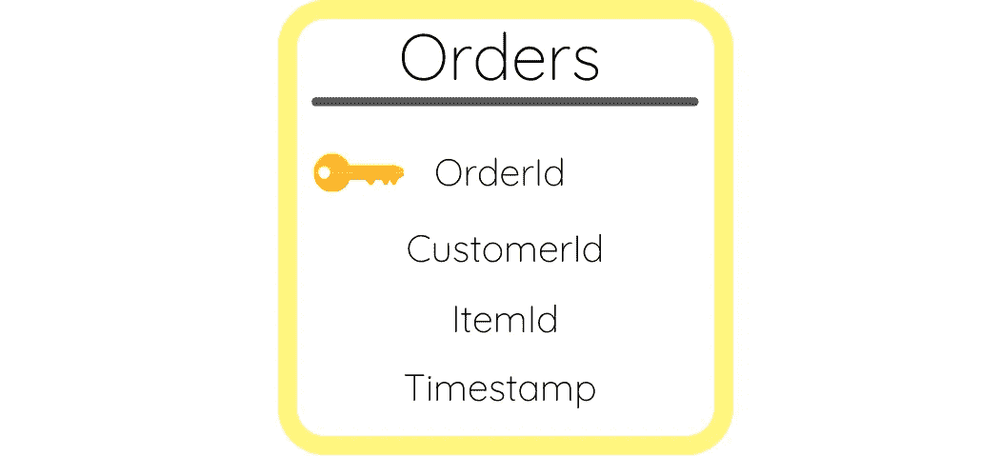
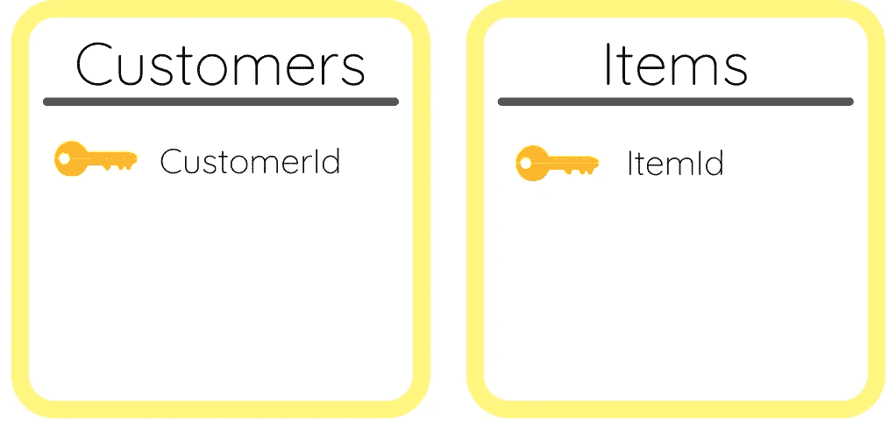
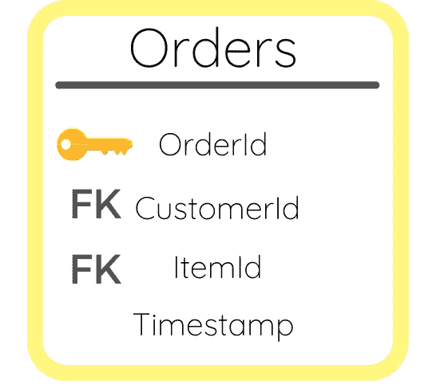

# 主键和外键的区别

> 原文：<https://towardsdatascience.com/the-difference-between-primary-and-foreign-keys-accbfb7815d3?source=collection_archive---------36----------------------->

## 以及在创建关系数据库时如何定义它们

照片由 [Samantha Lam](https://unsplash.com/@contradirony?utm_source=unsplash&utm_medium=referral&utm_content=creditCopyText) 在 [Unsplash](https://unsplash.com/s/photos/keys?utm_source=unsplash&utm_medium=referral&utm_content=creditCopyText) 上拍摄

在学习关系数据库时，理解主键和外键之间的区别是非常必要的。它们定义了数据库中不同表之间的关系，是数据建模中的一个关键概念。

首先，如果你不知道什么是关系数据库，它是一个被设计用来识别各种不同信息之间的关系的数据库。这就是主键和外键如此重要的原因。它们使关系数据库成为关系数据库！

## 主键

数据库中的每个表都有一个唯一的标识符，可以帮助您将该表及其行与其他表区分开来。主键始终充当唯一标识符。对于相应表中的每一行，它都是唯一的值。它可以简单到为每行生成一个 id 号，或者为商店的每个顾客生成一个社会保险号。

## 外键

外键有点难以理解。一个表的主键是另一个表的外键。一个表的唯一标识符可能只是另一个表的属性。然而，外键提供了两个表之间的链接，形成了它们之间的关系。

包含外键的表通常称为子表，而包含主键的表通常称为父表。一个数据库可以简单到只有一个父/子表，也可以有数百个父/子表。这完全取决于用例以及您试图存储多少信息。

## 让我们想象一下。

可视化主键和外键是数据建模的一个重要部分。如果您打算创建一个数据模型，那么您需要知道如何定义主键和外键，以及如何将它们相互映射。如果你需要数据建模的介绍，请查阅[数据建模 101:它是什么？](/data-modeling-101-what-is-it-e9c688f0680b)。

首先，您想要定义您的主数据表。这通常是其他表的来源表。例如，如果您拥有一家商店，该表可能就是您的订单表。您为商店收集的所有信息都将与您收到的订单相关联。想想什么将是你的唯一标识符。

作者图片

这里的唯一标识符或主键是 OrderId。这是一个对每个订单都不同的值。该表中还包括我们将要定义的其他表的主键。您需要考虑保存想要存储的信息所需的不同表。

如果我要为我的商店创建一个数据库，我还想存储每个客户和库存中每个商品的信息。这些都是它们自己的表，有它们自己的主键。

作者图片

Customers 表的主键是 CustomerId，Items 表的主键是 ItemId。如果您看上面，我还在 Orders 表中包含了这些值。因为 CustomerId 和 ItemId 是另外两个表的主键，所以它们将被视为 Customers 表中的外键。

作者图片

请记住，您还可以在每个表中包含不被视为主键或外键的其他属性。对于订单，时间戳仍然是您想要收集的关于每个订单的重要信息，但是它没有将数据库中的任何表链接在一起。

希望这能让您更好地理解关系数据库中主键和外键之间的区别。别忘了看看[数据映射 101:是什么？](/data-modeling-101-what-is-it-e9c688f0680b)关于创建数据模型的更深入的演练。我介绍了不同类型的数据模型、表之间的关系类型、关于主键和外键的更多信息，以及如何创建数据模型。