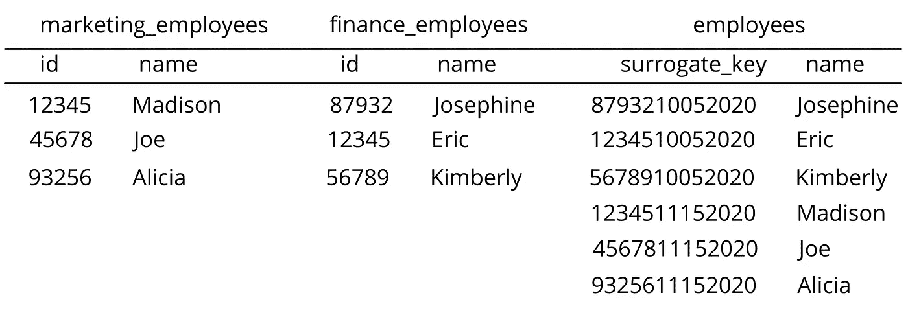

# 代理键和主键的区别

> 原文：<https://towardsdatascience.com/the-difference-between-surrogate-and-primary-keys-222cf31ddb57?source=collection_archive---------12----------------------->

## 什么时候用各种流行来源的例子

弗洛里安·伯杰在 [Unsplash](https://unsplash.com/s/photos/keys?utm_source=unsplash&utm_medium=referral&utm_content=creditCopyText) 上拍摄的照片

最近，我一直致力于重建整个数据堆栈，并找出用 dbt 编写模型的最佳方式。我最近[学习了](https://docs.getdbt.com/docs/building-a-dbt-project/building-models/configuring-incremental-models)关于增量模型以及如何实现它们。这对我来说是一件全新的事情，我期待着在进一步探索后与大家分享。

在阅读关于增量模型的文档时，我了解到我需要在每个表中拥有一个惟一的键。这对于更新和删除数据仓库中的记录至关重要。在安慰了 dbt Slack 通道之后，有人建议我使用`dbt_utils.surrogate_key`函数为我的表生成一个惟一的键。

这就是导致我产生这个问题的原因…代理键和主键之间有什么区别？我非常熟悉主键和外键，以及它们如何与关系数据库一起工作。以至于我写了一篇关于他们的文章！然而，直到现在我才听说过代理键。

事实证明，代理键与主键非常相似，因为它是表中对象的惟一值。但是，它不是从表中的实际数据派生出来的，而是由对象本身生成的字段。它不像主键那样具有商业价值，而是仅用于数据分析目的。如果你想到代理的这个[定义](https://en-academic.com/dic.nsf/enwiki/263746)“外部世界中的一个*实体*”——那么这种差异是有意义的。

代理键通常是数据库中的序列号，如 PostgreSQL `serial`列、Oracle `sequence`列或 MySQL `auto_increment`列。作为 Fivetran 和雪花的用户，我认为`_file`和`_line`列的组合是一个代理键。

您可以使用表中已经存在的不同列来生成代理键，而不是作为一个字段。如果您将 Fivetran 与雪花一起使用，您可以使用`_file`和`_line`为您的表创建一个代理键，以便惟一地标识每一行。正如开始提到的，我使用`dbt_utils.surrogate_key`来做这件事。

下面是一个使用部门 id 和员工 id 生成代理键的例子。

作者图片

它们通常是使用跨两个不同表的字段生成的，正如 dbt 的代理键函数的[定义](https://github.com/dbt-labs/dbt-utils#surrogate_key-source)中提到的。

当您的表中没有主键，但需要唯一的标识符时，代理键是理想的解决方案。它们对于性能和检测历史记录中的变化非常有用。我目前正在我的表中实现它们，以确保尽可能平稳地运行增量模型。它们将在插入、更新和删除记录时帮助雪花的合并语句。

希望这能消除您对代理键和主键之间的区别的任何困惑。现在，您可以在您的数据库中成功地实现它们，对两者之间的差异及其用例充满信心。查询愉快！