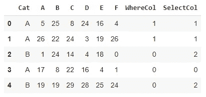

# Python NumPy 的 Where 和 Select 函数的区别

> 原文：<https://towardsdatascience.com/the-difference-between-where-and-select-functions-of-python-numpy-9c81273ed5fb?source=collection_archive---------14----------------------->

## 实践教程


Vanesa Giaconi 在 [Unsplash](https://unsplash.com/s/photos/comparison?utm_source=unsplash&utm_medium=referral&utm_content=creditCopyText) 上拍摄的照片

Pandas 和 NumPy 是用于数据分析和操作的两个伟大的 Python 库。它们可以说是数据科学生态系统中最受欢迎的库。

两者都提供了一些功能和方法来简化复杂的操作。在本文中，我们将讨论 NumPy 的两个这样的函数:Where 和 Select。

这些函数可用于根据列的值对列进行评估。因此，在过滤数据框或创建新列时，它们会派上用场。

让我们从导入库和创建样本数据框开始。

```
import numpy as np
import pandas as pddf = pd.DataFrame(
  np.random.randint(30, size=(5,6)),
  columns = list("ABCDEF")
)df.insert(0, "Cat", ["A","A","B","A","B"])df
```


df(作者图片)

我们使用 randint 函数来填充数据框。它由用 size 参数定义的 5 行和 6 列组成。这些值是 0 到 30 之间的随机整数。

我还想添加一个分类列作为数据框的第一列，所以我使用 insert 函数，而不是传统的创建新列的方法。

insert 函数允许使用列索引指定新列的位置。

是时候实践我们宝贵的功能了。让我们从哪里开始。

where 函数接受一个或一组条件。然后，我们可以为符合和不符合条件的行分配单独的值。

用一个例子更容易理解。

让我们基于以下条件创建一个名为“where”的新列:

*   如果 Cat 列中的值是 A，而 B 列中的值大于 10，则新列的值为 1。
*   对于不符合上述条件的行，新列的值为 0。

下面是我们如何完成这项任务。

```
df["WhereCol"] = np.where((df.Cat == "A") & (df.B > 10), 1, 0)df
```


df(作者图片)

我们可以增加条件的数量，也可以更改新列中的值。

where 函数能够计算一组条件的值。因此，我们只能在新列中分配两个不同的值:一个用于符合条件的行，另一个用于其他行。

select 函数更进一步。它接受多组条件。然后，我们可以为每组条件分配不同的值。因此，新列可以根据需要包含任意多的不同值。

让我们基于以下条件创建一个名为“SelectNew”的列:

*   如果 Cat 列中的值是 A，而 B 列中的值大于 10，则新列的值为 1。
*   如果 Cat 列中的值是 B，而 B 列中的值大于 10，则新列的值为 2。
*   对于不符合上述条件的行，新列的值为 0。

该任务可以使用选择功能完成，如下所示:

```
conditions = [
  (df.Cat == "A") & (df.B > 10),
  (df.Cat == "B") & (df.B > 10)
]values = [1, 2]df["SelectCol"] = np.select(conditions, values, default=0)df
```



df(作者图片)

条件和值作为列表传递给 select 函数。第一个条件与第一个值相关联，第二个条件与第二个值相关联，依此类推。

默认参数用于不符合任何条件的行。

我们也可以在单个列上指定条件。再来做一个例子。

```
conditions = [
  (df.B % 2 == 0) & (df.B > 20),
  (df.B % 2 == 1) & (df.B > 20),
  (df.B < 10)
]values = ["first","second","third"]df["SelectCol2"] = np.select(conditions, values, default="other")df
```


df(作者图片)

“SelectNew2”列是基于以下条件创建的:

*   如果 B 列是大于 20 的偶数，则它是“第一个”。
*   如果 B 列是大于 20 的奇数，则为“第二列”。
*   如果 B 列的值小于 10，则为“第三”。
*   对于其他值，它是“其他”。

## 结论

where 和 select 函数都允许创建条件列。where 函数产生具有两个不同值的列。一个用于符合指定条件的行，一个用于另一个。

select 函数更加灵活，因为它允许根据需要创建包含任意多不同值的条件列。我们只需要分别指定每个值的条件。

感谢您的阅读。如果您有任何反馈，请告诉我。