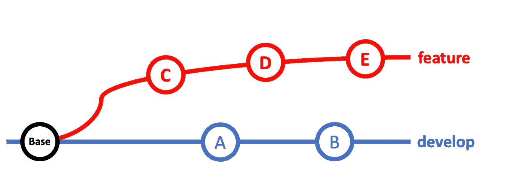
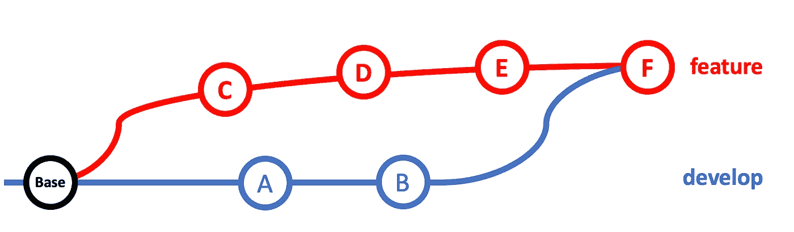
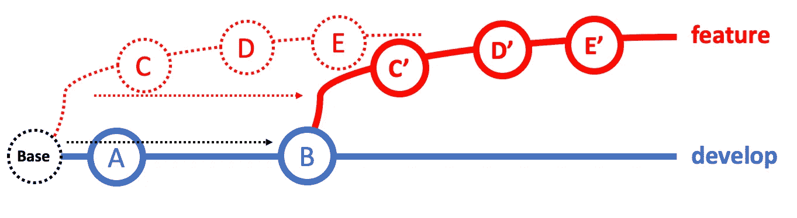

# Rebase 和 Merge 的区别

> 原文：<https://towardsdatascience.com/the-differences-between-rebase-and-merge-30c91cd18f30?source=collection_archive---------17----------------------->

## Git 问题 101

## 这可能是 git 用户问得最多的问题

[玛丽·莱扎瓦](https://unsplash.com/@marilezhava?utm_source=medium&utm_medium=referral)在 [Unsplash](https://unsplash.com?utm_source=medium&utm_medium=referral) 上拍摄的照片

我关于我们应该使用合并还是重定基础，这个问题在社区里争论了很久。

有些人会说合并更好，因为它保留了最完整的工作历史。其他人会认为 rebase 更整洁，这使得评论者的生活更容易和更有效率。本文将解释 merge 和 rebase 之间的区别以及使用其中一种的好处。

从根本上说，合并和 rebase 服务于相同的目的，将一个分支(有时是多个分支)的变更集成到另一个分支中。当您希望在打开拉请求之前集成最新的主或开发分支时最常用。虽然目的是一样的，但是合并和 rebase 实现的方式不同。

作者图片

快速思考一下这里的目标。想象你有这样一个分支‘特性’，它是从‘基础’的‘开发’分出来的。从那时起，您已经完成了 C、D、E 的工作，并且开发已经添加了 2 个变更 A、b。现在您想要打开一个拉式请求，将*‘您的工作’*集成到*‘开发分支’*。在此之前，您必须将*“开发分支”*中的更改集成到*“您的特性分支”*中，这样您的拉取请求中就不会有冲突。

## 合并

作者图片

Merge 会将 develop 中的更改集成到您的要素分支中，并创建一个新的提交 F。F 是合并 develop 分支的提交，如果有冲突，会对冲突进行排序。这个方法会将 develp 分支(A 和 B)中的更改带到您的 feature 分支中。现在，您的特性分支上的提交是 C、A、D、B、E、f。您的特性分支上又添加了 3 个额外的提交。

## 重定…的基准

作者图片

另一方面，rebase 移动了整个特性分支，就像它从开发分支的最后一次提交开始分支一样。Rebase 将首先搜索特性分支的基础，并将该基础更改为开发分支上的最新提交，在本例中为 B，然后*基于该基础重新应用*特性分支上的所有提交，B。Rebase 实际上会创建新的提交，C’、D’、E’。原始提交保持不变。最后，它将特征分支指向的对象从 E 改为 E’。

## 利弊

这两种方法之间的最大区别是 merge 保留了工作的完整历史，包括时间顺序，而 rebase 使提交变得清晰，并且只与分支上的工作相关。当一个评审者正在评审你的 PR 时，如果你选择合并，她将会看到 A、B、C、D、E、F 提交，如果你选择重定基数，她只会看到 C、D、E。

合并具有更高的可追溯性。你可以找到所有的工作经历，不管是否与这份简历相关。但是这对于评审者来说可能是痛苦的，因为分支由许多不相关的提交组成，并且通常很难识别它们。

Rebase 真的让 PR 变得整洁和相关，没有嘈杂的提交。评审者可以很容易地发现这个 PR 是关于什么的，以及在这个分支中做了什么改变。但是，如果您想跟踪存储库的详尽历史，这可能就没什么帮助了。

> Merge 具有更高的可追溯性，而 Rebase 更整洁，更便于审阅。

## 那么我应该用哪一个呢？

这真的取决于你的组织使用什么样的工作策略。您必须权衡重定基础的简单性的价值和合并的可追溯性的价值。很可能两者都用，在特定的情况下使用特定的方法。

从我个人的经验来看，rebase 更有利，因为它提供了一种更轻松的与团队成员合作的方式。大多数时候，我们真的应该避免在 PR 中包含与我们的工作无关的提交。这很容易导致混乱。

# 结论

我希望这篇文章已经消除了你对合并和重定基础的疑虑，因此你可以采用最适合你的工作流程的方法。如果你正在寻找一些更实际的例子，[的这篇](https://github.com/edx/edx-platform/wiki/How-to-Rebase-a-Pull-Request)和[的这篇](https://www.freecodecamp.org/news/an-introduction-to-git-merge-and-rebase-what-they-are-and-how-to-use-them-131b863785f/)文章是很好的开始。

接下来，我将分享一些我在工作中发现的最有用的 Git 技巧。敬请期待！

*我的 Git 系列故事:*

## [***Git 和 GitHub 初学者入门***](https://medium.com/swlh/an-intro-to-git-and-github-for-beginners-157c4374deff)

## [***实际操作 Git 工作流程及代码示例***](/hands-on-git-workflow-with-code-example-a89ec2b3110b)

## 我发现最有用的 5 个 Git 实践