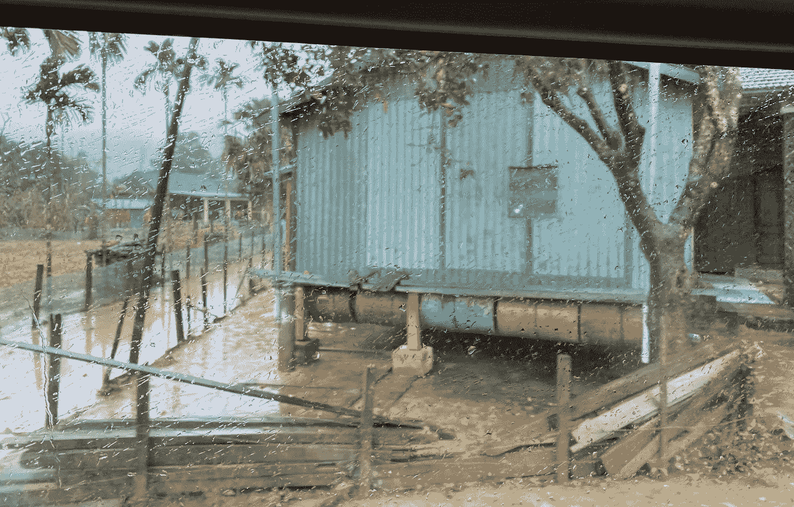

# 城市中的人员流动中断能被近乎实时地看到吗？

> 原文：<https://towardsdatascience.com/the-digital-tailwinds-of-pandemics-and-typhoons-cross-border-insights-from-facebook-mobility-data-763c493b5ecc?source=collection_archive---------57----------------------->

## [变更数据](https://towardsdatascience.com/tagged/data-for-change)

## 使用开源脸书数据对流行病和台风的跨境观察

> 这项工作已经完全使用公开数据完成，并与 [Kai Kaiser](https://medium.com/@kaialexander.kaiser/about) 合著。所有错误和遗漏都是作者的。

《2020 年》比以往任何时候都更加突出地表明，地理和公共卫生危机的发生率和后果会对人类活动造成大范围的干扰。随着大数据源的出现，有望近乎实时地为应对、恢复和最终抵御这些风险提供信息。利用来自智能手机的位置数据，我们提供了两个太平洋国家(菲律宾和越南)在面临这种挑战时人类移动的跨境比较可视化。

在广宁省的省会城市东海，农村居民为高暴露期开发了浮动避难所。作者图片。

2020 年 11 月 9 日，台风瓦姆科(VAMCO)在太平洋形成了单一的天气锋，促使数十万人撤离，乘客滞留，政府工作暂停，学校关闭，航班停飞。台风“瓦姆科”从菲律宾东部开始，横向横扫越南中部(路径如图 1 所示)。总的来说，在 2020 年，尽管政策制定者正在努力解决封锁、流动限制和其他非药物干预措施等持续存在的问题，以遏制新冠肺炎的蔓延，但太平洋地区仍经历了 10 次台风和 23 次热带风暴。大马尼拉地区经历了几十年来最严重的洪水，来自疫情的经济冲击加上房屋和基础设施的破坏，城市岛屿的食物几天都无法到达。

图一。*台风“瓦姆科”穿越菲越的路径(2020 年 11 月)。来源:*
喵使用 [WikiProject 热带气旋/轨迹](https://en.wikipedia.org/wiki/Wikipedia:WikiProject_Tropical_cyclones/Tracks)创建。[背景图片](https://commons.wikimedia.org/wiki/File:Whole_world_-_land_and_oceans.jpg)来自 [NASA](https://en.wikipedia.org/wiki/NASA) 。来自 [NOAA](https://www.ssd.noaa.gov/PS/TROP/DATA/ATCF/JTWC/bwp252020.dat) 的跟踪数据。

在疫情的背景下，政策指令(封锁或疏散)、不可抗力事件(摧毁房屋或基础设施)和自我保护行为(选择留在家中)在这个台风季节对人类流动和社会经济活动的“正常”模式造成了冲击。

当人们“就地躲避”(例如在疫情或极端天气期间)，或被困在某个地方(例如在山洪暴发或道路网络中断期间)，我们预计流动性会下降。如果下令封锁或疏散，我们可能会看到随着人们的重新安置，流动激增。按照指令，例如通常在国家公报上看到的指令，政府和决策者可能会问:[哪些领域的响应最慢或最慢？是不是有些地区根本没有反应？](https://voxeu.org/article/covid-social-distancing-driven-mostly-voluntary-demobilisation)。我们预期的区域的移动性受到影响了吗，或者其他区域的移动性也受到影响了吗？什么样的*数据源*可以帮助我们实时监控人类活动的变化，从灾难的来临到它的消散？

# 智能手机移动数据:接近实时的人体运动感知

随着智能手机在世界各地变得无处不在，来自 GPS 定位数据的见解为人们在灾难中如何移动提供了前所未有的洞察力。作为新冠肺炎加速的集体人道主义努力的一部分，脸书和谷歌等科技公司越来越多地提供数据集，使我们能够衡量人们在准备应对紧急情况时，移动性的变化是如何在地面上展开的。除了为政策制定者提供近乎实时、高度精细的*本地*洞察之外，用于收集和生成这些数据的共享方法还能够对跨越边界的移动性变化*进行一致和全面的比较。*

在时间和空间上，流动性数据的任何与危机相关的应用都将理想地满足政策执行者的两个标准。首先，结果可以以对决策者有用的方式呈现。第二，在任何给定的空间或时间粒度级别上，它们都代表潜在的当地人、地理位置和环境。另一个博客[展示了如何使用我们开发的一套开源快速评估方法来评估移动数据的代表性。](https://mahamfkhan.medium.com/small-districts-big-data-who-does-geo-referenced-mobility-data-represent-78212ca004f6)

在这里，通过关注台风“瓦姆科”(图 1)，我们展示了脸书 [*移动范围地图*](https://data.humdata.org/dataset/movement-range-maps) 数据集(最初用于监测新冠肺炎的移动性影响)的新用例:测量自然灾害造成的冲击。因为这些数据从疫情开始就可以获得，它使我们能够跟踪对当地流动性的影响，即使当其他风险的表现，如自然灾害等*加剧*时。

# 越南和菲律宾从第一波到洪水的一致测量

**图二。(菲律宾事件** ) (i)超强台风高尼(ii)台风瓦姆科(尤利西斯)(iii)圣诞节(iv)新年前夕**(越南事件)** (i)第二波封锁(ii)热带风暴林法(iii)热带风暴浪卡(iv)热带风暴索德尔(v)热带气旋莫拉菲(vi)台风瓦姆科(尤利西斯)。

脸书*运动范围地图*提供了两种跟踪移动性的度量标准:(I)运动的变化(在给定的一天，一个地区的运动范围或半径是多少？)和(ii)“原地不动”(有百分之多少的用户整天呆在一个地方？).在图 2 中，我们跟踪前者，从新冠肺炎的第一波到 2020 年太平洋台风季节和新年。在菲律宾，与基线相比，最初的封锁显示移动性下降了 60%，在整个疫情保持在大约 30%的下降水平——这种封锁被描述为[“看不到尽头】](https://www.aljazeera.com/news/2020/4/2/shoot-them-dead-duterte-warns-against-violating-lockdown)。另一方面，在越南，第一波的全国平均降幅仅为 40%，并且仅持续了一个月(4 月至 5 月)。流动性几乎回到了基线(在某些情况下，由于活动的爆发，甚至超过了基线)，直到 8 月份在岘港的第二波感染，在那里更多的局部封锁导致流动性小幅下降 20%。

考虑到这种情况，当超强台风“高尼”和台风“瓦姆科”登陆时，菲律宾的流动性已经低于“正常水平”，这两次台风都导致流动性短暂快速下降，反映了通常在圣诞节和新年前夕等低流动性日子出现的低流动性类型。

**图 3a。**在新冠肺炎疫情和(I)第二波一级防范禁闭期间(ii)热带风暴林发(iii)热带风暴浪卡(iv)热带风暴索德尔(v)热带气旋莫拉菲(vi)台风瓦姆科(尤利西斯)期间，在越南“呆在原地”的用户百分比。

**图 3b。**在新冠肺炎疫情和(I)超强台风高尼(ii)台风瓦姆科(尤利西斯)(iii)圣诞节(iv)新年前夕期间，菲律宾“呆在原地”(整天呆在一个 Bing 瓷砖里)的用户百分比

在图 3 中，我们评估了在疫情和台风季节“原地不动”的用户百分比。我们在引入封锁的时期(4 月和 5 月)看到长时间的持续峰值，在极端天气事件期间看到短暂的临时峰值。

# 追踪台风“瓦姆科”从形成到消散的过程

台风“瓦姆科”于 2020 年 11 月 11 日首次在菲律宾卡坦杜内斯登陆——这是本季度最具破坏性的台风。在图 4a 中，我们确定并跟踪了连续受到洪水影响的区域，首先是 Catanduanes，然后是 11 月 12 日的马尼拉市、Pampanga Bulacan、Tarlac 和 Rizal，以及 11 月 13 日的 Tugueragao 市。

**图 4a。**菲律宾受台风“瓦姆科”影响最严重的地区对比。最暗的红色表示与“正常”相比，移动性下降最大。

台风瓦姆科横过菲律宾后移向越南，并于十一月十五日在越南登陆。图 4b 显示了 VAMCO 如何在全国移动，在两天时间内降低了在河静、顺化、岘港、广平和广义的流动性。在这两幅图中，较深的红色阴影表示流动性下降较大。

**图 4b。**越南受台风“瓦姆科”影响最严重的地区对比。最暗的红色表示与“正常”相比，移动性下降最大。

# *开源中的移动范围图:针对复合风险的持续移动性监控*

用于上述分析的*移动范围图*数据可在人道主义数据交换上公开获取，全球可用，并每日更新。这使得决策者几乎可以立即获得数据，具有强大的跨国可比性，并能持续监控地区层面的影响和恢复程度。虽然运动范围图最初是为了测量新冠肺炎疫情之后的流动性变化而发布的，但我们说明了该数据是一个独特的复合指标，它内在地将多次冲击对流动性的影响分层。与其他一些数据集相比，数据集在面对事件时不需要被触发或激活。

这些信息在灾难应对周期的每个阶段对决策者和地方政府都至关重要，从确定紧急情况发生时受影响最严重的地区(预计受影响的地区*与实际受影响的*不同吗？)，以跟踪当地恢复率(哪个城市或城镇恢复最快？)，识别长期损害，并最终“重建得更好”。为了扩大这些数据在决策环境中的应用和采用范围，我们与[脸书永久数据](http://dataforgood.fb.com)团队合作，发布了一个基于 [Python 的灾难分析教程](https://mahamfkhan.medium.com/how-do-people-move-during-a-disaster-fad910e5de45)。

# 参考

[1].W. Maloney 和 T. Taskin，[新冠肺炎期间自愿与强制的社会距离和经济活动](https://voxeu.org/article/covid-social-distancing-driven-mostly-voluntary-demobilisation)，VoxEU。

[2] K .凯泽和 T. C .佩肖托，[政府如何利用数据对抗疫情及其伴随的信息学术](https://blogs.worldbank.org/governance/how-governments-can-use-data-fight-pandemic-and-accompanying-infodemic)，世界银行博客。

[3].汗和凯泽。[移动数据的代表性如何？脸书灾难地图数据的快速验证](https://mahamfkhan.medium.com/small-districts-big-data-who-does-geo-referenced-mobility-data-represent-78212ca004f6)。

[4].M. Khan 和 K. Kaiser，[人们在灾难中如何移动？
关于脸书运动范围地图新用例的教程。](https://mahamfkhan.medium.com/how-do-people-move-during-a-disaster-fad910e5de45)

# 承认

> 这项分析是由世界银行与脸书数据公司合作进行的。特别感谢澳大利亚政府外交贸易部(DFAT)通过越南新冠肺炎社会经济响应、恢复和复原大数据观察站对这项工作的支持，这是[澳大利亚世界银行在越南的战略伙伴关系第二阶段](https://vietnam.embassy.gov.au/files/hnoi/08%20201907%20Australia%20World%20Bank%20Partnership%20-%20Phase%202%20EN.pdf)的一部分。所有的错误和遗漏都是作者的。