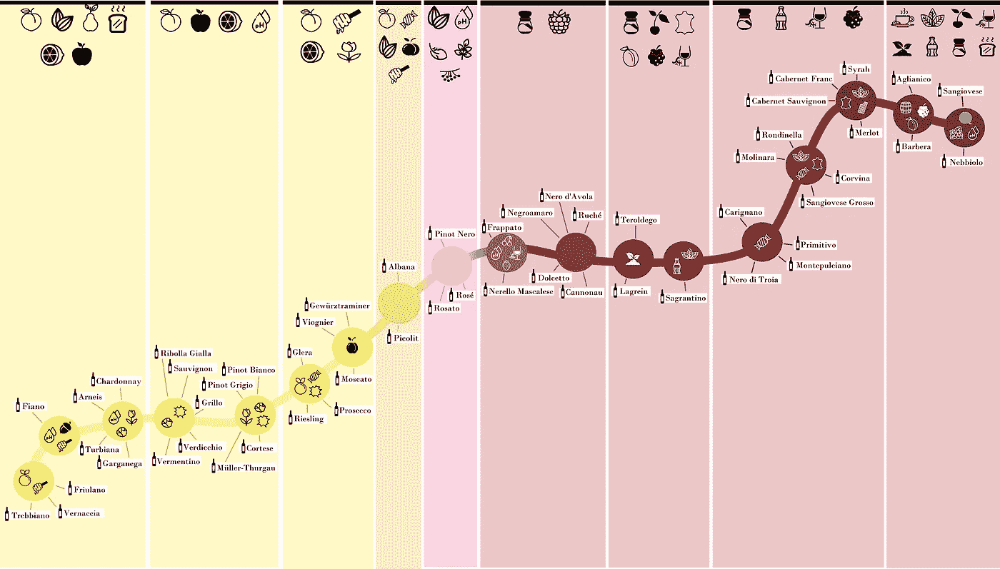
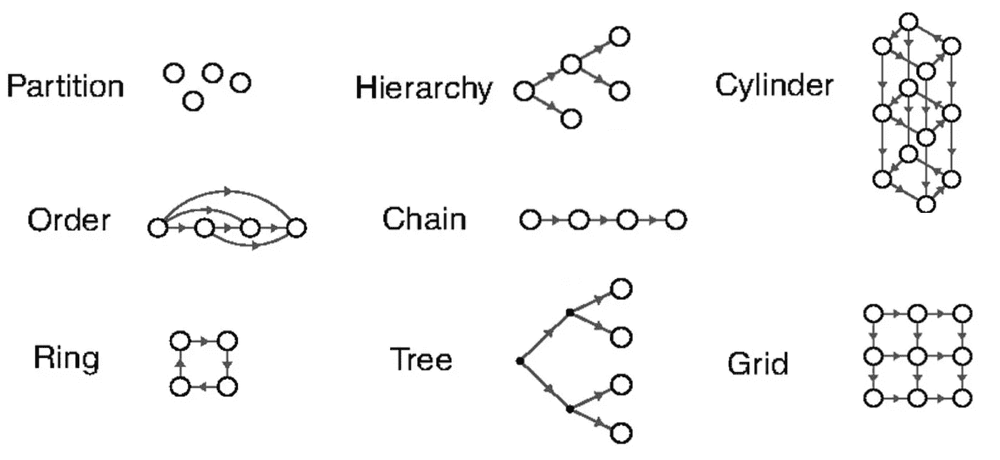
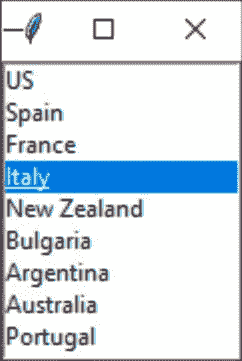
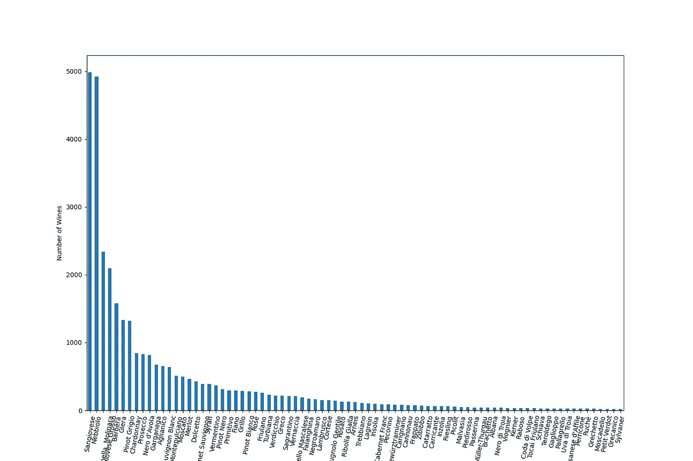
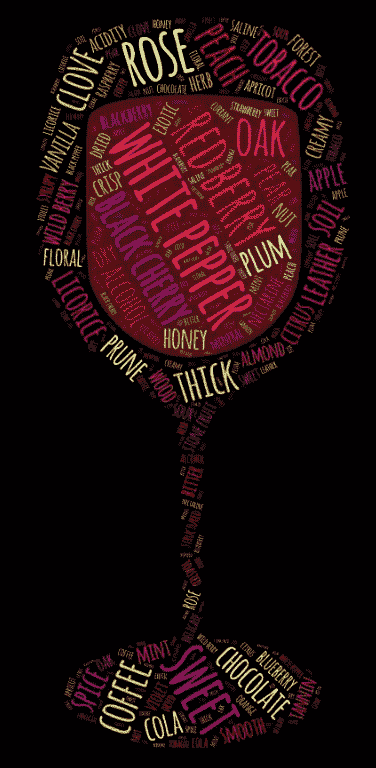
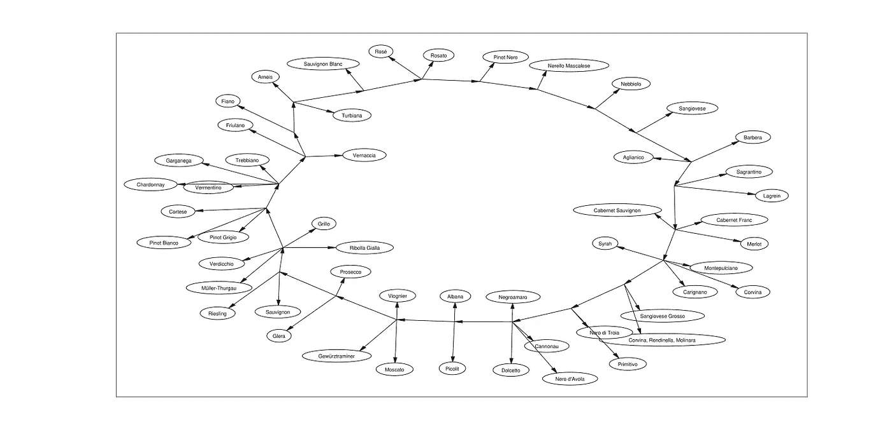
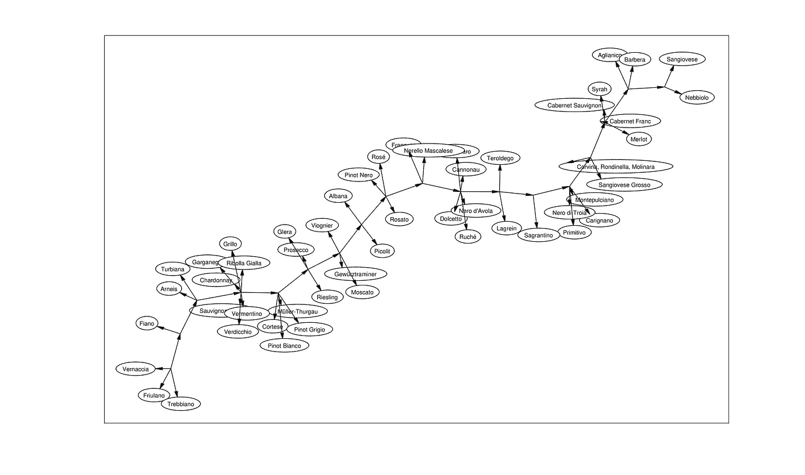

# 葡萄酒结构形式的发现

> 原文：<https://towardsdatascience.com/the-discovery-of-wines-structural-form-cb92a103b411?source=collection_archive---------27----------------------->

## 使用智能算法实现数据驱动的可视化



图片由作者提供。

你好。今天，我将介绍如何将 Kemp & Tenembaum 卓越的“形式发现”算法应用于葡萄酒数据集。最终，这提供了一个数据驱动的地图来根据我们的口味选择葡萄酒。如果你像我一样，喜欢数据科学、机器学习、认知和/或葡萄酒爱好者，那么你可能会对这篇文章感兴趣。

免责声明:我绝不是暗示这里采用的方法是最好的。事实上，如果你知道可以改进的方法，我很乐意听听！]

首先，像每个食谱一样，我们将从我们需要的东西的清单开始:

**葡萄酒数据集** ( *免费提供* [*此处*](https://www.kaggle.com/zynicide/wine-reviews) )

**Python** ( *我用* [*PyCharm*](https://www.jetbrains.com/pycharm/) )

**肯普&特南鲍姆算法** ( [*此处*](http://www.charleskemp.com/code/formdiscovery.html) )

**Graphviz** (此处[](https://graphviz.org/download/)**:确保下载的版本包含* ***neato*** )*

***Matlab***

*本质上，在他们的工作中，Kemp 创造了一种算法，可以找到数据集的最佳结构表示，没有任何关于这个维度的假设和指示。它通过将输入数据组织成 8 种“基本形式”并给每种形式分配一种分数来实现这一壮举，以便找到最符合数据的形式。*

*这些特定领域的形式是:分区、顺序、环、层次、链、树、网格和圆柱。下面描述的每个原型都是从图论中派生出来的，并且有自己特定的规则来指导数据簇之间的关系。如果这听起来令人困惑，不要烦恼！下面我们将把这些有点抽象的单词和一个实际的例子联系起来(*我们不会深入论文的细节，尽管*)。*

**

*图改编自 PNAS 的“[结构形式的发现”，在知识共享下出版。](https://www.pnas.org/content/105/31/10687)*

*在论文中，作者提供了几个使用不同数据集的工作示例，但是我觉得尝试在新数据上使用它会很有趣。为了寻找一个合适的数据集，我前往 [kaggle](https://www.kaggle.com/) ，在那里人们可以找到这种类型的东西。“葡萄酒评论”数据集引起了我的注意，因为它包含了人们可能用来作为算法特征的信息类型，所以*葡萄酒不是？**

*该数据集包含 260，000 瓶葡萄酒，每瓶葡萄酒的信息包括名称、品种、原产国、价格，更重要的是，还有侍酒师撰写的评论。我认为可以找到一种方法来提取所有这些评论中的重复出现的单词，然后将这些单词作为特征输入到算法中*

*要做到这一点，人们可以使用部分流程来生成如今似乎无处不在的“文字云”。*

**

*这里有一个单词云的例子。你这辈子应该至少看过 ***一部*** 一部。图片由 Alberto Frigo 制作，[公共领域](https://commons.wikimedia.org/wiki/File:Auto-etnographic_cloud_of_Frigo%27s_project.jpg)*

*想象一下当我搜索“python wordcloud 教程”时的难以置信，第一个结果[是一个使用与我选择的数据集完全相同的数据集的指南！初学者的运气最好。](https://www.datacamp.com/community/tutorials/wordcloud-python)*

*无论如何，我们将使用这种方法提取侍酒师用来描述葡萄酒口味的最常见的词，将这些特征分配给一系列葡萄酒品种，将其输入 Kemp & Tenenbaum 的算法，并看看它如何为我们安排它们。简单。*

*好的，我们可以从流水线的逐步分解开始。*

> **第 1 至 10 点为基本数据操作和 wordcloud 设置，第 11 至 19 点为算法设置矩阵并输入，第 20 点为结果**

*1。按照 Python 的习惯，我们通过导入必要的**包** ( *这样称呼是因为它们实际上包含了做*事情的代码)来开始脚本。令人震惊的是，在导入之前，需要安装软件包。你如何做取决于你如何使用 Python。我就简单提一下在 PyCharm 里怎么做。基本上每个包的安装都涉及到终端中编写的单行代码，一般结构为“pip install nameofthepackage”(*作为参考，* [*此处*](https://pandas.pydata.org/pandas-docs/stable/getting_started/install.html) *可以找到安装各种 builds 的熊猫的说明*)。需要的包是 **matplotlib** 来帮助我们制作图表， **numpy** 和 **pandas** 来处理操作数据， **scipy.io** 转换 Python 输出以在 Matlab 中使用，以及 **tkinter** 允许我们制作一个菜单来从中选择内容。我猜你能搞清楚 **wordcloud** 有什么用。*

```
*import matplotlib.pyplot as plt
import numpy as np
import pandas as pd
import scipy.io as sio
import tkinter as tk
from wordcloud import WordCloud, STOPWORDS*
```

*当我们将包**作为** *something*导入时，这意味着我们可以引用那个*something*来访问包中的代码，因此它通常是名称本身的缩写。只是为了打字少一点。*

***2。**现在我们可以**将数据集**加载到 Python 中。我假设它已经从 kaggle 下载，保存在我们工作的目录中，并命名为 winedata1 和 winedata2，因为出于某种原因，数据集被分成两半。*

*`df1 = pd.read_csv("winedata1.csv")`*

*就像这样，我们将文件“winedata1.csv”中包含的所有内容都赋给了名为“df1”的变量。这是通过一个 **pandas** 函数(read_csv)完成的，我们通过调用导入时为 pandas 选择的缩写( **pd** )来访问它。如果您想知道什么是 csv 文件，请考虑 excel 表格。如果你想知道什么是 excel 表格，可以把数字和单词排列成有行和列的表格。如果你想知道什么是数字、表格、行和列…嗯，嗯..没关系。*

*无论如何，我们将对数据集的后半部分也这样做:*

*`df2 = pd.read_csv("winedata2.csv")`*

*然后，我们将这两个独立的数据帧结合起来。一个新词)通过使用另一个 pandas 函数来完成，并恢复整个数据集:*

*`dataset = pd.concat([df1, df2])`*

***3。**正如我之前提到的，这个数据集包含了世界各地的葡萄酒。如果我们根据葡萄酒的生产国来缩小我们使用的葡萄酒的范围，这可能是最好的，因为某个地方生产的解百纳可能与其他地方生产的解百纳在特征上有所不同。*

*有比弹出窗口更好的方法吗？你可以滚动窗口，从中选择一个国家。我不这么认为。*

*在此之前，最好知道数据集中有多少个国家。我们很懒，所以我们让计算机来统计这个(数据集的**国家**列中**特有的**字数)，并告诉我们(**打印**)。*

```
*print("There are {} countries producing wine in the whole dataset, please choose one by selecting it from the list"
" and pressing enter".format(len(dataset.country.unique())))*
```

*接下来，我们将使用 tkinter 包(tk)设置**弹出窗口**。*

```
*window = tk.Tk()
window.title(‘Wine producing countries’)
window.geometry(‘100x150’)
tiny_list = tk.Listbox(window)
tiny_list.pack(expand=True, fill="both")
countries = dataset.country.unique()for item in range(len(countries)):
    tiny_list.insert("end", countries[item])

tiny_list.select_set(0)
tiny_list.focus_set()*
```

*我们还需要编写一个小函数，允许我们从弹出窗口中选择一个国家，并在完成后关闭它。*

```
*def exit_gui(event):
    global choice
    choice = tiny_list.curselection()
    window.destroy()*
```

*最后，我们可以运行窗口，让机器知道我们的选择将通过按下**回车键**发出信号，并让它通知我们所做的选择。*

```
*window.bind("<Return>", exit_gui)
window.mainloop()

print("Wines from", countries[choice], "were chosen.")*
```

**

*作者图片*

*在本教程中，我选择了意大利葡萄酒，但是代码应该可以很好地运行大多数选择。然而，如果选择了一个葡萄酒很少的国家，可能会有问题，所以不要向下滚动太多。*

***4。**现在，让我们用我们选择的国家的所有葡萄酒瓶数据制作一个变量。我们称它为葡萄酒，因为我们还能怎么给它命名？这是我们从现在开始要做的。*

```
*wines = dataset[dataset.country == countries[choice]]*
```

*此外，每种酒**品种**都有多个瓶子，所以打印出这些品种是个好主意。*

```
*print(wines.groupby("variety").describe())*
```

*就意大利葡萄酒而言，品种中有一些“T20”混合“T21”。由于第一个目标是将葡萄酒品种与它们的口味特征相匹配，因此建议直接剔除这些葡萄酒，因为它们的风味会因“混合”而有很大差异，可以归为一个品种。*

```
*wines = wines[wines.variety != "Red Blend"]
wines = wines[wines.variety != "White Blend"]
wines = wines[wines.variety != "Sparkling Blend"]*
```

*去除数据集中少于 20 个条目的品种也是一个好主意，因为没有足够的数据来评估它们的味道。*

```
*wines = wines.groupby("variety").filter(lambda x: len(x) > 20)*
```

***5。在这一部分中，我们关注数据集中的另一个问题:一些品种的名称略有不同，但实际上是相同的。例如，一些葡萄酒被标为“长相思”,而另一些则被标为“长相思”,其实它们指的是同一个品种。这种问题对于大型数据集来说很正常，需要解决。***

*下面的代码在所有品种的名字中寻找**相似之处**，并询问用户如果它们部分匹配时想做什么，给出 3 个选项供选择:*

*[1]将名称相似的两个品种合并(并选择保留哪个名称)。*

*[2]从数据集中移除两者之一(并选择哪一个)。*

*[3]无视它们，继续生活。*

*一旦完成，程序会告诉我们剩余品种的数量。*

```
*varietylist = sorted(wines.variety.unique(), key=len)for first_index in range(len(varietylist)):
    try:  
        for second_index in range(first_index + 1, len(varietylist)):  
            if varietylist[first_index] in varietylist[second_index]:
                first_rep = varietylist[first_index]
                second_rep = varietylist[second_index]
                print('\n detected a repetition between', first_rep, 'and', second_rep)
                choice = input('How would you like to proceed? [1]Rename (merge), [2]Remove, [3]Ignore')
                if int(choice) == 1:
                    subchoice = input(
                        'Would you like to [1]assign ' + first_rep + ' to ' + second_rep + ' or [2]viceversa?')
                    if int(subchoice) == 1:
                        wines.loc[wines['variety'] == first_rep] = second_rep
                    elif int(subchoice) == 2:
                        wines.loc[wines['variety'] == second_rep] = first_rep

                if int(choice) == 2:
                    menu = list([first_rep, second_rep])
                    subchoice = input('Which type would you like to drop?' +
                                      ' [1]' + first_rep + ' has' + ' ' +
                                      str(len(wines.loc[wines['variety'] == first_rep])) + ' entries' +
                                      ' or ' + '[2]' + second_rep + ' has' + ' ' +
                                      str(len(wines.loc[wines['variety'] == second_rep])) + ' entries')

                    wines = wines[wines.variety != menu[int(subchoice) - 1]]
                if int(choice) == 3:
                    continue
    finally:
        continueprint("there are", len(wines.variety.unique()), "varieties of wine left in the data")*
```

***6。**好了，是时候我们制作一个**图**来粗略看看我们正在处理的数据了。为此，我们使用 matplotlib，它将输出如下图所示的图形。*

```
*plt.figure(figsize=(15, 10))
wines.groupby("variety").size().sort_values(ascending=False).plot.bar()
plt.xticks(rotation=80)
plt.xlabel("Type of Grape")
plt.ylabel("Number of Wines")
plt.show*
```

**

*一个柱状图让我们快速感受每个葡萄酒品种(横轴)有多少种葡萄酒(纵轴)。图片作者。*

***7。**如果你看一下数据集，你会发现还有很多我没有提到的信息。事实上，它对我们的目的毫无用处，我们将把它从“葡萄酒”数据框架中删除。怎么会？嗯，使用 **drop** 命令和一个我们认为不再需要的列名列表。*

```
*wines.drop(
    ["country", "winery", "designation", "province", "region_1", "region_2", "price", "points", "taster_name",
     "taster_twitter_handle", "title"], inplace=True, axis=1)*
```

***8。**这里 **wordcloud** 进程开始了，它将寻找给定文本中最常见的单词。首先，所有品酒师对每瓶酒的评论都被合并成一个单一的、非常大的文本(本例中为 700 万字)。由于这些单词中有许多不是*美味*口味特征，我们制作了一个过滤器来阻止一些(**停用词**)并避免它们出现在结果中。然后，单词云被生成*

```
*text = " ".join(review for review in wines.description)
print("There are {} words in the combination of all reviews.".format(len(text)))stopwords= set(STOPWORDS)
stopwords.update(["drink", "now", "wine", "flavor", "flavors", "show", "hint", "sangiovese", "expression", "delivers", "of",
             "open", "made", "quality", "end", "layer", "generous", "aromas", "occasion", "nose", "carry", "over", "a",
             "offer", "chardonnay", "offers", "make", "nose", "cabernet sauvignon", "merlot", "through", "with", "now",
             "close", "palate", "texture", "feel", "mouth", "mouthfeel", "year", "boast", "touch", "the", "elegant",
             "well", "one", "pretty", "pinot grigio", "lead", "vintage", "personality", "boasts", "savory", "and", "is",
             "imported", "along", "load", "years", "give", "intensity", "made", "followed", "whiff", "elegant", "has",
             "pair", "note", "aroma", "this", "suggest", "with", "after", "aged", "dominate", "opens", "fragrance",
             "those", "who", "enjoy", "that", "recall", "pair", "time", "come", "around", "completed", "by",
             "but", "find", "delicious", "blast", "still", "nebbiolo", "glass", "already", "opens", "doles", "note",
             "less", "which", "such", "it", "despite", "care", "gone", "framed", "in", "drinks", "packed", "packs",
             "bouquet", "local", "italian", "finish", "aromas", "assertive", "delightful", "evolved",
             "evolves", "italy", "would", "intensity", "genuine", "wonderful", "smelling", "manifested", "bursting",
             "modern", "solid", "qualities", "more", "than", "terms", "here", "ambitious", "version", "unique", "into",
             "southern", "northern", "enough", "really", "very", "plenty", "touch", "particularly", "probably",
             "opulent", "attractive", "should", "be", "drunk", "any", "doesn't", "marked", "excellent", "bloated",
             "steady", "on", "crowd", "packed", "grapes", "rich", "beautiful", "presents", "approachable", "shows",
             "you", "although", "need", "along", "alongside", "accompanied"])wordcloud = WordCloud(stopwords=stopwords, max_words=1000).generate(text)*
```

*这部分有点手动，在某种意义上，我还没有找到一种以令人满意的方式从我们的词云中提取味道特征的自动方法，因为无论你放多少停用词，一些不相关的词仍然会通过。所以，你要么相信我，要么自己看看 **wordcloud.words_** 看看侍酒师赋予葡萄酒的最常见/最相关的味道特征是什么(我在各个生产国都这么做了)。无论如何，这是味道特征列表:*

```
*features = list(['description', 'variety', 'sweet', 'black cherry', 'tobacco', 'coffee', 'clove', 'chocolate', 'rose',
                 'cinnamon', 'oak', 'leather', 'peach', 'red berry', 'thick', 'blue flower', 'white flower', 'licorice',
                 'plum', 'vanilla', 'almond', 'wild berry', 'alcohol', 'blackberry', 'cola', 'honey', 'toast', 'prune',
                 'pear', 'spice', 'black pepper', 'white pepper', 'apple', 'creamy', 'soil', 'nectarine', 'truffle',
                 'smooth', 'citrus', 'stone fruit', 'acidity', 'tannin', 'simple', 'floral', 'mint', 'mocha',
                 'red cherry', 'orchard fruit', 'raspberry', 'wood', 'menthol', 'exotic', 'blueberry', 'yellow fruit',
                 'bitter', 'mineral', 'crisp', 'violet', 'herb', 'anise', 'apricot', 'spring flower', 'espresso', 'dry',
                 'forest', 'lemon', 'tangerine', 'nut', 'astringent', 'thyme', 'acacia', 'saline', 'kiwi', 'bodied',
                 'structured', 'dried', 'cantaloupe', 'rosemary', 'earth', 'cocoa', 'sage', 'cigar', 'currant', 'sour',
                 'barrique', 'hazelnut', 'maple syrup', 'mushroom', 'balsamic', 'nutty', 'toasted', 'syrupy', 'cedar',
                 'smoky', 'tropical', 'gentle', 'delicate', 'easy drinking', "strawberry", "orange", "figs", "silky"])*
```

*还不错。在几秒钟内，我们压缩了超过 700 万个单词，精确地得到了 100 个。如果你在开始时注意到了“描述”和“变化”,这是我为数据帧操作做的一个变通方法，很快就会被放弃。*

*9。如前所述，Data Camp 有一个教程，教你如何从相同的数据集中生成一个 wordcloud，以及如何通过 Python 把它放到一些互联网下载的图片中。然而，你可能会决定查看一下[艺术字](https://wordart.com/)中的品味功能列表，这样会得到更快更好的结果，就像这样:*

**

*更漂亮的文字云。图片作者。*

*10。我们已经完成了计划的第一部分，即从数据集中提取葡萄酒的风味。现在，我们需要程序将这些味觉特征分配给各种葡萄酒。我们首先在数据框架中制作提取的特征列，然后对于每一瓶葡萄酒，我们检查其侍酒师的评论是否包含任何这些特征，这将为我们提供一个很好的“逻辑”，是/否(1/0)，矩阵指示一瓶葡萄酒是否具有某种味道特征。*

```
*wines = wines.reindex(columns=features)

for feats in range(2, len(features)):
    wines[features[feats]] = wines['description'].str.contains(features[feats])*
```

*真快。现在我们可以从数据中删除侍酒师的描述，因为我们已经完成了。讨厌游戏，不讨厌玩家。*

```
*wines.drop('description', inplace=True, axis=1)*
```

***11。**最后，我们制作了一个新的数据框架，汇总了所有这些 1 和 0，并根据不同的葡萄酒对数据进行了压缩！这意味着，如果我们的数据集有两瓶 Sangiovese 葡萄酒，并且都有“单宁”作为特征，新矩阵将有一个 Sangiovese 行，在“单宁”列中有 2，而如果只有一瓶有“巧克力”,现在我们将在“巧克力”列中有 1，如果都没有“桃子”,则在该列中有 0，以此类推所有特征和品种。我们称之为**品味事件**。*

```
*tasteoccurrences = wines.groupby("variety").sum()*
```

*12。多亏了这个项目，我了解到品酒师和学者有一个共同的特点:写作时，他们会打开一本辞典，寻找花哨的同义词，以获得复杂性，减少重复。除非他们真的打算让‘咖啡’、‘浓咖啡’和‘摩卡’是不同的口味，我对此表示怀疑。因此，我们需要总结和丢弃所有这些多余的特征。*

```
*tasteoccurrences["coffee"] = tasteoccurrences["coffee"] + tasteoccurrences["espresso"] + tasteoccurrences["mocha"]
tasteoccurrences["mint"] = tasteoccurrences["mint"] + tasteoccurrences["menthol"]
tasteoccurrences["floral"] = tasteoccurrences["floral"] + tasteoccurrences["spring flower"] + tasteoccurrences[
    "white flower"]
tasteoccurrences["citrus"] = tasteoccurrences["citrus"] + tasteoccurrences["lemon"] + tasteoccurrences["tangerine"]
tasteoccurrences["structured"] = tasteoccurrences["structured"] + tasteoccurrences["bodied"]
tasteoccurrences["soil"] = tasteoccurrences['soil'] + tasteoccurrences["earth"]
tasteoccurrences["chocolate"] = tasteoccurrences["chocolate"] + tasteoccurrences["cocoa"]
tasteoccurrences["tobacco"] = tasteoccurrences["tobacco"] + tasteoccurrences["cigar"]
tasteoccurrences["alcohol"] = tasteoccurrences["alcohol"] + tasteoccurrences["barrique"]
tasteoccurrences["nut"] = tasteoccurrences["nut"] + tasteoccurrences["nutty"]
tasteoccurrences["toasted"] = tasteoccurrences["toasted"] + tasteoccurrences["toast"]
tasteoccurrences["syrupy"] = tasteoccurrences["syrupy"] + tasteoccurrences["maple syrup"]
tasteoccurrences["wood"] = tasteoccurrences["wood"] + tasteoccurrences["cedar"]
tasteoccurrences["delicate"] = tasteoccurrences["delicate"] + tasteoccurrences["easy drinking"] +
                               tasteoccurrences["simple"]
tasteoccurrences["smooth"] = tasteoccurrences["smooth"] + tasteoccurrences["silky"]

tasteoccurrences.drop(["espresso", "menthol", "mocha", "spring flower", "tangerine", "lemon", "bodied", "white flower",
                       "earth", "cocoa", "cigar", "barrique", "nutty", "toast", "maple syrup", "cedar", "simple",
                       "silky",
                       "easy drinking"], inplace=True, axis=1)*
```

***13。**对于最后的数据操作部分，我们将**归一化**总得分。这是通过减去平均值并除以标准偏差来完成的。首先，我们需要用空值替换零，否则会影响平均值。*

```
*tasteoccurrences.replace({0: np.nan}, inplace=True)*
```

*由于下面的规范化(或标准化)，我们的新矩阵(*最初命名为* **datamatrix** )中的值将显示每个葡萄酒品种的特征与平均值的标准差。这被称为 **Z 得分**，而**T21 的大多数统计数据都归结于此。我们可以用它来指导选择每个品种保留哪些特征。***

*我在代码中设置了一个非常宽松的半标准差阈值(> = 0.5)，以拒绝那些很少与某种变化相关联的特征。作为参考，我们称之为“**统计显著性**”的是距离平均值 2 个标准差的距离，所以我们在这里是 1/4。*

```
*datamatrix = pd.DataFrame(columns=tasteoccurrences.columns)for grapes in range(len(tasteoccurrences)):
    datamatrix.loc[grapes, :] = (tasteoccurrences.iloc[grapes, :] - tasteoccurrences.iloc[grapes,:].mean()) / tasteoccurrences.iloc[grapes,:].std() >= 0.5*
```

***14。**然后，行的名称(即葡萄酒品种)从 tasteoccurrences 转移到 datamatrix，并将其内容指定为**整数**(又名数字)，否则当我们去那里时，Matlab 会不必要地将它们视为**字符串**(又名文本)，从而使我们感到厌烦(*很快*)。*

```
*datamatrix.index = tasteoccurrences.index
datamatrix = datamatrix.astype(int)*
```

*并去掉所有没有被分配到任何葡萄酒品种的风味。*

```
*datamatrix = datamatrix.reindex(columns=datamatrix.columns[datamatrix.sum() != 0])*
```

***15。**此外，理想情况下，该算法需要比**entities**(葡萄酒品种)更多的**特性**(即，比**行**更多的**列**)。所以，我们做一个快速循环，去掉一些变量，直到满足这个条件。在这里，我放弃了功能较少的品种，只是另一个任意的选择。*

```
*while datamatrix.shape[0] > datamatrix.shape[1]:
    lowfeat_wines = datamatrix.sum(axis=1) < (datamatrix.sum(axis=1).mean() - (datamatrix.sum(axis=1).std()))
    datamatrix.drop(datamatrix[lowfeat_wines].index, inplace=True, axis=0)*
```

***16。**我们设置矩阵，分别保存行和列的名称，并将其转换到 Matlab。很明显，如果你想运行这个，保存它们的路径需要改变。*

```
*datamatrix = datamatrix.reindex(columns=datamatrix.columns[datamatrix.sum() != 0])names = np.sort(list(datamatrix.index))
mdic = {"names": names}
sio.savemat("wine_names.mat", mdic)

datamatrix.to_csv(r'C:\Users\stempio\PycharmProjects\AdditionalSources\winedatapyt.csv', index=False)*
```

*Matlab 的最后阶段已经准备好了，算法很容易设置。对我来说，最棘手的部分是获得正确的 graphviz 版本并正确安装。*

*17。通过 **Matlab** ，我们将我们的 Python 输出文件移动到 Kemp & Tenembaum 的算法数据文件夹所在的目录下。*

```
*kemp_path = 'C:\Users\stempio\Documents\MATLAB\formalgo\data';

movefile('C:\Users\stempio\PycharmProjects\AdditionalSources\winedatapyt.csv' , kemp_path)
movefile('C:\Users\stempio\PycharmProjects\AdditionalSources\wine_names.mat' , kemp_path)*
```

*18。我们传送到那个目录，并对数据执行一些小的操作。算法的饭做好了，这是最后的盐。*

**

*马西莫·德安东尼斯为本文精心制作。*

```
*cd(kemp_path)
load('wine_names')

names = cellstr(names);
temp = readtable('winedatapyt.csv');
features = temp.Properties.VariableNames';
data = table2array(temp);save('italian_wines', 'data', 'features', 'names')

cd ..*
```

*我们需要对算法的 **masterrun.m** 文件做一个小小的编辑，修改第 35 行。*

```
*thisdata = 21*
```

*类似地，我们修改 **setps.m** ，按照已经存在的格式，在列表的第 **12** 和 **27** 行添加数据文件的名称(在本例中为‘Italian _ wines’)。*

*就像这样，我们可以在命令窗口中键入以下命令来运行该算法:*

```
*masterrun*
```

*它会施展魔法，试图找到理想的结构形式来排列它所接收的数据。最棒的部分是，它实际上向我们展示了它是如何试图解决这个问题的，如果你不觉得这很有趣，我怀疑你是否已经做到了这一步，但不管怎样，还是要向你致敬！*

***19。**一旦完成(*可能需要一段时间*)，我们感兴趣的输出将在变量 **modellike** 中，特别是在它的第 21 列(上面我们设置的 **thisdata** 的数量)。我们对得分最高的结构形式感兴趣，所以我们寻找跨行的最大值。然后我们用它的名字画出来。*

```
*[~, idx] = max(modellike(:,21));draw_dot(structure{idx,21}.adj, names{21})*
```

*瞧。我第一次尝试运行它时，它给了我一个环形结构，这是非常显著的，因为涉及味道和风味的图形通常被描述为[轮子](https://www.google.com/search?q=wheel+taste&safe=strict&client=firefox-b-d&source=lnms&tbm=isch&sa=X&ved=2ahUKEwihhvv7gMLuAhVjxoUKHaRrCgkQ_AUoAXoECBgQAw&biw=1658&bih=911&dpr=2)。它也跟着葡萄酒的颜色走，却没有任何提示！*

**

*“意大利葡萄酒圈”，听起来有点不靠谱。作者图片*

*然而，当我改进代码和添加特性时，算法也改变了它的输出，在最终的脚本中，它输出了一个链。因此，结果会因数据而异，但仍然遵循颜色和味道的倾向。*

**

*“意大利葡萄酒连锁店”，这可能是一个酒类商店的名字。图片作者。*

*20。诚然，Kemp & Tenenbaum 算法的输出看起来不如其理论好，也没有传达太多关于实体(葡萄酒)和特征(风味)的信息。所以我向我的一个好朋友寻求建议来改善它的外观。事不宜迟，下面是最终的表单:*

**

*看起来有点像地铁地图，不是吗？请小心葡萄。*

*根据侍酒师对意大利葡萄酒口味的判断，对数据集中的意大利葡萄酒进行信息丰富、数据驱动的结构化表示。垂直区带包含其中的节点共享的特征，而节点显示连接到它们的所有变体共享的一些特征。当然，这些品种本身有更多独特的特征，但为了使图表更整洁，没有包括这些特征。*

***TL；我们已经实施了最初的计划:从一个包含 260，000 种葡萄酒的相对较大的数据集中提取味道特征，并将其分配给各个品种，然后我们礼貌地要求一个智能算法以最佳方式排列它们。可以肯定地说，如果你喜欢上图中的某一种葡萄酒，比如说 Nebbiolo，你更可能喜欢 Sangiovese 而不是 Frappato。当然，对于数据集中的瓶子来说尤其如此。***

*你可以想象在一个更深入的模型上继续工作，在一个瓶子一个瓶子的水平上完成，而不用按品种来折叠葡萄酒。恕我直言，这导致*降低了*模型的拟合度。*

*如果你知道任何有这类数据的葡萄酒销售网站，他们可能会有兴趣雇佣一名初级数据科学家(看看你[维维诺](https://www.vivino.com/IT/en/)、[les grapes](https://www.lesgrappes.com/en)、 [TWIL](https://www.thewineilove.com/) 😊)，让我知道。我可能会接受用葡萄酒支付部分费用。*

*感谢阅读！*