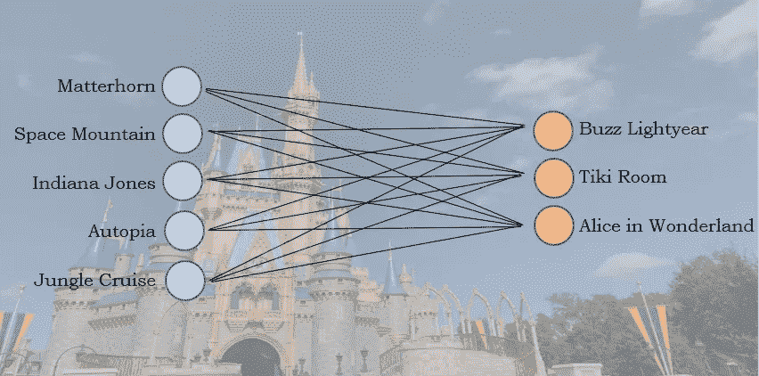

# 迪士尼算法:一个有监督的机器学习程序

> 原文：<https://towardsdatascience.com/the-disneyland-algorithm-a-supervised-machine-learning-program-67c730cd62d5?source=collection_archive---------24----------------------->

## 我教了一台机器如何选择你在迪斯尼乐园的下一站



图片由作者提供

## 简介:

迪士尼乐园有 30 种不同的游乐设施，你的一天看起来有无限的可能性。嗯，不完全是无止境的，但是很接近了。准确地说，如果你当天只乘坐 12 次，有 86，493，225 种可能性(30 选 12)。这给迪士尼乐园的常客或对数据科学感兴趣的个人留下了一个有趣的问题:迪士尼乐园理想的一天是什么时候？

## 工作原理:

为了尝试回答这个问题，我将一个神经网络应用到我的 MATLAB 模拟中，该模拟来自我的上一篇文章[通过人口模拟预测迪士尼乐园的等待时间](/predicting-disneyland-wait-times-through-population-simulations-20f44c7582f6)。那篇文章深入探讨了模拟是如何工作的，但本质上，它跟踪了迪士尼乐园周围的不同群体，因为他们做出了乘坐选择，并记录了他们一天的运行分数。更高的分数意味着他们有更好的一天。

为了将神经网络应用于这些数据，我将它设计成只有一层，有一个输出层和一个输入层。输入层由 60 个节点组成，其中 30 个节点代表该组的骑行历史，30 个节点代表该组刚刚骑过的骑行。由 30 个节点组成的输出层将是所有可能的下一次乘坐。这个想法是，给定你已经骑过的和你刚刚骑过的，机器将选择你的下一次骑行。

为了选择训练数据，我希望查看迪士尼乐园模拟日的前 10%分数。这些群体显然做出了导致更美好一天的决定，所以我们想训练神经网络做出同样的决定。对于排名前 10%的每一组，我将从他们的乘车顺序中抽取 5 个样本。在每个示例中，我将选择乘坐作为正确的输出，之前的乘坐以及总的乘坐历史作为输入。这将为神经网络产生大约 2，750 组不同的训练数据(大约 5，500 组的 10%，每组 5 个样本)。下面是如何从模拟数据矩阵中收集每个单独的训练数据的示例。

```
training_data = zeros(num_groups * 5 * 0.1, 60); % initializes the training matrixcorrect_output = zeros(num_groups * 5 * 0.1, 30); % initializes the output matrixindex2 = 0; % initializes an indexindex3 = 0; % initializes an indexridebefore = 0; % establishes a variableoutput_ride = 0; % establishes a variablerides_before = []; % establishes an arraytop10 = prctile(group_data(:,43),90);for a2 = 1:num_groups % for all groups in parkif group_data(a2,43) >= top10 % if score is in top 10%for a1 = 1:5 % collects 5 samplesindex3 = 0; % resets an indexrides_before = []; % clears the ride history arrayindex2 = index2 + 1; % up one increment for data matrixfor a3 = 1:40 % for up to 40 rides in one dayif ride_history(a2,a3) ~= 0 % counts how many rides the group has been onindex3 = index3 + 1;endendrandom_num3 = randi(index3); % picks a random number from that countoutput_ride = ride_history(a2,random_num3); % finds corresponding ride for that random numberif random_num3 ~= 1 % if it's not the first ride of the dayridebefore = ride_history(a2, random_num3 - 1); % sets this variable to the ride before the next choicefor a4 = 1:(random_num3 - 1)rides_before(length(rides_before) + 1) = ride_history(a2,a4); % sets ride history to all rides before next choiceendelseridebefore = 0; % resets valuerides_before = []; % resets arrayendfor a5 = 1:30 % turns previous ride number into binary string from 1-30if a5 == ridebeforetraining_data(index2,a5) = 1; % all 0's except for previous rideendendfor a6 = 1:length(rides_before) % turns ride history numbers into binary string from 1-30for a7 = 1:30if rides_before(a6) == a7training_data(index2,a7 + 30) = 1; % all 0's except for rides previously riddenendendendfor a8 = 1:30 % turns chosen ride into binary string from 1-30if a8 == output_ridecorrect_output(index2,a8) = 1; % all 0's except for group's chosen rideendendendendend
```

现在我们有了 60 个输入节点值和相应的 30 个正确的输出值。我们现在可以使用有监督的机器学习算法，我们的学习率设置为 0.05。我将使用 sigmoid 激活函数来保持所有输出值在 0 和 1 之间。下面是我的监督学习算法的代码。

```
dweights = rand(60,30); % assigns random weights to a 60x30 matrixalpha = 0.05; % learning rate set to 0.05epochs = 5000; % repeats for training datafor ii = 1:epochs % loop for each epochapprox_output = 1./(1 + exp(-1 * training_data * dweights)); % finds approximate outputerror = correct_output - approx_output; % finds errordelta = (approx_output .*(1-approx_output)).* error; % applies activation function (sigmoid)ad = alpha .* delta; % extra step for alpha times deltatrans_training = transpose(training_data); % transposes training data matrixdweights = dweights + (trans_training * ad); % updates weightsendsave('Weights.mat','dweights'); % saves new weights after all epochs
```

该代码通过权重矩阵强化了良好的决策。权重将开始收敛到某些值，这将有助于机器做出决策。下面是 3 个不同权重随时间收敛到特定值的示例。


图片由作者提供

现在，如果你给算法你刚刚骑过的车，以及你之前所有的车，它会给出接下来的前三个车供你选择。让我们看看理想的迪士尼乐园日是什么样子。

## 理想的迪士尼乐园日:

从我以前的文章[预测迪士尼乐园:让你的迪士尼日更美好的策略](/predicting-disneyland-strategies-to-better-your-disney-day-e08f8b84f51)中我们知道，越小的团队每天乘坐的次数越多。以下是其他一些可以考虑的建议:

*   提前到达——在公园开放前到达的团队平均每天乘坐的次数更多。
*   选择正确的第一次乘坐——太空山、马特宏峰和印第安纳琼斯被选为第一次乘坐时，每天会有更多的人乘坐。
*   选择距离更近的骑行——在骑行之间走得更少的群体有更好的机会获得更高的分数。

假设你选择太空山作为你一天的第一站。这是离入口最近的大型游乐设施之一，所以如果你提前到达，它总是一个不错的选择。在离开太空山之后，你进入你刚刚乘坐的游乐设施的程序[24]，以及你的游乐设施历史[24](太空山在模拟中是游乐设施 24)。算法选择…马特宏峰。这是有道理的。这是下一个最接近的大型游乐设施，而且很有可能，等待的时间不会太长。在马特宏峰之后，你输入[16]作为你刚刚骑过的骑行，输入[24，16]作为你的骑行历史。马特宏峰之后的下一部是……加勒比海盗。这个循环可以在公园里持续一整天，算法不断地给你 3 个最好的游乐设施供你选择。

根据迪士尼乐园游乐设施选择算法，对于每天预期总游乐设施中最好的前 5 个游乐设施，以下是接下来的 11 个游乐设施:


图片由作者提供

该算法在排名靠前的群体中发现了一个普遍模式。如果你马上淘汰了前五名中的两个，你将在公园里度过愉快的一天。此外，该算法还发现，选择离你刚刚骑过的车更近的车会节省你的时间，从而提高你的分数。注意马特宏峰总是跟着太空山，或者加勒比海盗和大雷山总是挨着。

实际上，计划和实现理想的迪斯尼乐园日几乎是不可能的。乘车故障、上厕所和在餐厅长时间等待会让你很难遵循迪士尼乐园的算法。然而，有一些大多数前 10%群体做出的决定，你应该考虑自己做出。

## 前 10%的乘车选择决策:

下面显示了得分最高的小组做出的乘车选择。


图片由作者提供

排名靠前的几组分别是《大雷山》(4)、《加勒比海盗》(21)、《鬼屋》(10)。所有这些游乐设施都彼此靠近，往往全天等待时间适中，同时仍然提供良好的刺激。

排名前 10%的团体倾向于首先登上印第安纳琼斯、太空山和马特宏峰，然后通过乘坐上述中等等待时间的游乐设施来积累分数。这些是通常在一天内进行多次的乘坐。

从重要的游乐设施开始，以重要的游乐设施结束。骑中等等待时间骑多次在一天当中。在一天中最热的时候乘坐室内游乐设施。所有这些事情都是由模拟中最好的小组完成的。

## 结论:

迪士尼乐园算法是结束我的迪士尼乐园数据分析 3 部分系列的好方法。将神经网络应用到我的模拟中被证明是一项具有挑战性，但也是值得的任务。它表明，在从我的模拟中获得的成千上万的原始数据点中，有一些重要的模式，你可以在下一次迪士尼之旅中实施。