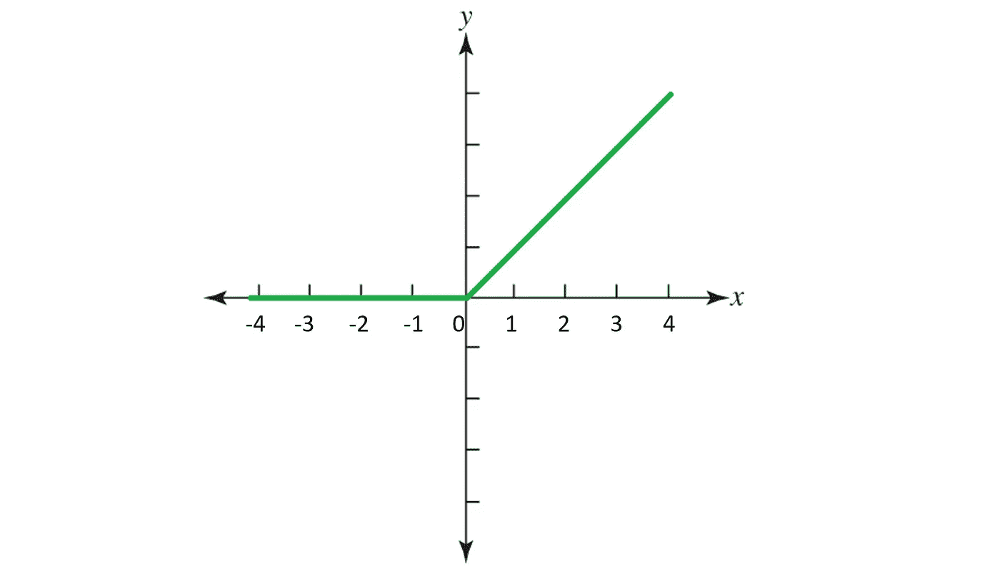
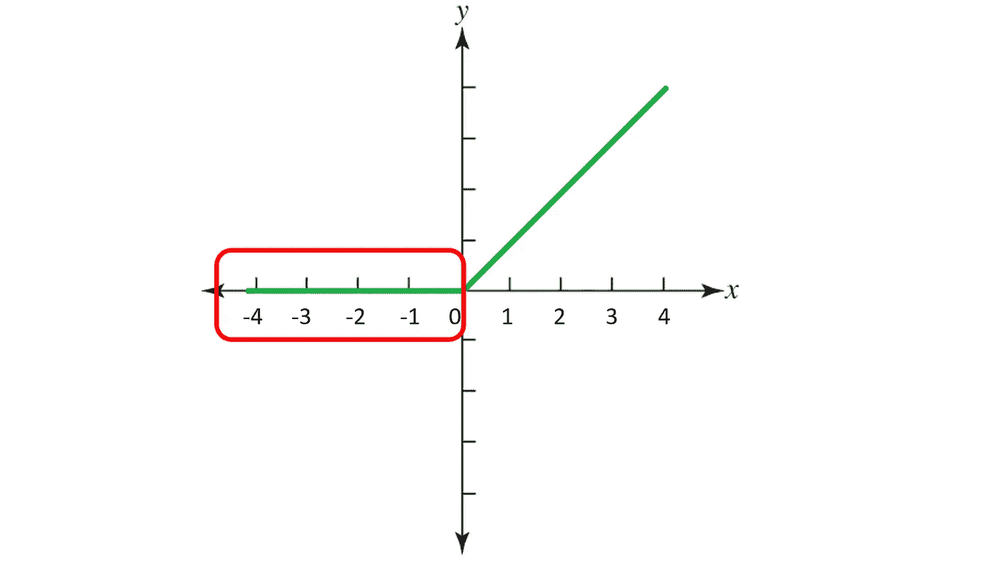
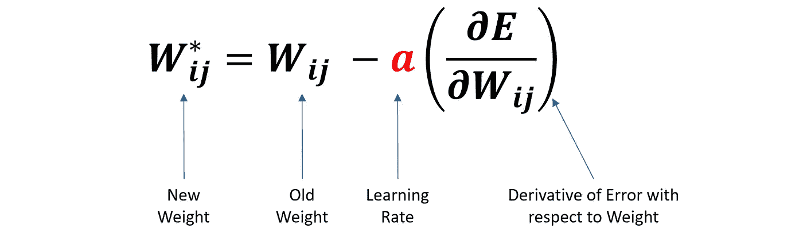
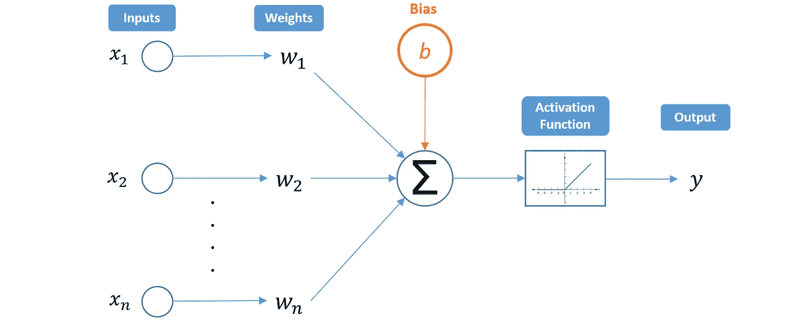
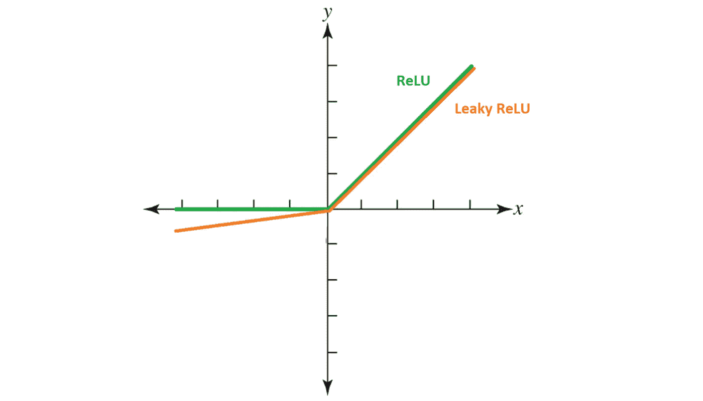

# 垂死的雷鲁问题，解释得很清楚

> 原文：<https://towardsdatascience.com/the-dying-relu-problem-clearly-explained-42d0c54e0d24?source=collection_archive---------4----------------------->

## [思想和理论](https://towardsdatascience.com/tagged/thoughts-and-theory)

## 通过理解 ReLU 的缺点来保持你的神经网络的活力

照片由[索伦·费伊萨](https://unsplash.com/@solenfeyissa?utm_source=medium&utm_medium=referral)在 [Unsplash](https://unsplash.com?utm_source=medium&utm_medium=referral) 上拍摄

# 内容

> *(****1****)*[*什么是 ReLU，它的优点是什么？*](#0ebe) *(****2****)*[*有什么垂死的热路问题？*](#4995) *(****3****)*[*什么原因导致了将死的热路问题？*](#7696) *(****4****)*[*如何解决将死的热路问题？*](#0863)

激活函数是定义如何将神经节点输入的加权和转换为输出的数学方程，并且它们是人工神经网络(ANN)架构的关键部分。

激活函数将**非线性**添加到神经网络中，允许网络学习数据中的复杂模式。激活函数的选择对人工神经网络的性能有着重要的影响，最受欢迎的选择之一是**Re**ctived**L**linear**U**nit(ReLU)。

# 什么是 ReLU，它的优点是什么？

整流线性单元(ReLU)激活函数可描述为:

## ***f(x) = max(0，x)***

它的作用是:
**(i)** 对于负输入值，输出= 0
**(ii)** 对于正输入值，输出=原始输入值

ReLU 激活功能的图示

ReLU 因为几个关键的优势而广受欢迎:

*   ReLU 比其他常见的激活函数(例如， *tanh* 、 *sigmoid* )花费更少的学习时间和更少的计算开销。因为每当其输入为负时，它输出 0，较少的神经元将被激活，导致**网络稀疏**，从而更高的**计算效率**。
*   与 *tanh* 和 *sigmoid* 相比，ReLU 包含了**更简单的数学运算**，从而进一步提升了它的计算性能。
*   *tanh* 和 *sigmoid* 函数容易出现**消失梯度**问题，梯度在反向传播中急剧收缩，使得网络不再能够学习。ReLU 通过保留梯度来避免这一点，因为:
    **(i)** 它的线性部分(在正输入范围内)允许梯度在神经元的活动路径上很好地流动，并保持与节点激活成比例
    **(ii)** 它是一个无界函数(即，没有最大值)。

# 垂死的 ReLU 问题是什么？

垂死的 ReLU 问题是指很多 ReLU 神经元只输出 0 值的场景。下面的红色轮廓表示当输入在负**范围内时会发生这种情况。**

红色轮廓(在负 x 范围内)划分 ReLU 输出 0 的水平段

虽然这一特性赋予了 ReLU 其优势(通过网络稀疏性)，但当这些 ReLU 神经元的大部分输入都在负范围内时，这就成了一个问题。最糟糕的情况是整个网络都瘫痪了，这意味着它只是一个常量函数。

当这些神经元中的大多数返回输出 0 时，梯度在反向传播期间无法流动，并且权重没有更新。最终，网络的很大一部分变得不活跃，无法进一步学习。

因为 ReLU 在负输入范围内的斜率也为零，一旦它变成死的(即卡在负范围内，给出输出 0)，很可能保持不可恢复。

然而，由于优化器(例如，随机梯度下降)每次都考虑多个输入值，所以垂死 ReLU 问题并不总是发生。**只要不是所有的输入**将 ReLU 推至负段(即，一些输入在正范围内)，神经元就可以保持活动，权重可以得到更新，并且网络可以继续学习。

# 是什么导致了将死的 ReLU 问题？

垂死的 ReLU 问题通常由以下两个因素驱动:

## ㈠高学习率

让我们首先看看反向传播中更新步骤的等式:

更新规则的等式(图片由作者提供)

如果我们的学习率( **α** )设置得太高，我们的新权重很有可能会落在高度负值的范围内，因为我们的旧权重会被减去一个大的数字。这些负权重导致 ReLU 的负输入，从而导致即将发生的 ReLU 问题。

*注:回想激活函数的输入是(W*********x)+b .*

## ㈡大的负偏差

简单神经网络的图解(图片由作者提供)

虽然到目前为止我们主要讨论了权重，但是我们不能忘记偏差项也是和权重一起传递到激活函数中的。

偏差是添加到输入和权重乘积中的常量值。考虑到这一点，较大的负偏置项会导致 ReLU 激活输入变为负值。如前所述，这会导致神经元持续输出 0，从而导致死亡的 ReLU 问题。

# 如何解决垂死的热卢问题？

有几种方法可以解决日益严重的 ReLU 问题:

## (I)使用**较低的学习率**

由于较大的学习率会导致较高的负权重可能性(从而增加死亡的几率)，所以在训练过程中降低学习率可能是个好主意。

## (二)ReLU 的变更

由于负输入范围内的平坦部分会导致即将到来的 ReLU 问题，自然会考虑调整该平坦部分的 ReLU 变化。

**漏重流**是解决垂死重流问题的常用有效方法，它通过在负范围内增加一个微小的斜率来实现。这将修改函数，以便在输入小于 0 时生成较小的负输出。

ReLU 和 Leaky ReLU 的图形比较(图片由作者提供)

还有其他变化，如参数 ReLU (PReLU)、指数线性单位(eLU)和高斯误差线性单位(GELU)。它们的细节超出了本文的范围，但是它们都有一个共同的目标，即通过避免零斜率段来防止垂死的 ReLU 问题。

## ㈢修改初始化程序

初始化神经网络的权重和偏差的常见方式是通过对称概率分布(例如，He 初始化)。然而，这种方法容易因不良的局部极小值而导致死亡 ReLU 问题。

已经证明，使用一个**随机不对称初始化**可以帮助防止死 ReLU 问题。请务必查看 arXiv 论文中的数学细节。

# 结论

随着 ReLU 广泛应用于流行的神经网络，如多层感知器和卷积神经网络，本文提出了理论概念，实际意义，和潜在的解决方案的垂死 ReLU 问题。

# 在你走之前

欢迎您**加入我的数据科学学习之旅！**关注此[媒体](https://kennethleungty.medium.com/)页面或查看我的 [GitHub](https://github.com/kennethleungty) 以了解更多精彩的数据科学内容。同时，享受在你的网络中应用 ReLU 的乐趣！

</pytorch-ignite-classifying-tiny-imagenet-with-efficientnet-e5b1768e5e8f>  </the-most-starred-forked-github-repos-for-python-and-data-science-f8bb3de47e96> 