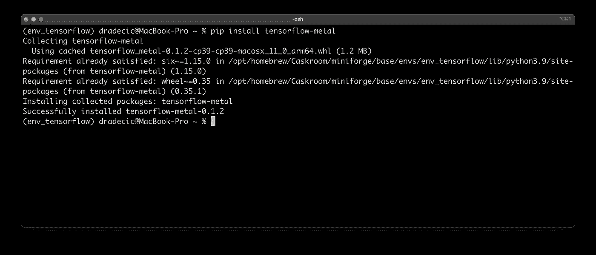

# 在 M1 MAC 电脑上安装 TensorFlow 2.5 的最简单指南

> 原文：<https://towardsdatascience.com/the-easiest-guide-to-installing-tensorflow-2-5-on-m1-macs-7c8f5129752d?source=collection_archive---------19----------------------->

## 以及如何在 M1 GPU 上训练神经网络——包括源代码


照片由[克雷顿·马尔奎斯特](https://unsplash.com/@cmalquist?utm_source=unsplash&utm_medium=referral&utm_content=creditCopyText)在 [Unsplash](https://unsplash.com/?utm_source=unsplash&utm_medium=referral&utm_content=creditCopyText) 上拍摄

M1 芯片是一项了不起的技术。如果你考虑效率和外形因素，没有什么真正接近。尽管如此，在发布近一年后，安装和管理 Python 包感觉比它应该的要难。

没有哪个库比 TensorFlow 更让开发者头疼了。

TensorFlow 一直是一个噩梦，无法正确安装，尤其是如果你想使用 Mac 的 GPU。大多数在线指南在你开始培训之前似乎都是有效的——然后 Python 内核就死了，你什么也做不了。

今天，您将在 M1 Mac 上安装 TensorFlow 和 TensorFlow Metal。您还将训练一个简单的神经网络，只是为了验证一切工作正常。

我还做了一个视频教程，大家可以随便看看:

你可以在 [GitHub](https://github.com/better-data-science/TensorFlow) 上访问源代码。

# 张量流先决条件

在考虑 TensorFlow 之前，您需要安装三样东西。那些是*家酿*、 *Xcode 工具*和 *Anaconda* 。

先说家酿。您可以直接从他们的[网站](https://brew.sh/)复制/粘贴安装命令:

```
/bin/bash -c "$(curl -fsSL https://raw.githubusercontent.com/Homebrew/install/HEAD/install.sh)"
```

安装需要几分钟时间，完成后您就可以安装 Xcode 工具了。请记住，您不需要 Xcode 本身，只需要命令行工具。您可以使用以下命令安装它们:

```
xcode-select --install
```

最后，你需要一条蟒蛇。到目前为止， [Miniforge](https://github.com/conda-forge/miniforge) 在 M1 芯片上本地运行，所以这是您将使用的发行版。您将需要下载 ARM64 版本，即下图中标记的版本:


图 1-Miniforge 下载页面(图片由作者提供)

单击该链接将下载 SH 文件，然后您可以通过终端安装该文件:

```
sh <path_to_Miniforge_file.sh>
```

安装很简单，所以我不在这里介绍。安装完成后，打开一个新的终端窗口并执行以下命令:

```
conda -V
```

这将打印出 Miniforge 版本。这是我的:


图片 2 — Miniforge 版本(图片由作者提供)

只要执行命令不会导致错误，您的版本是否更新并不重要。现在，您可以基于 Python 3.9 创建一个新的虚拟环境。我给我的取名为`tensorflow_env`:

```
conda create --name env_tensorflow python=3.9
```

创建后，使用以下命令激活它:

```
conda activate env_tensorflow
```

您应该会在终端窗口中看到类似这样的内容:


图 3 —激活 TensorFlow 环境(图片由作者提供)

现在所有 TensorFlow 必备都安装好了，接下来就可以安装节目的明星了。

# 安装 TensorFlow 和 TensorFlow Metal

让我马上澄清一些事情——在安装过程中你会得到错误。那完全没问题。有一种方法可以解决 TensorFlow 安装给您带来的任何错误。

从安装苹果的 TensorFlow 依赖项开始:

```
conda install -c apple tensorflow-deps
```

现在可以尝试使用以下命令为 macOS 安装 TensorFlow:

```
pip install tensorflow-macos
```

Anaconda 的对等版本还不可用，所以您必须坚持使用 pip。安装将需要一段时间并会失败，您会看到更多红色错误信息:


图 4 —试图在 M1 芯片上安装 TensorFlow(图片由作者提供)

好消息是——所有的错误信息都是可以修复的。我们先安装 TensorFlow Metal:

```
pip install tensorflow-metal
```

安装将成功，不会出现任何问题:



图 5 —安装 TensorFlow Metal(图片由作者提供)

对之前的错误消息的快速修复是安装 TensorFlow 和 FlatBuffers(先决条件)而不依赖它们。您可以使用以下两个命令来实现这一点:

```
pip install tensorflow-macos --no-dependencies
pip install flatbuffers --no-dependencies
```

这次安装将会成功。事实证明，您不需要 TensorFlow 依赖项，因为您已经在几分钟前通过 Apple repo 安装了它们。

要验证安装是否成功，请打开 Python shell，导入 TensorFlow，并打印其版本:


图 6-验证 TensorFlow 已安装(图片由作者提供)

现在，TensorFlow 2.5 已成功安装！本节的最后一步是安装 Jupyter，因为它是本文选择的 IDE。您可以自由使用任何其他 IDE，但是如果您想坚持使用 Jupyter，下面是安装命令:

```
conda install -c conda-forge jupyter jupyterlab
```

接下来让我们来验证你是否真的可以训练神经网络。

# 训练一个简单的神经网络模型

在继续之前，您应该启动 JupyterLab 会话，或者打开任何其他代码编辑器。让我们通过执行以下单元来仔细检查 TensorFlow 是否已安装:

```
import tensorflow as tf
tf.__version__
```

它在我的机器上打印出“2.5.0”。接下来，让我们列出 TensorFlow 可以用来训练模型的所有设备。这些包括 CPU 和 GPU，M1 Mac 上的 8 核 GPU 应该足以在相对较小的数据集上训练一些基本的深度学习模型。

命令如下:

```
tf.config.list_physical_devices()
```

这是它在我的机器上打印的内容:


图 7——M1 Mac 上的可用设备(图片由作者提供)

CPU 和 GPU 都是可见的。接下来，您将创建一个虚拟数据集。唯一的输入特征是范围从 1 到 100 的 1000 个数字的数组，步长为 0.1。目标变量是输入要素的平方。两者都被转换为浮点张量对象:

```
import numpy as npX = np.arange(1, 101, step=0.1)
y = [x**2 for x in X]X = tf.cast(tf.constant(X), dtype=tf.float32)
y = tf.cast(tf.constant(y), dtype=tf.float32)
```

现在可以声明一个神经网络模型了。下面的代码片段创建了一个 2 层神经网络，每层有 64 个神经元。然后使用平均绝对误差(T2)作为损失跟踪指标，亚当(T4)作为优化器，对模型进行编译。最后，该模型被训练 100 个时期:

```
model = tf.keras.Sequential([
    tf.keras.layers.Dense(64, activation='relu'),
    tf.keras.layers.Dense(64, activation='relu'),
    tf.keras.layers.Dense(1)
])model.compile(
    loss=tf.keras.losses.mean_absolute_error,
    optimizer=tf.keras.optimizers.Adam(learning_rate=0.1),
    metrics=['mean_absolute_error']
)model.fit(X, y, epochs=100)
```

培训结束后，您将看到以下内容:


图 8-训练神经网络模型(图片由作者提供)

到目前为止，一切顺利！作为最后一步，您可以使用`predict()`函数对新数据进行预测:

```
model.predict([10, 20, 30])
```

以下是输出结果:


图 9 —根据新数据进行预测(图片由作者提供)

实际值应该是 100、400 和 900，所以这个模型离我们并不远。今天到此为止。接下来让我们总结一下。

# 离别赠言

今天，您已经在 M1 Mac 上成功安装了 TensorFlow 和 TensorFlow Metal。您还训练了一个简单的神经网络来验证一切正常。

这是一个小小的成就，但是任何 M1 用户都知道 Python 包的安装有多繁琐。以下视频和文章将在 TensorFlow 中介绍回归，如果您想了解更多信息，请继续关注。

感谢阅读。

*喜欢这篇文章吗？成为* [*中等会员*](https://medium.com/@radecicdario/membership) *继续无限制学习。如果你使用下面的链接，我会收到你的一部分会员费，不需要你额外付费。*

<https://medium.com/@radecicdario/membership>  

# 保持联系

*   注册我的[简讯](https://mailchi.mp/46a3d2989d9b/bdssubscribe)
*   在 YouTube[上订阅](https://www.youtube.com/c/BetterDataScience)
*   在 [LinkedIn](https://www.linkedin.com/in/darioradecic/) 上连接

*原载于 2021 年 9 月 30 日 https://betterdatascience.com**的* [*。*](https://betterdatascience.com/the-easiest-guide-to-installing-tensorflow-2-5-on-m1-macs/)