# 最简单的无头 Raspberry Pi 设置

> 原文：<https://towardsdatascience.com/the-easiest-headless-raspberry-pi-setup-68d72076accc?source=collection_archive---------5----------------------->

## 用智能手机设置无头树莓派的快速入门指南。

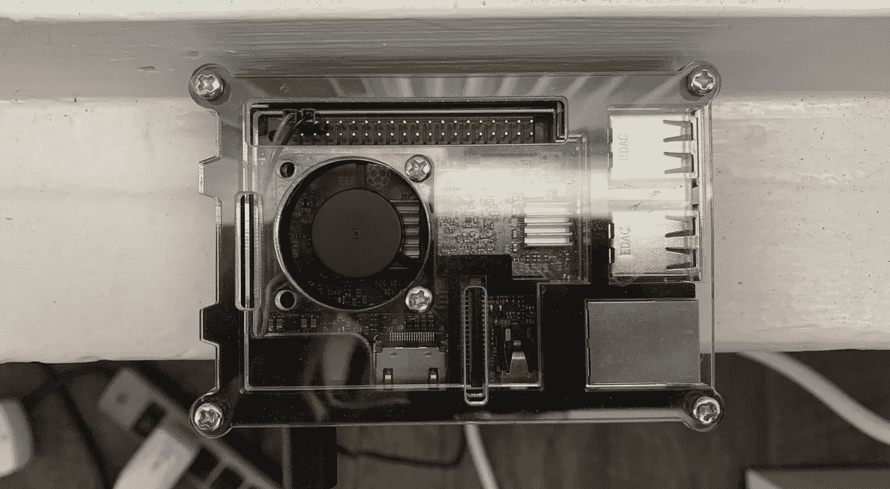

(图片由作者提供)

啊，Raspberry Pi——一款小巧、价格适中的 Linux 电脑，深受修补者和程序员的喜爱。我玩树莓派已经有一段时间了，在这篇文章中，我将尽我所能总结我的经验，用我最近发现的一种漂亮的方式让你开始使用无头树莓派。

也许这是你第一次使用 Raspberry Pi，或者你是一个老手，但不管怎样，你可能会收集到一些提示，让你的无头 Raspberry Pi 设置更好的体验。

这种方法最酷的一点是，设置无头树莓派的常见问题以一种优雅的方式得到了解决:*当树莓派尚未连接到网络时，如何连接到无头树莓派来配置树莓派的网络访问？*

通常，我们必须手动将带有固定 WiFi 凭证的`wpa_supplicant.conf`文件添加到 microSD 卡的启动驱动器中。

通过这种方法，使用一些很酷的开源蓝牙技术和一个智能手机应用程序，我们可以动态配置我们的无头树莓 Pi 的 WiFi 网络。这里的好处是，这是一个比手动编辑一些文件更好的界面，它可以让你在飞行中切换你的无头 Raspberry Pi 的 WiFi 网络，而不必再次拔出你的 microSD 卡，以防你的 Raspberry Pi 失去与当前 WiFi 网络的连接。

你只需要在树莓派的蓝牙范围内，就可以使用智能手机应用程序配置树莓派的网络。

首先，什么是无头设置，我为什么要做？在传统的 Raspberry Pi 设置中，您需要将显示器、键盘和鼠标插入您的设备——这有点笨重和不方便。

一个无头的设置是没有显示器、键盘和鼠标的 Raspberry Pi。运行无头设置让我们放弃额外的外围设备，直接从任何其他计算机(例如我的笔记本电脑)无线控制 Raspberry Pi。

我认为无头设置的主要优点是方便，但我遇到过很多没有额外外设的情况，无头设置是唯一的选择(有人说是黑客马拉松吗？)

让我们开始吧。我有一个树莓皮 3，但任何树莓皮将与此设置工作。

我们所需要的是下面的设置。

*   树莓派
*   4GB 或更大的 microSD 卡
*   Windows、Mac 或 Linux 电脑
*   将 microSD 卡插入电脑的适配器
*   iPhone 或 Android 设备

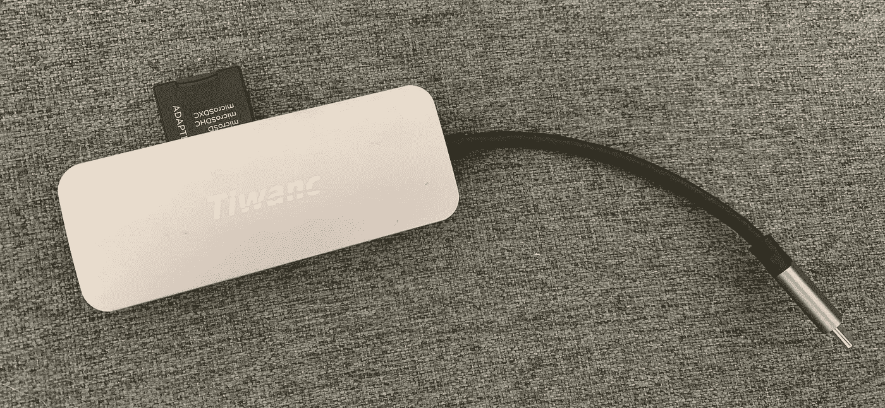

适配器地狱。(图片由作者提供)

一旦我们收集了材料，我们就完成了一半。

进入你的 Windows、Mac 或 Linux 电脑，然后 [**下载最新的 BerryLan 风味 Raspbian 图像**](https://downloads.nymea.io/images/raspberrypi/latest) 。这是标准的 Raspbian 图像，预装了一个名为 BerryLan 的程序，它将帮助我们将我们的 Raspberry Pi 连接到 WiFi，而不必摆弄配置文件。

BerryLan 是一个开源软件，它使用我们手机上的一个应用程序通过蓝牙与我们的 Raspberry Pi 通信，并为我们更新网络配置文件。

下载完成后，解压到某个地方以备后用。

同样在你的 Windows、Mac 或 Linux 电脑上， [**下载 Belena Etcher**](https://www.balena.io/etcher/)——我们将使用它将这个图像闪存到 microSD 卡上。下载后，安装并打开它。

将 microSD 卡和适配器安装程序插入计算机。

点击 **Flash from file** 并选择我们下载的图像。

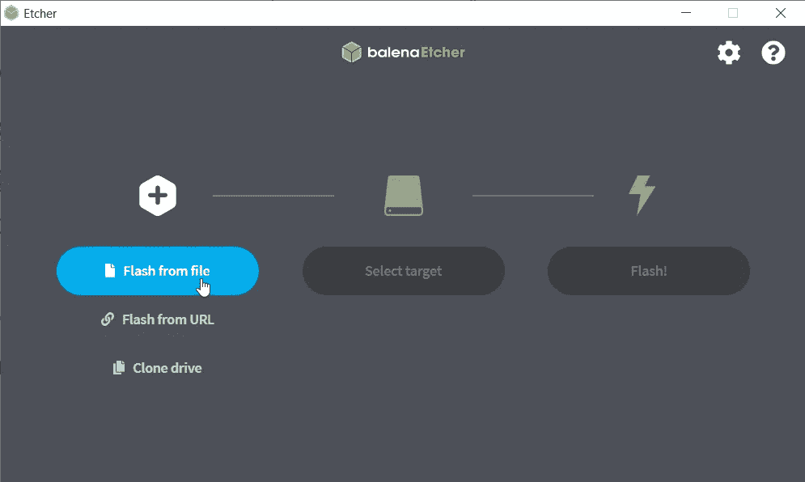

点击**从文件中刷新。(**图片作者)

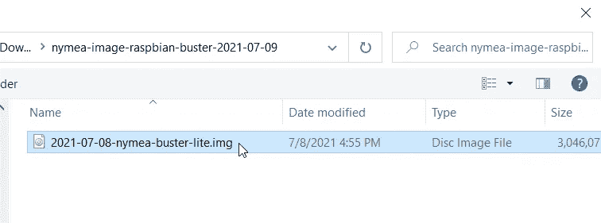

选择我们刚刚下载的树莓派图片。(图片由作者提供)

接下来点击**选择目标**，找到并勾选您的 microSD 卡。

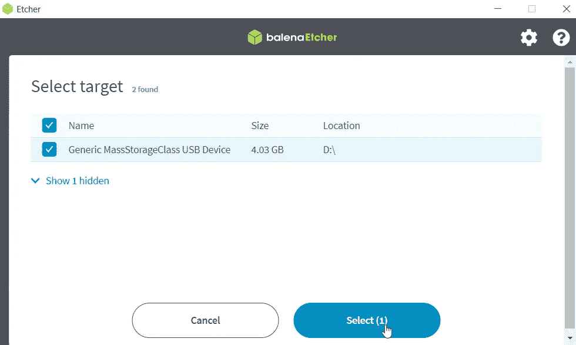

确保您选择了正确的存储设备！此时移除任何其他外部存储设备可能是明智的，这样我们就不会意外删除任何内容。这将清除您的 microSD 卡。(图片由作者提供)

一旦你点击闪存，Balena Etcher 将开始闪存图像到您的 microSD 卡。

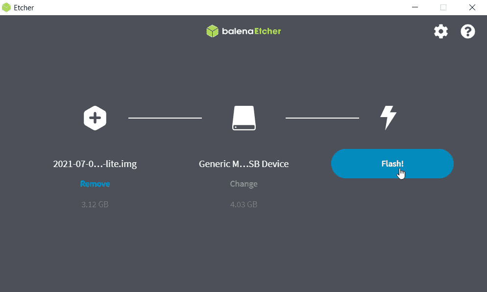

点击**闪光！**然后等待图像结束闪烁。这应该只需要几分钟。(图片由作者提供)

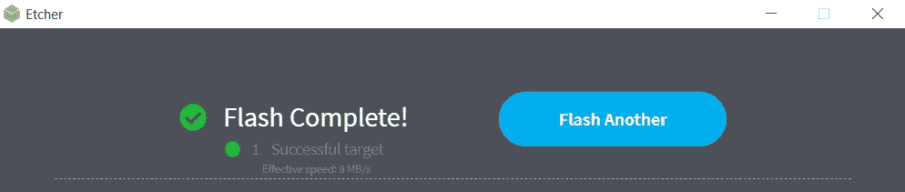

当我们的 flash 成功时，我们应该会看到这个屏幕。(图片由作者提供)

在我们等待这一切结束的时候，让我们拿出你的 iPhone 或 Android 设备，下载**BerryLan**App([App Store](https://apps.apple.com/us/app/berrylan/id1436156018)/[Google Play](https://play.google.com/store/apps/details?id=io.guh.berrylan&hl=en_US&gl=US))。

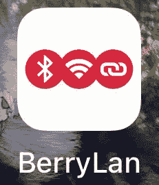

在我的 iPhone 上下载的 BerryLan 应用程序。(图片由作者提供)

到目前为止，你的图像有望完成闪烁，这样我们就可以拔出 microSD 卡(Balena Etcher 安全地为你弹出)并将其插入到 Raspberry Pi。把你的树莓 Pi 插上电源，让它启动。

此时，Raspberry Pi 无法连接到互联网，因为它还不知道我们的 WiFi 凭据。在这个浆果味的 Raspbian 图像中，当我们的 Raspberry Pi 无法连接到任何 WiFi 源时，它会自动开始监听我们，通过我们的手机蓝牙给它一些 WiFi 凭据。

打开 BerryLan 应用程序，您应该会看到有一个蓝牙设备可以连接。

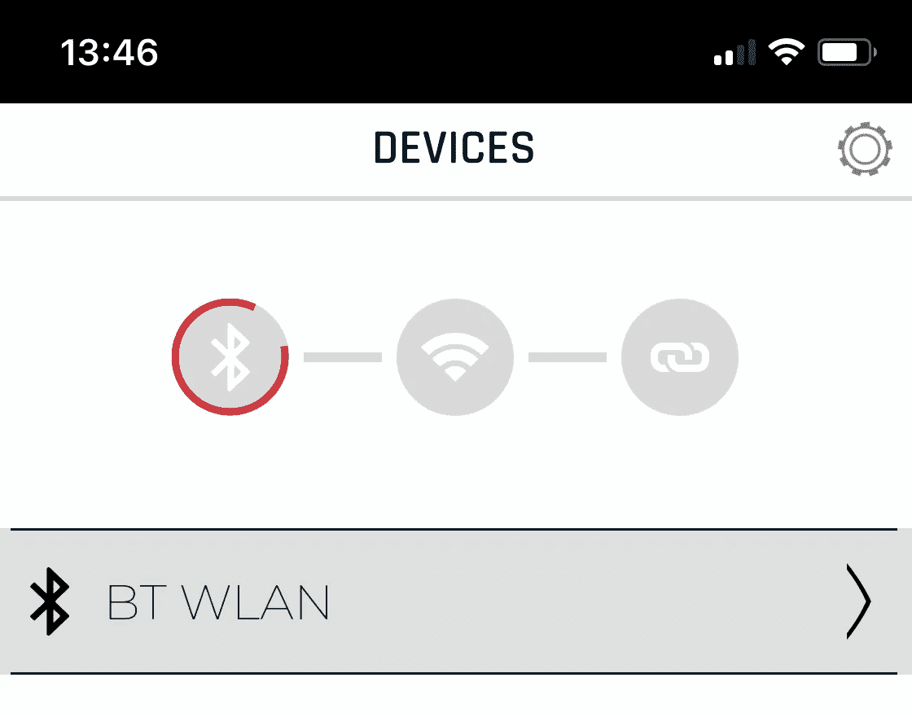

选择列出的唯一蓝牙设备。(图片由作者提供)

一旦我们点击蓝牙设备，我们将看到一个列表，其中列出了我们的 Raspberry Pi 可以看到的所有 WiFi 源。登录您的 Wifi 网络。

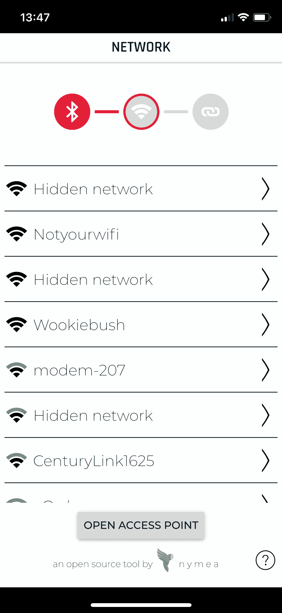

选择您的 Wifi 网络，然后触摸**打开接入点**，在下一页输入您的 WiFi 网络密码。(图片由作者提供)

Tada！我们的 Raspberry Pi 现在应该连接到我们的 WiFi 网络了。BerryLan 甚至给了我们一个方便的私有 IP 地址，我们可以从 WiFi 网络上的任何设备远程访问我们的 Raspberry Pi。请随意截图此页面—我们可能需要此私有 IP 地址。

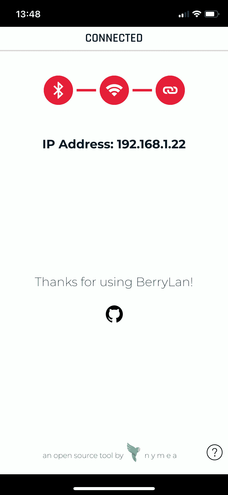

成功连接的页面向我们展示了我们树莓派的私有 IP！我无法告诉你有多少次我不得不谷歌如何找到我的树莓皮的私人 IP，而无法登录到树莓皮。(图片由作者提供)

在这个阶段，我们的无头设置完成了！那不是很无痛吗？最后一件事是验证我们可以 SSH 到我们的无头 Raspberry Pi 设置中来实际控制它。SSH 代表安全外壳，让我们远程控制另一台设备。

根据您的计算机使用的平台，打开 Windows PowerShell 或 macOS/Linux 命令行，并键入以下内容:

`ssh nymea@nymea`

`ssh nymea@<PRIVATE_IP_ADDRESS>`(如果上述命令不起作用)

你会看到一个关于主机真实性的警告——输入`yes`。

然后会提示您输入 Raspberry Pi 的密码，在这张图片中，默认密码是`nymea`。

您应该会看到这个登录屏幕。你被录取了。去吧，现在就开始那个项目！

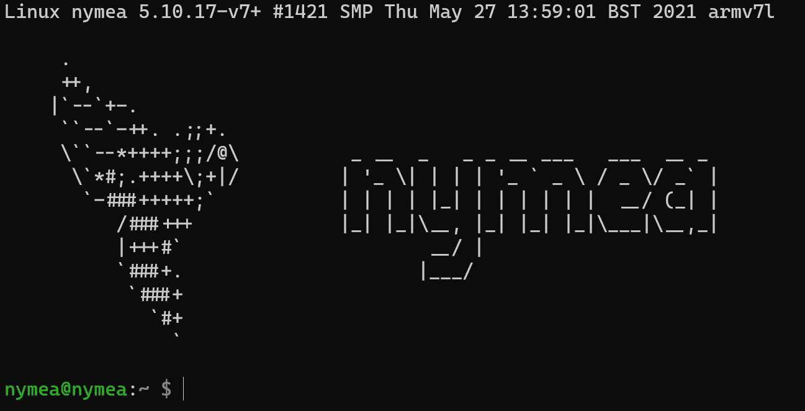

(图片由作者提供)

使用`passwd`命令更改你的默认 Raspberry Pi 密码。