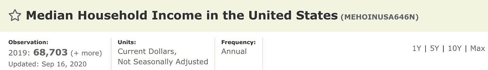
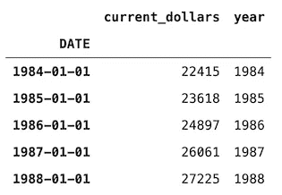
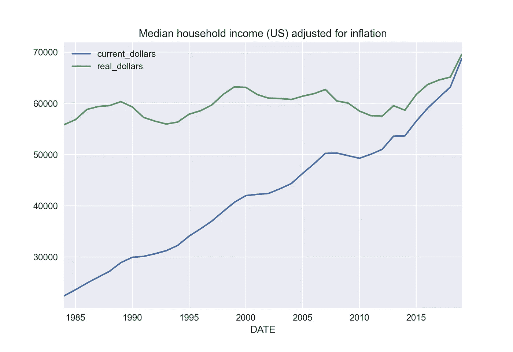

# 在 Python 中调整通货膨胀数据的最简单方法

> 原文：<https://towardsdatascience.com/the-easiest-way-to-adjust-your-data-for-inflation-in-python-365490c03969?source=collection_archive---------15----------------------->


由[萨拉·库菲](https://unsplash.com/@stereophototyp?utm_source=unsplash&utm_medium=referral&utm_content=creditCopyText)在 [Unsplash](https://unsplash.com/s/photos/inflation?utm_source=unsplash&utm_medium=referral&utm_content=creditCopyText) 拍摄的照片

## 有了 cpi 库，你只用一行代码就可以做到！

通货膨胀——这个词我们几乎每天都能在新闻中听到。我们知道，长话短说，通货膨胀意味着我们的钱随着时间的推移越来越不值钱。但是减少多少以及如何调整通货膨胀的数值呢？在本文中，我将通过展示如何在 Python 中处理通货膨胀来回答这些问题。但是首先…

# 一点理论

我不会花太多时间来写关于通货膨胀及其后果的经济学理论，因为这是一篇具有不同焦点的更长文章的主题。用一句话来定义**通货膨胀**——它是一个经济体在一段时间内价格水平的总体上升。这意味着，当总体价格水平上升时，每种货币单位(无论是美元、欧元等。)我们可以购买更少单位的某些商品或服务。这就是之前提到的货币购买力的下降。

我们用**通货膨胀率**来衡量通货膨胀，通货膨胀率是一般价格指数，最常见的是消费者价格指数(CPI)的年度百分比变化。

我们需要再定义两个术语，以便于分析。第一个是**当前美元**。它是指从实际登记货币价值的时期开始的价值。或者，它是没有经过通货膨胀调整的值。第二项是**实际美元**，即经通胀调整后的价值。

利用消费物价指数调整通货膨胀价格的一般公式是:

```
real_dollars = (current_dollars * cpi_new) / cpi_old
```

这是理论，让我们进入动手部分！

# Python 中的示例

## 设置

像往常一样，我们导入所需的库。

对于本文，我们将使用`cpi`库来调整美元值，这比手动下载 CPI 数据并调整值要容易得多。要记住的一件事是，这个图书馆只使用美元。对于其他货币，您必须手动调整数据或找到一个替代库。

导入库时，我们可能会看到以下警告:

```
StaleDataWarning: CPI data is out of date. To accurately inflate to today’s dollars, you must run `cpi.update()`.
```

这是不言自明的，我们需要运行以下命令来获取最新的 CPI 数据。

```
cpi.update()
```

我们现在准备调整通货膨胀的美元价值。

## cpi 的基本操作

`cpi`库最重要的功能是`inflate`，我们用它来调整通货膨胀的现值。在下面的代码片段中，我们提供了美元价值以及记录美元价值的年份。

```
cpi.inflate(100, 2000)# 150.2967
```

结果意味着，如果某样东西在 2000 年价值 100 美元，由于通货膨胀，它在 2020 年将价值 150 美元。这是因为该函数的默认设置将使用 CPI-U ( *所有城市消费者的消费价格指数*)指数将该值调整到最近一整年(在撰写本文时，为 2020 年)，这是美国劳工统计局推荐的默认值。你可以在这里阅读更多关于指数[的内容。](https://www.investopedia.com/terms/c/cpiu.asp)

我们还可以指定要将该值调整到的目标年份。

```
cpi.inflate(100, 2000, *to*=2010)# 126.6295
```

我们不限于使用年份。对于逐月调整，我们可以简单地提供`datetime.date`对象作为参数。

最后，我们还可以使用`get`方法很容易地获得 CPI 指数的值。

```
cpi.get(2020)# 258.811
```

## 把 cpi 和熊猫结合起来

这已经很方便了，但是，在大多数情况下，我们不会对获取单个值感兴趣，而是调整存储在`pandas`系列/数据框架中的整个系列的值。

首先，我们需要一些数据。对于这个玩具示例，我们可以使用来自 FRED 数据库的[美国家庭收入中位数](https://fred.stlouisfed.org/series/MEHOINUSA646N)。仔细检查已经应用于数据的调整类型总是有好处的。我们可以在下图中看到，收入系列是以现值美元表示的。



[来源](https://fred.stlouisfed.org/series/MEHOINUSA646N)

我们从 FRED 的网站下载数据，并使用`pandas`将其加载到 Python 中。我们还进行了一些重命名，以保持名称有意义，并创建了一个额外的列，从日期中提取年份—我们将使用它来调整当前的美元值。



作者图片

不幸的是，没有内置的功能来迭代使用`pandas`数据帧。然而，我们可以使用`apply`方法轻松地自己完成。

下面我们可以考察当前和实际美元的美国家庭收入中值。我们可以清楚地看到，这些值收敛到同一个值，但并不完全一致。这是因为收入时间序列在 2019 年结束，而我们正在调整到 2020 年。



作者图片

# 外卖食品

*   通货膨胀是一个经济体在一段时间内平均价格水平的上升。
*   现值美元代表的是记录时的价值，而实际美元是根据通货膨胀调整的。
*   我们可以使用`cpi`库轻松调整通货膨胀(仅美元)。

你可以在我的 [GitHub](https://github.com/erykml/medium_articles/blob/master/Data%20Wrangling/cpi.ipynb) 上找到本文使用的代码。此外，欢迎任何建设性的反馈。你可以在推特或评论中联系我。

如果你有兴趣学习如何使用 Python 进行量化金融，你可能想看看 [Quantra](https://www.quantra.quantinsti.com/?ref=eryklewinson) ( *免责声明:一个附属链接*)，它提供了关于这个主题的各种不同的课程。

如果您喜欢这篇文章，您可能还会对以下内容感兴趣:

[](/9-useful-pandas-methods-you-probably-have-not-heard-about-28ff6c0bceee) [## 你可能没听说过的 9 种有用的熊猫方法

### 它们可以让你的日常工作更容易、更快捷。

towardsdatascience.com](/9-useful-pandas-methods-you-probably-have-not-heard-about-28ff6c0bceee) [](/mplfinance-matplolibs-relatively-unknown-library-for-plotting-financial-data-62c1c23177fd) [## mpl finance——matplolib 相对不为人知的用于绘制金融数据的库

### 包括快速创建图表的方法，如烛台，连科，或点和图

towardsdatascience.com](/mplfinance-matplolibs-relatively-unknown-library-for-plotting-financial-data-62c1c23177fd) [](/stockstats-a-handy-stocks-oriented-pandas-dataframe-wrapper-a879a06d9c3f) [## stock stats——一个方便的面向股票的熊猫数据框架包装器

### 只需调用列名即可访问各种技术指标！

towardsdatascience.com](/stockstats-a-handy-stocks-oriented-pandas-dataframe-wrapper-a879a06d9c3f) 

# 参考

[1]美国人口普查局，美国家庭收入中值[MEHOINUSA646N]，从圣路易斯美联储银行的 FRED 处检索；https://fred.stlouisfed.org/series/MEHOINUSA646N, 2021 年 7 月 12 日。