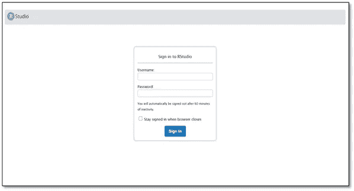
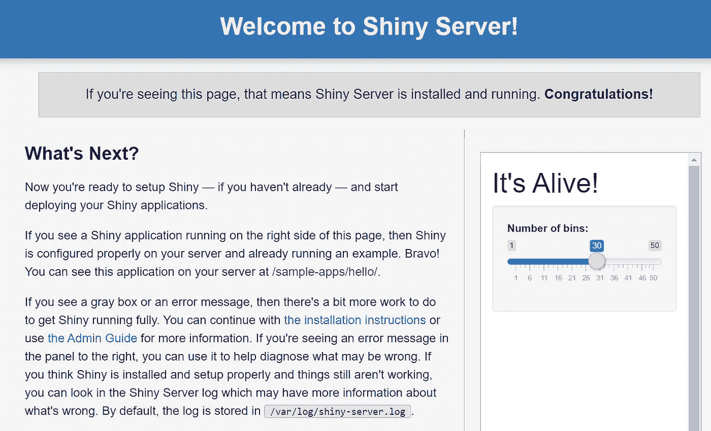

# 在 AWS EC2 实例中获得 Rstudio 闪亮服务器的最简单方法

> 原文：<https://towardsdatascience.com/the-easiest-way-to-get-rstudio-shiny-server-in-an-aws-ec2-instance-62ed37cb4aef?source=collection_archive---------32----------------------->

如果你是一名数据科学家，有一个 R shiny 应用程序在本地运行，你想与你组织中的用户共享它，将它托管在用户可以访问的服务器上将是一个不错的选择。

在这里，我们将看看如何在 AWS 中做到这一点。

用 R 加速 EC2 实例最简单的方法是使用 R-studio / Shiny 的 **Amazon 机器映像(AMI)** 。当我们启动 EC2 实例时，第一步是选择一个 AMI，它是一个包含一组软件配置的模板。[路易斯·阿斯莱特](https://www.louisaslett.com/)正在为 RStudio 服务器维护 AMIs。他在开发和维护这方面做得很好。多亏了他。我们可以根据我们希望从这里[https://www.louisaslett.com/RStudio_AMI/](https://www.louisaslett.com/RStudio_AMI/)启动实例的 AWS 区域来选择 AMI。

我在这里不解释启动实例的步骤，因为你可以在互联网上找到很多教程。一旦 EC2 实例成功启动，导航到该实例的 IP 地址会直接将我们带到 RStudio。您应该会看到下面的屏幕。

您可以使用
登录-用户名:rstudio
-密码:< EC2 实例 ID >

**Shiny app** Shiny App 可以在`/shiny/username` 访问，比如默认用户 rstudio，Shiny App 会在/shiny/rstudio

我们可以将我们的 Shinyapp 代码复制到用户主目录中名为`ShinyApps`的文件夹中。

希望这个快速提示对你有帮助。我发现对于数据科学家来说，这是在 AWS 中启动 RStudio 的最简单的方法，他们不习惯从 Linux 到 SSH 并安装所需的软件。