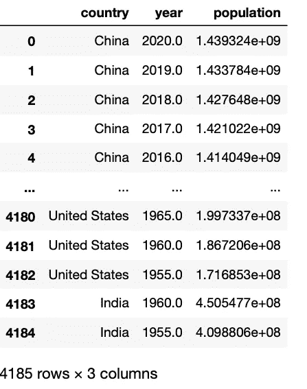
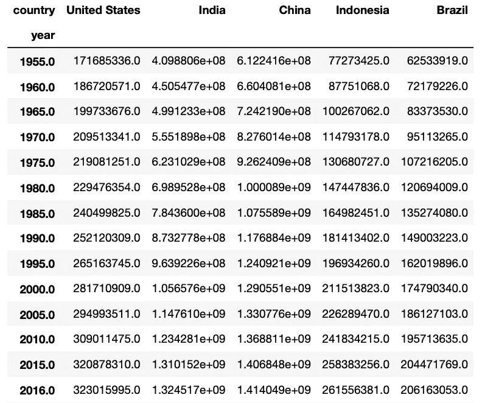
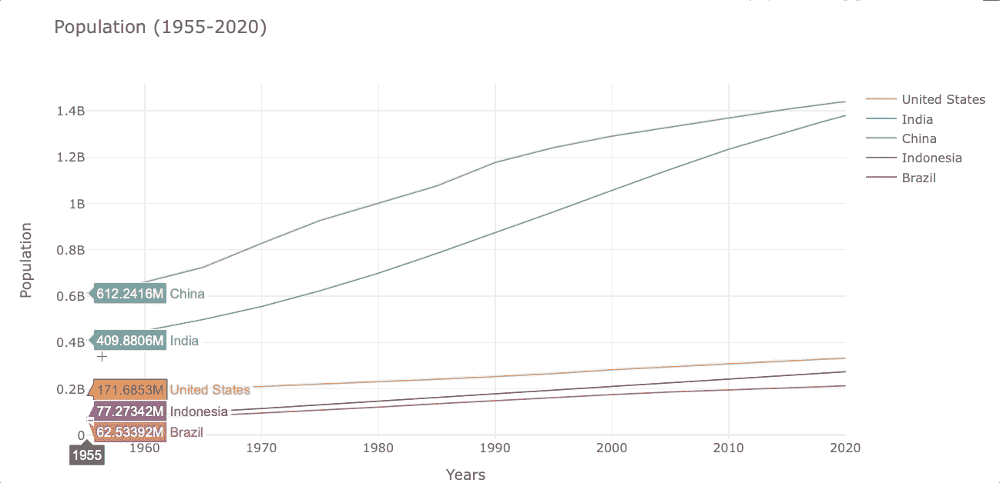
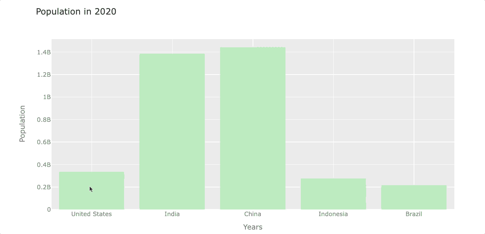
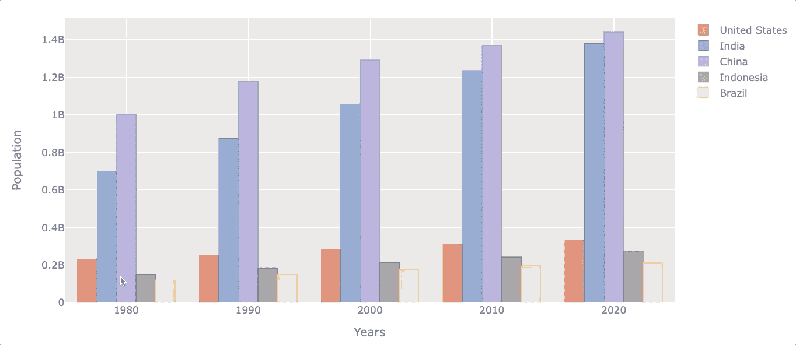
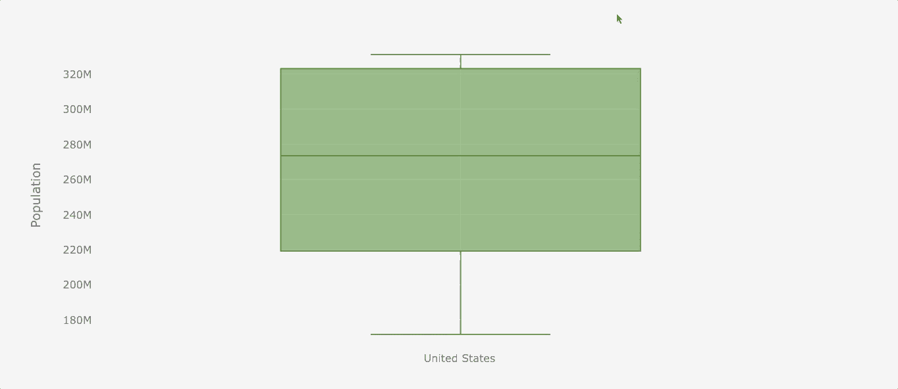
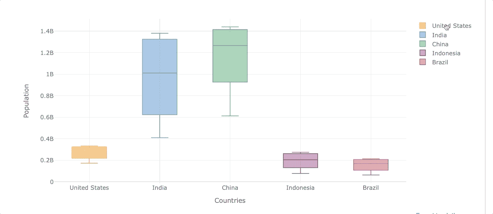
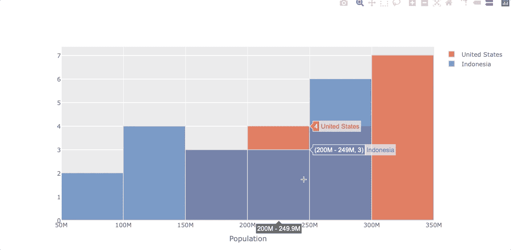
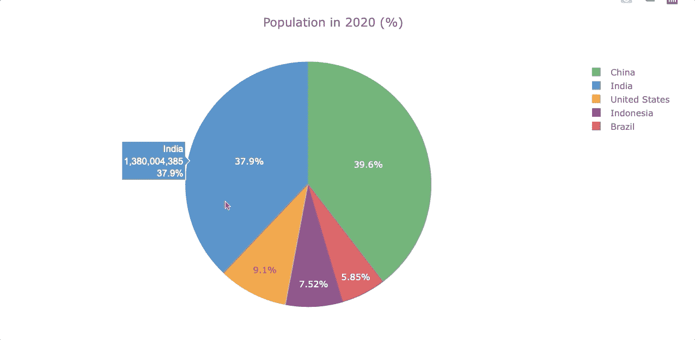
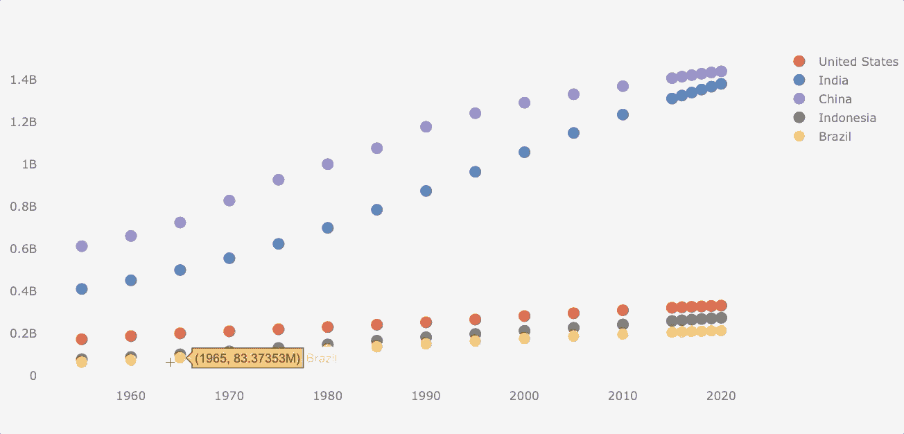

# 用熊猫制作漂亮的互动视觉效果的最简单的方法

> 原文：<https://towardsdatascience.com/the-easiest-way-to-make-beautiful-interactive-visualizations-with-pandas-cdf6d5e91757?source=collection_archive---------2----------------------->

## Python 中熊猫的一行交互式可视化


照片由[杰里·张](https://unsplash.com/@z734923105?utm_source=medium&utm_medium=referral)在 [Unsplash](https://unsplash.com?utm_source=medium&utm_medium=referral) 上拍摄

如果你一直在关注我的[数据可视化指南](https://frank-andrade.medium.com/list/data-visualization-in-python-7aea0e3f93ca)，你可能知道我喜欢用 Python 创建好看且可读的可视化，而不需要太多的技术知识和浪费大量时间。

交互式可视化也不例外，所以我一直在寻找 Python 中友好的库。有许多图书馆在做这项工作，但当涉及到与熊猫一起工作时，事情就变得混乱了。

幸运的是，有一种简单的方法可以直接从 Pandas 创建交互式可视化，我们将在本指南中详细了解它是如何工作的。

```
**Table of Contents** 1\. [First things first](#064d)
 - [Install the libraries](#f5bb)
 - [Import the libraries](#2c10)
 - [The data](#dba9)
2\. [Line Plot](#4660)
3\. [Bar Plot](#88e5)
4\. [Boxplot](#7abf)
5\. [Histogram](#fc0f)
6\. [Piechart](#470c)
7\. [Scatterplot](#1816)
```

# 重要的事情先来

## 安装库

为了轻松创建交互式可视化，我们需要安装袖扣。这是一个连接 Pandas 和 Plotly 的库，所以我们可以直接从 Pandas 创建可视化(过去你必须学习变通方法才能让它们一起工作，但现在更简单了)

首先，确保您安装了 Pandas，并在终端上运行以下命令:

```
pip install pandas
pip install plotly
```

注意，也可以用 conda 来安装 Plotly `conda install -c plotly`。

安装 Plotly 后，运行以下命令来安装袖扣:

```
pip install cufflinks
```

## 导入库

要开始工作，请导入以下库:

```
import pandas as pd
import cufflinks as cf
from IPython.display import display,HTMLcf.set_config_file(sharing='public',theme='ggplot',offline=True) 
```

在本例中，我使用的是`‘ggplot’`主题，但是您可以随意选择任何您想要的主题。运行命令`cf.getThemes()`来获得所有可用的主题。

为了在接下来的部分中使用 Pandas 进行交互式可视化，我们只需要使用语法`dataframe.iplot()`。

## 数据

在本指南中，我们将使用人口数据框架。首先，下载 [Google Drive](https://drive.google.com/file/d/1QpCcE4U8NIhznbqf0kdeO2ITKPEs9OSm/view?usp=sharing) 或 [Github](https://github.com/ifrankandrade/data-visualization/tree/main/datasets/population) 上的 CSV 文件，将文件移动到您的 Python 脚本所在的位置，然后在如下所示的 Pandas dataframe 中读取它。

```
df_population = pd.read_csv('population_total.csv')
```

数据框包含了世界上大多数国家/地区历年的人口数据，如下所示:



作者图片

这个数据框架几乎已经可以绘制了，我们只需要删除空值，对其进行整形，然后选择几个国家来测试我们的交互式绘图。下面显示的代码完成了所有这些工作。

```
# dropping null values
df_population = df_population.dropna()# reshaping the dataframe
df_population = df_population.pivot(index='year', columns='country',
                                    values='population')# selecting 5 countries
df_population = df_population[['United States', 'India', 'China', 
                               'Indonesia', 'Brazil']]
```

现在，数据框看起来像下面的图片，并准备好绘图。



作者图片

如果你想知道一个数据科学家如何收集真实世界的数据，比如这个“population_total.csv”，[看看我做的这个指南](https://betterprogramming.pub/how-to-use-scrapy-to-build-a-dataset-for-your-data-science-project-8f04af3548c6)。(数据科学项目不会总是有 Kaggle 数据集可用)

现在让我们开始制作交互可视化吧！

# 线图

让我们做一个线图来比较一下从 1955 年到 2020 年这 5 个国家的人口增长了多少。

如前所述，我们将使用语法`df_population.iplot(kind='name_of_plot')`来绘制图表，如下所示。

```
df_population.iplot(kind='**line**',xTitle='Years', yTitle='Population',
                    title='Population (1955-2020)')
```



作者图片

乍一看，很容易看出印度的人口增长比其他国家快。

# 条形图

我们可以在按类别分组的条形图上制作一个单独的条形图。让我们看一看。

## 单条形图

让我们创建一个柱状图，显示到 2020 年每个国家的人口。为此，首先，我们从索引中选择 2020 年，然后用列转置行以获得列中的年份。我们将这个新的数据帧命名为`df_population_2020`(我们将在绘制饼状图时再次使用这个数据帧)

```
df_population_2020 = df_population[df_population.index.isin([2020])]
df_population_2020 = df_population_2020.T
```

现在我们可以用`.iplot()`绘制这个新的数据帧。在本例中，我将使用`color`参数将条形颜色设置为浅绿色。

```
df_population_2020.iplot(kind='**bar**', color='lightgreen',
                         xTitle='Years', yTitle='Population',
                         title='Population in 2020')
```



作者图片

## 按“n”个变量分组的条形图

现在让我们看看每个十年开始时人口的演变。

```
# filter years out
df_population_sample = df_population[df_population.index.isin([1980, 1990, 2000, 2010, 2020])]# plotting
df_population_sample.iplot(kind='**bar**', xTitle='Years',
                           yTitle='Population')
```



作者图片

很自然，所有这些国家的人口都在逐年增长，但有些国家的增长速度更快。

# 箱线图

当我们想看到数据的分布时，箱线图是很有用的。箱线图将显示最小值、第一个四分位数(Q1)、中值、第三个四分位数(Q3)和最大值。查看这些值的最简单方法是创建交互式可视化。

让我们看看美国的人口分布。

```
df_population['United States'].iplot(kind='**box**', color='green', 
                                     yTitle='Population')
```



作者图片

假设现在我们想得到相同的分布，但所有选定的国家。

```
df_population.iplot(kind='**box**', xTitle='Countries',
                    yTitle='Population')
```



作者图片

正如我们所看到的，我们还可以通过单击右侧的图例来筛选出任何国家。

# 柱状图

直方图表示数字数据的分布。让我们看看美国和印度尼西亚的人口分布。

```
df_population[['United States', 'Indonesia']].iplot(kind='**hist**',
                                                xTitle='Population')
```



作者图片

# 饼图

让我们再来比较一下 2020 年的人口，但现在用的是饼状图。为此，我们将使用在“单个柱状图”部分创建的`df_population_2020`数据框。

然而，为了制作饼图，我们需要将“国家”作为列而不是索引，所以我们使用`.reset_index()`来取回列。然后我们将`2020`转换成一个字符串。

```
# transforming data
df_population_2020 = df_population_2020.reset_index()
df_population_2020 =df_population_2020.rename(columns={2020:'2020'})# plotting
df_population_2020.iplot(kind='**pie**', labels='country',
                         values='2020',
                         title='Population in 2020 (%)')
```



作者图片

# 散点图

虽然人口数据不适合散点图(数据遵循一个共同的模式)，我会为了本指南的目的制作这个图。

制作散点图类似于折线图，但是我们必须添加`mode` 参数。

```
df_population.iplot(kind='**scatter'**, **mode**='markers')
```



就是这样！现在你已经准备好制作你自己的与熊猫的美丽的交互式可视化了。如果你想学习 Python 中的其他可视化库，如 Matplotlib 和 Seaborn，还想知道如何制作 wordclouds，[查看我制作的这些指南](https://frank-andrade.medium.com/list/data-visualization-in-python-7aea0e3f93ca)。

[**与 3k 以上的人一起加入我的电子邮件列表，获取我在所有教程中使用的 Python for Data Science 备忘单(免费 PDF)**](https://frankandrade.ck.page/bd063ff2d3)

如果你喜欢阅读这样的故事，并想支持我成为一名作家，可以考虑报名成为一名媒体成员。每月 5 美元，让您可以无限制地访问数以千计的 Python 指南和数据科学文章。如果你使用[我的链接](https://frank-andrade.medium.com/membership)注册，我会赚一小笔佣金，不需要你额外付费。

[](https://frank-andrade.medium.com/membership) [## 阅读弗兰克·安德拉德(以及媒体上成千上万的其他作家)的每一个故事

### 作为一个媒体会员，你的会员费的一部分会给你阅读的作家，你可以完全接触到每一个故事…

frank-andrade.medium.com](https://frank-andrade.medium.com/membership)