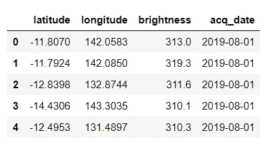
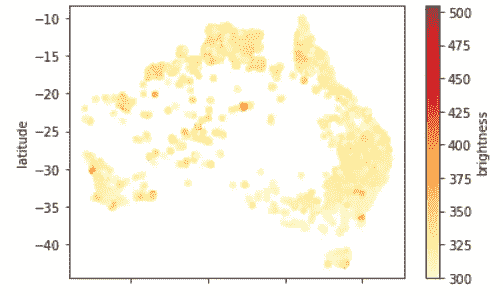
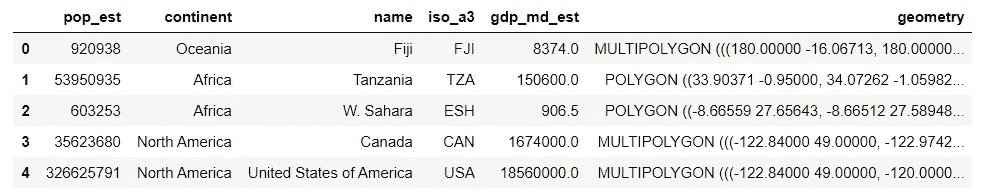
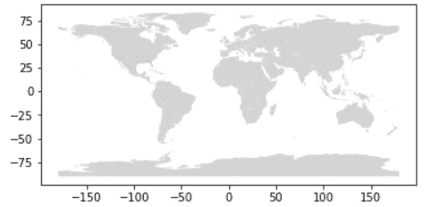
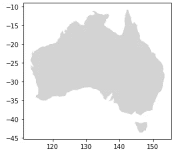
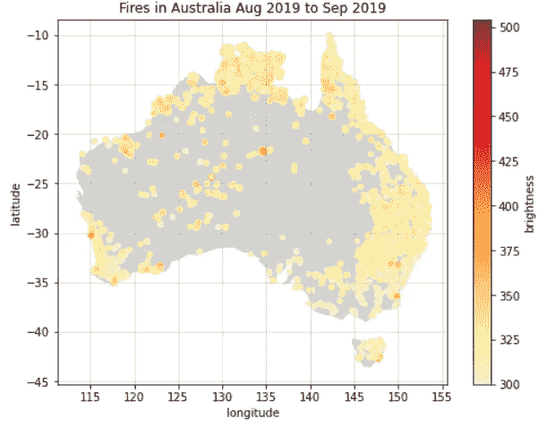
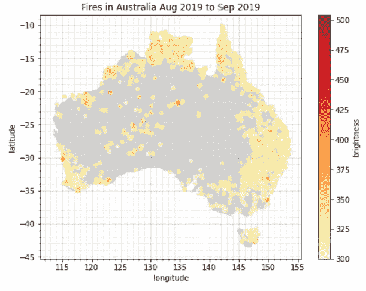

# 在世界地图上绘制熊猫数据的最简单方法

> 原文：<https://towardsdatascience.com/the-easiest-way-to-plot-data-from-pandas-on-a-world-map-1a62962a27f3?source=collection_archive---------1----------------------->

本指南旨在通过最少的文字和最少的代码，向您展示如何使用 Matplotlib 和 Geopandas 库在世界地图上绘制来自 Pandas 对象的数据。

需要安装的 python 库有 pandas、geopandas 和 matplotlib。你可以在 github 上找到这个教程的代码:[https://github.com/udiy/blogposts/tree/main/Easy%20map](https://github.com/udiy/blogposts/tree/main/Easy%20map)

熊猫对象中的数据需要有位置坐标，这意味着纬度和经度。对于这篇文章，我使用的是关于澳大利亚火灾的数据，可以在这里找到:[https://www . ka ggle . com/carlosparadis/fires-from-space-Australia-and-new-zeland](https://www.kaggle.com/carlosparadis/fires-from-space-australia-and-new-zeland)。

这些数据来自美国宇航局的卫星 MODIS 仪器，他们从太空监测火灾，在本文的结尾找到致谢。在数据中，有一列称为亮度，这是对火的温度(开尔文)的测量。

# 浏览数据

现在让我们看一些代码。首先，我们将快速浏览一下加载和查看数据:

```
df = pd.read_csv("fire_archive_M6_96619.csv", 
                 usecols=["latitude", "longitude", "brightness",
                 "acq_date"], parse_dates=["acq_date"])df.head()
```



上述代码单元的输出

现在让我们将数据绘制在散点图上，y 轴为纬度，x 轴为经度:

```
df.plot(x="longitude", y="latitude", kind="scatter", c="brightness",
        colormap="YlOrRd")
```



上述单元的输出

很好。即使不使用地图，我们也能看到澳大利亚的轮廓。我们来添加一张地图。

# 地质公园

Geopandas 允许您将世界各国的几何图形加载到一个名为 GeoDataFrame 的对象中，该对象与 pandas DataFrame 对象非常相似。看起来是这样的:

```
countries = gpd.read_file(
               gpd.datasets.get_path("naturalearth_lowres"))countries.head()
```



上述单元的输出

一旦你有了这个对象，你就可以轻松地绘制一张世界地图，就像你在 pandas 中使用绘图功能一样:

```
countries.plot(color="lightgrey")
```



上述单元的输出

由于我们的重点是澳大利亚，我们可以将“国家”对象切片，这样它只显示澳大利亚:

```
countries[countries["name"] == "Australia"].plot(color="lightgrey")
```



上述单元的输出

# **把所有这些放在一起**

我们现在将使用 matplotlib 创建一个图形，并同时绘制地图和数据:

```
# initialize an axis
fig, ax = plt.subplots(figsize=(8,6))# plot map on axis
countries = gpd.read_file(  
     gpd.datasets.get_path("naturalearth_lowres"))countries[countries["name"] == "Australia"].plot(color="lightgrey",
                                                 ax=ax)# parse dates for plot's title
first_month = df["acq_date"].min().strftime("%b %Y")
last_month = df["acq_date"].max().strftime("%b %Y")# plot points
df.plot(x="longitude", y="latitude", kind="scatter", 
        c="brightness", colormap="YlOrRd", 
        title=f"Fires in Australia {first_month} to {last_month}", 
        ax=ax)# add grid
ax.grid(b=True, alpha=0.5)plt.show()
```



上述单元的输出

# 额外奖励——额外造型

## 次要网格

网格线对应于两个轴上的记号。根据缩放级别和我们在地图上的目标，我们可能希望添加间距较小的网格线，为此我们需要添加额外的刻度。出于样式的目的，我更喜欢添加次要刻度，这样您可以用不同的颜色或透明度绘制次要网格。在下面的示例中，有一个间距为 1 度的次要网格:

```
# get axes limits
x_lo, x_up = ax.get_xlim()
y_lo, y_up = ax.get_ylim()# add minor ticks with a specified sapcing (deg)
deg = 1
ax.set_xticks(np.arange(np.ceil(x_lo), np.ceil(x_up), deg), minor=True)
ax.set_yticks(np.arange(np.ceil(y_lo), np.ceil(y_up), deg), minor=True)
ax.grid(b=True, which="minor", alpha=0.25)fig
```



上述单元的输出

# 感谢

*我们承认使用了美国宇航局资源管理系统(公司)(*[](https://earthdata.nasa.gov/firms)**)的消防信息的数据和/或图像，这是美国宇航局地球观测系统数据和信息系统(EOSDIS)的一部分。**

*MODIS 收集了 6 个 NRT 热点/主动火灾探测 [MCD14ML](https://earthdata.nasa.gov/earth-observation-data/near-real-time/firms/mcd14ml) 由 NASA 公司分发*。*上线[https://earthdata.nasa.gov/firms](https://earthdata.nasa.gov/firms)。doi:[10.5067/FIRMS/MODIS/MCD 14ml](https://earthdata.nasa.gov/earth-observation-data/near-real-time/firms/mcd14ml)*

*美国宇航局免责声明:[https://earth data . NASA . gov/earth-observation-data/near-real-time/citation # ed-lance-免责声明](https://earthdata.nasa.gov/earth-observation-data/near-real-time/citation#ed-lance-disclaimer)*

*就这些了，希望你觉得这个教程很有帮助，很享受:)*