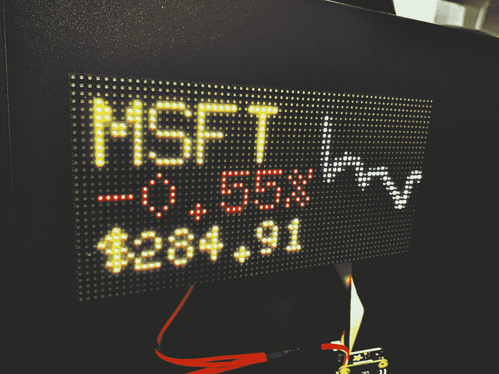
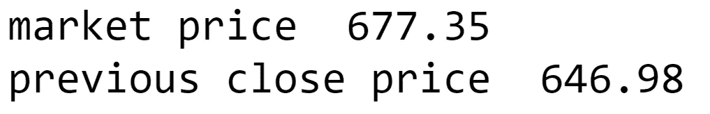
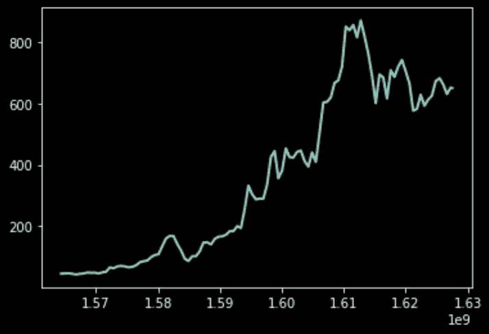

# 将股票数据放入 Python 程序的最简单方法:yfinance

> 原文：<https://towardsdatascience.com/the-easiest-way-to-pull-stock-data-into-your-python-program-yfinance-82c304ae35dc?source=collection_archive---------4----------------------->

## 关于 yfinance 及如何设置的初步探讨。



我最近在用 yfinance 做一个树莓 Pi 股票行情。请继续关注教程。(图片由作者提供)

最近我一直在做一个有趣的股票报价项目，我遇到了一些我以前从未想过的事情:*将当前和历史股票市场价格数据拉入我的 Python 程序的最佳方式是什么？*

事实证明，对我来说，最好的选择是**y Finance**——这是一个 Python 库，它给你提供来自雅虎财经的当前和历史股票市场价格数据，等等。最酷的是它完全免费，不需要 API 密匙，并且允许每小时 2000 个请求的相对较高的吞吐量。更酷的是你(是的，就是你！)可以很容易地将股票数据输入到 Python 程序中，就像我下面展示的这几个步骤一样简单。

## 设置

我使用的是 Python 3.8，但是任何高于 Python 3.4 的版本都应该被支持。您可以在 Linux、Mac 或 Windows 上运行。(如果你使用 Windows，我建议你[看看 WSL2，如何开始，以及它能做的一切](https://medium.com/@kombustion/a-modern-linux-setup-for-the-modern-windows-developer-b7e0c2ad212e)——如果你使用 WSL2，一定要遵循 Linux 命令)

首先，我们要创建名为`env`的 Python 虚拟环境，并激活它。

**对于 Linux/Mac 终端**

```
python3 -m venv envsource env/bin/activate
```

**针对 Windows PowerShell**

```
python3 -m venv env.\env\Scripts\Activate.ps1
```

现在我们已经设置并激活了 Python 虚拟环境，让我们将 yfinance 安装到这个虚拟环境中，这样我们就可以使用它了。下一个命令对于任何平台都是一样的。

`pip install yfinance`

## 获取当前股票价格数据

现在 yfinance 已经安装好了，我们准备写一些 Python 代码了！

让我们试试 yfinance 的一些最基本，但可能是最常用的功能。

我正在研究股票行情，所以我想知道股票的当前价格。让我们获取一只股票的当前价格和之前的收盘价——在这个 Python 例子中，我们将使用 TSLA。

```
import yfinance as yfstock_info = yf.Ticker('TSLA').info
# stock_info.keys() for other properties you can exploremarket_price = stock_info['regularMarketPrice']
previous_close_price = stock_info['regularMarketPreviousClose']print('market price ', market_price)
print('previous close price ', previous_close_price)
```



上面代码的输出。(图片由作者提供)

好的，如果我们在股票市场开放的时间运行这个，价格信息会实时变化和更新。更新速度有多快？价格的变化和雅虎财经更新价格一样快，这对于我的目的来说已经足够快了。对于像高频交易机器人这样的东西来说，它可能不够快，但 Python 可能不是最好的。

## 获取历史股票价格数据

接下来我们来看一些历史数据。如果我们想要绘制它，我们将不得不安装一些额外的 Python 库来帮助我们——matplotlib 来绘制，pendulum 来为我们做一些简单的时间转换。

`pip install matplotlib pendulum`

现在让我们看看 TSLA 过去 2 年的股价，每隔 1 个月。您可以看到这些数字非常灵活，可以根据您的使用情况进行更改。

```
import yfinance as yf
import pendulum
import matplotlib.pyplot as pltprice_history = yf.Ticker('TSLA').history(period='2y', # valid periods: 1d,5d,1mo,3mo,6mo,1y,2y,5y,10y,ytd,max
                                   interval='1wk', # valid intervals: 1m,2m,5m,15m,30m,60m,90m,1h,1d,5d,1wk,1mo,3mo
                                   actions=False)time_series = list(price_history['Open'])
dt_list = [pendulum.parse(str(dt)).float_timestamp for dt in list(price_history.index)]plt.style.use('dark_background')plt.plot(dt_list, time_series, linewidth=2)
```



我们从上面的代码中得到的情节。哇，价格涨了很多。(图片由作者提供)

## 结论

我希望你能像我一样，发现 yfinance 库的建立和整合非常容易！这里有很多值得探索的地方，更多信息和例子可以在[https://pypi.org/project/yfinance/](https://pypi.org/project/yfinance/)找到。

***来自《走向数据科学》编辑的提示:*** *虽然我们允许独立作者根据我们的* [*规则和指导方针*](/questions-96667b06af5) *发表文章，但我们不认可每个作者的贡献。你不应该在没有寻求专业建议的情况下依赖一个作者的作品。详见我们的* [*读者术语*](/readers-terms-b5d780a700a4) *。*