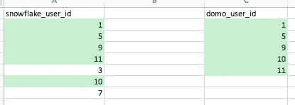

# 作为分析工程师验证数据的最简单方法

> 原文：<https://towardsdatascience.com/the-easiest-way-to-validate-data-as-an-analytics-engineer-e9d20d777bd4?source=collection_archive---------31----------------------->

## 如何使用 Excel 比较两个不同来源的数据模型


[西格蒙德](https://unsplash.com/@sigmund?utm_source=unsplash&utm_medium=referral&utm_content=creditCopyText)在 [Unsplash](https://unsplash.com/s/photos/checking?utm_source=unsplash&utm_medium=referral&utm_content=creditCopyText) 上拍照

作为一名分析工程师，验证数据模型是我工作的一大部分。随着现代数据堆栈的建立，旧的数据堆栈将被取代。随着旧数据栈的替换，新的数据模型也要根据旧的数据模型进行验证。

这可能很困难，因为数据模型位于两个不同的地方。通常情况下，数据太大，无法将一个数据源接收到另一个数据源中以便于比较。有时你必须回到最基础的地方，这就是为什么我在比较数据集时选择 Excel。

我目前正在使用 [Fivetran](https://fivetran.com/) 、[雪花](https://www.snowflake.com/)和 [dbt](https://www.getdbt.com/) 构建数据模型。目前，我们的旧数据模型位于 [Domo](https://www.domo.com/) 中。Domo 被认为是商业智能工具，所以数据模型运行缓慢。这使得在雪花和 Domo 中比较输出变得困难。

## 用例

在验证一个聚合列时，我发现 Domo 和 Snowflake 中的内容有差异。在验证时，我选择一小部分数据进行比较，而不是整个数据集。对于这个实例，我选择了其中`start_date`列的年份为 2020 并且推荐数不为空的行。

```
select distinct 
   user_id
from "core"."data_models"."referral_info" 
where number_of_referrals is not null 
   and year(start_date)=2020
```

在 Domo 中，我用这些相同的过滤器创建了推荐数据模型的子集。我在这里只选择了`user_id`列，因为我想直接比较在 Snowflake 中推荐的用户列表和在 Domo 中推荐的用户列表。选择多个列只会使比较更加混乱。

通过将数据集限制为具有唯一 id 的一列，我们可以很容易地看到数据中哪里不匹配。一旦我们找到了一个模型中的用户而不是另一个模型中的用户，我们就可以调查为什么会这样。

接下来，我将 Domo 和 Snowflake 中的数据子集导出到 Excel 中。幸运的是，每个数据集只有几千行。如果数据集的行数超过了几千行，那么您会希望对数据集进行更多的过滤。大型数据集导出到 Excel 需要很长时间。

## 比较数据集

现在，您已经将两个数据集保存到 Excel 文件中，您将希望找到一种方法来轻松地比较记录。将`user_ids`的一列与`user_ids`的另一列复制到 Excel 表中。


作者图片

1.  选择包含两列`user_ids`的整个数据集
2.  转到主页选项卡，然后单击“样式”
3.  在“样式”中，单击“条件格式”
4.  将鼠标悬停在“突出显示单元格规则”选项上
5.  点击“重复值”


作者图片

6.在弹出窗口中，选择“副本”,并选择您希望它们高亮显示的颜色


作者图片

7.单击“确定”

现在，您将会看到所有的副本都以您选择的颜色高亮显示。通过这种方式查找重复项，它们不必在同一行。它将在整个数据集中寻找重复项。这就是为什么确保您有一个来自每个数据源的`user_ids`的独特列表很重要。



作者图片

## 调查差异

现在，您可以更深入地了解是什么原因导致用户在一个数据模型中有大量推荐，而在另一个数据模型中没有。选择每个数据集中`user_id`，并比较每个数据模型中的列值。

在这里，我将特别关注具有`user_id = 3`和`user_id = 7`的用户。

您的`number_of_referrals`逻辑中使用的列值是否相同？

数据类型是否相同？

当我进一步研究我的差异时，我发现用于连接两个数据集的列之一在一个模型中是时间戳，而在另一个模型中是日期。这导致数据集无法正确连接，从而消除了参考值。

# 结论

验证数据是分析工程师最棘手的部分之一。它需要对数据模型中使用的数据和逻辑有深刻的理解。导致问题的往往是一些最意想不到的事情，比如数据类型。

确保您花时间来正确验证您的数据模型。数据的完整性取决于您正在实施的实践。坏数据输入意味着坏数据输出。如果你的数据模型给你不正确的结果，而你的公司把他们的整个分析建立在这些数据模型的基础上，那么会有很多地方出错。

花时间去理解你的数据。调查一下。找问题。试着找到他们。你总是想在你的模型投入生产之前找到它们。