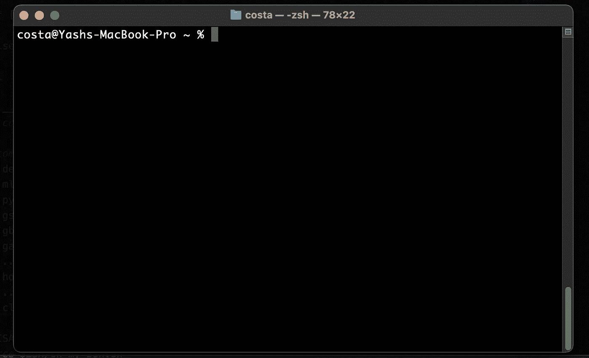
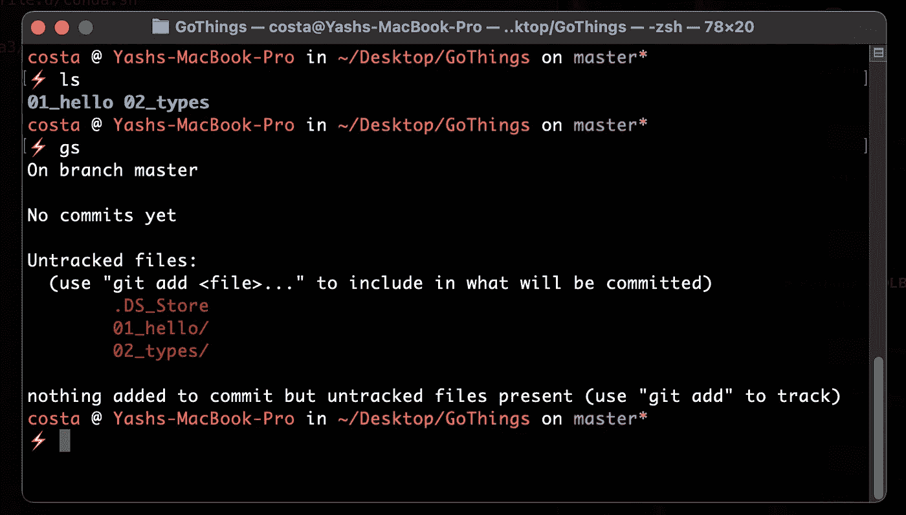

# 美化终端的简单方法

> 原文：<https://towardsdatascience.com/the-easy-way-to-prettify-your-terminal-24da896b031a?source=collection_archive---------11----------------------->

## 以确保你是有效率的，同时，让眼睛放松。


[郭罗兰](https://unsplash.com/@roland_kwok?utm_source=medium&utm_medium=referral)在 [Unsplash](https://unsplash.com?utm_source=medium&utm_medium=referral) 上的照片

从事数据科学工作需要花费大量时间在终端上摆弄命令。无论是运行脚本、处理版本控制、运行和管理容器——涉及终端的各种工作随处可见。

现在大多数 Linux 和 MacOS 机器的默认设置是 **zsh** 终端。它通常看起来像这样:



我的旧终端。不太好看，是吧？

没有什么能阻止我们承认它看起来很无聊。现在，把它广泛应用到我们的日常生活中，你就会知道它会有多单调了。

这就是定制的魔力所在。

对于我们这些对神秘的*点文件知之甚少的数据科学家来说， **zsh** 终端可以让我们轻松地用定制的外观(主题化的)和许多强大的功能来构建我们自己的终端。*

***让我向你展示我如何使用一个开源库和一些我自己的定制来美化我的终端，这一切都是在一个小时内完成的:***

**

*我的新终端！看起来很棒，对吧？*

*我们开始吧👇*

# *安装 ohmyzsh*

*ohmyzsh 是一个以作为定制 zsh 终端的终极框架而自豪的库。*

*它有一个很酷的主题，你可以想象的每个开发主题的基本插件的巨大集合，并具有定制它们的灵活性！*

*总而言之，这几乎是我们终端检查尝试的基础，所以让我们继续把它安装到我们的系统中。*

> ***但是首先，**请检查你主目录下的`**.zshrc**`文件。如果它是空的，继续下面的安装，如果不是，请确保先备份文件。ohmyzsh 实际上在安装时覆盖了该文件，因此您之前的所有配置都将丢失。*
> 
> *在我的情况下，我必须做一个备份，因为我想确保我的 miniconda 配置和 Android SDK 路径不会丢失。*

*好的，安装可以通过一个简单的命令来完成:*

```
*sh -c "$(curl -fsSL https://raw.githubusercontent.com/ohmyzsh/ohmyzsh/master/tools/install.sh)"*
```

*在库的 GitHub 页面上也有其他的安装方法，如果你不能这样做的话，一定要去看看。*

*现在，让我们继续将主题应用到终端的步骤！*

# *新的主题码头*

*在图书馆的 *wiki* 页面上，列出了一百多个主题及其对应的截图。去吧，花点时间浏览并选择你喜欢的。*

*对于这个演示，我选择了 **dstufft** 主题。*

*在您最喜欢的文本编辑器中打开您的`.zshrc`文件，并将这些行粘贴到其中:*

```
*export ZSH="/Users/**username**/.oh-my-zsh"ZSH_THEME="dstufft" # at the end of the file
source $ZSH/oh-my-zsh.sh*
```

*记得**替换你的用户名**并保存。现在，继续打开一个新的终端选项卡。*

*现在你就可以使用你的主题终端了！*

*太好了！你做到了！我告诉过你这很简单，不是吗？😄*

> *现在有趣的部分来了。如果你不喜欢主题中定义的颜色，想用你自己的颜色来定制(像我一样)，你也可以这样做。*

*让我们看看如何！*

# *定制主题颜色*

*打开终端，输入:*

```
*spectrum_ls*
```

*您将会看到由多行颜色和数字组成的输出，如下所示:*

**

*多种颜色可供你使用！*

*现在从目录中打开主题的源代码→ ~/。oh-my-zsh/themes/**dstuftt . zsh-theme***

*让我们看看我们可以改变的各个部分:*

```
*function prompt_char {  git branch >/dev/null 2>/dev/null && echo '**±**' && return    hg root >/dev/null 2>/dev/null && echo '**Hg**' && return    echo '*****'}* 
```

*这里，注意粗体字。这些是出现在终端上的**提示符号**。随心所欲地用任何其他符号甚至表情符号来改变它们！*

*接下来是提示的主要部分——主机名**和用户名**以及对**目录**的描述。*****

```
*PROMPT='%{$**fg[magenta]**%}%n%{$reset_color%} at %{$**fg[yellow]**%}%m%{$reset_color%} in %{$**fg_bold[green]**%}%~%{$reset_color%}$(git_prompt_info)$(virtualenv_info)$(prompt_char) '*
```

*您可以更改以粗体突出显示的部分。您可以在这些地方替换之前选择的**颜色代码**。*

> *只要将 **$fg[magenta]** 替换为 **$FG[COLOUR-CODE]** 就可以了。*

*主题代码的其余部分也是如此。在那里，您可以更改 **git 分支信息**的显示方式:*

```
*ZSH_THEME_GIT_PROMPT_PREFIX=" on %{$fg[magenta]%}"ZSH_THEME_GIT_PROMPT_SUFFIX="%{$reset_color%}"ZSH_THEME_GIT_PROMPT_DIRTY="%{$fg[green]%}!"ZSH_THEME_GIT_PROMPT_UNTRACKED="%{$fg[green]%}?"ZSH_THEME_GIT_PROMPT_CLEAN=""*
```

*完成后，保存文件并打开一个新的终端标签。*

*现在，您应该可以在提示中看到您的更改。*

# *添加一些“别名”*

*我做的最后一件事是设置一些别名命令。*

*这些反映了我在终端中经常使用的命令以及我想简化的命令。这就是全部了。*

*例如，现在，我可以输入:*

```
*gs*
```

*而不是完整的:*

```
*git status*
```

*来获取我的 git 分支的状态。等等，你明白了。*

***别名**可以像**中那样定义。zshrc** 文件也是:*

```
*alias gs="git status";alias gb="git branch";# and so on...keep all you want to!*
```

# *一些离别的话…*

*这就是我如何定制我的终端的外观和感觉，以及添加一些生产力特性。*

*从这里去哪里？嗯，我可以推荐您探索 ohmyzh 存储库中更多可用的插件。他们大谈特谈它们的用处，其中一些还提供了许多预置的别名！*

*如果你想看看我定制的终端的最终代码，我已经将它们[存储在这里](https://github.com/yashprakash13/data-another-day/blob/main/README.md#bash-essential-tricks-to-make-you-even-more-lazy)，还有我所有编程和数据科学文章的代码和资源。⭐️回购，看看周围！*

**喜欢我的文章吗？成为* [*中等会员*](https://ipom.medium.com/membership) *继续无限制学习。如果你使用下面的链接，我会收到你的一部分会员费，不需要你额外付费。这将帮助我支持我的写作努力:)**

*我的另外几篇文章你可能会觉得很值得一读:*

*[](/the-nice-way-to-use-docker-with-vscode-f475c49aab1b) [## 将 Docker 与 VSCode 结合使用的好方法

towardsdatascience.com](/the-nice-way-to-use-docker-with-vscode-f475c49aab1b) [](https://pub.towardsai.net/7-awesome-jupyter-utilities-that-you-should-be-aware-of-f3afdb75c2b) [## 你应该知道的 7 个很棒的 Jupyter 工具

### 一些有用的技巧和窍门，我用在了几乎所有涉及 Jupyter 笔记本的数据科学项目中

pub.towardsai.net](https://pub.towardsai.net/7-awesome-jupyter-utilities-that-you-should-be-aware-of-f3afdb75c2b)*