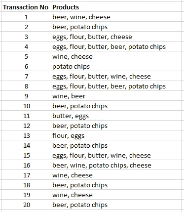
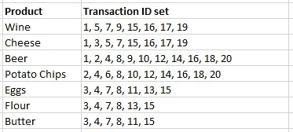
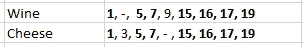
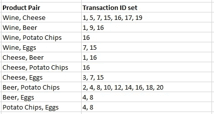
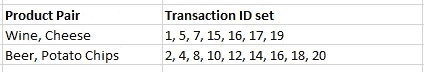
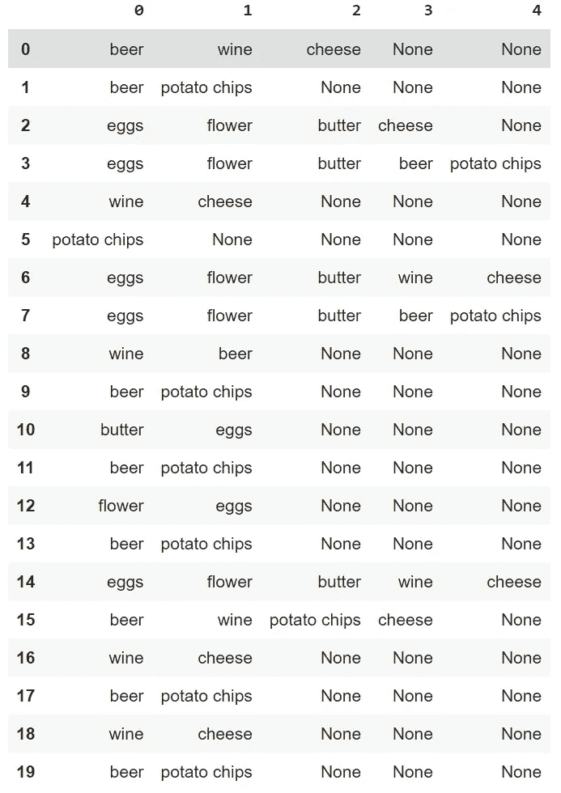
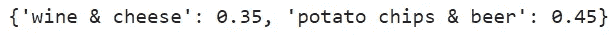

# Eclat 算法

> 原文：<https://towardsdatascience.com/the-eclat-algorithm-8ae3276d2d17?source=collection_archive---------0----------------------->

## 使用 Python 中的 Eclat 算法进行购物篮分析的频繁项集挖掘

Eclat 算法。玛丽-米歇尔·布沙尔在 [Unsplash](https://unsplash.com/?utm_source=unsplash&utm_medium=referral&utm_content=creditCopyText) 上拍摄的照片。

在这篇文章中，你将学到你需要知道的关于 Eclat 算法的一切。Eclat 代表*等价类聚类和自底向上格遍历*，它是一个用于**关联规则挖掘**的算法(它也重组了**频繁项集挖掘**)。

关联规则挖掘和频繁项目集挖掘在它们用于**购物篮分析**的应用中最容易理解:这里的目标是理解购物者经常一起购买哪些产品。

然后，这些关联规则可以用于例如**推荐引擎**(在线购物的情况下)或者用于离线购物的**商店改进**。

# 关联规则挖掘的 ECLAT 算法

ECLAT 算法并不是第一个用于关联规则挖掘的算法。该领域的基础算法是 [**先验算法**](/the-apriori-algorithm-5da3db9aea95) 。由于 Apriori 算法是该领域中提出的第一个算法，它在计算效率方面得到了改进(即，他们做出了更快的替代)。

## ECLAT vs FP 增长 vs 先验

Apriori 算法有两个更快的替代方案，它们是最先进的:其中一个是 [**FP Growth**](/the-fp-growth-algorithm-1ffa20e839b8) ，另一个是 **ECLAT** 。就执行时间而言，FP 增长和 ECLAT 之间没有明显的赢家:它将取决于不同的数据和算法中的不同设置。

# ECLAT 算法的一个用例示例

现在，让我们介绍一个示例用例，让这个主题更加实用。在本文中，我们将采用一个夜店交易的小数据集。对于每笔交易，我们都有一个产品列表。

相同的数据集在早先的文章中用于 [Apriori 算法](/the-apriori-algorithm-5da3db9aea95)和 [FP 增长算法](/the-fp-growth-algorithm-1ffa20e839b8)，因此我们可以使用它们作为基准并验证获得的结果是否相同。

原始数据集如下所示:

ECLAT 算法。事务数据集。

正如你已经看到的，这家夜店的顾客主要购买啤酒、薯片、葡萄酒之类的东西，还有一些其他产品。

# ECLAT:速度更快但指标更少

如果你已经熟悉了频繁项集挖掘或者关联规则挖掘的其他算法，有一件小事可能会让你大吃一惊。尽管大多数算法都包含一些关于它们的规则的关键指标，ECLAT 却没有这样做。

例如， **ECLAT** 并不能给你**信心和** **升力指标**，而这些对于替代车型的解释是必不可少的。另一方面，这允许模型更快:用户可以在速度和拥有更多度量之间做出选择。

# ECLAT 算法是如何工作的？

现在让我们通过手动复制算法的步骤来进入 **ECLAT** 算法。

## **步骤 1 —列出每个产品的交易 ID (TID)集合**

第一步是制作一个列表，其中包含每个产品的交易 id 列表。下表显示了该列表。

ECLAT 算法。为每个产品设置的交易 ID (TID)。

这些事务 ID 列表被称为事务 ID 集，也称为 TID 集。

## 步骤 2 —使用最小支持度进行过滤

下一步是决定一个叫做**最小支持的值。**最低支持将用于过滤掉不常出现的产品。

在当前示例中，我们将选择值 7 作为最小支持。正如您在步骤 1 的表格中看到的，有两种产品的 TID 集合包含少于 7 个交易:面粉和黄油。因此，我们将它们过滤掉，得到下表:

ECLAT 算法。过滤掉未达到最低支持的产品。

## 步骤 3 —计算每个产品对的交易 ID 集

我们现在来看成对的产品。我们将基本上重复与步骤 1 相同的事情，但现在是针对产品对。

ECLAT 算法的有趣之处在于，这一步是使用两个原始集合的**交集来完成的。这使得它不同于 Apriori 算法。**

ECLAT 算法速度更快，因为识别交易 id 集合的交集**比*扫描每个单个交易*是否存在产品对(如 Apriori 所做的)要简单得多。在下图中，您可以看到如何轻松地过滤出葡萄酒和奶酪产品对之间常见的交易 id:**

ECLAT 算法。找到事务 id 的交集比扫描整个数据库更容易

对每个产品对进行交集运算时(忽略未单独获得支持的产品),会得出下表:

仍在竞争中的所有产品对的事务 ID 集。

## 步骤 4-过滤掉没有达到最小支持度的对

和以前一样，我们需要过滤掉没有达到最低支持度 7 的结果。这使得我们只剩下两种产品组合:葡萄酒和奶酪以及啤酒和薯片。

ECLAT 算法。有两个产品对获得支持。

## 第五步——只要你能在支撑位上方建立新的对子，就继续做下去

从这一点开始，尽可能长时间地重复这些步骤。对于当前示例，如果我们创建三个产品的产品对，您会发现没有任何三个产品的组达到最低支持级别。因此，关联规则将是上一步中获得的规则。

# Python 中的 ECLAT 算法

在这个练习中，我们将使用 Python 中的 [pyECLAT](https://pypi.org/project/pyECLAT/) 包。这是一个非常容易使用的软件包。如果您在笔记本电脑环境中，可以按如下方式安装它:

ECLAT 算法。安装 pyECLAT。

一旦你安装了这个包，你需要一个输入数据的方法。在这种情况下，让我们以列表的形式输入数据。每笔交易都表示为一个产品列表。您可以这样做:

Eclat 算法。输入数据。

pyECLAT 库将数据帧作为输入。您可以简单地将您的事务列表转换成一个数据框架，pyECLAT 包会处理剩下的事情。在生成的数据框中有许多非值并不是问题。

ECLAT 算法。重新组织数据。

这是数据的样子:

ECLAT 算法。重新组织的数据

现在您已经有了数据，您需要指定一些算法参数。首先，您需要指定您感兴趣的最小项目集大小。在这种情况下，我们感兴趣的是产品关联，所以我们想省去单个(1-item)项目集:最小大小需要是 2。

我们还需要将我们的最小支持值转换成百分比，这很容易做到，如下面的代码所示。

最后，pyECLAT 包希望我们指定一个最大大小。我们没有项目集的最大大小(我们也会对大的产品关联感兴趣)。因此，我们取最大交易规模。

ECLAT 算法。准备算法设置。

现在我们已经有了所有必要的输入，我们终于可以开始使用 pyECLAT 包了。这有两个步骤:首先实例化，然后拟合算法。您可以这样做:

ECLAT 算法。执行算法。

fit 方法返回两件事:所谓的*关联规则索引*和所谓的*关联规则支持。*正如我之前解释的那样，不会有很多指标。这里唯一有趣的事情是使用下面的代码来查看规则支持:

ECLAT 算法。打印规则。

您将看到有两个确定的规则:葡萄酒和奶酪，以及啤酒和薯片:

ECLAT 算法。最终规则

## 解释

对此的解读是，在我们夜店的成交里面，有两个产品组合是比较强势的。人们经常一起买酒和奶酪。人们也经常一起买薯片和啤酒。显然，将这些产品放在一起是一个好主意，这样人们可以很容易地同时使用它们。或者，也许店主可以考虑将产品包装成有吸引力的报价，以进一步促进这些产品的销售。

# 结论

在本文中，您发现 ECLAT 算法是进行关联规则挖掘或频繁项集挖掘的一种快速有效的方法。您已经看到，尽管它更快，但它比其他方法的度量更少，这也是它更快的部分原因。

在 Python 示例中，您已经看到了如何在一家夜店的交易数据示例中使用 pyECLAT 包。您已经看到了两个关联规则是如何被发现的，以及店主可以利用这些知识做些什么。

*我希望这篇文章对你有用。感谢您的阅读，请不要犹豫，继续关注更多的数学、统计和数据内容！*