# 快速运输的影响

> 原文：<https://towardsdatascience.com/the-effect-of-fast-shipping-80c2ccebbd13?source=collection_archive---------21----------------------->

## [理解大数据](https://towardsdatascience.com/tagged/making-sense-of-big-data)

## 哈佛 IACS 顶点工程，2020 年秋季

**队员:**关毅兴、保罗-艾米尔、乔丹-特利、

**顾问:**尼克·斯特恩，克里斯·坦纳，纳撒尼尔·伯班克

*免责声明:本博客中表达的观点仅代表作者个人观点，不代表哈佛或 Wayfair 的观点。*

# 介绍

Wayfair 是一家销售家具和家居用品的美国电子商务公司。他们的数字平台提供来自 11，000 多家全球供应商的 1，400 万件商品。

快速运输产品是小包裹产品，可以在两个工作日或更短时间内交付给 Wayfair 的部分客户。然而，提供快速运输产品将在 Wayfair 方面产生更多成本。因此，我们有兴趣调查为产品添加快速运输选项是否会增加该产品的利润。特别是，我们希望:

1.  **估计所有产品、每个品类和每个产品的平均销售增长**。
2.  **衡量销售增长的边际效应**:随着快速发货产品比例的增加，销售增长如何变化。
3.  **确定关键产品特性**，这些特性将使产品销售对快速发货更加敏感**。**

# **实验设计和数据收集**

**对于每个用户，他们被赋予一个s 值，该值是一个介于 25 和 75 之间的整数。这个数字直接对应于用户看到项目的快速发货标志(如果它可用)的概率。当一个用户浏览一个项目，它有快速运输，每个项目有 S%的机会显示快速运输标志。每个用户的 s 值是在该用户看到任何给定商品的快速运输时随机确定的。**

**我们得到的数据是汇总的。我们有每个(项目、运输标志、s 值)组合的数据，所以我们知道每个项目、每个 s 值的属性，当它被看到有和没有快速运输时。下面给出了两个假项目的例子，以便读者可以理解确切的格式。**

****

**举例说明我们拥有的数据的确切格式**

**对于每个项目，我们有 51(对应于从 25 到 75 的每个 s 值)乘以 2(快速发货标志真/假)行= 102 行。**

**我们得到的确切属性如下:**

1.  ****wfsku** —内部唯一物品标识符**
2.  ****s 值** —分配给查看商品的客户的 s 值**
3.  ****cartshowshipflag** —是否看到带有快速发货标志的商品**
4.  ****impression nt**—实验中该项目的搜索页面浏览量**
5.  ****avgsortrank** —在搜索页面上看到的项目的平均排序排名**
6.  ****pdpcnt** —产品展示页面点击接收项的次数，即搜索页面点击接收项的次数**
7.  ****numord** —包含该商品的订单数量**
8.  ****qtyord** —订购的该物品的数量**

**numord 和 qtyord 的区别如下:如果一个用户订购了三把相同的椅子，那么 numord = 1，qtyord = 3。**

**我们还被给予关于项目的一般属性，如产品的类别和市场类别名称、评论计数、平均评级、平均订单重量，以及实验前 90 天的数字，对应于印象、产品显示页面点击、订单数量和订购数量。**

# **数据探索和过滤**

**在我们开始为这个项目挑选和训练模型之前，对收集的数据进行初步分析。在这里，我们强调一些关键问题和发现，以及我们如何解决它们。**

## **扭曲的数据**

**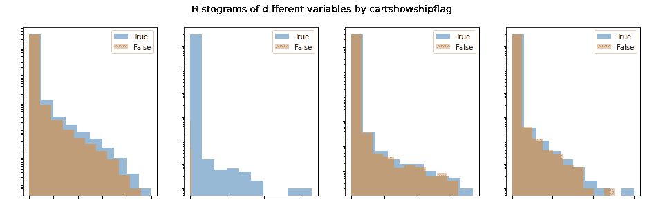**

**图 impressioncnt、pdpcnt、numord 和 qty order 的偏斜数据分布。(在某些图中，根据合作伙伴的要求，省略了数字刻度。除非另有说明，所有省略的刻度都是线性的。对于该图，y 轴是对数刻度。)**

**如图 1 所示，在实验过程中，顾客购买了非常大量的受欢迎的产品，压倒了其余产品的销售。类似的事情也发生在产品印象数、产品展示页面点击数、平均排序排名等方面。当我们在建模中使用这些变量时，为了避免少数几个大值控制模型，有必要采用日志或其他方法进行重新缩放。此外，我们必须确保大量接近于零的值不会淹没其余的值。**

## **线性缩放模式**

**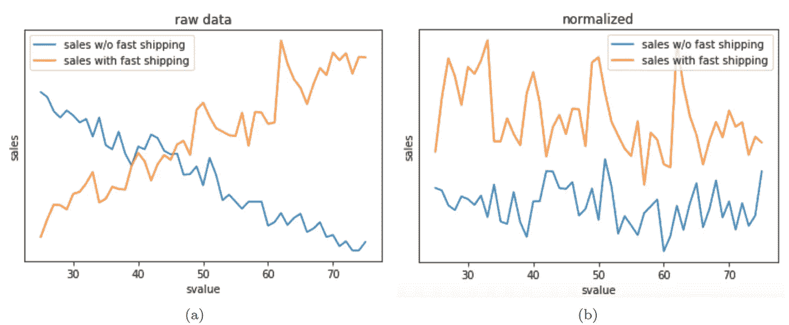**

**图 2:当类别 ID 为 12 的 s 值增加时，有无快速发货的销售如何变化。**

**如图 2 所示，对于许多类别的产品，该类别中快速运输的销售额随着 s 值的增加而线性增加；随着 s 值的增加，没有快速运输的产品的销售线性下降。这是一个实验过程的机械制品。另外，随着 s 值的增加，出货快的产品销量的增加总是大于出货不快的产品销量的减少。**

## **数据过滤**

**由于数据是高度倾斜的，我们必须过滤掉数据中的噪声和异常值，以避免未定义的或极端的值估计。在这里，我们列出了我们在这个项目中使用的过滤器，并提供了所有这些过滤器的理由:**

1.  ****采用和不采用快速发货的最小订单数量和销售数量**:避免未定义/极端的销售乘数**
2.  ****与过去 90 天的销售记录一致**:假设一个产品在实验前的 90 天内卖出了 N90 份(带快运)，在实验期间没有快运卖出了 N0 份，带快运卖出了 N1，那么我们强制 N0+N1≥ (1-t)* 0.7* 41/90 *N90，其中 t 是我们可以容忍的最大销售变化率(在本项目中设为 0.5)。这里 41 是这个实验持续的天数，0.7 是被引导到这个实验中的客户的百分比。**
3.  ****根据印象或销售额排名前 50%的受欢迎产品**:受欢迎的产品获得了最多的客户曝光率，并创造了大部分的产品销售额。因此，我们的利益相关者更关心受欢迎的产品，而这些受欢迎的产品数据不太容易受到噪音的影响。**

# **文献评论**

**在这里，我们先简要回顾一下我们在这个项目中使用的统计模型、软件包和符号，然后再介绍我们采用的建模方法。**

## **回归模型**

**为了研究快速发货的影响，我们从订单数量的线性回归开始。然后我们继续进行关于订单数量的泊松回归，因为我们回归的变量总是一个整数。最后，我们使用二项式回归来回归(已完成/成功)订单的数量，给定产品加载到搜索页面的次数，以考虑随着 s 值的增加而增加的暴露量。**

## **异质处理效果 EconML 包**

**虽然回归确实为我们提供了一种研究快速装运效应的方法，但对这类问题更正式的方法通常是异质处理效应分析和推断。异质治疗效果分析考虑了治疗和各种其他属性之间的相互作用不一定是线性的这一事实，并提供了对相互作用项进行建模的正式机制。本节将提供 EconML 软件包的基本介绍性概述，EconML 是一个强大的 python 库，它使我们能够在各种情况下通过推理分析执行异质效应分析，以及我们将在稍后展示模型以估计异质治疗效应时广泛使用的符号。**

**设 Y(T)为响应变量，T 为处理指标，X 为异质性指标，从 t0 到 t1 的异质性处理效应表示为τ(t0，t1，x)=E[Y(t1)-Y(t0) | X=x]。**

**我们假设我们有如下形式的数据:{Yi(ti)，ti，，wi}:**

1.  ****Yi(ti)** :所选治疗的观察结果→ numord，qtyord**
2.  ****ti** :治疗→ cartshowshipflag (1，0)**
3.  ****xi** :用于异质性的协变量(即可能与 ti 相互作用的变量)→ S 值**
4.  ****wi:** 其他可能影响我们响应变量的参数→通用产品属性，如 90 天、评级、价格等。**

**我们假设我们的目标量τ(异质治疗效果)具有以下结构:**

1.  **Y=H(X，W)T + g(X，w，ϵ)**
2.  **T=f(X，W，η)**
3.  **τ(t1，t0，x)=E[H(X，W) | X=x](t1-t0)**

**这里η和ϵ是相加的噪声因子，h，g，f 是函数。EconML 包中的 BaseCATEstimator 类将通过少量的编码为我们提供治疗效果的置信区间。**

## **基于树的模型**

1.  **贝叶斯可加回归树**

**与树方法相反，参数模型确实有局限性，因为它们不适合许多类型的函数。贝叶斯加性回归树像梯度推进树一样对顺序弱学习器的贡献求和。前者与后者之间的主要区别在于，使用先验分布来正则化树(例如，它控制树的深度，它倾向于从每个叶子内的平均值收缩分布，等等)。).这种内置的惩罚避免了调整任何超参数和正则化。该模型的另一个主要好处是，我们可以从计算的后验分布中获得更丰富的信息。需要一个 MCMC 采样器，用于种植新树和采集样本。**

**2.诚实的树和因果的森林**

**这些模型被设计用于因果推断以测量治疗效果。诚实的树被称为“诚实的”,因为它们在数据的一部分被训练，在另一部分被评估。更准确地说，构建这样的树是为了最小化考虑了每个叶子中的方差和叶子之间的协方差的度量，然后它评估每个叶子对数据的剩余部分的处理效果。这些树被设计来平衡准确性，同时没有太多的不确定性。因果林是这些树的集合。像在随机森林中一样，个体诚实树可以用数据和特征的不同子样本来生长，以确保它们的结果之间的某种独立性。对我们的问题使用因果森林的优点是，我们可以首先从非线性中受益，以拟合我们的数据。第二,“诚实”成分将使得能够具有对异常值稳健的模型，并且将在评估治疗效果时限制测量噪声。**

# **基于聚合的方法**

**估计快速发货的平均效果的一个自然方法是简单地将它计算为有快速发货的总销售额除以没有快速发货的总销售额。**

## **任务 1:销售额的平均提升**

**如果不过滤掉销量很少或没有销量的产品，我们得到的最终价值是 1.25 倍(即销量增长 25%)。这个数字可能被高估了，因为我们没有考虑到由于快速运输而增加的产品暴露。**

**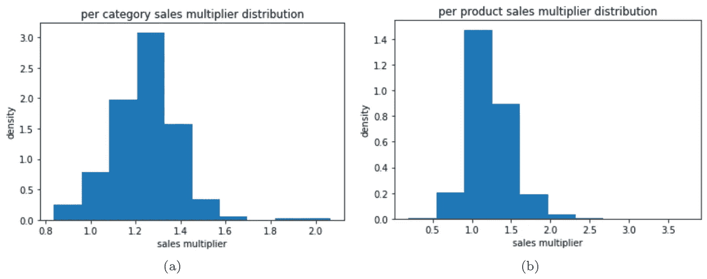**

**图 3:每个类别和每个产品的销售乘数分布**

**我们还计算了每个类别和每个产品的平均销售乘数，并在图 3 中显示了它们的分布。在这里，当我们将范围从所有项目缩小到特定的类别和产品时，销售数据变得更加嘈杂。因此，我们根据以下标准过滤掉一些数据，以避免未定义或极端的销售乘数值:**

**1)对于一个类别，如果该类别中有快速发货或没有快速发货的产品的总销售额低于阈值(图 3 中设置为 100)，我们将跳过该类别。**

**2)对于一个产品，如果有快速发货或没有快速发货的产品的总销售额低于一个阈值(图 3 中设置为 40)，我们将跳过该产品。**

## **任务 2:S 值的影响**

**提醒一下，任务 2 的目标是衡量随着快速发货产品比例的变化，销售增长如何变化。我们使用了三种不同的模型来尝试回答这个问题:线性回归、泊松回归和二项式回归。**

**作为一个简单的基线模型，我们计算了每个 s 值的订单总数和订购商品总数，并回归了 s 值的总和。这在下面的图 4 中可以看到。**

**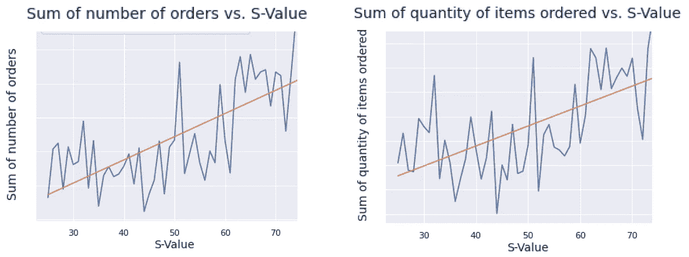**

**图 4:线性回归。**

**然而，这个模型被认为是幼稚的，因为我们没有考虑印象的数量。在较高的 s 值下，项目会获得较高的曝光度，因为当显示快速运输时，搜索排序算法会有所提高。正因为如此，我们会自然而然地期望在更高的 s 值下有更多的订单，所以这些数字代表了两种不同处理的组合效果:排序提升和运输标志。**

**我们还使用泊松回归来重复上述模型，因为售出的订单数/数量总是整数类型。我们发现，s 值增加 1 会导致订单数量和订购商品数量都成倍增加约 1.001。这听起来不是很多，但如果我们考虑从 S = 25 移动到 S = 75，这是大约 1.05 的倍数增加。然而，在这个模型中，我们也没有考虑暴露程度，所以我们不能直接使用这个结果来回答任务 2。**

**为了纳入暴露水平，我们考虑了二项式回归模型。设 Yi 为 S = Si 时的总订单数，Ni 为 S = Si 时的敞口，那么我们可以说 Yi =二项式(Ni，pi)，其中 pi 依赖于 Si。我们直觉地认为，在更高的 s 值下，我们会收到更多的订单，这是由于快速运输带来的分拣提升。**

**然而，我们发现事实并非如此。考虑下面的图 5。**

**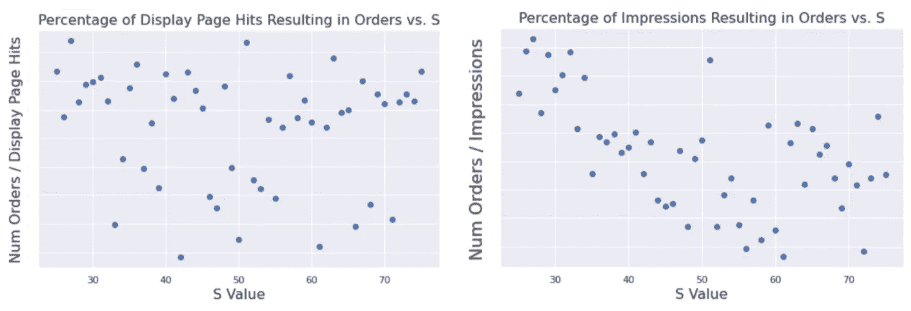**

**图 5:二项式回归问题**

**在这些图中，我们对订单总数、产品显示页面点击总数和搜索页面显示总数进行了求和。我们绘制了订单数除以曝光度的图表——左边是产品显示页面点击率，右边是搜索页面浏览量，这给出了导致订单的产品显示页面点击率或浏览量。我们看到，随着 s 值的增加，速率没有增加或减少。我们查看了特定的类别、特定的商品以及 10 个或 10 个以上订单的商品，它们都遵循相似的趋势。**

**我们能想到的第一个解释是，当提供几个快速运输的项目时，用户可能会经历选择麻痹。如果你正在购买一个沙发，并看到几个快速发货，这可能比你只看到一个快速发货的沙发更难决定。另一种解释是，根据产品是否接受快速装运处理，这两种费率可能表现不同。我们对上面的发现很感兴趣，我们决定更深入地研究不同转换率和快速发货之间的关系，并引出了一种不同的建模方法，我们将在后面的部分中介绍这种方法。**

## **任务 3:对快速装运敏感的产品特性**

**此任务的主要目标是确定关键产品特征，使产品销售对快速发货更加敏感。**

1.  **产品特性分布**

**解决上述问题的一种方法是首先将所有产品分为三组:**

1.  **如果提供快速发货，销售额至少增加 10%的产品组，**
2.  **如果提供快速发货，销售额至少下降 10%的产品组，以及**
3.  **不在前两组中的产品组(即，对快速发货不太敏感)。**

**然后，对于每个产品特性，我们将该产品特性在上述三组中的分布可视化。分布的清晰分离意味着这种产品特性可以使产品在质量上对快速发货更加敏感。**

**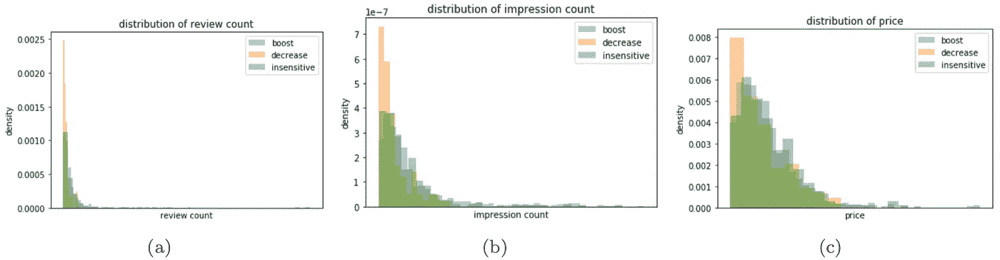**

**图 6:选定产品特征的分布**

**图 6 显示了三个产品特征分布的清晰分离:评论计数、印象计数(产品加载到页面上的次数)和产品价格。我们可以看到，当一个产品的评论或印象数较少或价格较低时，如果提供快速发货，则该产品的销售额更有可能下降至少 10%。然而，这种方法不能定量地确定一个产品特性的变化如何影响最终的销售乘数，我们将在下一节解决这个问题。**

**2.治疗效果的基线模型—线性回归**

**在本节中，我们开发了一个具有线性回归的基线模型，以量化每个定量变量(例如，审查数量、平均评级、权重、实验前 90 天的先前观察结果等)的平均治疗效果变化。**

**在此模型中，我们对不同 S 值的订购数量进行求和，并为每个回归保留一个变量，以隔离其影响。更准确地说，每个回归模型的预测变量是快速发货二元变量(处理)、要评估的产品特征以及两者之间的相互作用。我们选择订购数量作为我们的输出变量。**

**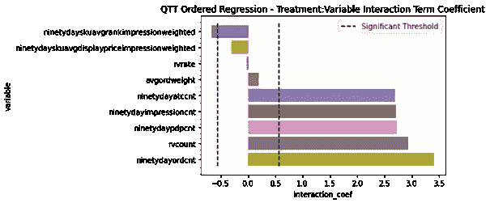**

**图 7:线性回归模型中处理和标准化产品特性之间的相互作用系数。**

**图 7 显示了处理和每个产品特性之间相互作用项的系数。所有产品特性之前都已标准化。如果产品特性增加一个标准偏差，这个系数可以解释为订购数量的平均增加。我们使用随机高斯变量进行模拟，以了解这些系数的重要性。我们观察到，导致平均治疗效果变化最大的特征是与受欢迎程度相关的特征(90 天订单计数、产品评论计数、90 天产品显示页面点击计数等)。**

**与数量订单的范围相比，相互作用系数的值较小，这可以通过线性回归对所有产品给予相同权重的事实来解释。因此，由于每个产品的订单分布是偏斜的(大多数产品的销售额较低)，该模型不会对少数产品给予很多信任，这些产品可能已经收到了较高的治疗效果差异。为了改善我们的研究，我们应该考虑非线性模型，并可能包括不同变量和治疗效果之间的交叉作用。**

**3.基于树的模型**

**在我们定义基于树的模型的处理效果之前，我们需要首先引入一些符号:**

**- N:体验中 70%的客户生成的订单数量**

**- N0:没有快速装运处理的订单数量**

**- N1:快速发货处理的订单数量**

**- N = N0 + N1**

**假设快速出货完全没有影响，那么 N0* = 49% N，N1* = 51% N

如果实验在与之前 90 天期间相同的条件下运行，那么 N ≈ 70% *41/90 *N90，其中 N90 是实验前 90 天的订单数。

用这些符号，有两种方法来定义治疗效果:**

1.  **N1-N0:订单数量的绝对增长。这是治疗效果最直接的定义，但我们发现这个定义的变量与产品的受欢迎程度(大量订单)高度相关。BART 和因果森林生成的结果与基线模型已经确定的结果相似:关键特征是与产品受欢迎程度相关的特征。**
2.  **N1/N1*-N0/N0*:重新调整后的销售增长百分比。然而，这种划分使得以这种方式定义的治疗效果对销量很少的产品的噪声高度敏感，如图 8 所示。我们发现，最终，使用这种治疗效果定义训练的基于树的模型生成的预测只对流行产品有效，并且识别的关键特征也是与产品的流行度相关的特征。**

**我们用 BART 和 Causal Forest 获得了类似的结果，根据销售额增加的重新标度百分比来估计治疗效果。图 8 显示了因果森林模型的预测处理与实验前 90 天内订单数量的实际销售重标差异的比较。我们观察到治疗效果总是略呈正的，这让我们认为一个负的治疗效果只是噪音。我们能够识别出我们模型的最佳预测值是与产品受欢迎程度相关的预测值，如图 9 所示。这些模型的置信区间远非精确，因为大多数观察点并未落入其相应预测值周围的 95%范围内。因此，我们避免从这些森林模型中得出产品特性对处理效果影响的结论。**

**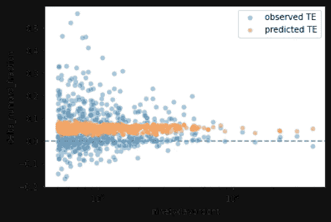**

**图 8:基于树的模型生成的预测。请注意，随着 90 天订单数(产品的受欢迎程度)的增加，治疗效果的方差会减小。**

**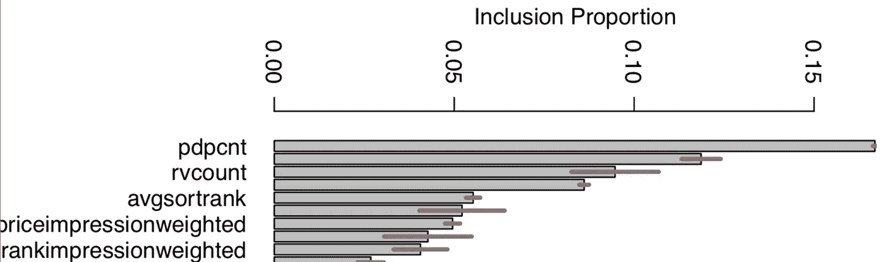**

**图 9:由基于树的模型识别的关键产品特征。请注意，前 3 个关键特征:产品显示页面点击计数、评论计数和平均排序排名都与产品的受欢迎程度相关。**

## **问题**

**我们现在总结基于汇总的方法的缺点，然后在下一节中使用基于转换率的方法来解决这些缺点:**

**首先，如上所述，这种方法没有考虑到这样一个事实，即快速运输提供的分类提升也可以增加产品的曝光率，从而增加最终的销售数字。如果我们只想量化“纯”快速发货的影响，我们必须对快速发货、产品曝光和销售之间的相互作用进行建模。**

**第二，在计算销售乘数以过滤噪声产品之前，我们使用的过滤阈值有些武断。当我们查看子类别的这些估计值时，其中一些估计值对使用的阈值很敏感。**

**第三，由于这个实验实现中的一个小缺陷，处理稍微不对称:当我们合计所有 s 值中已经或没有看到该产品快速发货标志的客户数量时，我们将发现大约 51%，而不是 50%的客户显示了快速发货标志。我们必须在销售乘数估算中考虑到这一点。**

# **基于转换率的方法**

**针对上述问题，经过仔细考虑，我们决定
将快速装运的影响视为以下两种影响的组合:**

1.  ****更好的印象到 pdpcnt 的转换率**:如果一个产品被加载到一个页面上，由于快速发货的徽章，更有可能被点击到产品展示详情页**
2.  ****更好的 pdpcnt 到 numord/qty order 的转换率**:如果点击并加载产品显示详情页面，由于提供快速发货，产品更有可能被订购**

**然后，对于每种产品，我们采取以下步骤来衡量快速发货的效果:**

1.  **计算 impressioncnt 到 pdpcnt 的转换率，分别使用和不使用快速发货:x0 和 x1**
2.  **计算 pdpcnt 到 numord/qty order 的转换率，分别使用和不使用快速发货:y0 和 y1**
3.  **转换率乘数估计值则为 x1*y1/(x0*y0)**

**这种方法解决了基于聚集的方法的三个主要问题:
1)它在某种意义上是“印象独立的”:假设一个产品 p 在页面上加载了 t 次。如果没有快速发货，它将被卖出 x0*y0*t 次；随着快速运输，它将出售 x1*y1*t 倍。销售乘数估计为 x1*y1*t/(x0*y0*t)=x1*y1/(x0*y0)独立于印象数 t.
2)过滤的必要性大大降低。例如，在这个框架中，我们不再需要担心某个产品在没有快速发货的情况下只卖出了一两笔，而在提供快速发货的情况下却卖出了几十或几百笔。
3)前面提到的 51/49 偏差不再是一个问题，因为它只对产品收到的印象/曝光有影响，这种方法在某种程度上是“印象独立”的。**

## **任务 1:销售额的平均提升**

**图 10 显示了新的每产品销售乘数分布，定义为从印象到订购数量的转换率。有趣的是，如果在这种框架下提供快速发货，只有大约 30%的产品会收到销售促进效果。对于这些收到销售促进效果的产品，平均销售乘数估计为 1.46 倍(即销售额增长 46%)。如果包括所有产品，平均销售乘数估计值将变为 0.85 倍(即销售额下降 15%)。**

**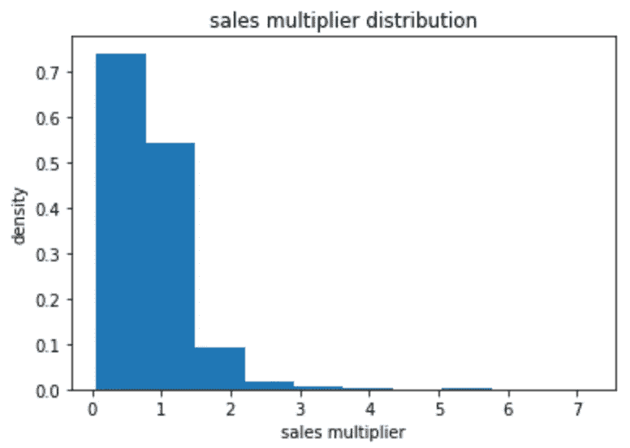**

**图 10:新框架下的每件产品销售乘数分布**

**为了理解这个数字，我们还研究了如上定义的每个产品的 x0、y0、x1、y1 值，并发现:**

1.  **对于仅 40%的产品，如果客户在产品展示页面，并且相关产品提供快速发货，他们更有可能订购购买产品。**
2.  **对于仅 20%的产品，如果这些产品被加载到显示给客户的页面上，客户更有可能点击产品显示页面。其余 80%的产品无法有效利用快速运输带来的分拣提升。如果由于排序提升，这些产品在搜索页面上显示给更多的客户，那么点击它们的客户就会减少。**

## **任务 2:S 值的影响**

**图 11 显示了当 s 值从 25%增加到 75%时，不同转换率的变化情况。这里的转换率是所有产品的平均值。我们决定取所有产品的平均值，因为对于大多数(产品，s 值)对，产品显示页面的点击数和销售量都是 0。因此，该(产品，s 值)对的转换率为 0。**

**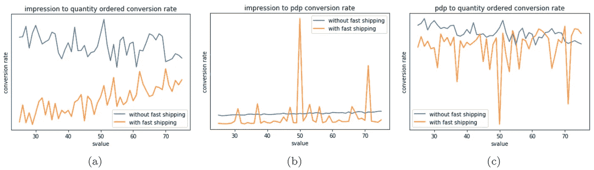**

**图 11:转换率:(a)从印象到订购数量，(b)从印象到产品展示页面点击，(c)从产品展示页面点击到订购数量**

**在图 11 中可以观察到几个重要的现象。首先，从印象到订购数量的转换率(没有快速发货)和从产品显示页面点击到订购数量的转换率(没有快速发货)都随着 s 值的增加而降低，如图 11(a)所示。这是有道理的:随着客户发现越来越多的产品提供快速运输，没有“快速运输”肯定会使产品对客户的吸引力下降。**

**第二，随着 s 值的增加，从印象到产品展示页面点击的转换率在有无快速发货的情况下基本保持不变，如图 11(b)所示，与图 11(c)中的转换率相反。由于我们将快速发货的影响视为从印象到产品显示页面点击以及从产品显示页面点击到订购数量的转换率提高的影响的组合，我们可以推断，在这个项目中，快速发货的影响对从产品显示页面点击到订购数量的转换率的影响比从印象到产品显示页面点击的转换率的影响大得多(几乎可以忽略不计)。**

**第三，从印象到订购数量的转换率随着 s 值的增加而增加，如图 11(a)所示。如上所述，我们将这一增长主要归因于产品显示页面点击量到快速发货订购量的转化率的提高。最初，我们预计，随着 s 值的增加，从印象到快速发货订购数量的转换率会降低，理由如下:随着 s 值的增加，客户可以获得更多的快速发货选择。因此，快速发货作为加分项在客户决策过程中的权重会降低，这导致任何给定产品从印象到订购数量的转化率降低。然而，根据我们上面的发现，我们意识到，当客户从一系列在线选项中选择时，价格、封面照片、评论率等产品属性通常是比快速发货更重要的因素。因此，我们最初的推理不成立。**

## **任务 3:对快速装运敏感的产品特性**

**即使在 50%最受欢迎的产品中，从产品显示页面到订单以及从印象到订单的转化率也在 1e-6 到 1 之间。有了这样的可变性，我们决定测量这两个转换率的对数的治疗效果。例如，对从产品显示页面点击(PDP)到订单率的转换率的对数的处理效果是:**

**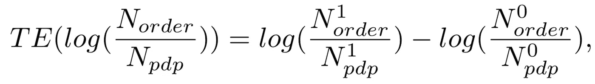**

**其中 N⁰和 n 分别是处理前后(即，快速运输前后)的观察量。**

**下面的图 12 显示了该变量与 PDP 数量的对数的关系(产品显示页面，在一定程度上反映了产品的受欢迎程度)。除了最受欢迎的产品之外，这一变量的治疗效果的方差并不像我们之前看到的那样随着产品受欢迎程度的变化而变化。这种处理效果的平均值是负的(接近 0.050)，因此平均而言，当提供快速运输时，PDP 转换率比没有快速运输时低 9.2%。这种趋势可以通过以下事实来解释:PDP 数量对快速发货比订单数量更敏感，即，在百分比上，PDP 数量随着快速发货比订单数量增加得更多。因此，转换率平均随着快速运输而下降。我们观察到印象到订单的转换率也有类似的模式，平均下降了 32%。**

**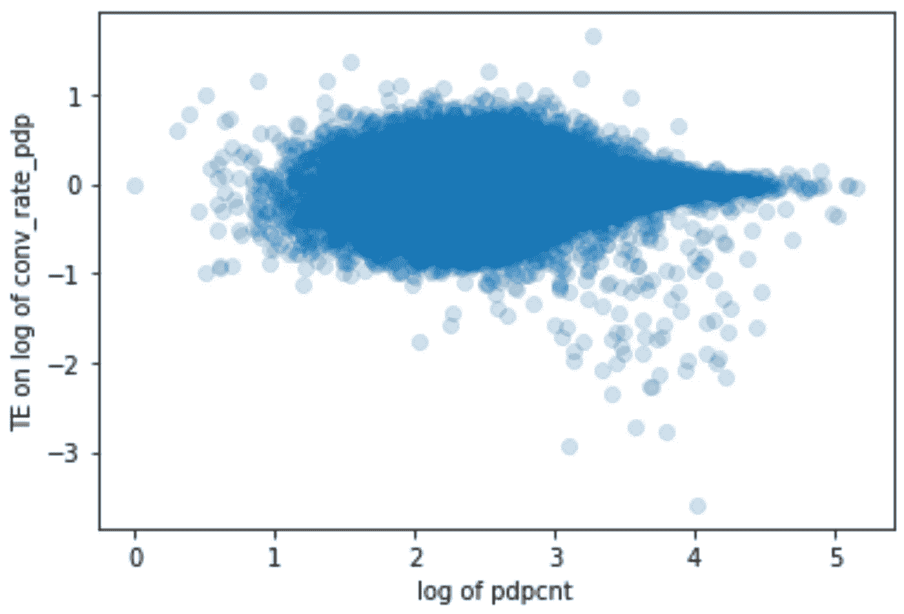**

**图 12:观察到的对对数 PDP 转换率的处理效果与对数 PDP 的关系(针对前 50%最受欢迎的产品)**

**然后，我们通过将过滤后的数据集分成训练集和测试集来评估多个模型。我们比较 MSE 得分和 95%置信区间准确性(即，在预测置信区间内的观察点的比率)的准确性。结果如图 13 所示。**

**这里，基于双稳健学习(DRL)算法的线性 DRL 是一种首先应用任意机器学习模型来拟合治疗和响应，然后使用线性模型从治疗残差预测响应残差的方法。我们用特定治疗 T 估计我们的预测结果 Y 为:**

**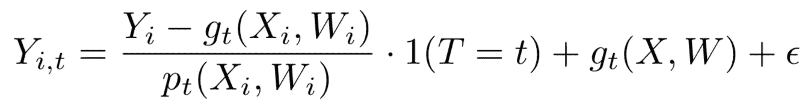**

**其中 T 是离散处理的一个热编码，p(Xi，Wi)是通过运行分类从(X，W)预测 T 而计算的倾向模型，g(X，W)是回归模型，使得 g(X，W) = E[Y |T，X，W]，并且我们可以通过简单地回归 Y(i，1)-Y(i，0)来学习处理θ(X)。对于这项任务，我们重点研究该模型的以下参数:**

1.  **模型回归:E[Y |T，X，W]的估计量。通过在(特征、控制、一次性编码处理)连接上回归 Y 来训练。**
2.  **ϕ(X)(特征):用于在最终 CATE 回归中创建复合特征**

**总之，我们首先通过在(X，W)上运行 Y 的回归来训练回归模型 g(X，W)，并通过运行分类来从(X，W)预测 T 来训练倾向模型 p(Xi，Wi)。然后如上所述构造双稳健随机变量，并在 x 上回归它们。**

**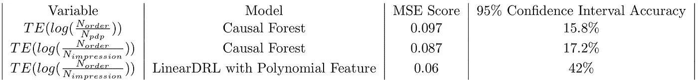**

**图 13:模型性能比较**

**在对线性 DRL 的各种组合进行试验后，我们发现具有**weighted lasscov**和二次多项式特征的线性 DML 表现最佳，如图 13 所示。**

**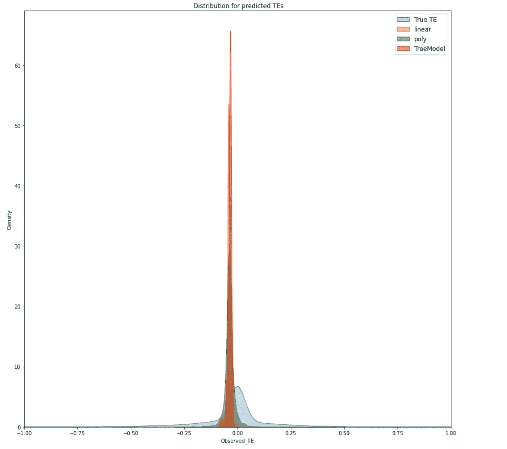**

**图 14:不同模型的预测与观察到的效果**

**图 14 显示了不同模型的预测分布与观察到的治疗效果的真实分布的对比。我们可以看到，所有模型的预测都低估了真实的治疗效果，如图表中左移的中心所示。总体而言，与其他模型相比，具有多项式特征的 DRL 学习器具有最宽的分布，但是预测结果仍然以零为中心。图 15 详细显示了线性 DRL 预测与观察到的效应。如果我们研究我们模型的治疗效果系数，如图 16 所示，我们发现根据该框架下的 p 值(必须小于 0.05)，没有显著特征高度预测我们的治疗效果。此外，在所有特征中，90 天订单计数，一个与产品受欢迎程度相关的产品属性，似乎仍然是最重要的一个，尽管不是治疗效果的高度预测。**

**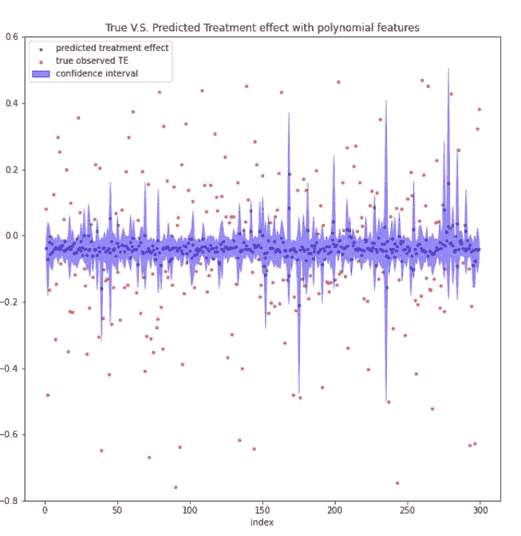**

**图 15:线性 DRL 预测与观察到的效应**

**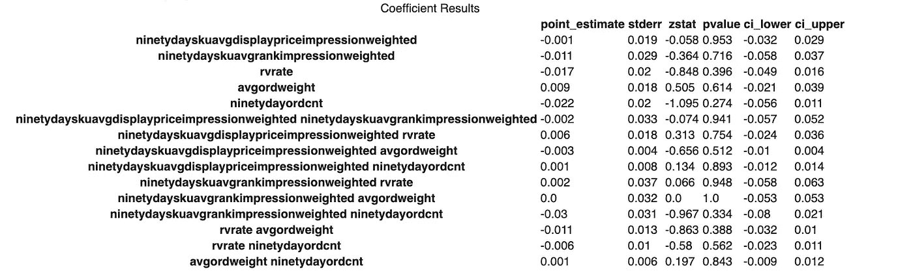**

**图 16:线性 DRL 系数**

**然而，当我们继续过滤掉不受欢迎的产品时，我们的 LinearDRL 学习器在置信区间的分布和准确性方面有了显著的改进，如图 17 和图 18 所示。然而，线性模型和系数在很大程度上保持不变。因果福里斯特方法产生类似的结果，尽管它在这个框架下不如线性 DRL 方法执行得好。**

**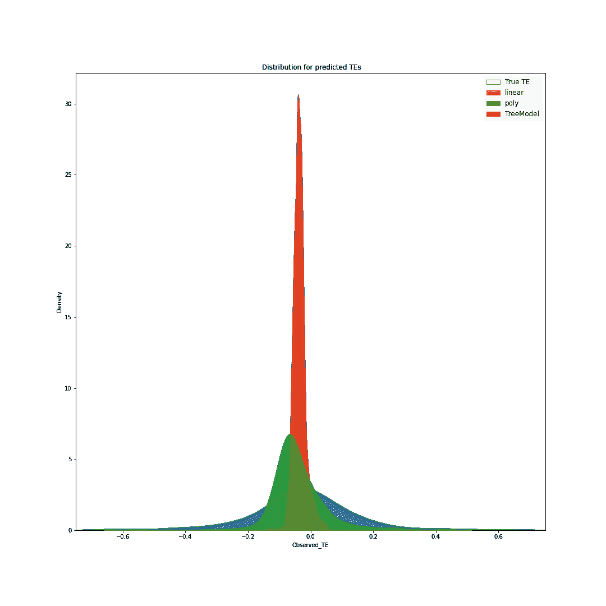**

**图 17:不同模型的预测与观察到的效果，过滤掉不受欢迎的产品**

**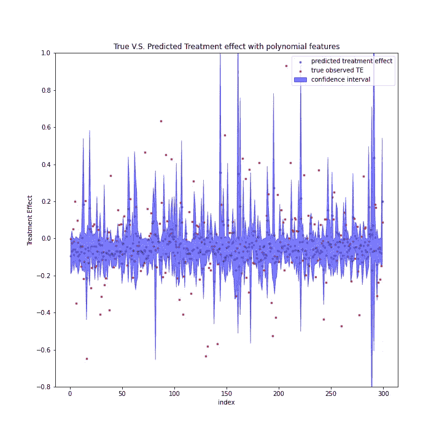**

**图 18:线性 DRL 的预测与观察到的效果，不受欢迎的产品被过滤掉**

# **结论**

**我们在这个项目中研究快速装运的影响。我们先从基于汇总的方法开始，然后再讨论基于转换率的方法。使用基于聚合的方法，在不考虑排序提升如何对最终销售做出贡献的情况下，我们发现快速发货可以带来 25%的销售增长，这可能是一个过高的估计，订单数量和销售数量与 s 值的线性增长成比例。通过基于转换率的方法，我们发现，如果我们固定产品的曝光度，快速发货可以为转换率不会因快速发货而下降的产品带来 46%以上的销售额。与从印象到产品展示页面点击的转换率相比，快速发货对从产品展示页面点击到订购数量的转换率的影响要大得多。随着 s 值的增加，从印象到快速发货订购数量的转换率也增加。最后，在这两个框架下，我们发现与产品受欢迎程度相关的产品属性是使产品销售对快速发货更敏感的关键特征。**

# **感谢**

**我们要感谢 Nathaniel Burbank(Wayfair)、Nick Stern(哈佛)和 Chris Tanner(哈佛)在整个工作过程中给予的支持和指导。**

****

**与 [Wayfair](https://www.wayfair.com/) 合作**

**海报链接:[https://drive . Google . com/file/d/15Jqb _ gmwF _ gK _ zq 0 lm 0 rezwzzgaj-nHA/view？usp =共享](https://drive.google.com/file/d/15Jqb_gmwF_gK_zQ0lm0REZWzZGAJ-nHA/view?usp=sharing)**

**海报展示短片链接:[https://drive . Google . com/file/d/1 LSM x 6 x 2 jezi 3 oucf 2 in 2 _ 0 ifastbgjp 0/view？usp =分享](https://drive.google.com/file/d/1lsmx6X2JEzI3ouCF2in2_0IFAstBgjP0/view?usp=sharing)**

# **参考**

1.  **巴特:贝叶斯加性回归树。应用统计学年鉴 4(2010):266–298。**
2.  **韦杰、s .和 s .阿西。"使用随机森林的异质处理效果的估计和推断."*美国统计协会杂志*113(2015):1228–1242。**
3.  **EconML : Python SDK，由新英格兰 MSR 的 ALICE 团队开发**
4.  **[GRF](https://grf-labs.github.io/grf/index.html) :广义随机森林，一个基于森林的统计估计和推断的插件包。**