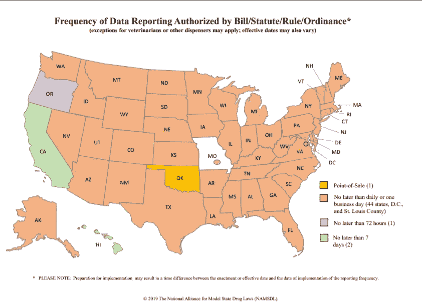
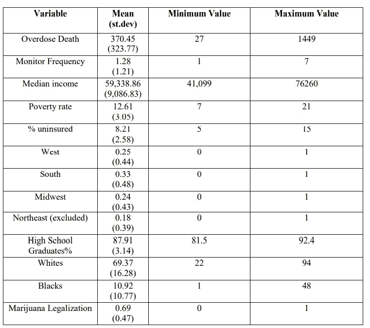
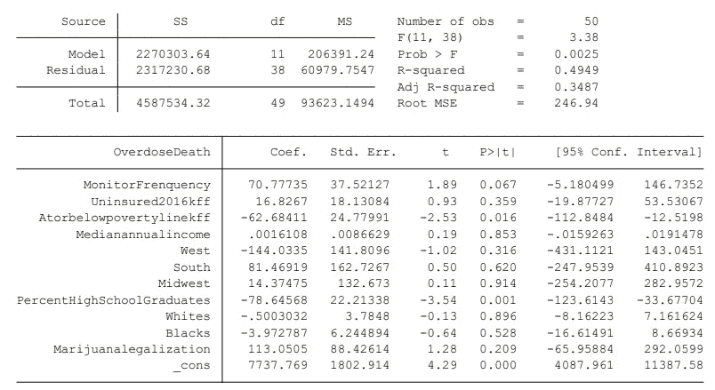
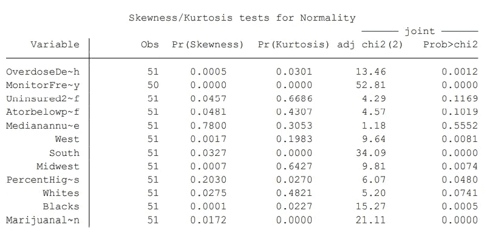
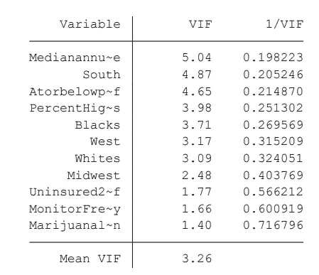
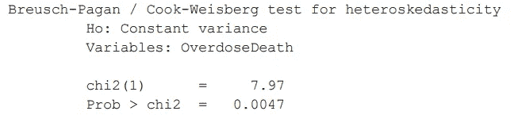
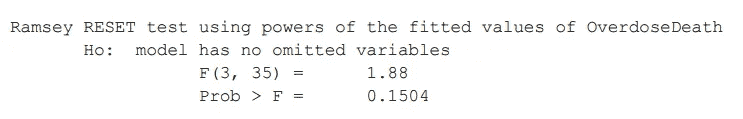
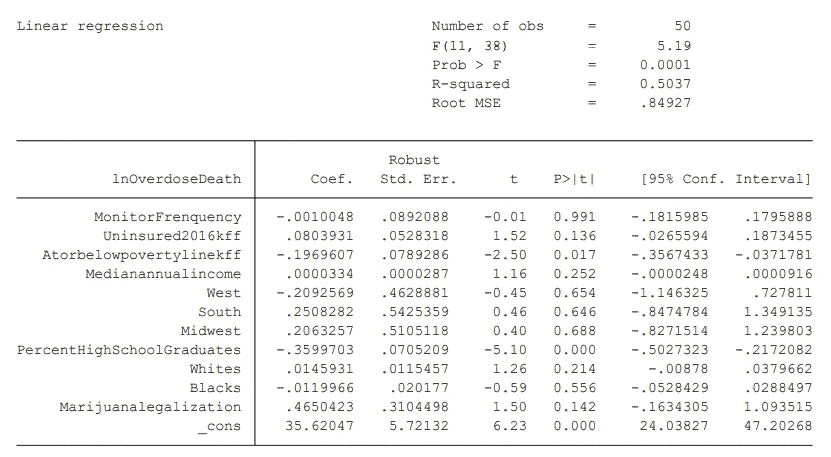

# 监测频率对处方阿片类药物过量死亡率的影响

> 原文：<https://towardsdatascience.com/the-effect-of-monitoring-frequency-on-prescription-opioids-overdose-death-rate-ccb4c9c741dd?source=collection_archive---------30----------------------->

药品图片，来自 [Unsplash](https://unsplash.com/photos/KltoLK6Mk-g) 的 [Myriam Zilles](https://unsplash.com/@myriamzilles)

## 具体和**按部就班**分析

在这篇博客中，我将描述监测频率如何影响处方阿片类药物过量的死亡率。具体过程包括背景介绍、文献综述、实证模型、数据探索、实证结果、未来检验、结论和政策含义以及引用。

# **简介**

处方阿片类药物通常用于治疗急性疼痛，作为治疗的重要组成部分。然而，阿片类药物的误用和过量近年来在美国已经成为一个日益严重的问题。

每天，大约有 174 人会死于药物过量(Jalal，Hawre，et al 2018)。目前，阿片类药物，包括处方阿片类药物、海洛因和合成阿片类药物，如芬太尼及其化学类似物，是用药过量死亡的主要原因(Jalal，Hawre 等人，2018 年)。

加拿大政府从[爱德华王子岛](https://www.princeedwardisland.ca/en/information/health-and-wellness/preventing-opioid-related-overdoses)拍摄的阿片类药物过量图像的迹象

在这种情况下，系统动力学模型显示，阿片类药物过量危机预计将会恶化——预计到 2025 年，每年阿片类药物过量死亡人数将达到近 82，000 人(陈，秋实，等，2019)。因此，美国政府决定建立处方药监控计划(PDMPs)来对抗这种严酷的状况。目前，监测强度每增加 1 个点，用药过量死亡就减少 1%(Pardo，Bryce。，et al 2017)。

综上所述，我们可以从不断增长的死亡趋势中得出结论，有大量的患者和药物滥用者无法控制自己对处方阿片类药物的过量使用，因为他们可能无法控制自己，并且缺乏关于过量使用的危害的关键信息。因此，有更好的处方药监测计划(PDMPs)是必要的，以干预这些人的近视行为，降低政策制定者因阿片类药物过量而导致的不必要的高死亡率。

# **文献综述**

在文献综述部分，我将按时间顺序介绍四篇与阿片类药物过量相关的文献，以展示处方药监测计划对处方阿片类药物过量死亡率的影响如何随时间变化。

第一篇文献在州一级量化了处方药监测计划(PDMPs)与药物过量死亡率之间的关系。这表明，虽然 PDMPs 可能是防止非法使用处方物质的重要工具，但其影响并未反映在药物过量死亡率中(Paulozzi，Leonard J .，等人，2011 年)。它们对处方阿片类药物消费的影响似乎很小。PDMP 的管理者需要开发方法来改善他们的数据的使用，以影响处方药过量死亡率的问题(Paulozzi，Leonard J .，et al 2011)。

第二篇文献指出，为了降低逐渐增加的处方阿片类药物过量死亡率，四十九个州(除密苏里州外)创建了处方药监测计划，以帮助监测高风险处方药物(Patrick，Stephen W .，et al 2016)。它还发现，一个州实施一项计划与实施后一年内平均每 10 万人口中减少 1.12 例阿片类药物相关的过量死亡有关(Patrick，Stephen W .，et al 2016)。

第三篇文献使用了来自疾病控制和预防中心(CDC)的流行病学研究在线数据库(WONDER)的更准确和更广泛的数据，对根据处方药滥用政策系统(PDAPS)编制的指数变量回归州年死亡率(Pardo，Bryce。，et al 2017)。从数据来看，文献指出监测强度与用药过量死亡率呈负相关。监测强度每增加 1 点，用药过量死亡率就会降低 1%(Pardo，Bryce。，et al 2017)。

最近的研究探讨了各州是否已经随着时间的推移过渡到 PDMP 模式。它提出，自 1999 年以来，美国各州倾向于过渡到更强大的处方药监测计划类别(Smith，Nathan，et al 2018)。

从上述所有文献综述中，我们应该已经意识到处方药监测计划对处方阿片类药物过量死亡率的影响正在逐渐增强。然而，没有文献将阿片类药物过量死亡率和其他重要影响因素放入一个单一的经验模型中，以表明处方阿片类药物过量死亡率如何受到其他重要因素的影响。

因此，为了进一步研究，我将更深入地调查每 100，000 人中处方阿片类药物过量死亡率与监测频率以及其他因素之间的关系，以认识到控制处方阿片类药物滥用的重要性。我们感兴趣的独立变量是处方阿片类药物监测频率。我将使用州作为我们的分析单位，并在州一级收集数据。

# **经验模型**

线性回归用于估计处方阿片类药物过量死亡与监测频率之间的关系。在本文中，我们将估计以下回归模型:

> overdesead = B0+B1 * monitor frequency+B2 *未参保+B3 *收入+B4 *地区+B5 *种族+B6 *教育+B7 *大麻合法化+错误

在上面的模型中，过量死亡变量测量各州每 100，000 人口中的处方阿片类药物过量死亡率。我们感兴趣的独立变量是监控频率，它测量每个州处方药的监控频率。

收入变量包括各州的平均收入和低于联邦贫困线的人口比例。未保险变量衡量没有医疗保险的国家总人口的比例。我们也算地区，东北除外。这场竞赛包括每个州非裔美国黑人的百分比和非西班牙裔白人的百分比。教育衡量每个州高中毕业率的百分比。以及大麻合法化措施，如果该州完全合法化与否。

# **数据探索**

处方阿片类药物过量死亡率数据来自 2014 年美国国家卫生统计中心疾病控制和预防中心(CDC)的凯泽家庭基金会分析。

药品监控程序图片，图片由 [NAMSDL](https://namsdl.org/wp-content/uploads/Frequency-of-Prescription-Drug-Monitoring-Program-PMP-Data-Reporting-Map.pdf)

自变量基于 2014-2015 年公开的州级数据。监测频率的数据来源基于[处方药监测项目(PMP)数据报告的频率——上图](https://namsdl.org/wp-content/uploads/Frequency-of-Prescription-Drug-Monitoring-Program-PMP-Data-Reporting-Map.pdf)。自变量将监控频率定义为各州处方药更新的频率。有三种类型的频率:每天，三天，每周。

各州的特征包括贫困率(贫困人口的百分比)、年收入中值、该州未投保人口的比例以及种族。2016 年所有的州特征都是从凯泽家族基金会获得的。

教育包括每个州高中毕业生的百分比。数据来自美国人口普查局，2013-2017 年美国社区调查 5 年评估。

大麻合法化措施，如果国家完全合法化或没有。并且数据来源于 2019 年 4 月各州大麻合法化地图。

表 1:来自 Stata 的描述性统计数据

上表 1 显示了各州处方阿片类药物过量死亡率的巨大差异，从北达科他州的每年 27 人到加利福尼亚州的 1449 人，平均为 370.45 人。美国的监控频率各不相同，从 44 个州和圣路易斯县的每日签到到加利福尼亚和夏威夷的每周签到。

# **实证结果**

下表 2 中的回归结果表明，监测频率是决定国家处方阿片类药物过量死亡率的重要因素。更新频率越高，用药过量死亡率越低。当监护仪更新频率增加一天时，状态阿片类药物过量死亡将减少 70.78 (p 值

表 2:来自 Stata 的回归结果

处方阿片类药物过量死亡率的其他重要因素包括贫困、高中毕业生的比例。由于州收入中位数给出了一个相对较小的系数，我们不能用它来得出任何结论。尽管各州的收入中值在统计上并不显著，但较高的贫困率伴随着较低的处方阿片类药物过量死亡率(p <0.001). Since the three regions, insurance, marijuana legalization, whites, and blacks all have relatively high p-value, we are not able to use them to conclude anything.

# **未来测试**

在整个研究中，我们在残差中有多种误差假设，现在我们必须对这些假设进行测试，以进一步巩固我们的结果。这些假设是正态残差、无异方差、无多重共线性和无遗漏变量。拥有正态残差对整个研究很重要，因为它允许有效的假设检验。更具体地说，正态性确保我们的 p 值、t 检验和 f 检验是合理的和正当的。为了检验这种正态性假设，使用偏度-峰度全正态性检验。

表 3:正态性的偏度/峰度检验

通过分析因变量“用药过量死亡率”,我们看到其偏斜度的 p 值低于 0.001，未通过测试。因此，这必须在未来回归运行 ln(过量死亡率)时进行校正。

**VIF 测试**

下一个测试检查模型中的任何多重共线性，即两个以上的变量之间存在完美的线性关系。这将导致系数和标准误差不稳定和膨胀。

表 4:多重共线性的 VIF 检验

如果一个变量的 VIF 大于 10，它可以被认为是其他独立变量的线性组合，但是，该模型中的所有变量都通过了测试。变量中没有明显的多重共线性。

**布鲁赫-帕甘试验**

为了检验异方差性，即残差具有不相等的分布，我们将使用 Breusch-Pagan 检验。

表 5: Breusch-Pagan 异方差检验

在这个测试中，p 值实际上低于 0.005。因此，我们可以得出这样的结论:零方差(常方差，也称为同方差)被剔除，残差中可能存在异方差。

**拉姆齐试验**

最后一个检验，拉姆齐检验，分析拟合值的非线性组合是否有助于解释因变量。如果是这样，这意味着型号可能指定不正确。

表 6:拉姆齐复位测试

幸运的是，p 值大于 0.1。因此，该模型很可能没有一个变量被省略，根据测试是足够的。

为了纠正 Breusch-Pagan 和偏斜度/峰度测试中显示的异方差性和正态性问题，我们将对因变量 ln(过量死亡率)的自然对数进行回归。这种回归还利用稳健的标准误差，进一步对抗残差中的条件异方差。

表 7:自然对数回归

# **结论和政策影响**

实证结果表明，较高的监测频率将降低处方阿片类药物过量死亡率。如前所述，以前的文献表明，监测强度每增加 1 个点，用药过量死亡率就降低 1%(Pardo，Bryce。，et al 2017)。因此，增加监测频率应被视为公共卫生官员和决策者的一个重要目标，作为扭转全国处方阿片类药物过量死亡率上升趋势的潜在手段。这种政策干预可能包括帮助保险公司和处方药监控计划更好地识别和采取行动减少不适当和非法的处方，限制第三方支付者以减少不适当处方的方式报销，阻止从多个医疗保健提供商处获得处方阿片类药物的努力，以及改善临床护理。我们的实证结果也支持这样的观点，即针对贫困线以下家庭的家庭福利政策可能会在降低处方阿片类药物过量死亡率方面产生良好的回报。

这项研究的结果并非没有局限性。首先，各州关于用药过量死亡率的所有数据都是自我报告的，这可能会导致错误和偏倚的结果。第二，不同的州有不同数量的药店，与那些药店数量较少的州相比，这使得人们更容易获得处方阿片类药物。最后，我们没有把每个州的经济预算作为考虑因素。这些较富裕的州可以向当地福利和医疗系统投入更多资金，帮助降低处方阿片类药物过量死亡率。关于残差的进一步问题已在上次回归中进行了讨论和纠正。

# **引文**

陈，秋实，等 2019。"美国处方阿片类药物误用和预计过量死亡的预防."JAMA 网络公开，第 2 卷，第 2 期。

"处方药监测计划(PMP)数据报告的频率—地图."NAMSDL，2019 年全国示范州药品法联盟(NAMSDL)，2019 年 1 月 2 日。

Jalal，Hawre 等人 2018。“1979 年至 2016 年美国药物过量流行的动态变化。”《科学》2018 年第 361 卷第 6408 期。

"各州大麻合法性地图。"DISA 全球解决方案，2019 年 4 月 25 日。

帕尔多布莱斯。，等 2017。"更强有力的处方药监测项目能减少处方阿片类药物过量吗？"瘾》第 112 卷第 10 期。

帕特里克，斯蒂芬 w 等 2016。"与阿片类药物相关死亡率降低相关的处方药监测项目的实施."卫生事务，第 35 卷，第 7 号。

Paulozzi，Leonard J .等人，2011 年。"处方药监测项目和药物过量致死率."疼痛医学，第 12 卷，第 5 期。

"处方阿片类药物过量死亡和每 10 万人口死亡率(年龄调整)."亨利·凯泽家族基金会，2019 年 1 月 16 日。

史密斯、内森等人 2018。“处方药监测计划的类型:1999 年至 2016 年计划演变的潜在转变分析。”瘾》第 114 卷第 2 期。