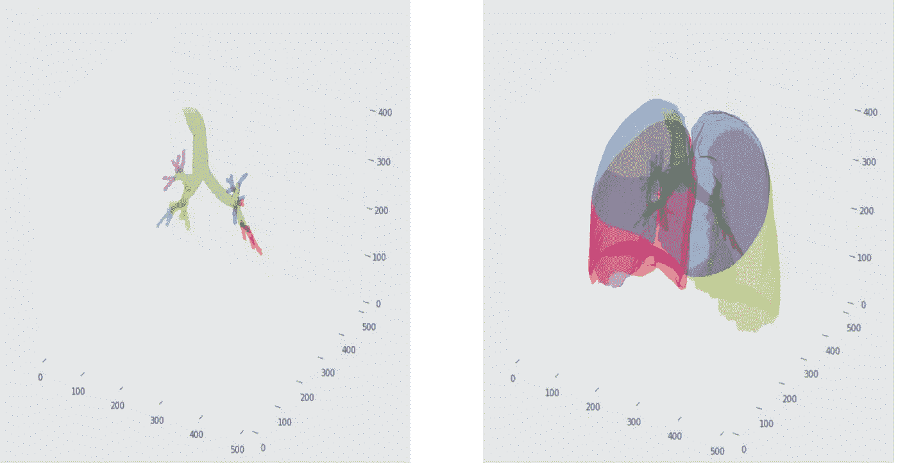

# 人工智能在人类肺部成像中的新兴角色

> 原文：<https://towardsdatascience.com/the-emerging-role-of-artificial-intelligence-in-human-lung-imaging-e914a8c2f936?source=collection_archive---------25----------------------->

## **人工智能评估肺叶的新方法**

抗击呼吸系统疾病是世界领导人和医疗保健系统的优先事项。包括发达国家在内，每年有数百万人死于呼吸系统疾病，尽管在这一问题上投入了巨大的社会利益。

新的人工智能(AI)技术在医疗保健领域的出现，通过提供辅助诊断和治疗计划的方法，增强了呼吸系统疾病的治疗前景。有了人工智能，呼吸医学的进步可能会以前所未有的速度加快，降低疾病死亡率，改善患者的生活质量。因此，实施新的人工智能工具来帮助临床医生的工作至关重要。

计算机断层摄影(CT)是横断面肺成像的主要形式，允许对肺和周围结构进行快速和高分辨率的评估。人工智能的最新发展支持 CT 图像分析自动化的更大范围。人工智能有望通过产生与人类观察者相当的更快、更便宜、更可靠的结果来改变这一领域。

肺叶分割是胸部图像解释中的一项重要任务，用于定位肺部的病变或其他成像发现。理解患者的肺叶解剖对于与肺和/或气管支气管树相关的疾病的诊断和治疗计划是至关重要的。

分割肺的可视化显示了气管、肺叶、肺段支气管和肺叶支气管[0]。

最近崛起，强大的人工智能方法概述了肺部图像分析新时代的到来。人工智能工具擅长看到和理解重要图像引导的模式，有助于提高呼吸领域的效率——改善诊断和治疗计划，让肺部学家花更多时间与患者在一起。因此，最近已经进行了各种尝试来开发自动分割技术。然而，在疫情之后，医疗保健尤其是放射系统的压力将继续存在，直到这些基于人工智能的方法被采用。

由于不同的呼吸系统疾病以不同的方式影响肺部结构，因此出现了肺叶分割的主要障碍。例如，新冠肺炎肺炎的影像表现与肺气肿非常不同。对于呼吸内科医生来说，准确的肺叶分割是至关重要的，以便适当地制定治疗计划。不准确的肺叶分割会给出关于疾病过程的误导性信息，从而导致错误的治疗决策。此外，大多数预先存在的基于人工智能的模型没有经过训练，无法准确辨别不同疾病在成像上的表现。结果，具有严重病理变化的肺叶的精确描绘仍然是一个未解决的任务。正因为如此，我们在患有各种疾病的患者身上测试了我们的模型，这些疾病包括肺癌、新冠肺炎肺炎、肺萎陷和肺气肿。

与由 Aboagye 教授领导的其他癌症成像中心(帝国理工学院)高级科学家一起，我们开发了一种人工智能驱动的多任务学习模型(MTL ),以解决设计中的这种需求。该模型并行运行各种(主要和辅助)相关任务。它利用了相关细分之间的共性，提高了模型的泛化能力。额外的任务用于分割气管支气管树以获得对感兴趣区域的更好的上下文理解。

虽然这项研究是由使用图像引导工具解决肺部疾病的需求驱动的，但我们也对探索模型同时处理两种肺组织的能力感兴趣，因为它们之间存在相关性。将 MTL 融入到我们的设计中，我们也受到了现实生活活动的鼓舞——开车、运动、骑自行车——在这些活动中，手眼协调经常在实践中一起学习，促进了任务学习。这个想法是想知道如果模型同时分割气道和肺会发生什么。

该项目是从以前的一项研究中发展而来的，该研究报告了即使在只有少量 ct 扫描的数据集上训练时也有特别好的结果。这一事实突出了该模型在处理看不见的数据时的泛化能力。我们通过在肺癌扫描上训练我们的模型并在新冠肺炎肺炎扫描上测试它来扩展这个概念。我们注意到这两种类型的 CT 扫描表现相似，尽管这两种类型的疾病的切片厚度和轴向切片非常不同。

该模型已在不同的 CT 扫描中使用和测试，包括来自 MosMedData 的扫描，其中包括具有新冠肺炎相关发现的患者。我们发现将肺分成独立的肺叶可以显著改善对患者新冠肺炎严重程度的评估。展望未来，我们预计该领域可以进一步探索我们的多组织分割设计，这有助于探测肺部健康状态。因此，我们的方法可能特别有趣，以适应不同的身体生命系统，其中针对其他疾病存在组织或器官的相关性。

这部作品有预印本:在[https://arxiv.org/abs/2105.05204](https://arxiv.org/abs/2105.05204)

我感谢我的合著者 Mitch Chen、Kristofer Linton-Reid、Joram Posma、Sue Copley 对该项目的重要贡献，该项目由帝国理工学院综合癌症成像中心主任 Eric O. Aboagye 教授领导。

**参考文献**

[0] Martell，Marc Boubnovski 等人，“开发一种用于计算机断层扫描肺叶分割的多任务学习 V-Net，并应用于患病肺。” *arXiv 预印本 arXiv:2105.05204* (2021)。