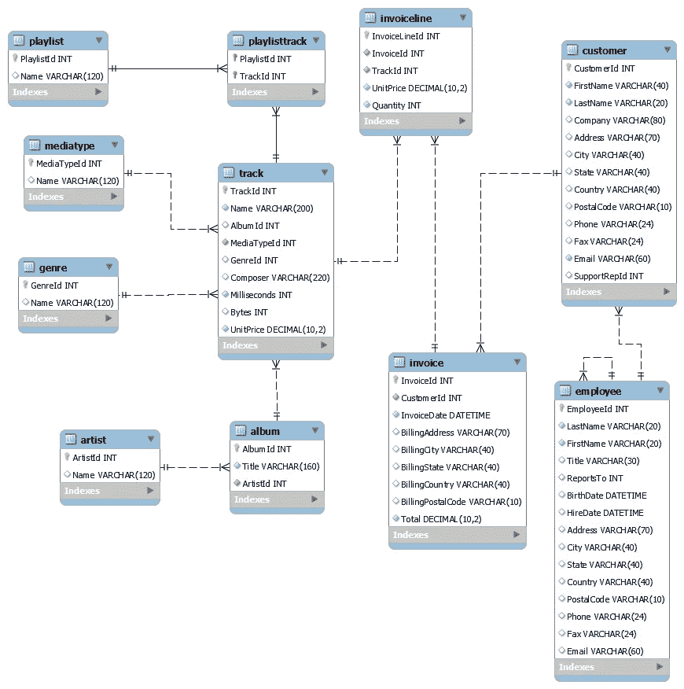
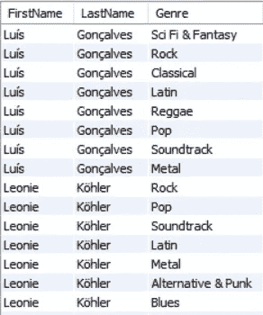
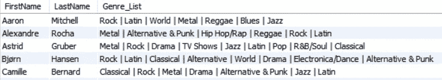
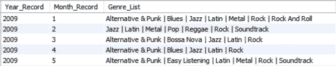
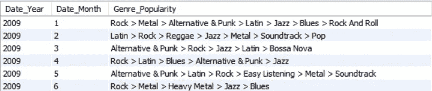
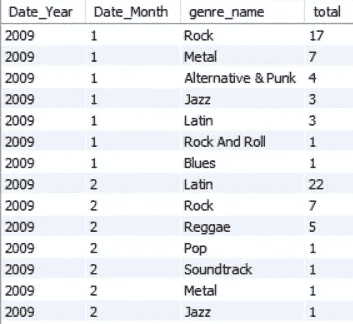
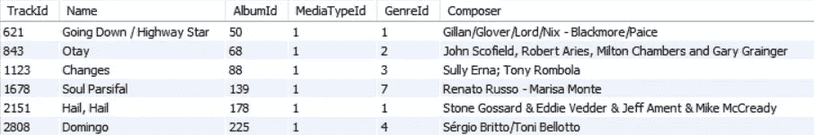

# 数据库规范化的敌人——用 SQL 将值分组到单个字符串中

> 原文：<https://towardsdatascience.com/the-enemy-of-database-normalization-grouping-values-into-single-string-with-sql-2294f40bb4d9?source=collection_archive---------11----------------------->

## *将 SQL 中的数据串联提升到下一个级别*


**图片由 PxFuel 提供**

如果你以前使用过 SQL 查询数据，你会注意到存储在关系数据库中的数据通常根据业务需要遵循潜规则“规范化”。1NF(第一范式)、2NF(第二范式)或 3NF(第三范式)是数据库开发人员或管理员经常听到的术语。创建任何新数据库的最基本规则是，每列每行都应包含一个值，并且数据集中不应有任何重复的行。虽然数据库开发人员更喜欢关系数据库始终遵循一些规范化标准，但数据分析人员可能会通过分组和组合信息来打破这些规则，以便进行更简洁、更有洞察力的分析。

因此，如果您正在通过与 SQL 交互来进行某种形式的即席数据分析以用于报告目的，了解如何以字符串格式将多个信息分组并连接在一个列下有时会对您的需求有所帮助。幸运的是，SQL 提供了几个高级函数，将简单的数据拼接任务提升到了一个新的水平。

根据您使用的 SQL 软件，这些功能特定于允许将数据分组和连接在一起作为单个任务的指定软件。实现相同目的的这些函数如下:GROUP_CONCAT、LISTAGG、ARRAY_AGG 和 STRING_AGG。对于本文，我将重点关注适用于 MySQL 和 SQLite 的 **GROUP_CONCAT** 函数。函数名本身意味着该函数根据特定属性将信息组合在一起，并将结果组合在一个字符串中。这个高级工具不同于 SQL 中通常的 CONCATENATE 函数，在该函数中，来自多个列的数据以单个字符串格式连接在一起。


**图片由 PxFuel** 提供

为了展示使用 GROUP_CONCAT 函数的好处，我将使用 MySQL 上的“Chinook”数据集，它代表一个数字媒体商店，其中包含来自 iTunes 的媒体相关数据。感谢 Luis Rocha 和 Brice Lambson 编译了这个适用于各种 SQL 软件工具的综合数据集。

您可以使用下面的 Github 链接找到关于样本数据集的更多细节:[https://github.com/lerocha/chinook-database](https://github.com/lerocha/chinook-database)

在我展示几个例子之前，下面的图 1 是这个数据库的模式图，以供参考:



**图 Chinook 数据库示意图(图片由 Eason Liaw 提供)**

您可能已经注意到，上面的模式图有点复杂，因为在这个数据库中连接了十多个表。下面的例子将涉及到使用上面的大多数表，所以请随意参考上面图 1 中的模式图，以便更容易理解 Chinook 数据库中各种表之间的关系。

**问题陈述 1:获取每个顾客购买的音乐流派列表，包括他们的名字和姓氏**

您可能想到的最初解决方案是使用带有 DISTINCT 关键字的简单查询来获得如图 2 所示的结果:



**图 2:前两个客户购买的所有音乐流派的记录(由 Eason Liaw 创建)**

```
SELECT **DISTINCT** FirstName, LastName, genre.name AS Genre FROM customer
INNER JOIN invoice USING (CustomerId)
INNER JOIN invoiceline USING (InvoiceId)
INNER JOIN track USING (TrackId)
INNER JOIN genre USING (GenreId)
```

虽然该查询返回为每个客户购买的所有音乐流派，但是从报告的角度来看，使用该查询的一个缺点是，该查询总共生成 440 行，并且为每个客户重复相同的 FirstName 和 LastName 值。对于分析师来说，这个缺点可能很难处理，因为这需要他们一次查看同一客户的多个记录，以了解他们的音乐流派偏好。

对于这个问题语句，更合适的方法是按照下面的查询使用 GROUP_CONCAT 函数来获得图 3 中的输出:

```
SELECT FirstName, LastName, **GROUP_CONCAT(DISTINCT genre.name ORDER BY CustomerId, InvoiceDate SEPARATOR ‘ | ‘)** AS Genre_List 
FROM customer
INNER JOIN invoice USING (CustomerId)
INNER JOIN invoiceline USING (InvoiceId)
INNER JOIN track USING (TrackId)
INNER JOIN genre USING (GenreId)
GROUP BY FirstName, LastName;
```



**图 3:前五名顾客购买的音乐类型列表(图片由 Eason Liaw 提供)**

请注意图 3 提供了比图 2 更简洁的信息，图 2 中的每一行都包含每个客户购买的所有音乐流派。GROUP_CONCAT 函数具有更好地表示分组数据的特性，除了使用默认的逗号分隔符之外，还可以指定如何分隔分组元素。

上面的查询将显示的记录数量从 440 条减少到 59 条，这样每个客户都有一个显示他们所有音乐流派偏好的值。值得强调的是，对于这个查询，每个客户偏好的流派列表是从最早到最晚的发票日期，这是在 GROUP_CONCAT 函数内的 ORDER BY 子句中指定的。

**问题陈述 2:获取所有客户每年、每月购买的音乐流派列表。**

假设下面的图 4 是这个问题陈述的期望输出:



**图 4:2009 年前 5 个月所有客户购买的音乐类型列表(由 Eason Liaw 创建)**

使用类似上面问题陈述 1 的 GROUP_CONCAT 函数，下面的查询提供了如图 4 所示的输出:

```
SELECT YEAR(InvoiceDate) AS Year_Record, MONTH(InvoiceDate) AS Month_Record, **GROUP_CONCAT(DISTINCT genre.name SEPARATOR ' | ')** AS Genre_List FROM invoice
INNER JOIN invoiceline USING (InvoiceId)
INNER JOIN track USING (TrackId)
INNER JOIN genre USING (GenreId)
GROUP BY YEAR(InvoiceDate), MONTH(InvoiceDate);
```

通过使用简单的日期函数提取 InvoiceDate 变量的年份和月份部分，该查询提供了这个问题陈述的解决方案。注意，对于这个问题语句，在 GROUP_CONCAT 函数中不一定需要 ORDER BY 子句，因为体裁的顺序并不重要。

**问题陈述 3(更具挑战性):使用第二个问题陈述，获得所有客户每年和每月购买的音乐流派列表，从最流行到最不流行的音乐流派排序。**

我建议你先自己尝试一下这个问题，然后再参考下面我的 SQL 解决方案进行挑战。这是图 5 中这个问题陈述的期望输出:



**图 5:2009 年前 6 个月顾客购买的音乐类型列表，按流行度排序(图片由 Eason Liaw 提供)**

这个问题语句需要 GROUP_CONCAT 函数和使用子查询的组合来解决。顺便说一下，您可以参考我下面的另一篇文章，了解在大数据上使用子查询的 SQL 性能的更多细节。

[](https://medium.com/@EasonLiawYiXian/sql-performance-of-window-functions-vs-subqueries-on-big-data-3fa533fc64bf) [## 大数据上窗口函数与子查询的 SQL 性能

### 使用窗口函数提高查询性能。

medium.com](https://medium.com/@EasonLiawYiXian/sql-performance-of-window-functions-vs-subqueries-on-big-data-3fa533fc64bf) 

通常，当你遇到这种涉及多个步骤的问题陈述时，我喜欢把这个问题陈述分成如下几个部分:

1.  统计在相应年份和月份购买每种音乐类型曲目的客户数量，然后将结果从最受欢迎到最不受欢迎排序
2.  按照年份和月份对第 1 点的结果进行分组，然后按照客户数量(受欢迎程度)从高到低排序，显示与相应年份和月份相关的所有流派。

为了解决上面的第一点，下面是一个查询，其输出如图 6 所示:



**图 6:第一步获得图 5 结果的结果(图片由 Eason Liaw 提供)**

```
SELECT YEAR(InvoiceDate) AS Date_Year, MONTH(InvoiceDate) AS Date_Month, genre.name AS genre_name, **COUNT(*) AS total** FROM invoice
INNER JOIN invoiceline USING (InvoiceId)
INNER JOIN track USING (TrackId)
INNER JOIN genre USING (GenreId)
**GROUP BY YEAR(InvoiceDate), MONTH(InvoiceDate), genre.name**
**ORDER BY Date_Year ASC, Date_Month ASC, total DESC**
```

通过将上面的查询视为子查询，下面的查询获得了上面图 5 所示的输出。

```
SELECT Date_Year, Date_Month, **GROUP_CONCAT(DISTINCT genre_name ORDER BY total DESC SEPARATOR ' > ')** AS Genre_Popularity
**FROM(**
SELECT YEAR(InvoiceDate) AS Date_Year, MONTH(InvoiceDate) AS Date_Month, genre.name AS genre_name, COUNT(*) AS total FROM invoice
INNER JOIN invoiceline USING (InvoiceId)
INNER JOIN track USING (TrackId)
INNER JOIN genre USING (GenreId)
GROUP BY YEAR(InvoiceDate), MONTH(InvoiceDate), genre.name
ORDER BY Date_Year ASC, Date_Month ASC, total DESC
**)** **result1**
**GROUP BY Date_Year, Date_Month**
```

值得一提的是，使用“>”符号定制 GROUP_CONCAT 函数中的分隔符特性，可以看到每年和每月的音乐流派从最流行到最不流行排序。如果不使用 GROUP_CONCAT 函数，您将不得不参考上面总共有 351 行的图 6 来了解每年和每月音乐流派的流行程度，从报告的角度来看，这可能很繁琐。

基于以上所有三个问题陈述，从 SQL 查询中观察到的一个共同特征是，使用 GROUP_CONCAT 函数需要 GROUP BY 子句来实现期望的结果。这两个关键字都有助于执行这种高级的即席数据分析。

既然我已经向您展示了 GROUP_CONCAT 函数如何有助于特定类型的即席数据分析，那么有必要了解为什么在使用 SQL 数据库时不应该滥用 GROUP_CONCAT 函数。虽然使用这种高级串联函数可以更简洁地提供洞察力，但是这些函数不符合数据库开发者和管理员希望遵循的数据库规范化规则。


**图片由来自 Pixabay 的 dschap 提供**

再次强调这一点，关系数据库的列应该只包含每条记录的一个值。GROUP_CONCAT 函数打破了任何给定关系数据库的这一最基本的规则，这就是为什么在使用关系数据库时，您不常看到多个值组合在一个列下。除非在表视图中经常查询这种格式的组合信息(在以后的文章中会有更多的细节)，否则在关系数据库中很少会看到这种情况。

从数据库维护的角度来看，维护同一列下的这种组合信息的一致性可能非常具有挑战性，尤其是在处理大型数据集时。使用相同的 Chinook 数据集，其中多个数据存储在同一列下的一个列是 tracks 表中的 composer 列，如下图 7 所示:



**图 7:曲目表中的六个随机行，作曲家栏使用不同的分隔符(图片由 Eason Liaw 提供)**

请注意，这里使用了各种分隔符(例如“/”、；)、“&”和“-”)，其中表示产生特定轨道的所有作曲者的字符串不一致。使用正则表达式查询特定作曲家创作的曲目并不困难。然而，更新作曲者的字符串带来了某些作曲者姓名出现打字错误的风险，使得关系数据库将不能容易地检测到这样的错误。例如，如果我键入“Toni Belotto”而不是“Toni Bellotto”作为新曲目记录的作曲家，数据库不会将更新操作标记为错误。数据库开发人员认为这种情况很危险，因为无法确定在记录中捕获的相同信息在所有其他行中是否一致。

我更愿意将与曲目的作曲者相关的信息存储在一个单独的表中，将作曲者的字符串拆分成它的元素，以减少在曲目表中存储重复数据的冗余。否则，获取每张专辑的字符串格式的作曲家列表可能会非常困难，因为需要考虑各种类型的分隔符及其组合来标识作曲家的唯一名称。


【pxhere.com 图片由穆罕默德·哈桑拍摄

您可能不想使用 GROUP_CONCAT 函数等高级串联函数的另一种情况是，使用从获得的查询中获得的结果来构建机器学习或深度学习模型。为了将这些参数传递到机器学习或深度学习模型中，串联的信息需要分裂成其元素，以便这些模型工作。例如，处理日期需要分成年、月和日，这样模型才能工作。目前，我不会深入研究机器学习或深度学习模型，但你可能会在未来的文章中听到更多。

因此，最重要的是要理解，虽然我在本文中讨论的这些高级串联函数对于特定的数据报告目的很方便，但是了解使用从查询中获得的结果的目的也是非常重要的。如果查询结果将用于新的数据库部署或构建新的机器学习模型，您可能不喜欢使用这种高级连接方法。如果你以一种适合他们需求的格式来展示你的结果，你的利益相关者将会非常感激。

因此，我鼓励您自己探索更多关于高级串联函数的用例。此外，从数据库开发人员的角度理解数据库规范化规则将使您在从关系数据库中检索用例数据或与数据库开发人员一起工作时更好地了解它。

下次再见，祝 SQL 查询愉快！:)