# 理解量子计算的入门

> 原文：<https://towardsdatascience.com/the-entry-to-understanding-quantum-computing-517f9d60f0fd?source=collection_archive---------5----------------------->

## 了解哈达玛转换门

量子机器学习要不要入门？看看 [**动手量子机器学习用 Python**](https://www.pyqml.com/page?ref=medium_hadamard&dest=/) **。**

哈达玛门是量子计算的基本变换门之一。我想说没有它就没有量子电路。这是因为阿达玛门允许量子位远离基态向量|0⟩和|1⟩.

# 基态的量子位

处于|0⟩或|1⟩基态的量子位，几乎和经典位一样。|0⟩状态下的量子位是 0，而|1⟩状态下的量子位是 1。一直都是。

你甚至可以用这两种状态的量子比特工作，你不会看到任何你用经典比特做不到的事情。例如，让我们考虑异或运算符(⊗)。你可以在经典的真值表中进行推理。

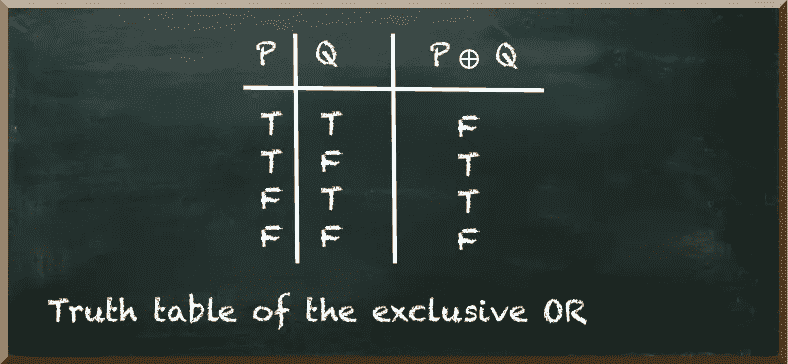

以下量子电路实现了𝑃和𝑄为 1 的异或运算(⊗)。

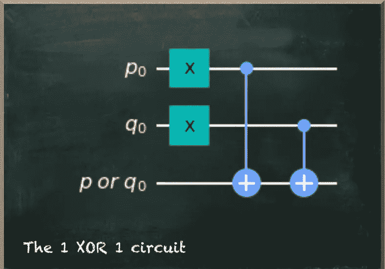

x 门将两个输入量子位放入|1⟩.状态对于任一处于|1⟩.状态的输入量子位，cnot-gate 将目标量子位从|0⟩翻转到|1⟩如果两个输入量子位都在|1⟩状态，一个不会把目标翻转到|1⟩，另一个会把它翻转回|0⟩.

该电路的测量概率证实了这一点。正如我们看到的，当𝑃和𝑄是 1，那么𝑃⊗𝑄是 0。

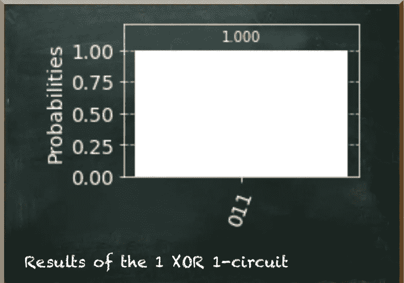

```
Note: The qubits read from right (upper) to left (lower). The output qubit is at the left.
```

# 叠加态的量子比特

当我们通过应用哈达玛门将输入的量子位叠加时，事情变得有趣起来。让我们先来看看当我们在单个量子位上应用哈达玛门时会发生什么。

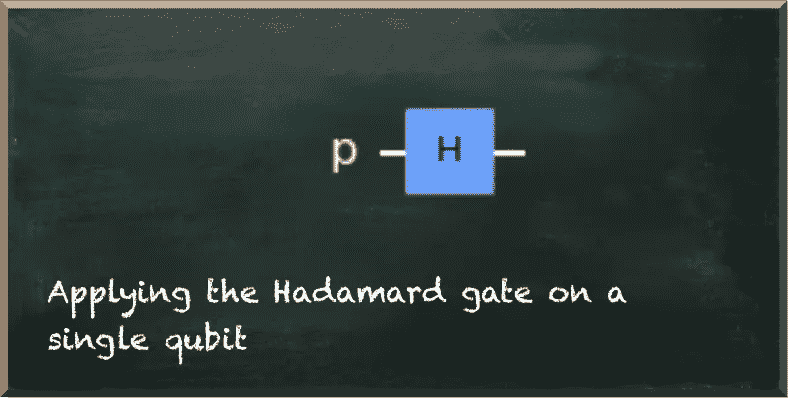

当我们运行这个电路时，我们测量量子位为 0 或 1。各有 50%的概率

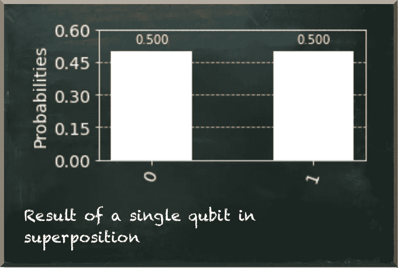

而且，我们可以用叠加态的量子位来同时计算各种状态。在下面的电路中，我们没有将输入量子位放入|1⟩态，但是我们对它们应用了哈达玛门。

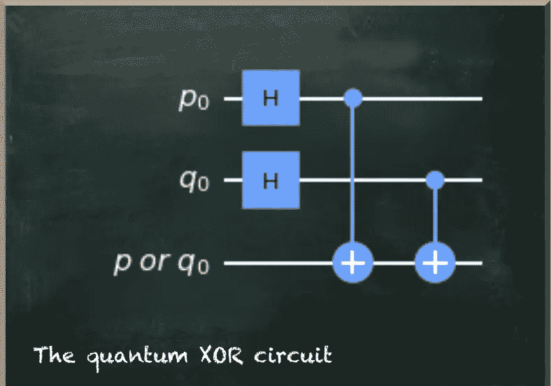

这个量子电路同时产生所有四种可能的状态。当我们只运行一次电路时，我们会得到四种可能状态中的任何一种。但是，输出量子位总是代表𝑃⊗Q.

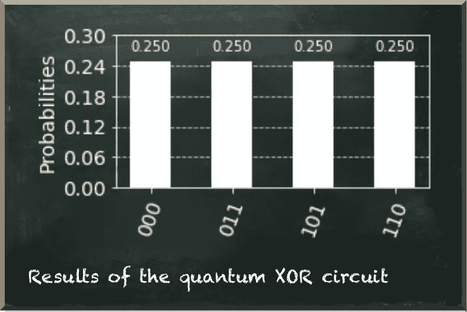

# 哈达玛之门会自动恢复

哈达玛门还有另一个特点。它会恢复原状。

下面的电路描绘了一个|0⟩态的量子位，我们对它应用了两个哈达玛门。

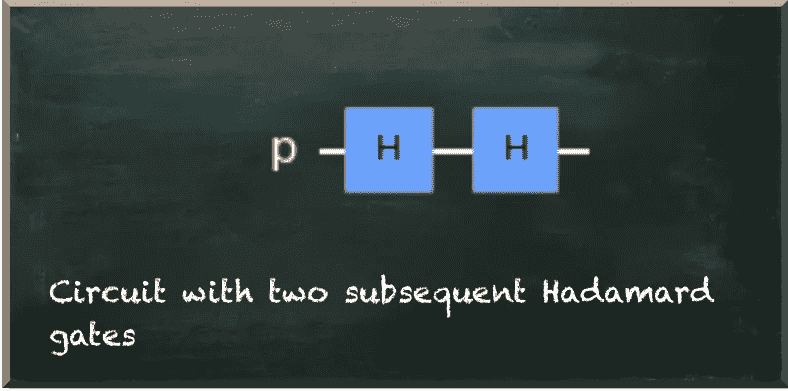

我们看到量子位回到了|0⟩.状态我们总是把它衡量为 0。

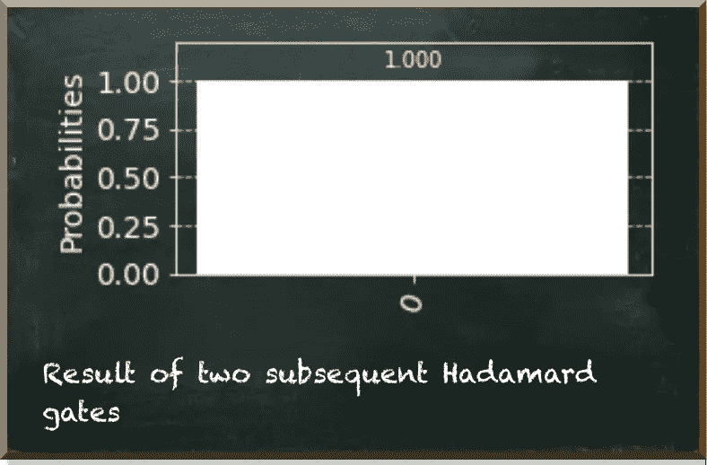

# |+⟩和|−⟩

如果我们只看一个量子比特的测量概率，我们是在|0⟩态的一个量子比特上应用哈达玛门还是在|1⟩.态的一个量子比特上应用哈达玛门并不重要下面的电路在应用哈达玛门之前将量子位放入|1⟩。

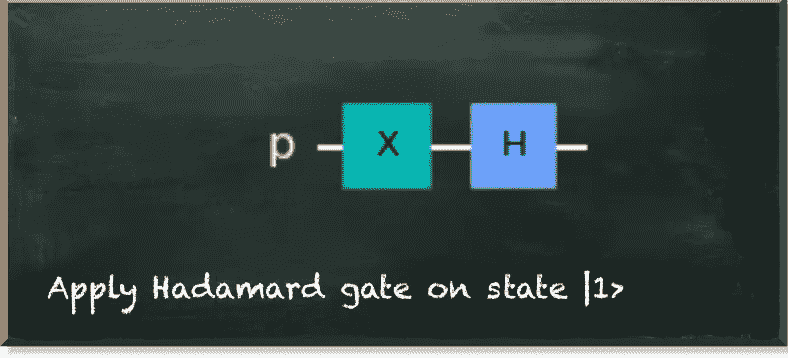

正如我们所看到的，当我们在|0⟩.态的量子位上应用哈达玛门时，结果是一样的

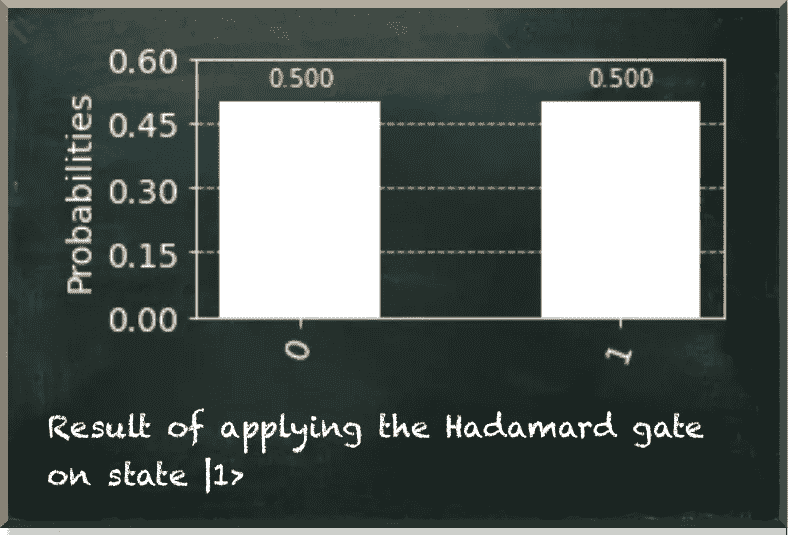

但是这两个州是不同的。

哈达玛门把|0⟩变成了|+⟩，把|1⟩变成了|−⟩.

要了解这些状态之间的差异，我们需要看看量子位的图形表示——布洛赫球。

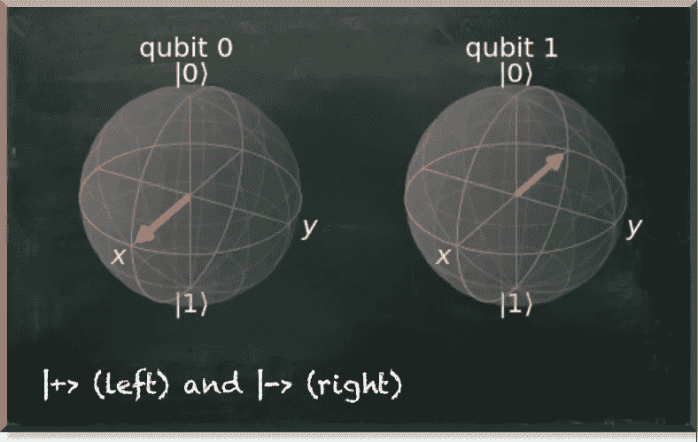

在布洛赫球中，量子位状态向量和球的两极之间的距离决定了测量量子位为 0 或 1 的概率。对于这两个国家来说，|+⟩和|−⟩都位于赤道上。它们到两极的距离是一样的。

但是有必要区分|+⟩和|−⟩，因为哈达玛门是可逆的。当我们在|0⟩州应用它两次时，我们希望再次得到|0⟩州的结果。但是如果我们在|1⟩州应用它两次，我们希望它再次在|1⟩出现。

这就是哈达玛门的作用。

下面的电路在两次应用哈达玛门之前将量子位放入|1⟩。

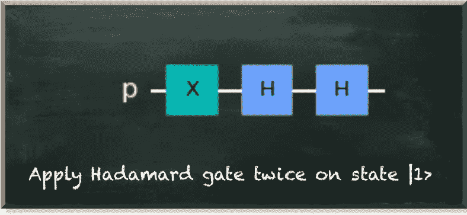

结果是|1⟩态的一个量子位，我们总是测量它为 1。

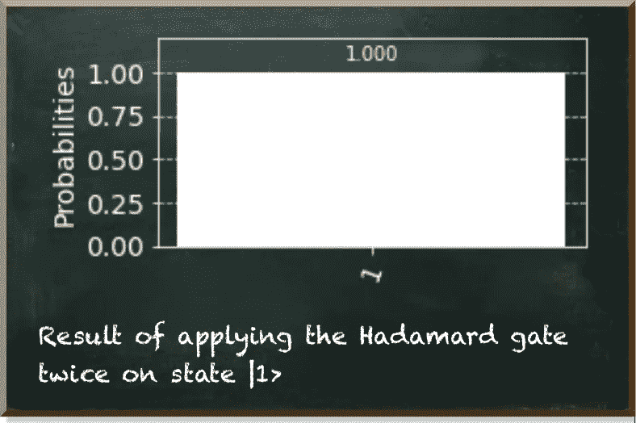

# 在|+⟩和|−⟩之间转换

|+⟩和|−⟩是两个不同的量子态，哈达玛门告诉我们它们是不同的。

但是我们不仅可以通过哈达玛门到达这些州。我们还可以通过应用 Z-gate 在|+⟩和|−⟩之间切换。

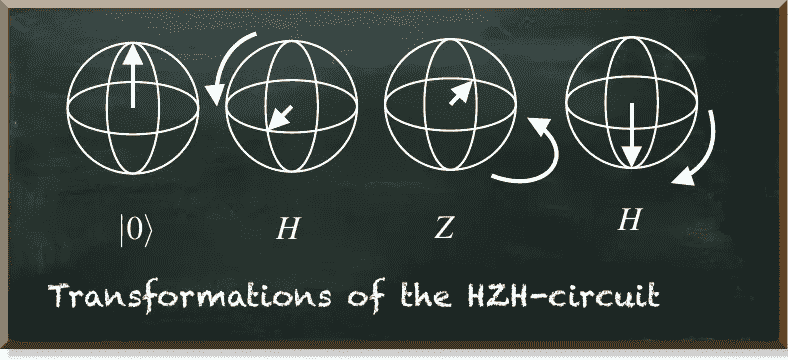

这是量子算法中的一个基本概念。

许多著名的算法，如 Deutsch 的、Bernstein-Vazirani 的和 Simon 的算法，使用 Hadamard 门将量子位放入|+⟩.状态然后他们将一些量子比特从|+⟩翻转到|−⟩(当然是以一种有意义的方式)。最后，他们再次在量子位上应用哈达玛门。因此，我们将一些量子位测量为 0，而将另一些量子位测量为 1——这样我们就有了一个结果。

**为什么我们不直接把量子位从** |0⟩ **放到** |1⟩ **以一种有意义的方式呢？**

你已经看到答案了。你还记得我们对叠加态的量子位进行异或运算吗？我们能够一次计算出所有可能的状态。这就是量子优势的来源。

# 结论

哈达玛门在量子计算中至关重要。它将量子位置于叠加态——这是利用量子优势的基础。

此外，哈达玛门生动地说明了量子计算的一些概念。例如，它表明量子门必须是可逆的，并且在量子态中有比测量概率更多的东西。

最后，哈达玛门是最重要的量子算法的基础。这些算法建立在将量子位从|+⟩翻转到|−⟩的能力上，从而产生给定问题的解决方案。

量子机器学习要不要入门？看看 [**动手量子机器学习用 Python**](https://www.pyqml.com/page?ref=medium_hadamard&dest=/) **。**


在这里免费获得前三章。