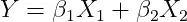
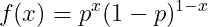
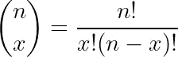
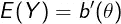
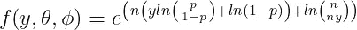
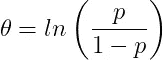
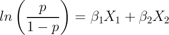
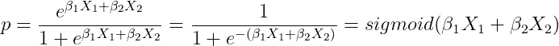

# 逻辑回归的起源

> 原文：<https://towardsdatascience.com/the-essence-of-logistic-regression-e9188625cb7d?source=collection_archive---------28----------------------->

## 用广义线性模型解释逻辑回归的起源

布雷特·乔丹在 [Unsplash](https://unsplash.com?utm_source=medium&utm_medium=referral) 上的照片

[**逻辑回归**](https://en.wikipedia.org/wiki/Logistic_regression) 是几乎每个数据科学家都在使用的一种无处不在的算法。然而，尽管它已经广为人知并得到了实施，但许多实践者仍然没有完全理解它的起源。在我的[上一篇文章](/poisson-regression-and-generalised-linear-models-606fe5f7c1fd)中，我讨论了[**【GLMs】**](https://en.wikipedia.org/wiki/Generalized_linear_model)以及它们与机器学习算法的联系。我建议现在的读者浏览一下那篇文章，以便对 GLMs 有一个全面的了解。然而，简而言之，GLMs 为目标变量**非正态分布**提供了一个理论框架。在本文中，我们将使用 GLMs 推导逻辑回归，以显示它的确切来源。

# 例题和动机

逻辑回归的目的是在给定一些特征的情况下，为发生的事件或属于某一类别的样本分配一个**概率。这类似于一个**布尔值输出。****

一个示例问题是确定学生是否通过考试。让我们将通过(成功)指定为 **1** ，将失败指定为 **0** 。现在，让我们假设我们知道他们为考试学习了多长时间，称这个为 ***X_1*** ，以及他们是否通过了之前的考试 ***X_2*** 。因此，我们可以把这个问题表述为:

作者在 LaTeX 中生成的方程。

其中 ***Y*** 为目标，那个**应该**取值在 **0** 和 **1 之间，**和 ***β*** 值是我们需要计算的**未知系数**来拟合模型。然而，你看到上面等式的问题了吗？**无法保证输出会在 0 和 1 之间。**花在学习上的时间， ***X_1*** *，*可以取从 **0** 到**无穷大**的值，这样我们就可以得到一个大于 **1 的 ***Y*** 值。这不好，会让我们的模型变得荒谬。**

因此，我们需要找到一种方法，或者更好的一个**函数**，来满足我们的目标变量**的要求。**可以使用 GLMs 的数学框架找到该函数。

# 伯努利和二项式分布

上述问题所需的输出由 [**伯努利分布**](https://en.wikipedia.org/wiki/Bernoulli_distribution) 满足。这种分布用两种可能的结果计算某个试验的概率，**成功或失败。**例如，抛硬币是否会落在人头上。人们通常将**成功**的概率指定为 *p，* ，因此 **失败**的概率为**1–p**。

伯努利分布的概率质量函数为:

作者在 LaTeX 中生成的方程。

其中 ***x*** 是成功试验的**次数**， ***p*** 是成功试验的**概率**。

伯努利分布是二项分布的**特例，其中我们有**个多次试验**，用 ***n*** 表示，因此可以有**个以上的成功试验**。二项式分布的**概率质量函数**为:**

作者在 LaTeX 中生成的方程。

这与伯努利分布的函数相同，只是我们现在乘以由下式给出的**二项式系数**:

作者在 LaTeX 中生成的方程。

这些系数计算在*试验中有***【x】****种结果的方式(排列)的数量。这些系数出现在 [**帕斯卡三角****组合学**](https://en.wikipedia.org/wiki/Binomial_coefficient) **等许多自然现象中。****

# **GLMs 和链接功能**

**GLMs 可用于确定**将输入“链接”到所需分配输出**的功能。GLM 理论框架要求目标变量分布是指数族的一员，该指数族由以下**概率密度函数**给出:**

****

**作者在 LaTeX 中生成的方程。**

**其中， **θ** 为**自然参数，**即为**与均值挂钩，****φ**为**标度参数**，即**与方差**挂钩。此外， **a(φ)** 、 **b(θ)** 和 **c(y，φ)** 是需要计算的附加函数。**

**可以通过数学推导得出，指数族的**均值、 *E(Y)、*和方差、 *Var(Y)* 、**由下式决定:**

****

**作者在 LaTeX 中生成的方程。**

****

**作者在 LaTeX 中生成的方程。**

**这些公式只是为了完整性而给出的，对于这个推导来说并不是必需的。同样，这个理论框架在我的[上一篇文章](/poisson-regression-and-generalised-linear-models-606fe5f7c1fd)中有更详细的解释。**

# **二项分布的链接函数**

**实际上，二项式分布是指数族的一员，可以用要求的格式写成:**

****

**作者在 LaTeX 中生成的方程。**

**通过将二项式公式的系数**与指数族公式的系数**进行匹配，我们得出结论:**

****

**作者在 LaTeX 中生成的方程。**

**你认识这个等式吗？上述函数被称为 **Logit 函数**，是二项式/伯努利分布的**圆锥形连接函数**。作为参考，上面的 ***p*** 值是输出变量 ***Y*** 等于**1*****P = P(Y = 1)****的**概率**。***

**因此，对于具有二项式/伯努利分布的目标变量,**数学推导的关联函数是 Logit 函数**。这就是为什么叫 **Logistic 回归！****

**回到我们上面设置的学生是否通过考试的问题。我们现在可以使用 **Logit 函数**修改我们之前的等式:**

****

**作者在 LaTeX 中生成的方程。**

**重新排列:**

****

**作者在 LaTeX 中生成的方程。**

**我们推导出了著名的 [**Sigmoid 函数**](https://en.wikipedia.org/wiki/Sigmoid_function) ！这个新的等式现在确保了无论我们的输入取什么值，输出总是在 0 和 1 之间！**

# **结论**

**我希望你喜欢上面的文章，并对逻辑回归的起源有所了解。我省略了相当多的数学细节，因为有些推导已经非常详尽了！因此，请随意进一步探讨这个话题，以获得更好的直觉！**

# **和我联系！**

*   **要在媒体上阅读无限的故事，请务必在这里注册！ 💜**
*   **[*想在我发帖注册时得到更新的邮件通知吗！*T45*😀*](/subscribe/@egorhowell)**
*   **[*领英*](https://www.linkedin.com/in/egor-howell-092a721b3/) 👔**
*   **[*碎碎念*](https://twitter.com/EgorHowell) 🖊**
*   **[*github*](https://github.com/egorhowell)*🖥***
*   *****🏅*****

> ***(所有表情符号都是由 [OpenMoji](https://openmoji.org/) 设计的——开源的表情符号和图标项目。执照: [CC BY-SA 4.0](https://creativecommons.org/licenses/by-sa/4.0/#)***