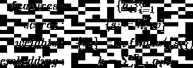
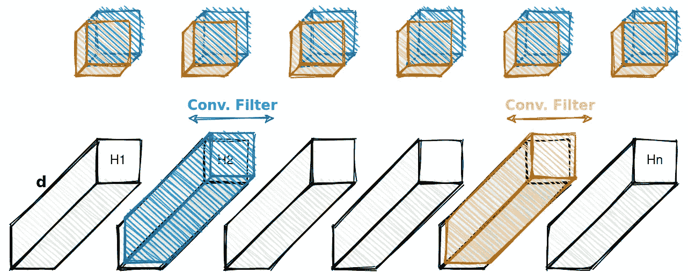
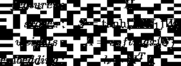
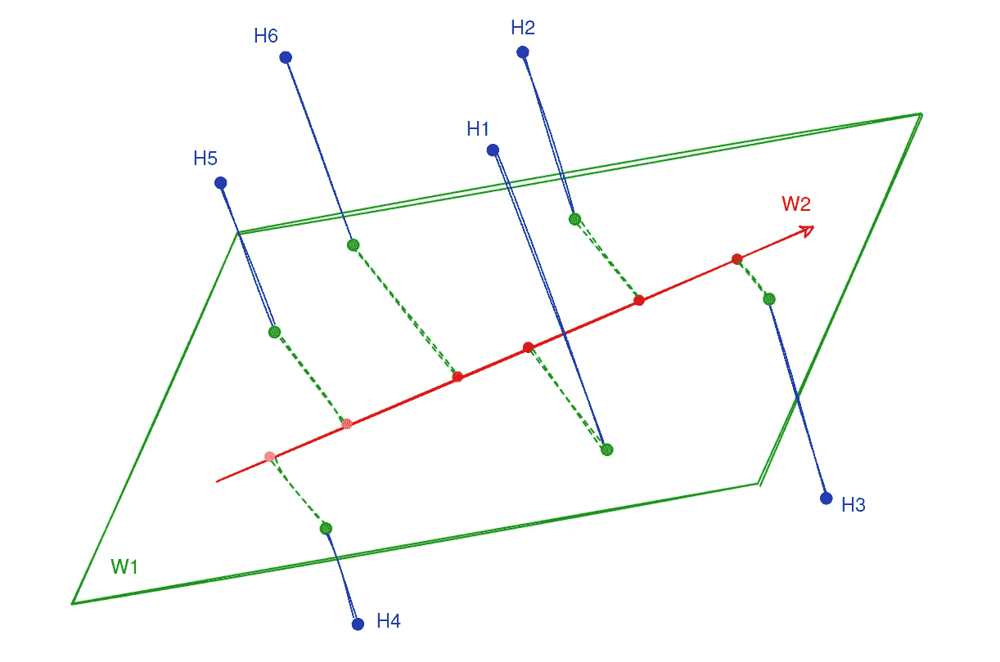
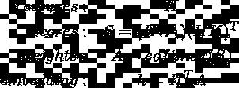
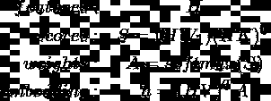

# 变形金刚的本质

> 原文：<https://towardsdatascience.com/the-essence-of-transformers-9fb8e14cc465?source=collection_archive---------27----------------------->

## [实践教程](https://towardsdatascience.com/tagged/hands-on-tutorials)，深度学习

## 到底什么是自我关注(层),它是如何基于 CNN 和混合专家

由 [Sereja Ris](https://unsplash.com/@kimtheris?utm_source=medium&utm_medium=referral) 在 [Unsplash](https://unsplash.com?utm_source=medium&utm_medium=referral) 上拍摄的照片

学习序列数据是机器学习中的一个重要问题，它出现在许多应用中，如时间序列分析和自然语言处理。以前，RNN 和 LSTM 是这一领域最受欢迎的模型，而现在，具有自我关注的变压器是 NLP 应用程序的最先进的模型。

在这篇文章中，我将站在变形金刚创造者的角度，重新思考这个问题。首先，我将定义主要的挑战:*在固定维度的特征向量中总结一个序列。*然后，我来解释一下自我关注的解决方案:*加权平均其中加权函数是带 1x1 卷积滤波器的 CNN*。我将继续变形金刚的想法:*使用自我关注作为神经网络的一层，并保持合理的参数数量*。最后，我将说明这个问题与混合专家有什么相似之处。我将试着把重点放在主要的想法上，把细节和实现问题留给你在网上能找到的很多很棒的教程。

# 问题定义

假设我们已经观察到一系列 *n* *d* 维数据(可以是原始输入或提取的特征)，我们想要**聚集**他们的信息并估计输出。例如，考虑一个 RNN，它取一个有 *n* 个单词 *(x₁,…,xₙ)* 的句子作为输入，将它们转换到一个隐藏向量空间，得到*n**d*-维度特征 *(h₁,…,hₙ)* ，取所有特征 *(h)* 的平均值，最后估计标签。在这个例子中，聚合(或压缩或汇总)是通过平均来完成的: *h = avg(h₁,…,hₙ).问题是除了简单地取平均值，我们还能做什么？*

我想到的第一个想法是连接这些特征以不丢失任何信息，建立一个*和*维度向量，并在其上使用一个完全连接的层。但是通过这种方式，我们应该学习 *O(nd)* 个参数，这些参数对于长序列来说可能太大了。实际上，我们希望参数的数量与 *n* 无关，这样我们就可以支持任意长度的序列。这个问题的两个经典解决方案是取平均值*(h =avg(h₁,…,hₙ)*，或者使用最新的特性 *(h = hₙ)* (它是 RNNs 中所有先前特性的总结)*。*这两种方法都产生了 *O(d)* 个参数，但具有不同的*加权函数*:后者认为所有特征的权重相等，而前者将所有权重赋予最新的特征。然而，特征的重要性可能因输入而异(例如，句子开头的单词*恶心*可能足以将其标记为负面)。**自我关注是*学习*一个加权函数**的方法，让特征自己决定它们的重要性。

# 自我关注

现在是构建加权函数的时候了，该函数将一系列特征作为输入，并为平均化设置它们的权重[1]。最简单的解决方案是使用一个固定的线性变换，这只是一个点积，然后将评估的分数归一化为 1:

其中 *w* 是应该学习的固定线性变换。所以那些真正想成为重要的特性，就要向 *w* 的方向看齐，打造更大的点积。 *w* 也可以看作是一个 *1x1* 卷积滤波器应用在一个 *1xn* 深度为 *d.* 的图像上

图一。应用两个 1x1 卷积滤波器(图片由作者提供)。

但是为什么只考虑一个方向(滤波器)和一个简单的线性变换呢？让我们把它做成 *k* 方向(见图 1。)并添加简单的非线性来学习更复杂的函数:

在这里，我刚刚使用了矩阵符号: *H* 是 *nxd* (每一行都是 hᵢᵀ中的一个) *W₁* 是 *dxk* (每一列都是一个方向像 *w* )，W₂是*kx1*(*最终变换)，所以 *S* 和 *A* 都是现在我们要用 *k(d+1)* 参数学习 *W₁* 和W₂(查图 2 举例。).*

**

*图二。三维空间中 n=6 个特征的例子。W1(具有 2 个方向)将点转移到 2 维子空间，W2(子空间中向量)设置特征权重；H3 和 H4 的权重分别最高和最低。*

*通过这种方式，我们正在学习关注序列中的某个特定片段。为什么不专注于不同的部分，同时学习 *p > 1* 加权函数呢？为此，将 *W₂* 从 *kx1* 改为 *kxp* 就足够了，之后，我们得到*恩智浦*得分矩阵 *S* 、*恩智浦*权重矩阵 *A* ，以及 *dxp* 嵌入矩阵 *h* 。这相当于添加另一个具有 *p* 滤波器的 *1x1* 卷积层，从而产生两层 CNN。通过这种方式，我们实际上是在学习选择最重要的特性，并将它们连接在一个嵌入矩阵中(与连接所有不切实际的特性相比)。*

*因此，自我关注加权函数是利用 CNN 权重共享特性的两层 **CNN** ，并且**个参数是 *k(d+p)*** ，其中 *d* 是初始维度， *k* 是第一层中过滤器的数量， *p* 是关注点的数量。*

# *变形金刚(电影名)*

*到目前为止，我们已经看到了自我关注的核心思想，即学习具有合理数量参数的参数加权函数。但那只是聚合函数的扩展。*然而，也许我们可以把它作为一个独立的特征提取器，因为它接受一个 n 维向量序列，并把它转换成一个 p 维向量序列。然后，如果我们可以使用这个特征提取器作为神经网络的一层呢？也许以后会变得更深？**

*我想，它们是[2]的作者在设计变形金刚和创造**自我关注层**时的想法。他们想去掉 rnn，用一个堆叠的自我关注层代替它们。还有一个重要的挑战需要解决:*参数的数量*。直观上，我们应该能够集中于较低层中的 *p=n* (或 *O(n)* )元素，如果是这样，参数的数量将是 *k(d+n)* ，这取决于 *n* 。*

*为了克服这个挑战，一个很好的想法被采用:设置 p=n， *W₂* 是一个 *kxn* 矩阵，有许多*个*参数，我们应该以某种方式减少它。所以让我们把它分解到 *(HK)ᵀ* ，其中 *H* 是原始的 *nxd* 矩阵， *K* 是一个 *dxk* 矩阵。合并 *H* 导致参数数量大幅减少，我们只需学习矩阵 *K* 和 *kd* 个元素。移除 *tanh* 函数，我们可以将公式重写如下:*

**

*另一个小扩展:输入维是 *d* ，在之前的版本中我们也得到一些 *d* 维的输出向量；让我们也将输入维数从 *d* 减少到 *k* (滤波器数量)，并通过将嵌入公式改为 *h=(HV)ᵀA* 得到 k 维*t37】输出，其中 *V* 是*t43】a*dxk*矩阵:***

那是变形金刚！无论你在[2]中看到的是实现的细节和符号的变化:名称*hw₁*t48】查询，*hk*t52】键，以及*HV*t56】值矩阵。现在**的参数数量是 *3dk*** 其中 *d* 和 *k* 分别是输入和输出向量的维数，在对一系列 *n* *d* -dim 向量应用自关注层之后，我们得到一系列 *n* *k* -dim 向量如你所见，参数的数量与 *n* 无关，我们可以堆叠自我关注层，构建一个深度模型，这就是 transformer。我不打算深究实现细节，并建议感兴趣的读者去看[3]。

# *专家混合

MoE 的想法是基于不同专家的意见进行判断:对于任意输入值，收集所有专家的意见，并取其加权平均值，其中权重基于该输入区域的专家专业水平。例如，在回归问题中，在一些区域中，输出可能更多地是输入的线性函数，而在其他一些区域中更多地是二次函数。MoE 关心的是如何同时学习专家本身和加权函数(这里称为门控网络)。

现在假设 *h₁,…,hₙ* 是不同专家的意见，自我关注是基于特征值设置权重的门控网络。这个想法是相同的，注意力加权网络是基于它们的值来选择特征的重要性级别。此外，它非常类似于混合密度网络，其中使用神经网络预测混合系数(参见[4]中的 5.6 和 14.5.3)。

# 参考

[1]林，，等.“一个结构化的自注意句嵌入”ICLR。2017.

[2]瓦斯瓦尼、阿希什等人，“你所需要的只是关注。”乳头。2017.

[3] [图文并茂的变形金刚](http://jalammar.github.io/illustrated-transformer/)

[4] Bishop，Christopher M. *模式识别和机器学习*。斯普林格，2006 年。