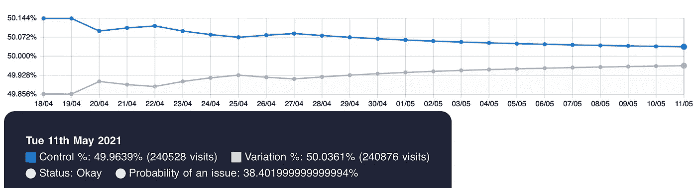
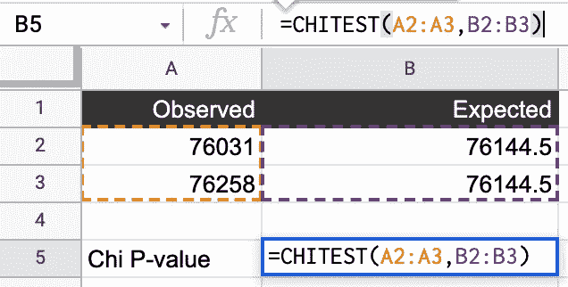
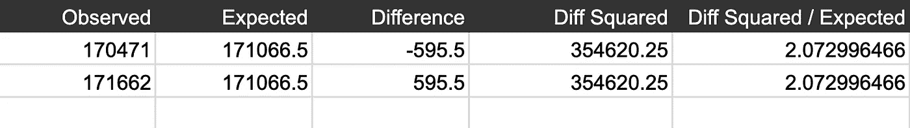
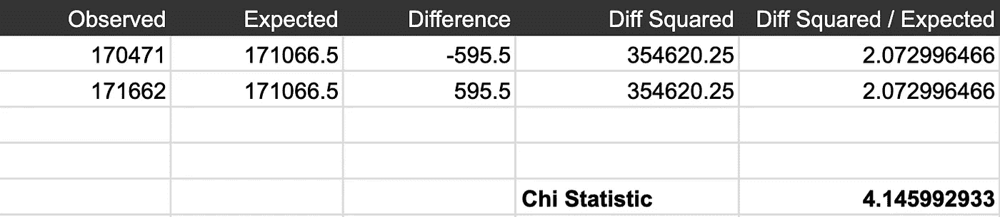
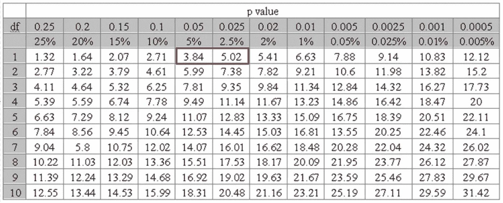
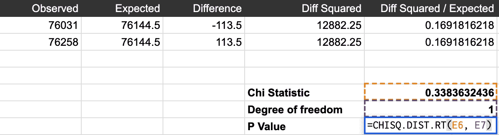
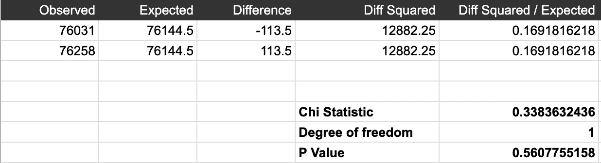

# A/B 测试样品比率不匹配的基本指南

> 原文：<https://towardsdatascience.com/the-essential-guide-to-sample-ratio-mismatch-for-your-a-b-tests-96a4db81d7a4?source=collection_archive---------6----------------------->

## 如果你不能相信一个实验的结果，你就不能相信你基于它做出的决定；你会惊讶地发现，你常常不相信实验的结果

缺乏数据完整性是实验中常见的问题。在处理重定向测试、单页应用程序或其他复杂设置时，它们尤其常见。你构建测试有多久并不重要；这些问题就这么发生了。

那么，鉴于这一事实，我们能做些什么呢？首先(也是最重要的)，我们需要**非常密切地跟踪我们实验的数据完整性**。因此，如果出现问题，我们会尽早知道。

任何人都可以执行的一个基本(简单)检查是**样本比率不匹配(SRM)** 检查。要做到这一点，您不必是分析师或数据科学家。事实上，我在测试中遇到的许多问题都是由产品所有者发现的。

在本文中，我将向您提供什么是 SRM 以及检查 SRM 的各种方法的实用概述。有了这些知识，你就可以把它整合到你自己的实验过程中。

在我们开始之前，我必须强调一点:尽管 SRM 可以捕获许多问题，但它并不能突出显示您的设置中的每个可能的问题。这只是你应该做的最起码的事情。

## 什么是样本比率不匹配？

假设你有一个 A/B 测试，期望是对半分…


图片作者。流量平均分配

但是假设你实际看到的是这样的…


图片作者。流量分配不均

请注意，样本大小不匹配。这就是我们所说的“样本比率不匹配”，即样本比率与我们的预期不匹配(对半分割)。像这样的偏差会使你的测试无效。

# 检查 SRM 时的规则

在我们进一步讨论之前，我们需要确定一些要遵循的规则。

这些规则的第一条是**用“用户”而不是“访问”来区分 SRM 检查的优先级**。那是因为分配给实验的是“用户”。相比之下，“访问”是这些用户进行的“会话”的数量。

如果一个变化鼓励用户更频繁地返回 **(或更少)，我们实际上可能会预期访问的偏斜。**

那么，这是否意味着带有“访问”的 SRM 总是没问题的呢？不一定。我遇到过这样的场景，缺陷导致用户在一个版本中比另一个版本中减少更多的访问。只是有“访问”的 SRM 并不是有“用户”的 SRM 是问题的“确凿证据”。

无论如何，我们的第二个规则是检查样本比率不匹配。那就是:**我们需要经常寻找问题。**SRM 检查不是一蹴而就的活动。我们需要在测试一启动就检查它们，然后我们应该定期检查。

至少在启动的第一周，新的实验应该像重症监护病人一样对待。

这条规则立即给我们带来了一个需要解决的问题，因为被询问的流量可能非常低。但是有一些方法可以提高我们的确定性。我们将在本文的稍后部分讨论这个问题。首先，让我们看看识别问题的最简单的方法。

## 检查明显的问题

识别问题的第一个也是最简单的方法是查看测试作业编号。

有些问题是如此的突出；你可以直接发出警报，而不需要做任何计算。例如，如果您在一个组中看到 1000 个用户，而在另一个组中看到 100 个用户，您就知道有问题了。

这似乎是显而易见的事情，但重要的是不要认为检查 SRM 是某种主要活动。只要能够很容易地快速看到这些数字，就能为你节省大量时间。

更重要的是，一旦你养成了定期查看这类数字的习惯，你就能发现不匹配的地方——尤其是大的不匹配。

但是假设更近呢？假设控制组中有 10，000 个用户，变体中有 9，500 个用户。那你会怎么做？

## 样本比率公式

我们可以运行一个简单的计算来找到样本比率。

首先，获得分配给实验的用户总数…

```
**total_users_in_test** = users_in_control + users_in_variation
```

…然后计算出每组用户的百分比。

```
control = **users_in_control / total_users_in_test**
variation = **users_variation / total_users_in_test**
```

你不需要同时解决控制和变化。一个就够了。

对于我们的例子，计算:

```
control = **10,000 / (10,000 + 9,000) =** 0.5263
variation = **9,500 / (10,000 + 9,000) =** 0.4737
```

因此， **52.63%的用户处于对照组，**和 **47.37%的用户处于变异**。现在，我们可能期望在实验的早期看到一定量的不匹配，但是上面的情况看起来很可疑。

我们怎样才能提高我们确定性的水平？是时候使用一些统计数据了...

# 独立性卡方检验

统计学是以有用的方式描述数据的方法。

我们有两个样本:控制组和变化组的流量。知道这些数字之间的差异超出正常概率的可能性是有用的。

我们可以使用**卡方独立性检验来做到这一点。**这个测试告诉我们，给定两个样本，样本独立**的概率**。

您实际上不需要知道计算 Chi 的公式(尽管我稍后会详细介绍)，因为使用 python 非常简单:

```
observed = [ **170471**, **171662** ]
total_traffic= sum(observed)
expected = [ total_traffic/2, total_traffic/2 ]from scipy.stats import chisquarechi = chisquare(**observed**, f_exp=**expected**)
print(chi)
```

“观察”变量列出了两个值:控制中的用户数和变化中的用户数。

“expected”变量也是两个值的列表:我们期望每个组有多少用户。我们期望的流量是每个中总流量的一半。这是总流量，除以 2。

我们需要来自 [**scipy.stats**](https://www.wikihow.com/Install-Scipy) 的“卡方”模块。之后，我们只需输入数字。我们得到的输出是:

```
Power_divergenceResult(statistic=4.145992932573005, pvalue=0.041733172643879435)
```

这是一个元组，其中第一项是**卡方统计**，第二项是 **p 值**。通常，人们会寻找 0.05 或更小的 **p 值**来确定独立性(以及，在我们的情况下，SRM 的证据)**。**

0.05 的问题在于它对于我们的目的来说不够严格。使用这个可能会给我们一个错误的问题信号。迈克尔·林顿*(optimize ly 团队的一员)*在下面的文章中对此进行了详细介绍。

我们需要的是对我们的独立性测试更加严格。低于 0.01 的值**应该足够了。在我们的 Python 示例中，我们可以编写一个条件语句，以便于阅读:**

```
if **chi[1]** < 0.01:
    print('Warning. SRM may be present.')
else:
    print('Probably no SRM.')
```

顺便说一下，chi[1]意味着我们从元组中访问 p 值。我们的完整脚本如下所示。

使用我们的例子，我们没有 SRM 的确凿证据。再补充一点，我喜欢看累积视图。我们的流量越大，两组样本的分割就越接近:



图片作者。[abdecisions.com 的屏幕](https://abdecisions.com)

上面是一个非常典型的样本比率视图。如果在实验运行期间引入了一个缺陷，这些累积视图对于确定 SRM 何时开始发生是有用的。

## 电子表格视图

我意识到许多阅读这篇文章的人可能不熟悉 python。因此，这里有一个使用电子表格的例子(适用于 Google Sheets 或 Excel):

使用 CHITEST 公式，我们可以传递两组值:观察值和期望值。



图片作者。使用电子表格进行卡方检验

```
=CHITEST(**observed_cell_range**,**expected_cell_range**)
```

第一个数字范围是控制和变化的“观察”值。第二个范围是“预期”(总数除以 2)。

公式的输出是 P 值。之后，规则与我们的 python 示例相同:小于 **0.01** 表示可能的 SRM。

## 更深入地了解卡方(可选)

对于那些真正想深入研究卡氏检验公式的人来说，这里是:


图片作者。χ统计=观察值与期望值的平方之和除以期望值

卡方统计量是每个观察值的总和减去期望值的平方，再除以期望值。

啊？让我们用一个电子表格来分解它:



图片作者。包含公式值的电子表格

这些列:

*   **观测值:**分别为控制交通量和变异交通量。
*   **预期:**每个的预期值——即观察到的总数除以 2。
*   **差异:**观察值减去预期值
*   **差的平方:**自身相乘的差
*   **差平方/预期:**差平方除以预期。

每一行都是一个变体组。例如，控制和变更(A/B)。

在这之后，我们准备寻找 Chi 统计，它只是 *Diff 的平方/预期(如上面的公式中所示)*的总和:



图片作者。差平方和除以期望值

我们如何从中获得 p 值？嗯，我们首先还需要一样东西:那就是自由度，计算方法是:

```
*Degree of Freedom = (rows − 1) × (columns − 1)*
```

在我们的例子中，我们的自由度是 1(两行用于测试和控制，两列用于观察和预期)。

然后，我们可以使用 p 值表来定位我们的得分并找到相关的 p 值:



图片作者。p 值表

或者使用电子表格功能:



使用 CHISQ。DIST.RT 来求 p 值

```
=CHISQ.DIST.RT( chi_statistic, degrees_of_freedom)
```

这个函数给出了精确的 p 值。我们最终的电子表格如下所示:



图片作者。来自 CHISQ 的 p 值。DIST RT

当然，您可以通过使用前面所示的 CHITEST 函数来规避所有这些问题。

# 摘要

使用 Chi 检查流量的有效性非常简单。真的没有借口不做。此外，通过做这个简单的检查，你真的可以节省很多时间。

一旦你经常这样做，你就可以通过添加更多的数据验证检查来更进一步。这才是真正的开始。但这是一个重要的开始。

说了这么多，还是要警惕狼来了。这可能会像数据有效性问题本身一样损害您的实验过程。我通常对在实验启动的第一天宣布问题很谨慎，除非有一个突出的问题。

经常这样做，您将成为尽早确定 SRM 问题的专家。

# 关于我

我是 **Iqbal Ali** ，[漫画作家](https://iqbala.com/) **，**train line 前优化主管， [A/B 决策工具](https://abdecisions.com)的创造者，也是一名自由职业的 CRO 专家和顾问。

我帮助公司开展实验项目，设计、开发、培训和建立实验流程。

如果你想联系，这是我的 [**LinkedIn**](https://www.linkedin.com/in/iqbalhussainali/) 。或者跟随我来到这里。