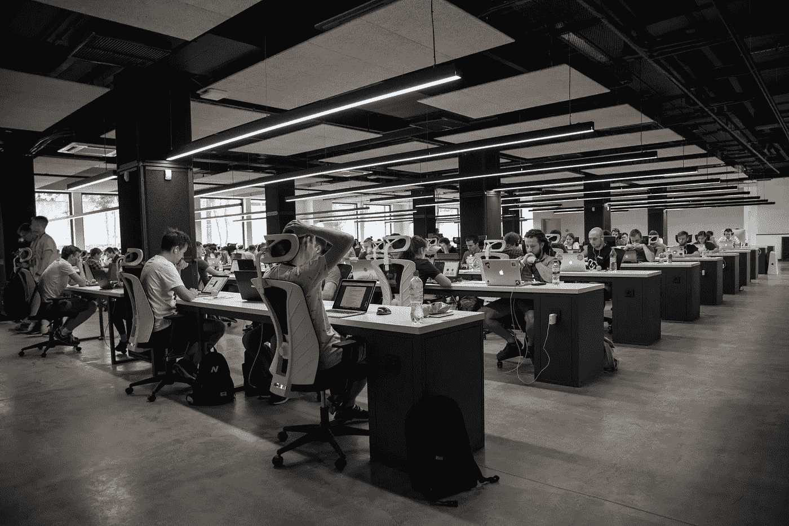

# 人工智能驱动的劳动力监督的伦理

> 原文：<https://towardsdatascience.com/the-ethics-of-ai-driven-workforce-surveillance-2bfaa57cc4a5?source=collection_archive---------43----------------------->

## 意见

## 了解公司如何使用人工智能来监控员工的生产力、健康和行为，这一概念在法律环境中的地位，以及公司应该走多远

Alex Kotliarskyi 在 [Unsplash](https://unsplash.com/s/photos/workforce?utm_source=unsplash&utm_medium=referral&utm_content=creditCopyText) 上的照片

简而言之，任何管理者的价值都可以和他们团队的效率和生产力联系起来。可以说，除了使用复杂的策略之外，许多经理还依靠他们的直觉来评估员工并相应地对待他们。随着疫情迫使大多数企业进行远程工作，这种方法在很大程度上已经不再适用。管理人员越来越难以在没有直接沟通的情况下监控员工的工作效率，这极大地增加了对远程监控解决方案的需求。

然而，高级员工监控的概念已经存在很久了。20 世纪，弗雷德里克·泰勒(Frederick Taylor)提出了科学管理理论，彻底改变了组织对待员工绩效评估和劳动生产率的方式。尽管泰勒的理论在 20 世纪 30 年代已经过时，但其利用数据提高员工绩效的核心思想至今仍在探索之中。随着[人工智能服务](https://www.itransition.com/services/artificial-intelligence)的民主化，公司现在期待使用人工智能来简化员工监控也就不足为奇了。

本质上，每个员工都在不断产生数据，这些数据可用于分析绩效、福利和行为。虽然一些公司监控员工在不同应用上花费的时间，但其他公司甚至远程查看员工的屏幕，并从网络摄像头捕捉视频。这些想法和技术已经使用了相当一段时间，人工智能最终可以通过实时处理和分析大量数据来实现它们。

例如，工作场所监控软件初创公司 Sapience Analytics 的产品被 100 多家公司使用，它通过监控计算机的使用情况来评估员工的生产力。该公司的客户之一 Barclays 开始使用该程序来匿名检测未被占用的工作站，主要目的是减少办公空间。一段时间后，巴克莱似乎无法抵挡充分利用该软件的诱惑，开始对员工进行去匿名化，并非常详细地衡量他们的生产率。不到一个月，员工就公开批评了新系统，巴克莱银行因违反隐私法面临十亿美元的罚款。

亚马逊使用 ML 供电的摄像头来监控送货车的内部，以检测危险的驾驶行为。嵌入式 ML 算法可以识别司机是否因手机而分心或打哈欠，并可以立即发送音频反馈，告诉司机注意路况。不出所料，只有在司机同意被过度监控的情况下，这样的监控水平才是合法的，这导致了员工的强烈反对。然而，尽管遭到强烈反对，该公司的事故减少了近 50%，分心驾驶减少了 45%。

在过去的十年里，我们的隐私界限变得如此模糊，以至于很难判断公司在哪里真正越界了。虽然亚马逊的大多数客户愿意出售大量个人数据，以换取更好的产品推荐，但他们无法摆脱不断被监视和分析的想法，即使这是为了他们自己的利益。这是可以理解的。

在这一点上，它是关于找到雇主应该收集和可以收集的确切员工数据之间的平衡。鉴于对工作场所监控解决方案的需求迅速增加，适当的法规尚未出台。然而，劳动力监测的方法和理由范围如此之广，以至于建立一个普遍的法律框架相当复杂。目前，根据不同的管辖范围，法律含义有很大的不同。例如，不列颠哥伦比亚省(OIPC)信息和隐私专员办公室认为，为了提高公司 IT 系统的安全性而监控在线活动并不是收集个人信息的正当理由。最重要的是，OIPC 提供了一份详尽的指南，明确概述了适当使用劳动力监控的条件。

然而，OIPC 和几乎任何其他监管机构尚未就使用监控技术评估员工表现时什么是可接受的提供指导。在法规跟上之前，雇主不得不缓慢而谨慎地对待工作场所的监控。告知员工将收集哪些数据以及收集的原因至关重要。更重要的是，员工能够选择退出监控计划，而不用担心失去福利或工作。

同样重要的是运行监控程序，这样员工自己也能从中受益。如果操作正确，并采用适当的游戏化策略，人工智能支持的员工绩效评估可以极大地影响工作满意度和敬业度。

最后，确保这些算法公平地评估性能是至关重要的。虽然似乎有无限的员工数据要收集，但需要一个经验丰富的数据科学团队来理解这些数据。这就是为什么这些计划的成功将与第三方供应商的专业知识密切相关。

虽然有些人可能会对这些迅速渗入我们现实的奥威尔式想法感到恐惧，但企业衡量、控制和影响员工绩效的欲望只会变得更强。虽然人工智能监控的新时代已经到来，但在企业和监管机构找到让这些举措变得公平和道德的方法之前，很可能还要经历几次失败。