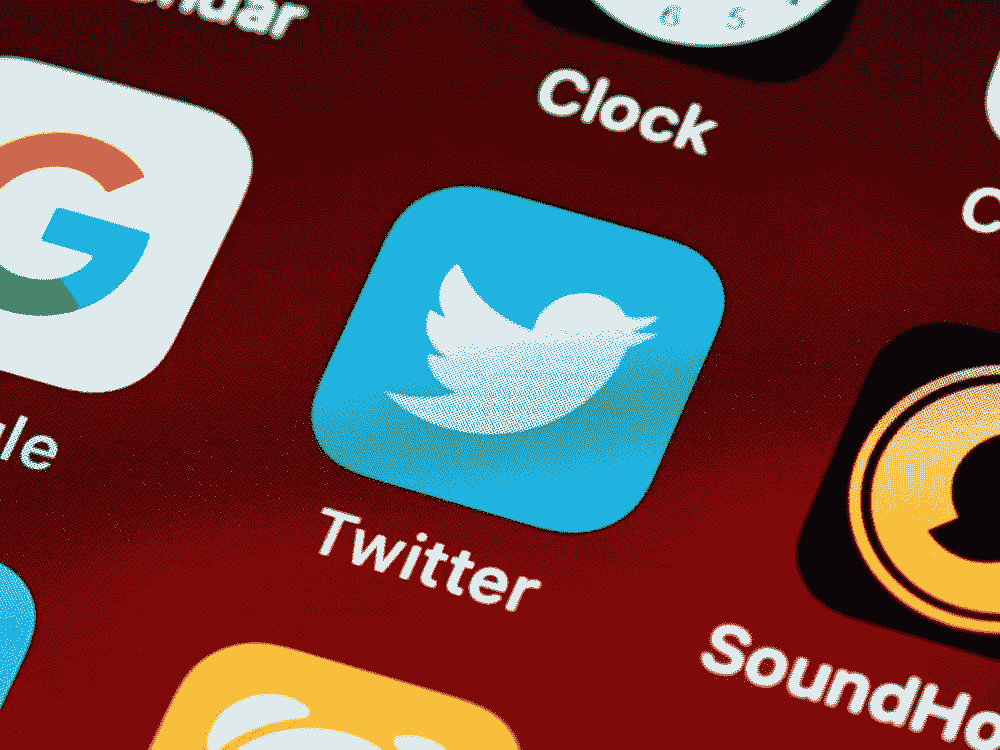
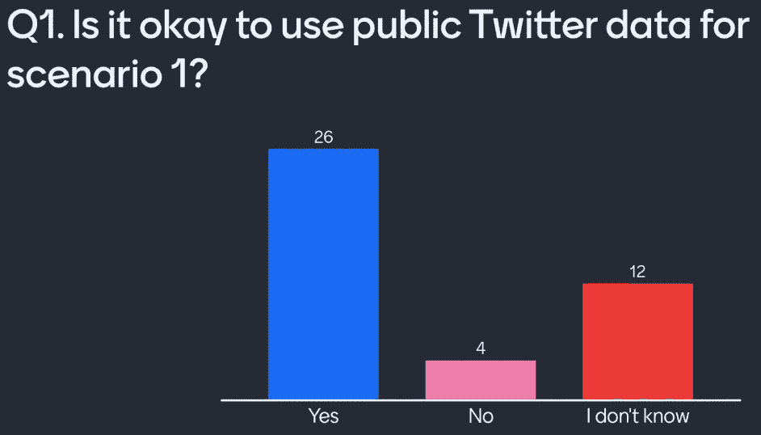
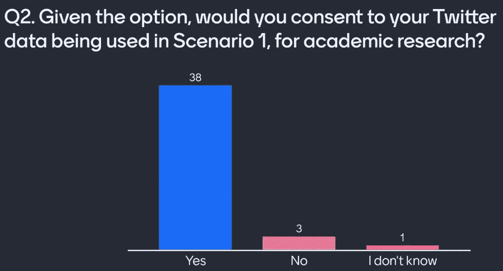
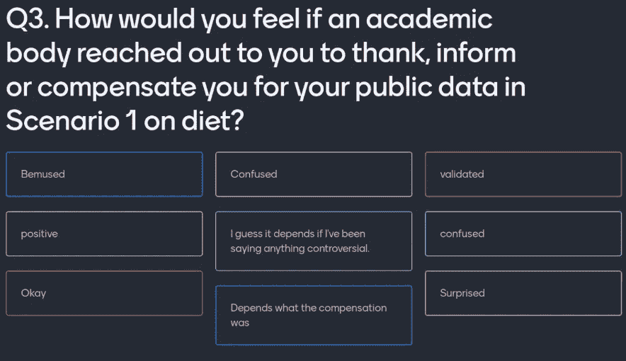
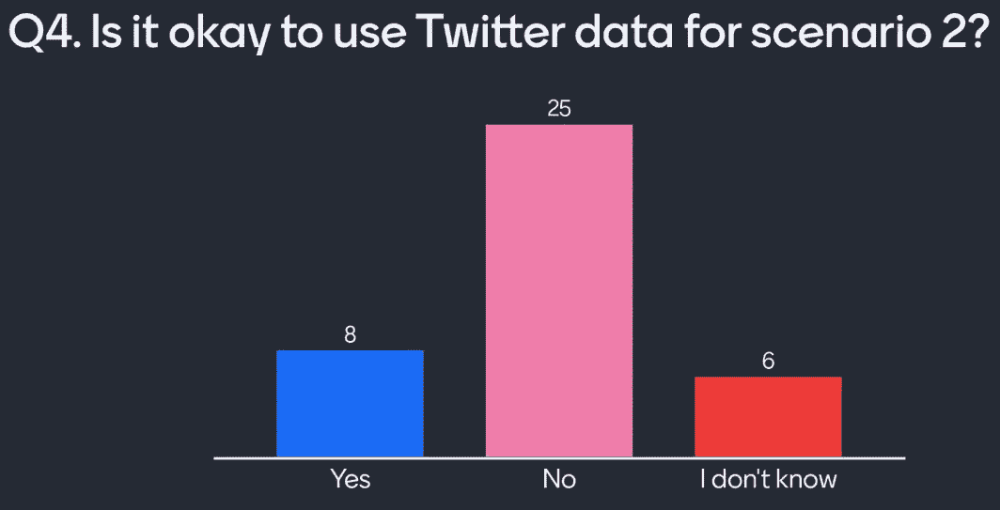
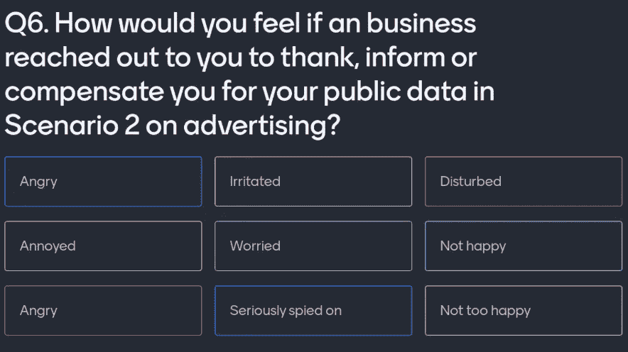
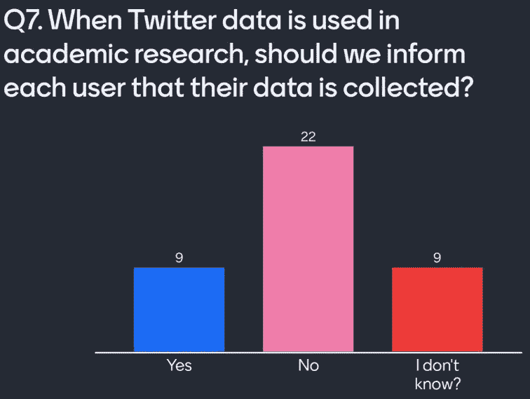
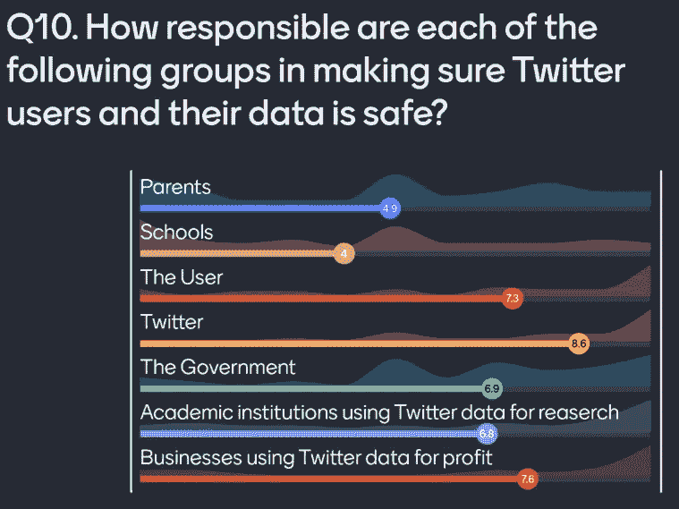
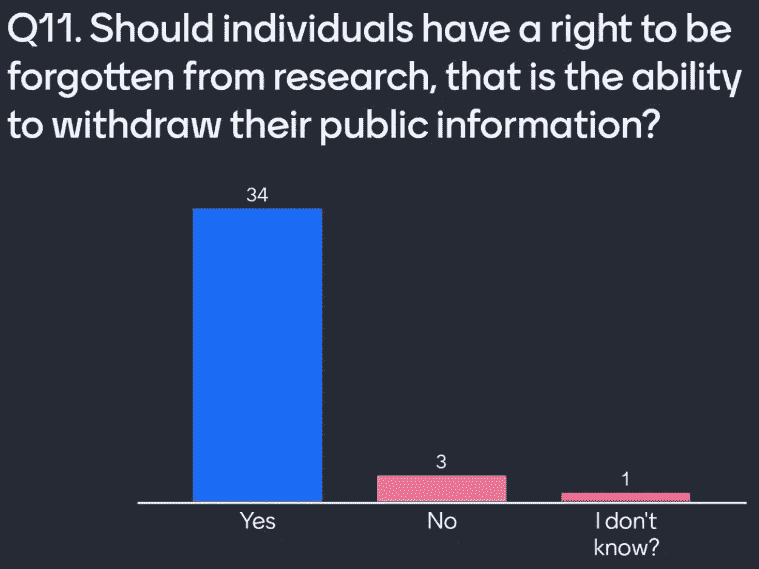

# 我们应该使用 Twitter 数据吗？

> 原文：<https://towardsdatascience.com/the-ethics-with-twitter-data-b071af4b6b9b?source=collection_archive---------12----------------------->

## 而个人数据不是。

## 我们*可以*使用社交媒体数据进行研究，这并不意味着我们*应该*

# 介绍

这篇文章深入探讨了以下问题:

*   知情同意——组织在不通知用户的情况下使用 Twitter 数据。
*   匿名—用户的内容有很高的重新识别风险。
*   撤销权—用户无法撤销擦除的数据。

Twitter 可以解决这些问题。学术界可以通过增加伦理审查程序来帮助开创先例。学术界可以鼓励将 Twitter 数据视为个人数据。

照片由[布雷特·乔丹](https://www.pexels.com/@brettjordan?utm_content=attributionCopyText&utm_medium=referral&utm_source=pexels)从[派克斯](https://www.pexels.com/photo/red-blue-and-yellow-textile-5417837/?utm_content=attributionCopyText&utm_medium=referral&utm_source=pexels)拍摄

# 使用 Twitter 数据

2021 年 3 月，我开始探索 Twitter 作为研究的数据来源。在整个过程中，我发现了作为仇恨犯罪证据的推文，其中包含裸体等内容。大多数演讲者不会热衷于在不知情的观众面前使用这些推文。中途发现有问题或令人震惊的推文的可能性如此之高，以至于我不得不添加一张警告幻灯片。

作为最近的[研究方法电子节](https://www.ncrm.ac.uk/RMeF2021/home.php)的一部分，我修改了这个演讲，重点是使用 Twitter 数据的道德问题。我问了与会者各种各样的问题，关于 Twitter 数据在各种场景中的使用。这篇文章将介绍我向与会者提出的问题。此外，我将探究 42 位与会者给出的答案。最后，我提供了我对这些结果的解释，并建议未来的工作。此演讲的完整录音可在[此处](https://www.youtube.com/watch?v=cRNJrShpXrw)获得。

这些结果带有严重的偏见。所有与会者都代表了一定水平的学术界。所有学者都熟知数据的道德使用，并了解数据隐私。一组类似的数据从业人员复制了这些结果。

这篇博文中使用的所有数据都可以在英国数据服务 Github 上获得。

# 使用 Twitter 数据可以吗？

> 场景 1 —“曼彻斯特大学正在研究仇恨言论与纯素食主义和植物性饮食之间的关系。你关于食物和素食主义的推文被刮了。”

在这种情况下，一名研究人员搜集了你的 Twitter 数据。使用 Twitter 的新学术 API 层，研究人员每月可以收集 1000 万条推文。在我思考之前，先考虑以下问题:

*   Twitter 的数据被学术界以这种方式刮掉可以吗？
*   如果让您选择，您会同意收集您的数据并用于本次研究吗？
*   如果曼彻斯特大学联系您感谢、告知或补偿您您的公共数据被用于本研究，您会作何感想？

## 问题 Twitter 数据可以这样使用吗？

这个场景为研究提供了一个“好”的理由。大多数与会者不会在推特上发布针对纯素食者的仇恨内容。社会鼓励个人在看起来不错的情况下“捐赠”他们的数据。当被问到时，许多人会提供这些数据，即使是私人的。拒绝在这里分享你的数据可能暗示你有所隐瞒。你有什么要隐瞒的吗？如果你做了，你会改变你的答案吗？

我们可以在下面看到，许多用户认为这是对公共数据的一种可接受的使用。有些人不确定，很少有人反对这个想法。

## 问题 2——给你一个选择，你会同意在场景 1 中使用你的 Twitter 数据吗？

在这里，我向与会者提供我们的研究知情同意的选择。这不是用户目前拥有的选项。在这里，任何不确定道德的人都同意捐赠他们的数据。尽管如此，有些人还是会拒绝这种“捐赠”。如果这是任何其他个人数据来源，我们不会在未经同意的情况下获取这些用户的数据。

## 问题 3——如果一个学术机构向你表示感谢、提供信息或补偿你在场景 1 中的公开数据，你会有什么感觉？

这里我们观察到一个现象。我们给 Twitter 用户一种错觉，认为他们的内容只是以他们想要的方式被观察到。对于无声刮痧，我们假定知情同意。当我们联系用户通知他们时，他们会感到不舒服。一些用户对其数据的使用了如指掌，但“不希望被联系”。大多数人对这种接触感到困惑。

一位用户称，这将取决于“我是否说过任何有争议的话”。这提出了一个奇妙的观点。在发微博的时候，我们都认为我们在说正确的事情。我们也可能得到社区的大力支持。学术研究或商业产品不是推特的最终目标。在我的演讲中，我强调了一条推特是推特上对素食主义最负面的看法。我怀疑用户想要这样，但他们没有选择。我相信更糟糕的事情正在发生。

随着时间的推移，我们是否如此大胆地说我们将永远站在所有问题的正确一边？

> 场景 2——一家大型科技公司搜集了 Twitter 上关于你去过的地方、在那里呆了多长时间以及访问频率的数据。他们利用这些数据来描述你，并向你投放有效的基于位置的广告。

在这种情况下，你的数据是被行业为了利润而搜集的。在我思考之前，先考虑以下问题:

*   推特数据这样用可以吗？
*   如果让您选择，您会同意将您的数据用于本次研究吗？
*   如果在场景 2 中，一家企业向你伸出援手，感谢、告知或补偿你的公开数据，你会有什么感觉？

在这里，我希望展示 Twitter 数据的相反用途。这是行业对公共数据的巨大滥用。支持场景 1 的方法也支持场景 2。推文的内容会影响用户的同意。进行刮擦的组织的意图也影响给予的同意。

## 问题 4——这样使用 Twitter 数据可以吗？

给定一个新的、邪恶的例子，我们再问一次，这是否是一个可以接受的使用公共 Twitter 数据的案例。一些用户坚信这些数据是公开的，因此任何人都可以使用。大多数用户不喜欢使用 Twitter 数据，尽管这是所有主要社交媒体赚钱的方式。

## Q5。如果可以选择，你会同意在场景 2 中使用你的 Twitter 数据吗？

同样，我提供了一个我们可以控制数据的假想场景。如果没有“捐赠”我们数据的压力，这就变得类似于盗窃。组织将公开的 Twitter 数据货币化，而不补偿用户。用户不喜欢这样，最终产品寻求操纵用户。一般与会者不会同意使用 Twitter 数据。

我们必须记住，用户是这些社交媒体的产品。这项服务是免费的。我想问的一个后续问题是“你会付费使用 Twitter 吗？”。这些矛盾在关注时会变得不舒服。这是缺乏知情同意的症状吗？

## Q6。如果在场景 2 中，一家企业向你伸出援手，感谢、告知或补偿你的公开数据，你会有什么感觉？

与会者讨厌这个问题。大多数用户报告感觉“被激怒”、“生气”、“被监视”以及类似的情况。GDPR 现在在这种情况下保护用户。该行业将收集用户数据来预测股票价格、政治结果等。他们只是默默地做。

# 道德和责任

这就结束了我们对场景的关注。我现在将深入探讨为什么 Twitter 数据是个人数据，为什么这是令人担忧的，以及我们可以做些什么。

## 问题 7——当 Twitter 数据被用于学术研究时，我们是否应该告知每个用户他们的数据被收集了？

在涉及个人数据的传统研究中，我们知道要寻求参与者的知情同意。我们还赋予这些用户随时撤销其数据的权利。在 Twitter 的数据中，似乎大量的推文提供了匿名的基线。

不联系这些用户，我们无法提供知情同意。当我们联系用户给出这个选项时，我们让他们不舒服。我们还在观察中偏向我们的研究，只接受来自同意的用户的数据。大多数与会者都知道，在这种情况下，通知 Twitter 用户是违反 GDPR 的。

## Q8。用 Twitter 数据进行的研究应该要求伦理审查吗？

所有英国大学都要求伦理审查批准使用个人数据的研究。一些大学表示，Twitter 数据需要进行伦理审查。这是学术界的第一步。在这个问题中，我试图检查与会者对此的反应，不知道过程。

大多数与会者认为，社交媒体数据应该需要进行伦理审查。

## Q9。所有大学都要求对个人数据和相关研究进行伦理审查。推文中的文字是个人数据吗？

带着这个问题，我明确表示，个人数据要接受伦理审查。我介绍了一条推文既是公开数据又是受保护的个人数据的悖论。谷歌搜索大多数推文会让你回到实时推文。这意味着文本本身就足以重新识别用户。

与会者认识到了我们对个人数据的定义中这种边缘情况的细微差别。重新鉴定的风险很高，但是数据是公开的。这里的正确答案取决于推文。这还取决于谁在收集数据，以及他们为什么想要这些数据。

# 谁负责解决这个问题？

## Q10。在确保 Twitter 用户及其数据的安全方面，以下每个组织的责任有多大？

对这些论点的一个常见反驳是，父母和学校有责任抚养孩子。数字卫生现在是许多学校课程的一部分。另一个观点是，政府应该干预和管理不道德使用数据的企业。政府可以引入数据保护立法。我想知道我的与会者认为每个小组对 Twitter 数据的安全性有多负责:

*   双亲
*   学校
*   用户
*   推特
*   政府
*   学术机构
*   工业

每次我进行这项调查时，我都发现大部分责任在于 Twitter 本身。他们是唯一能够追踪他们收集的数据的人。他们最有能力向学术界提供知情同意和被遗忘的权利。

与会者认为家长和学校的责任最小。许多人觉得他们没有责任。Twitter 用户的平均年龄在 25 岁或以上，不太可能是儿童。我们希望这些群体能够为下一代社交媒体用户做好准备。我们无法理解这一代人将在网上面临的风险。

与会者非常强调用户要对自己的数据使用负责。我称之为“你应该更清楚”的论点。我们要求用户了解他们的数据将如何被滥用，但他们并不知道。这看起来很简单。不要发不敏感的东西。我们无法预测下一个不敏感的趋势。那么我们怎么能期待未来的完美呢？用户一般不会看各个平台的条款。Twitter 用来教育用户的方法不起作用。

与会者对政府的责任有各种各样的意见。政府有能力执行和立法来保护推特用户。我们需要的数据保护通常需要几年时间。我们还需要一些未受保护数据的后果，以增加紧迫性。这一切来得太晚了，但必须来。

利用 Twitter 数据的企业可以资助 Twitter 的发展，以更好地利用数据。然而，这里存在利益冲突，企业通常希望以最便宜的价格获得尽可能多的数据。虽然可能会有一些进步的企业质疑这些数据的道德性，但通常情况并非如此。

学术界可以鼓励更好地利用社交媒体数据。一个快速的胜利将是对社交媒体数据进行伦理审查的要求。这开始了在收集的社交媒体数据中保护用户的过程。Twitter 需要更新他们向学术界提供的服务，以解决剩下的问题。学术层显示他们正在考虑学术界，但还需要做更多的工作。我担心 Twitter 认为这是一种社会公益“捐赠”数据，以抵消其他领域的滥用。

## Q11。个人应该有被遗忘的权利吗？

学者们知道个人应该有权撤销他们的数据。GDPR 增加了一些权力，让个人有权从数据集中删除他们的公共信息。

当一个组织抓取用户的内容时，Twitter 不会通知用户。这里没有责任，用户没有办法撤销他们的同意。用户可以删除或隐藏他们的帐户，但这并不能追溯保护他们。

## Q12。Twitter 是一个好的研究来源吗？

最后，与会者一致认为 Twitter 是一个很好的研究数据来源。这个问题遗漏了一条关于 Twitter 数据偏见的免责声明。每个社交媒体平台在选择使用它的用户中呈现出自己的偏见。Twitter 用户并不代表无法访问互联网的个人。推特用户一般是 25-34 岁的美国男性。如果我们以此为基础制定政策，我们需要澄清这种偏见。我们也可以采取措施，在我们的推文抽样中减少这种偏见。

# 我们应该在研究中使用 Twitter 数据吗？

## 我们应该可以使用 Twitter 数据。

一个主要论点是，这些数据已经公开，因此保护是多余的。许多社交媒体平台的目的是让尽可能多的人看到你的内容。这才是重点。说用户不理解这一点可能看起来很可笑。

我们也认为发布危害性内容的用户应该更清楚。如果你不想因为张贴种族主义、性别歧视或同性恋恐惧症的东西而惹上麻烦，就不要张贴。

这个数据集很有价值。任何用户都可以衡量公众对他们自己、一个政党、股价等的看法。为什么因为一个小小的隐私问题而忽略如此强大的数据集呢？

最后，由于这是公共数据，我们不再必须处理 GDPR 或未来的数据立法。

## 我们不应该使用推特数据。

通过一些干预，我认为我们可以合乎道德地使用这些数据。

社交媒体旨在分享内容。尽管如此，并不是所有的 Twitter 用户都希望他们的内容被所有人看到。同意数据滥用不是默认。请考虑以下情况:

*   孩子们明白他们的数据将如何被使用吗？
*   成年人了解他们的数据将如何被使用吗？
*   是否所有用户都预期机器学习将使他们从数据中获得洞察力？
*   所有用户都预料到这可能导致定向广告和政治操纵吗？
*   所有用户都相信我们不会找到更强大的方法来滥用这些数据吗？
*   所有用户都觉得他们的历史推文不包含过时的观点吗？

在一项学术研究中，根据 GDPR 法案，我们必须征得同意才能使用 Twitter 数据。许多用户希望他们的追随者看到他们的内容。一些用户可能希望这个圈子之外的人看不到他们的内容。这是一个未被充分利用的选项，而且它是可用的。如果我们主动联系用户，告知他们数据的使用情况，许多人会感到不安。推文的背景、组织和抓取的目的都会影响这种不安。

由于最初的 Twitter 内容通常是独一无二的，它也可以识别个人。在任何研究中，我们都努力将参与者重新识别的风险降至最低。这里的理由可能是数据是公开的。有没有可能公开和被观察是不同的意思？

最后，在传统研究中，我们会让所有用户能够随时撤销他们的数据。当数据源是社交媒体时，我们不提供此选项。如果我们有，即使通知用户我们有他们的数据也会让他们不舒服。一个学者一个月可以发 1000 万条推文。每隔几天删除数千个被撤销的数据点并不是一件简单的工作。怎么才能给用户提现的权利？这里谁负责？

# 结论

至此，曼彻斯特大学发布了[“超过 500 篇利用 Twitter 的出版作品”](https://research-it.manchester.ac.uk/news/2021/02/09/analysing-tweets-twitter/)。我们改变这一切是否已经太晚了？

华威大学已经决定需要进行伦理审查。在某些情况下，利用社交媒体的项目需要伦理审查。

> [“适用于公开数据的豁免并不自动适用于社交媒体数据”](https://warwick.ac.uk/services/ris/research_integrity/researchethicscommittees/ethicalapproval/social-media)。

关于 Twitter 数据，我们需要解决以下问题:

*   知情同意——用户不知道他们的内容被抓取的频率，也不知道这些内容被用于什么目的。试图通知用户导致厌恶。Twitter 有能力解决这个问题。
*   匿名——任何用户都可以窃取姓名、位置和其他受保护的特征。用户可以通过谷歌搜索该推文的内容来重新识别该推文。我们可以很快提供文本数据的统计披露控制，以保护匿名性。
*   撤销的权利——由于用户没有被告知，他们不知道他们需要撤销什么。如果他们可以退出，在攫取了数百万用户后，研究人员将如何管理这一点？Twitter 有能力解决这个问题。
*   伦理审查——大学应该站出来，接受社交媒体数据需要某种形式的保护。对社交媒体数据进行伦理审查是这一过程的第一步。

谢谢，如果您有任何问题，请随时通过[Joseph . Allen @ Manchester . AC . uk](mailto:joseph.allen@manchester.ac.uk)或 [@JosephAllen1234](https://twitter.com/JosephAllen1234) 联系我。