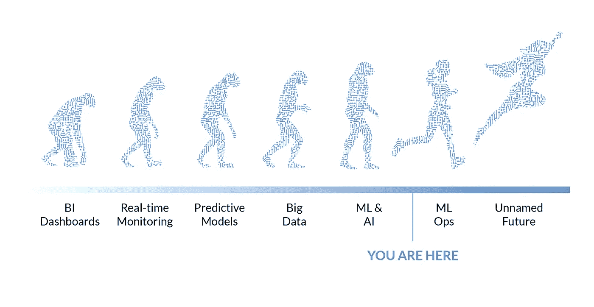
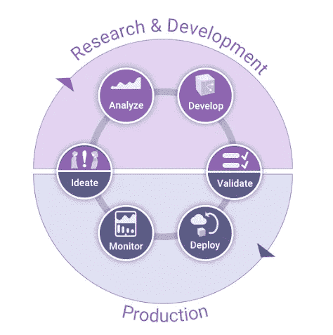

# AI 的进化——在下一次大灭绝中幸存所需的 3 个特征

> 原文：<https://towardsdatascience.com/the-evolution-of-ai-plus-3-traits-needed-to-survive-the-next-mass-extinction-5173f48c6c7a?source=collection_archive---------29----------------------->

## [意见](https://towardsdatascience.com/tagged/opinion)

## 如何在 MLOps 时代导航并脱颖而出

图片由 Domino 数据实验室提供

技术的进化，很像我们星球上生命的进化，其特点是稳步前进，偶尔夹杂着大规模灭绝和创新生命的爆发。我们很幸运地经历了一个进化的转折点。数据科学和人工智能领域的创新比比皆是，已经在改变商业和生活的本质。随着技术的繁荣，那些没有获得新时代生存特征的组织将面临真正的风险。

许多高管和分析专家对这一过程将把我们带向何方缺乏远见。他们对我们生活的这个时代的定义，我们称之为 MLOps 时代，是有局限性的。这导致他们固守技术并采用限制他们在新市场竞争能力的流程(进化意义上的特征)。企业人工智能的下一个进化时代会是怎样的？最先到达的人会发现自己处于食物链的顶端。在本帖中，我们提供了 MLOps 的定义，并讨论了顶级分析企业是如何超越我们当前的时代而发展的。我们洞察了下一个时代将会是什么样子，更重要的是，什么样的组织将会生存和发展。

# MLOps 时代

随着 2021 年的开始，数据科学、人工智能和人工智能行业目前正处于 MLOps 时代的早期。这是一个建立在过去创新基础上的激动人心的进步。它寻求解决将更多数据科学产品投入生产的最后一英里问题——将 ML 和 AI 投入运营。它承诺模块化和可重用的组件来满足这一目的。它采用了 DevOps 和软件工程(如 CI/CD 方法)的原理，并经过修改以适应数据科学工作的需要。它强调干净的数据管道来支持操作化过程。重要的是，MLOps 时代的每个方面都在经历向云工作负载的过渡。注意这个时代强调的数据科学生命周期的各个阶段是很有帮助的。它们是验证、部署和监控阶段。

# 数据科学生命周期

图片由 Domino 数据实验室提供

这是 MLOps 时代的普遍观点，但我们还处于这个时代的早期，在过渡到下一个大事件之前还有工作要做。特别是，我们将看到学术界和工业界对完善数据科学生命周期的验证和监控方面的关注。

验证工作目前领先于监测工作。学术界发表了大量关于模型的可解释性、伦理和偏见的研究。业界正在将这些想法转化为当今领先组织使用的工具和流程。还有很多工作要做，等我们离开这个时代，模型验证会成熟很多。

说到模型监控，学术界是后来者。这在一定程度上是因为，至少从学术意义上来说，这是一个已经解决的问题。然而，对于将已知的监控原则应用于生产模型的最佳方式，我们还有许多未解的问题。即使建立了最佳实践，实施也不是微不足道的；为了在 MLOps 意义上有效，它必须完成反馈循环以重新训练或完全重建模型。在模型监控有一个坚实的基础之前，学术界和工业界都有工作要做，但他们将在这个时代结束时到达那里。

# MLOps 时代的当前和未来

## MLOps 时代的当前焦点

*   操作化
*   模块化和可重复使用的组件
*   DevOps 和应用于数据科学的软件工程原理
*   数据完整性
*   CI/CD(持续集成和持续交付或部署)
*   功能模型验证
*   功能模型监控
*   云工作负载趋势

## MLOps 时代的未来焦点

*   模型验证将扩展到包括可解释性和伦理
*   模型监测将利用统计学原理，并与研究过程相结合，完成反馈循环

# 未知的未来

尽管围绕 MLOps 投入了大量精力和讨论，但 MLOps 仍然是生命周期的“生产”部分。MLOps 要求我们找出复杂的 API，并将服务和技术缝合在一起。MLOps 是关于如何做的。这个未来的未命名时代将把 MLOps 时代的一些相同原则应用于“R&D”的一半生命周期。那时，我们将进入一个以规模效益为特征的新时代。

正如一位已经在为未来时代做准备的前瞻性数据科学领导者所说，

> “十年前，数据是我们的竞争优势。然后是我们的模特。今天是我们的过程。”

有了 MLOps 时代的工具，下一个时代将是流程时代。这并不意味着技术不会发挥作用。创新将帮助领导者和团队运营数据科学生命周期的剩余部分。我们不是在谈论 auto-ML 或数据科学的简单按钮。这是关于标准化的。实施生命周期的构思、分析和开发阶段意味着提供获取和共享机构分析知识的工具。这意味着提供一种自动跟踪研究并通过点击一个按钮来复制它的方法。它与数据科学组合管理和建立需求层次有很大关系。它将关注数据科学项目管理。它的特点是全面的资产管理，从模型到数据集到图像以及其间的所有东西。它包括跟踪数据产品的商业价值。简而言之，这是关于强调数据科学中的科学——提供结构，以便团队可以像一组协作研究科学家一样运作。

# 未来时代——是关于过程的时代

*   数据科学是真正的企业能力
*   机构知识管理
*   再现性
*   在整个生命周期中优化研究团队的工作流程
*   分析专业人员的协作
*   利用有限的资源和巨大的人才缺口实现商业价值最大化
*   记录系统
*   自上而下的投资组合视图
*   项目管理

# 在下一次大灭绝中幸存下来所需的特征

基于对当前时代结束时 MLOps 将会是什么样子以及下一个时代将会带来什么的愿景，我们看到了组织和公司为了在下一个时代生存和发展而必须发展的三个强大特征。有些已经在开发了。

# 未来时代的特征

1.  生命周期管理
2.  知识管理
3.  证券管理

生命周期管理将是在我们当前的时代，即 MLOps 时代有效适应的组织的最终状态。它利用 MLOps 的原则和工具，作为优化将模型投入生产的过程的手段。它建立了一个组织，将这些原则扩展到整个生命周期中的研究团队。

知识管理依赖于定义良好的数据科学工作记录策略系统。这将通过技术——具体来说是数据科学平台——成为可能，但也需要领导层在不扼杀创造力的同时实现工作标准化。知识管理系统将成为分析突破的灵感火花。它将对数据科学团队创造的价值产生复合效应。

最后，那些采用有效的项目组合管理策略的人，在工具的支持下，将最终实现他们的需求层次，而不是今天数据科学项目工作的自下而上的方法。所有领导，从团队领导到最高管理层，都将了解数据科学项目和研究。追踪商业价值将成为现实。组织的分析引擎将最终开始全速运转。

# 后续步骤

组织应该拥抱当前的 MLOps 时代，同时为下一个时代奠定基础。拥抱今天的可操作性思维。建造管道。投资合适的人才。同时，开始试验分析研究的标准化。开始思考和测试知识管理原则和工具。了解你的分析组合，它来自哪里，以及如何管理它。现在采取这些步骤将是在未来十年的分析发展中取胜的关键。