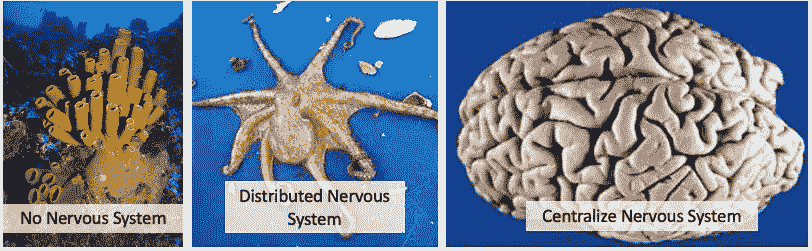
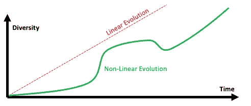
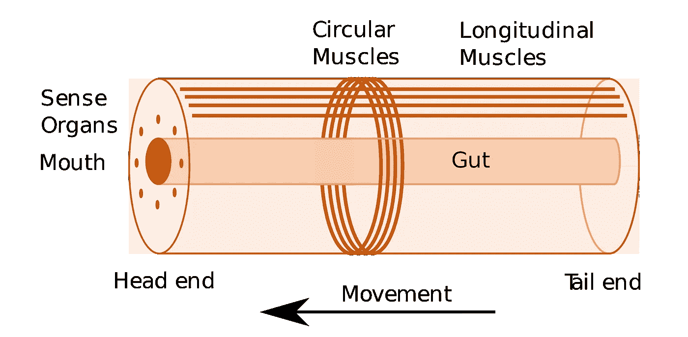
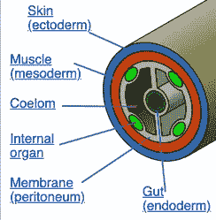

# 企业知识图和 CNS 的演化

> 原文：<https://towardsdatascience.com/the-evolution-of-enterprise-knowledge-graphs-and-the-cns-9c57a0513ecd?source=collection_archive---------39----------------------->

中枢神经系统的三个例子:海绵、章鱼和人脑。企业知识图会像人脑一样进化出专门的结构吗？作者的作品。

这个博客将推测企业知识图(EKG)将如何发展以包含专门的功能和专门的子图。我们将使用原始生命形式中中枢神经系统(CNS)进化的隐喻来提出一些关于建筑权衡分析的关键点。

如果心电图真的要成为组织的集中“大脑”,它们将需要从现在的位置发展到承担新的角色。我们还需要理解依赖组织的集中控制所面临的挑战。

## EKG 和中枢神经系统隐喻:海绵、章鱼和人脑

我们将使用生物体中枢神经系统的比喻来讨论心电图是如何演变的。这需要我们观察生物体进化出不同类型神经系统的不同方式，以及这些方式在适应新环境中的重要性。

让我们从**海绵**开始。它没有真正的中枢神经系统。海绵中使用电化学信号交换信息的神经元没有细胞类型**特化**。海绵有同质的 T4 细胞，它们利用化学信号进行交流，但它们速度缓慢，并且均匀地分布在海绵的全身。

这种分散设计有一些优点。你可以把一块海绵切成两半，两部分都能存活。简单的设计更容易维护，单点故障更少。

当我们想到“海绵信息架构”时，我们可以想象许多小的部门子图、数据库和电子表格是不相连的。它们都是一个企业中的一个个信息“细胞”孤岛，并不实时沟通。然而，你通常可以通过出售业务部门来重组你的公司，它将继续运作而不会影响到个人团队的表现。

接下来，考虑一下**章鱼**。虽然章鱼有神经元和一个中央大脑，但超过一半的神经元也分布在章鱼的每个四肢上。章鱼在中央大脑中为运动做总体规划，但它们允许复杂的肢体运动细节在每个肢体本身的神经元中完成。

“octopus 信息架构”对 EKG 有一些集中的作用，但它不在每个业务单元内执行详细的预测性业务规划。从技术上讲，我们称之为**半集中式** EKG 架构。EKG 仍然有专门的子图，但是它们需要被设计成将抽象概念发送到部门图，在部门图中完成执行细节。

最后，考虑人类的大脑。我们的大脑具有高度集中的神经系统，无论是大规模的身体运动规划还是精细的运动控制都是在颅骨内进行的。我们的眼睛处理图像并将数据发送到我们的视觉皮层，独立的大脑区域协调我们四肢的预测运动。然而，我们并没有将运动规划委托给我们肢体内的神经元。我们的大脑确实有许多高度专业化的区域来执行不同的功能。

人类大脑显示了低水平的同质细胞类型(神经元),但在大脑的数千个子区域中，连接模式具有高水平的多样性。

我相信不同的组织也会根据他们所处的环境演化出不同风格的心电图。就像不同类型的中枢神经系统进化的方式一样，不同类型的心电图也将以同样的方式进化，以满足不同类型组织的需求。EKG 也将遵循与中枢神经系统进化相似的进化路径。它们会从简单开始，慢慢进化出更加复杂和专业化的结构。我还相信，拥有集中心电图的大型组织将会主宰公司，就像人类主宰地球上的生命一样。

## 复杂性是有代价的

复杂性总是伴随着一些代价。当今生活世界中的许多植物和动物的例子都保持了它们的简单组织。因为这种简单，他们兴旺发达。像键值存储这样的数据存储是保持数据存储及其接口简单以便更容易横向扩展的很好的例子。不幸的是，这种简单性也阻止了我们有效地对键值存储进行复杂的查询。

## 非线性进化过程

进化通常不会沿着一条直线进行。它以波的形式出现，由特征的关键排列触发。导致心电图多样性迅速扩大的关键特征是什么？作者的作品。

大多数人都知道[寒武纪大爆发](https://en.wikipedia.org/wiki/Cambrian_explosion)的概念。寒武纪大爆发发生在大约 5.41 亿年前，当时海洋生物很原始——很像海绵。在寒武纪大爆发之前，生命形式相对简单，不会随时间快速变化。寒武纪大爆发后，我们既有动物多样性的快速进化和巨大增长。

寒武纪大爆发是一个非线性进化系统的例子。如果我们绘制不同种类动物的数量随时间的变化曲线，它不会是一条直线。那么，大多数进化的系统是否表现得像[复杂系统](https://en.wikipedia.org/wiki/Complex_system)。心电图也将遵循许多复杂系统的规则，并显示由关键事件触发的非线性增长模式，如 GQL 标准和图形硬件的到来。

## 早期生命形式和中枢神经系统的进化

但是[中枢神经系统](https://en.wikipedia.org/wiki/Evolution_of_nervous_systems)是如何进化的呢？为什么增长是非线性的？

与等待食物到来的植物不同，一些早期的生命形式更加灵活。他们搬到有食物的地方，后来，他们还需要学会捕捉猎物，远离捕食者。所以为了捕捉猎物或躲避捕食者，它们需要肌肉。

与静止的海绵不同，水母会四处移动。水母动物的全身都分布着神经网络。他们还没有表现出任何中枢神经系统的迹象。中枢神经系统进化的关键步骤是身体计划的[头部化](https://en.wikipedia.org/wiki/Cephalization)。这个过程围绕着一个双边身体计划来组织身体部位。

理想化的双侧身体平面是一个圆柱体，圆形和纵向肌肉围绕着中央肠道排列。感觉器官被放置在靠近肠口的头端。来源:维基共享。

一旦围绕肠道的基本身体结构进化，扩张和收缩的特殊组织就变成了肌肉。感觉器官出现在肠口周围。现在问题来了——我们如何协调感官和肌肉？这种协调应该是分布式的还是集中式的？

水母走的是去中心化路线。他们保持简单的身体结构，将感觉器官放在身体结构的顶端或边缘，他们从未进化出内脏和两侧对称。

但是双边贸易采取了不同的路线。他们采用了一种特定的身体结构，发现中央神经系统可以协调感官和肌肉。

今天，分布式本地标记属性图显然相当于双边身体计划。它拥有我们建设一个可扩展和可持续发展的 EKG 所需的所有关键建筑特征。对于其他图形数据库架构来说，仍然会有合适的环境。但我们现在有了一个架构，它将引发图形数据库中的“寒武纪大爆发”，为未来的心电图提供动力。

## 最佳实践的演变

一旦基本的身体计划得到发展，就可以在该身体计划的基础上建立一套最佳实践。这里有一个[体腔](https://en.wikipedia.org/wiki/Coelom)身体计划的例子，它在中央肠道周围有更复杂的结构。来源:维基共享。

## 多样化的环境加速进化

想象一下，整个地球是一个均匀的浅海。海洋深度没有变化，也没有陆地。如果是这样的话，我们今天就不会看到如此多样的生命形式了。因为地球提供了不均匀的生态景观，我们得到了更多的生命形式的多样性。

心电图的演变也是如此。组织不是同质的。他们为不同行业和不同类型的客户提供各种各样的产品和服务。由于这种多样性，我们应该期望看到心电图在它们的一些结构中多样化。

## 软件同质性允许硬件优化

这里有一个与多样性观察相反的想法。如果有成千上万个不同的数据库，没有哪个供应商会花十亿美元来为一个架构优化硅硬件。但是分布式本地标记属性图(DNLPGs)的发展已经将焦点集中在一个单一的架构上——使用希望遍历关系的指针。由于几乎所有现代企业知识图都使用 NLPGs，我们开始看到针对这些数据库的硬件优化。

这意味着任何其他不利用 DNLPGs 的数据库在性能上会有 1，000 倍的下降。这意味着进化的力量将迫使这些非 DNLPG 系统关注性能以外的其他领域。如果他们不这样做，适者生存的法则将把他们从数据库市场中淘汰。

是的，这些规则有些矛盾。但是，当我们试图想象心电图将如何演变时，我们需要把它们都记在脑子里。

## 专门的大脑区域

宇宙中最不可思议的事情之一是大脑如何采用单一结构，即神经元，并使用相同的结构在大脑中建立令人难以置信的各种更复杂的结构。人类大脑有数千个不同的区域，这些区域在超过 5 亿年的进化过程中已经形成了专门化。我们可以期待心电图发展出高度专门化的区域，但仍然使用共同的结构:具有属性的顶点和边。下面是一些可能发展起来的特殊子图:

1.  **地理位置** —地址、城市、州和地区等地点信息。
2.  **访问控制**(安全)——将用户与其角色和权限相关联。
3.  **客户知识** —所有客户接触点，包括网络访问、电子邮件、购买、退货和产品评论。
4.  **产品知识** —关于产品、规格、保修、产品分类、类似产品和竞争对手产品的详细知识。
5.  **一般语言知识** —描述单词、词义、同义词、首字母缩写词、缩略语、相关单词和定义的结构。
6.  **业务术语** —特定于您的组织和行业的术语。可能包含您所在领域常用词的专门定义。
7.  **数据转换知识** —原始数据如何转换为关联知识。包括模式匹配、模式映射、数据格式转换和数据质量检查的规则。
8.  **数据线性知识**-数据是如何到达 EKG 的？它从何而来，又是如何转化的。数据与特定任务的相关性有多高？
9.  **业务规则知识** e —在 EKG 中，确定性业务规则是如何存储和执行的？人们如何查看和更新规则？一个高层次的规则被改变的下游后果是什么？
10.  **报告知识**——报告是如何产生的。数据是从哪里来的？报告多久运行一次，由哪些代理运行？运行报告的成本是多少？谁创建并维护报告？与任何给定报告最相似的报告是什么？
11.  **因果关系知识** —各种商业事件的起因是什么？我们能解释客户体验问题的根本原因吗？可以看到模拟选择以预测未来成本？

## 大脑和头骨:保护你的 EKG

随着中枢神经系统变得越来越复杂，它们开始成为动物的单点故障。对未受保护的大脑的打击会很快使动物失去知觉，容易受到捕食者的攻击。

如果章鱼的一个肢体失去了部分分散的大脑，它仍然可以存活，甚至长出新的肢体。同样，部门数据集市可能会崩溃，但不会影响您的客户体验。

那么，如何保护我们的客户体验依赖于其全天候可用性的中心资源呢？我们如何在 EKG 周围构建一个“骷髅”,以确保它具有高可用性？使用具有高复制级别的分布式图形数据库是一种解决方案。但是保护您的 EKG 免受粗略查询也很重要。

几年前，我的一个朋友参与了一个项目，该项目使用一个新的开源查询程序来简化数据湖中低级数据的查询。问题是该软件不能限制任何查询的资源，如 CPU 时间、内存或 IO。因此，查询中的一个小错误会导致整个数据湖不可用，直到查询完成或集群中的每个节点都重新启动。不用说，即使在大量投资之后，这个项目还是停止了。细粒度企业级资源控制的核心属性尚未形成。

总之，心电图不仅需要精细的访问控制，还需要内部控制来保护实时服务不受干扰。

## 结论:让 EKG 爆炸开始吧

我们现在正处于几个强大的力量在不同类型的心电图中产生爆炸的阶段:

1.  **一种标准化的数据模型**——标记属性图(LPG)
2.  一个**横向扩展架构** —分布式本机 lpg
3.  一种标准的**查询语言**-图形查询语言(GQL)
4.  **硬件**针对分布式本地 lpg 的指针跳跃和随机访问模式进行了优化
5.  **支持企业问题的软件**(高可用性、安全性等)。)
6.  集成**图形-机器学习**软件，自动预测未来事件并提出建议

因此，我预计几年后，我们将会看到像寒武纪大爆发末期的动物类型一样多样的心电图。随着心电图演变出更复杂的功能，我们还将看到更古老、更原始的关系架构的衰落。

请注意，关系数据库和电子表格不会消失。世界上仍然有海绵，因为它们简单的设计有好处。但是海绵并不主宰我们的星球。拥抱心电图多样性和复杂性的组织注定要比那些坚持简单设计的组织控制更多的资源。