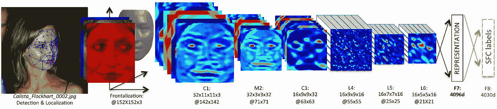
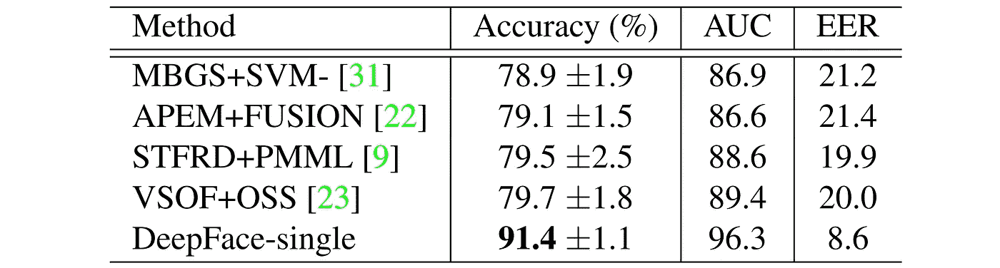
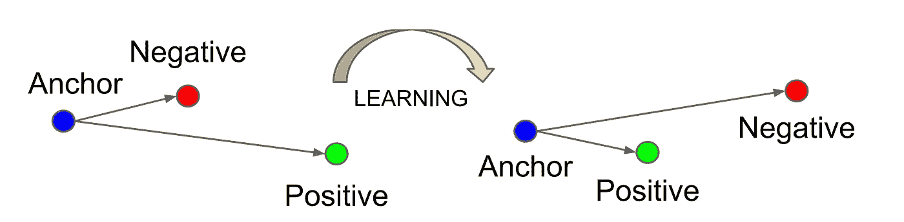
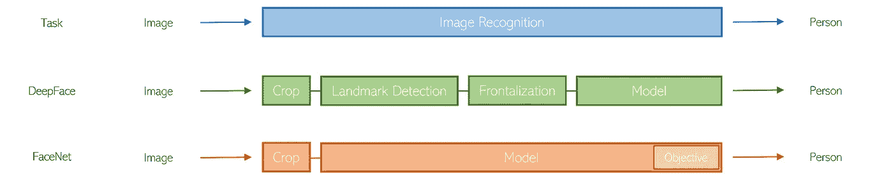
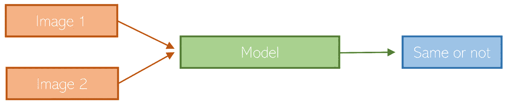

# 面部识别的演变——深度学习转型的案例研究

> 原文：<https://towardsdatascience.com/the-evolution-of-facial-recognition-a-case-study-in-the-transformation-of-deep-learning-73a738fcce67?source=collection_archive---------25----------------------->

来源: [Unsplash](https://unsplash.com/photos/2LowviVHZ-E)

## 人类领域的知识不再有用

机器学习经常被描述为对“创造算法的算法”的研究。在一定程度上，这是正确的——机器学习会找到最佳模型来拟合数据。正是通过这个过程，我们获得了可以对数据进行预测的算法。

然而，这种描述有点不对劲:它抹去了人类特定任务的参与。在现实中，人类在确保机器学习算法与给定数据一起工作方面发挥着重要作用。例如，人类知道 *x* 算法不适用于共线特征，所以他们执行某种预处理来消除它们。

甚至更进一步，很多机器学习算法都布满了人类的手印。他们都有某种偏见(不是统计意义上的)以某种方式或另一种方式学习。机器学习算法需要精心挑选，以便它们的偏差能够很好地处理给定的数据。

尽管没有免费的午餐定理为“万能学习者”的不可能性提供了理论上的吸引力，但深度学习是朝着这个方向迈出的一大步。如果你愿意，神经网络是“创造机器学习算法的算法”深度学习与机器学习的区别在于其模型的大规模参数化。

因此，深度学习模型不仅比机器学习模型更强大，而且在不同的背景下更具普遍性。一些“模板模型”如 EfficientNet 或 ResNet 可以满足各种各样的图像识别环境，从 X 射线诊断到数字识别。因此，深度学习需要更少的数据预处理。

深度学习隐含着人类的知识没有用。对人类来说，让优化器在损失场景中自由活动并发展自己的学习比人类强加人类约束更好。

面部识别是一个特别有趣的问题，因为似乎与“人类知识无用”的假设相反，人类可以“帮助”深度学习模型。至关重要的是，人脸的结构在所有图像中都是一致的，细微的差异很重要。

人类对人脸了解很多，一个模特从一些人类的支持中受益似乎是唯一合理的。

脸书的面部识别模型 DeepFace 利用人类对数据集和任务的知识开发了一个多步管道。

1.  *在图像/人脸裁剪中检测人脸*。这个步骤从图像中去除任意的背景，这样人脸本身就是识别的对象。
2.  *识别面部标志*。这在视觉上相当于把一个“网”放在脸上；识别对应于各种面部标志如前额或鼻子中心的几个点。
3.  *临街*。使用这些数据点，脸部被“扭曲”,使得人面向前方。也就是说，如果两个不同的人看向不同的方向，他们可能会看起来不同，所以这种校正有助于进一步突出身份的潜在差异。
4.  *将预处理后的人脸传入神经网络*。一旦面部被对齐和调整，它就被传递到神经网络中进行分类。

来源:[深面纸](https://www.cs.toronto.edu/~ranzato/publications/taigman_cvpr14.pdf)。

尤其是在当前，这条管道的范围之广可能令人惊讶。面部检测、地标识别和正面化的前三个步骤不是微不足道的步骤。此外，还有许多人类假设，例如:

*   面部检测算法不会模糊重要的特征，如下巴的底部或额头的尖端。
*   临街化有助于模型。
*   临街化不会模糊或扭曲重要的特征。

然而，DeepFace 是在深度学习迅速崛起的早期构思的。此前，更多传统的机器学习算法，如线性判别分析和支持向量机被采用。DeepFace 在面部识别方面接近人类的表现，并在计算机准确性方面取得了令人印象深刻的进步。

与以前的算法相比，在特定面部识别数据集上的准确度有了令人印象深刻的提高。来源: [DeepFace paper](https://www.cs.toronto.edu/~ranzato/publications/taigman_cvpr14.pdf) 。

2015 年，在 DeepFace 发布后不久，谷歌发布了面部识别开发产品 FaceNet。它与 DeepFace 的根本区别在于，一个卷积神经网络用于整个端到端过程，而不是几个。

FaceNet 接受了关于*三重缺失*的培训。也就是说，网络被输入三幅图像——两幅来自人 A，一幅来自人 b。其目标是使人 A 的两幅图像之间的距离最小化，并使人 A 的图像和人 b 的图像之间的差异最大化

最小化锚和正片之间的距离；最大化锚和底片之间的距离。来源: [FaceNet 论文](https://www.cv-foundation.org/openaccess/content_cvpr_2015/papers/Schroff_FaceNet_A_Unified_2015_CVPR_paper.pdf)。

通过从不同角度收集大量数据并照明，这种三重损失的发展将来自 DeepFace 的误差减少了七倍以上。FaceNet 对姿势、光照甚至年龄都是不变的。此外，除了人脸裁剪之外，FaceNet 不需要任何预处理，也不会从中受益。正如作者所写的，

> “我们的端到端培训不仅简化了设置，还表明直接优化与手头任务相关的损失可以提高绩效。”

人类将复杂的任务分成更小的步骤，已经变得不如一个端到端的深度学习模型有效。

我们可以这样理解人脸识别方法的变化。可以认为是“为模型赋能”。

*   *减少对模型本身的约束*。将图像识别的任务分解为如何进行面部识别的非常人性化的概念是该模型的一个限制。
*   *阐明模型的目的*。也就是说，它不是改变模型本身来满足我们的需求，而是以某种方式引导，使得对数据的理解更加清晰。

这可以被认为是从“人类领导模型”到“模型领导人类”的转变。

同样，这导致应用程序的通用性增加。DeepFace 只能应用于面，因为它依赖于特定于面的管道。另一方面，FaceNet 可以应用于任何识别问题。

然而，FaceNet 是在 2015 年构思的——就深度学习发展而言，相当于过去相当长的时间。然而，自那以后，这种端到端开发和调整目标的趋势，以及模型本身的形状，一直在继续。

例如，最近提出的暹罗网络比较两幅图像，并返回它们是否属于同一类。当每个人的样本非常少时，它在大规模图像识别系统中特别有效。

暹罗网络架构。

在深度学习的未来，我们可以进一步期待“为模型赋能”的努力。人类领域知识继续停止提供帮助，模型将继续在各种环境中增加通用性。

越来越多的，我们看到模型不是任意分离的，而是进一步相互联系的。对预处理和后处理的依赖减少了，取而代之的是更大的信任，即给定任务的正确框架，模型可以比任何人走得更远。

## 感谢阅读！

如果你喜欢这篇文章，你可能会喜欢相关的文章。

</a-fascinating-state-of-the-art-method-to-train-neural-networks-on-dishonest-data-bcbf51dd0b59>  </can-transformers-solve-this-90-year-old-classic-computer-science-problem-better-than-human-8ef78bb2e9d8>  

*所有数字均由作者创作，除非另有说明。*