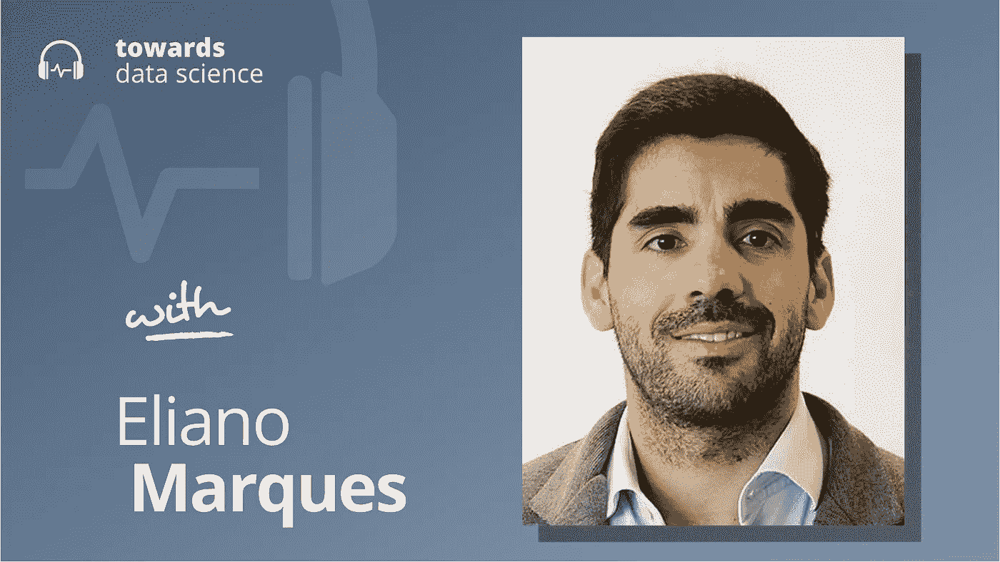

# 人工智能隐私和数据安全的(不断发展的)世界

> 原文：<https://towardsdatascience.com/the-evolving-world-of-ai-privacy-and-data-security-8e1bf3b5cdd6?source=collection_archive---------33----------------------->

## [播客](https://towardsdatascience.com/tagged/tds-podcast)

## 埃利亚诺·马克斯谈定义和保护隐私的挑战

[苹果](https://podcasts.apple.com/ca/podcast/towards-data-science/id1470952338?mt=2) | [谷歌](https://www.google.com/podcasts?feed=aHR0cHM6Ly9hbmNob3IuZm0vcy8zNmI0ODQ0L3BvZGNhc3QvcnNz) | [SPOTIFY](https://open.spotify.com/show/63diy2DtpHzQfeNVxAPZgU) | [其他](https://anchor.fm/towardsdatascience)

*编者按:这一集是我们关于数据科学和机器学习新兴问题的播客系列的一部分*，*由 Jeremie Harris 主持。除了主持播客，Jeremie 还帮助运营一家名为*[*sharpes minds*](http://sharpestminds.com)*的数据科学导师初创公司。*

我们都重视隐私，但我们大多数人都很难定义它。这有一个很好的理由:我们对隐私的看法是由我们使用的技术决定的。随着新技术允许我们用数据交换服务，或者以不同的形式为隐私付费，我们的期望发生了变化，隐私标准也在发展。隐私是一个移动的目标。

理解和执行隐私标准的挑战并不新鲜，但鉴于近年来人工智能的快速发展，这一挑战变得更加重要。仅仅在十年前毫无用处的数据——例如非结构化文本和图像——现在成了宝贵的财富。公司应该有权使用他们最初在价值有限的时候收集的数据吗，现在它不再是了。公司有义务提供最大限度的隐私而不直接向客户收费吗？人工智能中的隐私既是一个技术问题，也是一个哲学问题。为了讨论这个问题，我邀请了 Protegrity 的数据和人工智能执行副总裁 Eliano Marques，这是一家专门为大公司提供隐私和数据保护的公司。埃利亚诺在过去十年里一直从事数据隐私方面的工作。

以下是我在对话中最喜欢的一些观点:

*   即使是大型的知名公司通常也不知道谁应该对隐私负责——是首席信息官、首席技术官、首席安全官，还是其他人。但是因为他们致力于解决隐私问题——或者至少，被人看到他们在解决这些问题——他们还是设立了隐私倡议。虽然如果组织层面的责任更加清晰，这些举措不太可能发挥最大作用，但不清楚它们是不是一件坏事:它们代表了对隐私的一种有点笨拙但有价值的初始投资，并向消费者和其他公司发出了隐私问题值得解决的信号。
*   许多人本能地不喜欢定向广告，但还不清楚它们弊大于利。广告最好的版本就是一个通知，告诉你一个产品正是你所需要的。由于我们在使用某项服务时会以这样或那样的方式面对广告，因此，大量不相关的广告会比少量有针对性的帖子更好，这一点并不明显。广告定位可以说是一种平衡功能，允许每个人以大致相同的隐私成本免费获得服务，而另一种选择在某些情况下需要用户为他们的隐私付费。
*   在过去十年中，数据泄露和隐私攻击发生了很大变化。埃利亚诺解释说，十年前，黑客攻击几乎只针对原始数据。但今天，算法是一个越来越重要的漏洞:恶意行为者可以毒害训练数据，并提取由神经网络等机器学习模型记忆的信息，有效地获得了进入原本可能被认为是安全的数据的后门。
*   埃利亚诺认为，确保用户隐私得到尊重的关键是让用户意识到，当他们以某种方式与产品互动时，他们会做出特定的隐私权衡。这意味着向用户解释为什么需要某些数据，并允许他们以清晰地映射到他们可以使用的产品功能的方式轻松修改他们的个人隐私设置。这在很大程度上是因为每个人对隐私都有不同的定义，而且没有一个明确的衡量标准或标准来定义隐私原则。

## **章节**:

*   0:00 介绍
*   1:40 埃利亚诺的背景
*   8:25 技术人员缺什么？
*   17:30 数据隐私意识
*   23:02 定向广告的价值
*   27:30 购买自己的隐私
*   38:15 隐私指标
*   44:10 隐私问题教育
*   53:26 总结