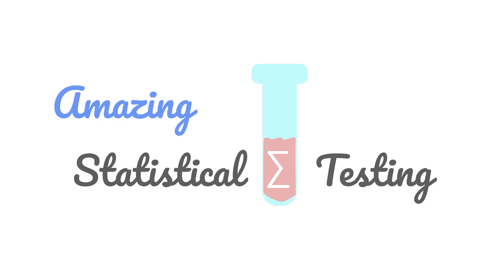
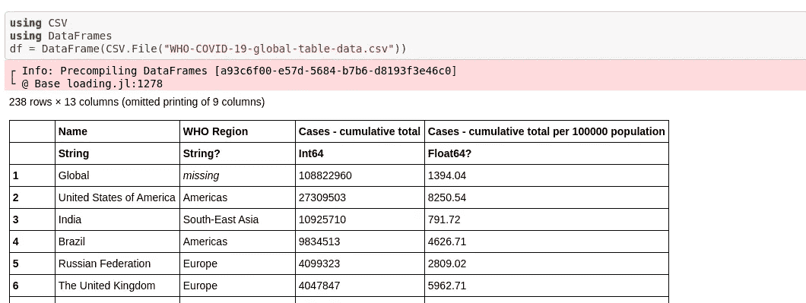
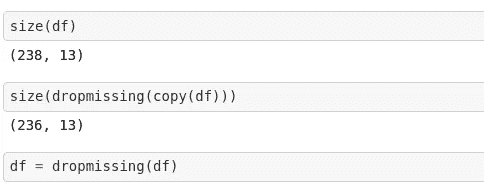
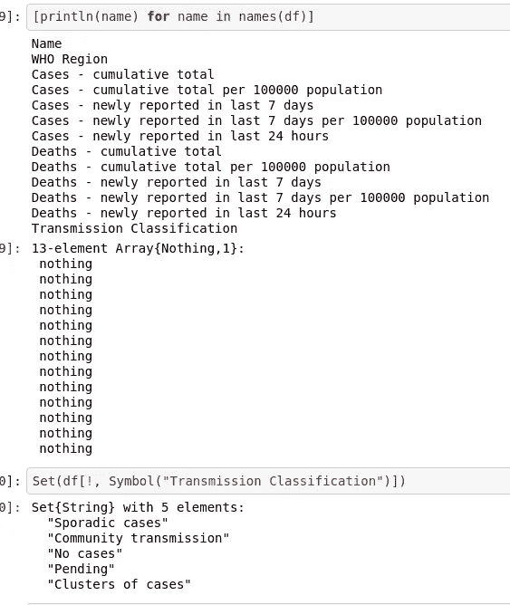
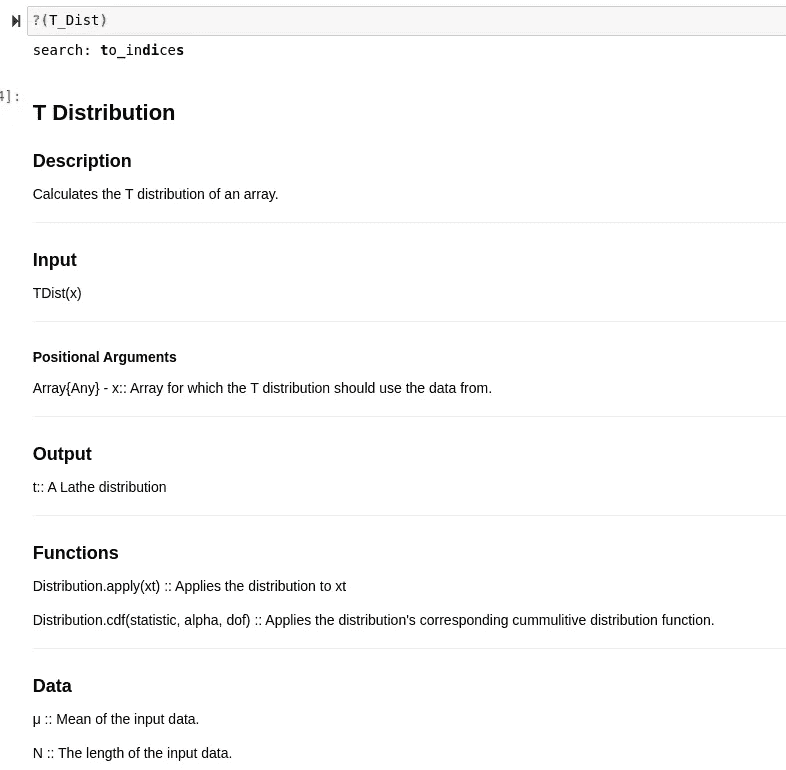
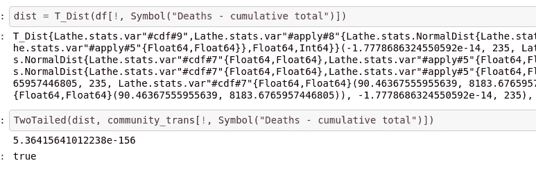

# 在 Julia 中执行统计测试的令人兴奋的新方法

> 原文：<https://towardsdatascience.com/the-exciting-new-way-to-perform-statistical-tests-in-julia-e0dc80fa9a9b?source=collection_archive---------35----------------------->

## 激动人心的新测试方法在最新版本的车床朱莉娅。



(图片由作者提供)

# 介绍

Julia 中的统计测试总是比许多语言竞争者更难做。对于很多 Julia 软件来说，这当然是真的，因为它太年轻了，但我认为统计测试尤其受到了这种衰弱的打击。虽然 Julia 有一些可以组合起来以获得统计值的相当分段的基础包，但是这些包也经常由不同的人在不同的时间出于不同的目的而创建。因此，记住这一点，完成简单的工作，如执行 T-test，在生态系统中可能是一场噩梦。

需要澄清的是，这并不是说 T-test 在当前没有 Lathe 的 Julia 生态系统中是不可行的，但是我确实认为这个包有一个很好的测试方法，而且；

> 统计测试自动化。

如果你感到困惑，并且从未听说过车床，你可以在 GitHub 上查看:

[](https://github.com/ChifiSource/Lathe.jl) [## ChifiSource/Lathe.jl

### Lathe.jl 是 Julia 中用于预测建模的一体化软件包。它附带了一个统计库…

github.com](https://github.com/ChifiSource/Lathe.jl) 

对于这篇文章以及以后类似的文章，我创建了一个名为车床书籍的新存储库。我对这个新的存储库的意图是为那些想使用该软件，但可能不知道如何使用的人创建一个更好的方法，用真实世界的例子来演示它，这些例子在数据方面是可重复的。此存储库中的所有笔记本都将从存储库或外部来源加载文件。这与我的其他笔记本储存库有很大的不同，因为它真的很容易实验。下面是我在这篇文章中使用的笔记本的链接:

[](https://github.com/emmettgb/Lathe-Books/blob/main/stats/stats_InferentialTesting.ipynb) [## emmett GB/车床书籍

### 使用和演示车床的笔记本。jl 软件-emmettgb/车床-书籍

github.com](https://github.com/emmettgb/Lathe-Books/blob/main/stats/stats_InferentialTesting.ipynb) 

# 数据

正如我在介绍中提到的，我希望这些项目的所有数据都可以从远程来源获得。考虑到这一点，我确实发现了一些直接来自世界卫生组织的非常激进的数据，我觉得这些数据对新冠肺炎非常有意思。尽管这次疫情非常糟糕，但我必须承认，利用从这种情况中得出的数据进行工作是非常棒的。在我看来，在 Julia 中从互联网上获取随机文件的最佳方式是使用 wget。当然那不是 Julia，那是 Bash，所以我可以说从互联网时代获得随机文件的最好方法是 wget。然而，在 Julia 中，我们将需要来自 Base 的 run()方法，它将接受一个表达式。

```
**using** Base: run
run(`wget https://covid19.who.int/WHO-COVID-19-global-table-data.csv`)
```

这将下载一个新文件， ***【世卫组织-新冠肺炎-全球-表格-数据. CSV .】*让我们用 CSV.jl 和 DataFrames.jl 读入该文件。有两种方法可以做到这一点，但据我对 DataFrames.jl 的工作所知，真正首选的方法实际上是不使用 sink 参数，这是我过去一直使用的方法。sink 参数会产生许多问题和奇怪的 bug，这些问题和 bug 都可以追溯到使用这种方法。CSV.read()方法也是如此。DataFrames.jl 的做法是将文件放入 DataFrame 构造函数中，如下所示:**

```
**using** CSV 
**using** DataFrames 
df = DataFrame(CSV.File("WHO-COVID-19-global-table-data.csv"))
```



(图片由作者提供)

如上图所示，该数据框中有十三个要素。人们可能会观察到的另一个现象是，这些数据中存在缺失值。每当我发现缺少值时，我总是做的第一件事就是检查大小。我这样做的原因是比较丢失前后的大小，看看我是否真的需要观察计数。如果你来自 Python 世界，让我们看看它的大小或形状。别担心，我通常不小心输入了形状(df ),然后不得不把它改成大小。无论如何，通常如果丢弃破坏了数据的完整性，那么我们需要寻找一种不同的解决方案，例如丢弃不良特征，或者用统计上不太重要的东西填充那些缺失的值，例如均值或多数类。

```
size(df)size(dropmissing(copy(df)))
```



(图片由作者提供)

考虑到如果我从这个数据框中丢弃丢失的值，我只会丢失两个观察值，我认为可以肯定地说，继续处理并丢弃它们可能不是一个坏主意。现在我们可以利用我喜欢的三种不同的技术来探索我们的特性。

这三种技术中的第一种是只显示每一列，这样我们就可以对数据类型有一个概念，就是将 allcols 关键字参数添加到 show()方法中。这将允许我们看到原始显示中省略的列，以及它们各自的数据类型和观察值。

```
show(df, allcols = true)
```

这样的输出可能相当复杂，难以阅读。我们查看这些维度的另一种方法是 names(df ),它将给出数据框中所有列的名称。

```
[println(name) **for** name in names(df)]
```



(图片由作者提供)

对于分类特性，我们可以利用 Set()转换来获取特性中所有的唯一类。对于连续问题，我们可以使用平均值来观察我们特征的数学平均值。我想测试不同的传输分类，所以我决定将这个特性转换成 Set()类型。

当然，在这组数据中有许多不同的独特观察结果，它们很可能对死亡和病例都有统计学意义。像“社区传播”这样的分类很可能有更多的确诊病例，特别是在过去 7 天内。也就是说，我们可以根据这一想法制定一个假设。

> 如果传播分类是“社区传播”，那么这很可能与较高的病例数相关。

这似乎是相对显而易见的，但在科学领域，如果定性事实听起来很现实，这并不重要，除非我们对相关性进行定性判断。也就是说，我们不能因为这个假设有意义就去证明它，但是如果它对两个维度的关联没有任何定性意义，我们还是可以接受零假设。

# 测试

现在我们有了一些数据，我们至少了解了一点，我们可以继续进行测试，以证明我们的假设。这方面的第一步是将我们想要测试的样本与其余的人群分开。在这种情况下，我们的样本将是在“传播分类”维度上属于“社区传播”类别的所有观察结果。在 Julia 中有很多方法可以做到这一点，比如 filter()方法，但是我非常喜欢使用 find all。这两种方法的区别在于，findall 将提取相关值，而 filter 将创建一个条件掩膜(通常为 BitArray 类型),该掩膜将应用于数据框，以移除与过滤条件不匹配的值。下面是我在这个实例中如何使用 findall:

```
community_trans = df[findall(in(["Community transmission"]), df[!, Symbol("Transmission Classification")]), :]
```

现在让我们从车床进口我们需要的东西。新的测试方法利用了车床中已经提供的分布基础。我们可以创建一个分布对象，然后通过一个名为 TwoTailed()的函数传递新的分布，以便执行双尾测试。我还打算导入一个 T 分布，以及抽象的车床分布类型，分布。

当然，t 分布是我们将要测试的分布。另一方面，分布类型只是函数采用的一个抽象类型，T 分布是它的一个子类型，这正是我想要通过导入它来演示的:

```
using Lathe.stats: T_Dist, TwoTailed, Distribution
```

现在如果我们使用子类型操作符，<:/>

```
T_Dist <: Distribution
true
```

我们可以通过简单地提供总人口作为位置参数来创建我们的分布。如果我们想了解更多关于发行版的功能，我们总是可以做到的

```
?(T_Dist)
```



(图片由作者提供)

该结构中的 apply()函数将对数据应用概率密度函数或 pdf。cdf()函数当然会对累积密度函数做同样的事情。在 t 分布的例子中，这将是较低的正则化不完全 beta 函数。让我们从最初的 df 中创建一个包含普通人群的新分布:

```
dist = T_Dist(df[!, Symbol("Deaths - cumulative total")])
```

现在，我们可以通过调用 TwoTailed()方法并提供我们的分布和示例作为位置参数，再用一行代码进行测试:

```
TwoTailed(dist, community_trans[!, Symbol("Deaths - cumulative total")])
```



(图片由作者提供)

Julia 可能对它的科学符号有点讨厌，但很难想象这在统计学上有多大意义。该函数实际上将返回一个布尔类型，而不是一个 P 值。我将更多地讨论为什么结论中会有这一点，但它确实为统计自动化中一些有趣的想法打开了大门。回到 P 值，这个数字大约是. 00000…53，这表示非常高的统计显著性。我们还可以为这个测试方法提供一个额外的关键字参数，它将允许我们调整我们的置信度和 alpha 值。看一下文档，您可能会注意到关键字参数 C 的存在。C 将取一个浮点数 64，这是我们希望测试的置信度百分比。默认情况下，这是 0.95，使得我们的 alpha 值为 0.05，这对于假设检验来说是相当标准的。

# 结论

我真的很兴奋车床的突破性发布，我们将很快看到。这个新版本的伟大之处在于，软件包的每个部分都经过了显著的改进，加入了一些非常棒的新功能和工具，我认为这些功能和工具肯定会对任何数据科学家有用。我特别兴奋地加入了新的自动化后端，这些后端将允许自动数据处理、统计，当然还有预测建模。总而言之，车床软件包正变得越来越有用，我认为它将很快对机器学习产生重大影响。感谢您的阅读，我希望这篇文章至少是有见地和有趣的！