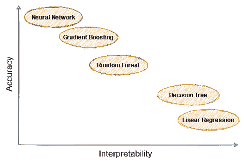
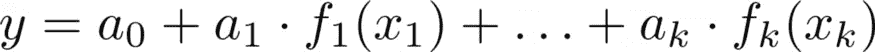
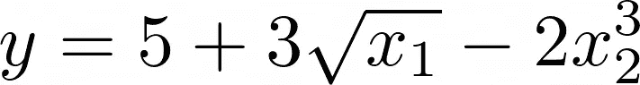
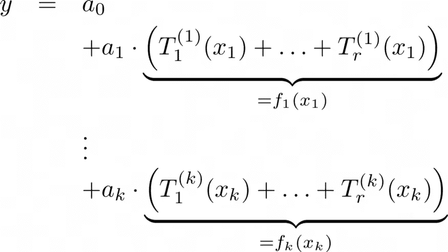
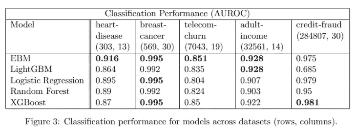
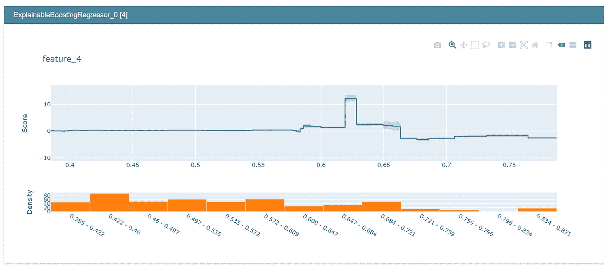

# 可解释的助推器

> 原文：<https://towardsdatascience.com/the-explainable-boosting-machine-f24152509ebb?source=collection_archive---------1----------------------->

## [可解释的人工智能](https://medium.com/tag/explainable-ai)

## 像梯度推进一样精确，像线性回归一样可解释。


由 [Fabrice Villard](https://unsplash.com/@fabulu75?utm_source=medium&utm_medium=referral) 在 [Unsplash](https://unsplash.com?utm_source=medium&utm_medium=referral) 上拍摄

# 可解释性和准确性的权衡

在机器学习社区，我经常听到和读到关于*可解释性*和*准确性*的概念，以及它们之间如何进行权衡。通常，它是这样描述的:



图片由作者提供。

你可以这样理解:线性回归和决策树是非常简单的模型，一般来说并不精确。神经网络是*黑盒模型*，也就是说，它们很难解释，但通常表现得相当不错。像随机森林和梯度推进这样的集合模型也不错，但很难解释。

## 可解释性

但是什么是可解释性呢？对此没有明确的数学定义。一些作者，如[1]和[2]将可解释性定义为人类可以理解和/或预测模型输出的属性**。这有点不切实际，但我们仍然可以根据这一点对机器学习模型进行分类。**

为什么线性回归 *y=ax+b+ɛ* 可以解释？因为你可以说类似“增加一个 *x* 增加一个 *a* 的结果”。该模型不会给你一个意外的输出。越大的 *x* ，越大的 *y* 。较小的 *x* 较小的 *y* 。没有输入 *x* 会让 *y* 以奇怪的方式摆动。

为什么神经网络不可解释？好吧，试着猜测一个 128 层深度神经网络的输出，不用实际实现，不用纸笔。当然，输出是根据某个大公式得出的，但是即使我告诉你对于 *x* =1，输出是 *y* =10，对于 *x* =3，输出是 *y* =12，你也猜不出 *x* =2 的输出。可能是 11，可能是-420。

## 准确(性)

这是你能接受的——原始数据。对于回归，均方差、平均绝对误差、平均绝对百分比误差，应有尽有。对于分类，F1，精度，召回，当然，还有老国王本人的准确性。

让我们回到图片上来。虽然我同意这一点，但我想强调以下几点:

> **可解释性和准确性之间没有内在的平衡**。有些模型既可解释又准确。

所以，不要让这张图骗了你。**可解释的助推机器**将帮助我们突破中间向下倾斜的线，到达我们图表右上角的圣杯。


图片由作者提供。

*(当然，您也可以创建不准确且难以解释的模型。这是一个你可以自己做的练习。)*

阅读本文后，您将能够

*   理解为什么可解释性很重要，
*   解释黑箱解释的缺点，如石灰和沙普利值，以及
*   理解并使用可解释的助推机器学习器

# 解释的重要性

能够解释模型有几个好处。它可以帮助您改进模型，有时它甚至是业务所必需的，简单明了。

## 模型改进


照片由[alevision.co](https://unsplash.com/@alevisionco?utm_source=medium&utm_medium=referral)在 [Unsplash](https://unsplash.com?utm_source=medium&utm_medium=referral) 上拍摄

假设你想建立一个模型来预测房子的价格。*有创意吧？*其中一个输入特征是**房间数量**。其他特征包括大小、建造年份和一些衡量社区质量的指标。标准化特征后，您决定使用线性回归。测试集上的 *r* 很好，您可以部署模型。在稍后的时间点，新的房屋数据进来，你注意到你的模型相当偏离。**哪里出了问题？**

由于线性回归具有高度的可解释性，您可以直接看到答案:特征“房间数量”的系数是负的，尽管作为一个人，您会期望它是正的。房间越多越好，对吧？但是**型号因为某种原因学了相反的**。

这可能有很多原因。也许你的训练和测试集是有偏见的，如果一个房子有更多的房间，它往往是旧的。如果房子越旧，价格就越便宜。

这是你唯一能够发现的东西，因为你可以看看模型内部是如何工作的。您不仅可以发现它，还可以修复它:您可以将“房间数”的系数设置为零，或者您也可以重新训练该模型并将“房间数”的系数强制为正。这是你可以通过设置关键字`positive=True`用 scikit-learn 的`LinearRegression`做的事情。

> 注意，这将所有的 T2 系数设为正。如果你想完全控制系数，你必须写你自己的线性回归。你可以查看[这篇文章](/build-your-own-custom-scikit-learn-regression-5d0d718f289)来开始。

## 业务或法规要求


[廷杰律师事务所](https://unsplash.com/@tingeyinjurylawfirm?utm_source=medium&utm_medium=referral)在 [Unsplash](https://unsplash.com?utm_source=medium&utm_medium=referral) 上拍摄的照片

通常，利益相关者希望至少有一些关于事情为什么会发生的直觉，你必须能够向他们解释。虽然即使是最非技术人员也可以同意“我将一堆数字加在一起”(线性回归)或“我沿着一条路径走，并根据一些简单的条件向左或向右走”(决策树)，但对于神经网络或集成方法来说，这要困难得多。农民不知道的东西他不吃。这是可以理解的，因为这些利益相关者经常要向其他人报告，而其他人也需要对事情大致如何运作的解释。祝你好运，向你的老板解释梯度推进，这样他或她可以把知识传递给更高的实例，而不会犯任何重大错误。

除此之外，可解释性甚至可能是法律所要求的。如果你为一家银行工作，并且创建了一个决定一个人是否能获得贷款的模型，那么你很有可能被法律要求创建一个可解释的模型，这可能是逻辑回归。

在我们讨论可解释的助推机器之前，让我们先看看一些解释黑盒模型的方法。

# 黑盒模型的解释


劳拉·乔伊特在 [Unsplash](https://unsplash.com?utm_source=medium&utm_medium=referral) 上拍摄的照片

有几种方法试图解释黑盒模型的工作原理。所有这些方法的优点是你可以利用你已经训练好的模型，并在此基础上训练一些解释者。这些解释器使模型更容易理解。

这种解释器的著名例子是局部可解释的模型不可知解释(*LIME*)【3】和 Shapley 值【4】。让我们快速了解一下这两种方法的缺点。

## 石灰的缺点

在 LIME 中，你试图一次解释你的模型的一个预测。给定一个样本 *x* ，为什么标签是 *y* ？假设您可以在围绕 *x.* 的封闭区域中用一个可解释的模型来近似您的复杂黑盒模型。这个模型被称为**代理模型**，通常为此选择线性/逻辑回归或决策树。然而，如果近似不好，你可能没有注意到，解释就会产生误导。

还是一个你要注意的[甜库](https://github.com/marcotcr/lime)。

## 沙普利值

使用 Shapley 值，可以将每个预测分解为每个特征的单独贡献。例如，如果您的模型输出 50，使用 Shapley 值，您可以说要素 1 贡献了 10，要素 2 贡献了 60，要素 3 贡献了-20。这三个 Shapley 值之和是 10+60–20 = 50，即模型的输出。这很好，但遗憾的是，这些值极难计算。

对于一般的黑盒模型，计算它们的运行时间是特征数量的指数级。如果你有几个特性，比如 10 个，这可能还是可以的。但是，根据你的硬件，20 美元可能已经不可能了。公平地说，如果你的黑盒模型由树组成，有更快的近似值来计算 Shapley 值，但它仍然会很慢。

不过，Python 有一个很棒的 [shap 库](https://shap.readthedocs.io/en/latest/)，它可以计算 Shapley 值，你绝对应该去看看！

不要误解我。**黑盒解释比完全没有解释要好得多**，所以如果你出于某种原因不得不使用黑盒模型，就使用它们。但是当然，如果你的模型表现良好*并且同时*是可解释的，那就更好了。现在终于到了继续寻找这种方法的代表的时候了。

# 可解释的助推器

可解释的助推的基本思想一点也不新鲜。它始于加法模型，早在 1981 年就由杰罗姆·h·弗里德曼和沃纳·斯图兹尔首创。这种类型的模型具有以下形式:



图片由作者提供。

其中 *y* 是预测值，而 *x* ₁、…、 *xₖ* 是输入特征。

## 一位老友

我声称你们所有人都已经偶然发现了这样一个模型。让我们大声说出来:

> 线性回归！

线性回归只不过是一种特殊的可加模型。在这里，所有的功能 *fᵢ* 就是身份，即*。f* ᵢ( *xᵢ* ) = *xᵢ* 。很简单，对吧？但是你也知道，如果违背了[的假设](https://en.wikipedia.org/wiki/Linear_regression#Assumptions)，特别是**的线性假设**，线性回归可能不是精度方面的最佳选择。

我们需要的是更通用的函数，能够捕捉输入和输出变量之间更复杂的相关性。微软的一些人给出了一个如何设计这种功能的有趣例子[5]。更好的是:他们为 Python 甚至围绕这个想法开发了一个舒适的包。

注意，在下文中，我将只描述可解释的增压**回归变量**。分类也很有效，并不复杂。

## 解释

你可能会说:

> 有了这些函数 f，这看起来比线性回归更复杂。这个怎么更容易解读？

为了说明这一点，假设我们已经训练了一个如下所示的附加模型:



图片由作者提供。

您可以将(16，2)插入到模型中，并接收 5+12–16 = 1 作为输出。这是已经分解的 1 的输出——有一个 5 的*基线*,然后功能 1 提供了一个额外的 12，功能 3 提供了一个额外的-16。

事实上，所有的功能，即使它们很复杂，也只是由简单的加法组成，这使得这个模型很容易解释。

现在让我们看看这个模型是如何工作的。

## 这个想法

作者以类似梯度推进的方式使用小树。如果你不知道梯度增强是如何工作的，请参考这个很棒的视频。

现在，代替在所有特征上训练每棵小树，可解释的增强回归器的作者提议用**一次一个特征**训练每棵小树。这将创建一个如下所示的模型:



图片由作者提供。

**你可以在这里看到以下内容:**

*   每个 *T* 都是深度小的树。
*   对于每一个 *k* 特征， *r* 树被训练。所以，你可以在方程中看到 *k*r* 不同的树。
*   对于每个特征，其所有树的总和就是前面提到的 *f* 。

这意味着函数 *f* 由小树的和组成。由于树的用途非常广泛，许多复杂的函数都可以非常精确地建模。

请务必观看此视频，了解另一种解释:

好吧，我们已经看到了它是如何工作的，你可以很容易地解释可解释的增压机的输出。但是这些模型有什么好的吗？他们的论文[5]这样写道:



图片摘自[5]。可解释增压机。

我看不错！当然，我也测试了这个算法，它在我的数据集上也很有效。说到测试，让我们看看如何在 Python 中实际使用可解释的 boosting。

## 在 Python 中使用可解释的增强

微软的[解释包](https://github.com/interpretml/interpret)使得使用 explainable boosting 变得轻而易举，因为它使用了 scikit-learn API。这里有一个小例子:

```
from interpret.glassbox import ExplainableBoostingRegressor
from sklearn.datasets import load_boston

X, y = load_boston(return_X_y=True)

ebm = ExplainableBoostingRegressor()
ebm.fit(X, y)
```

这没什么奇怪的。但是解释包提供了更多的东西。我特别喜欢可视化工具。

```
from interpret import show

show(ebm.explain_global())
```

除此之外，`show`方法甚至可以让您检查函数 *f* 。这里是针对特性 4(*NOX；波士顿住房数据集的氮氧化物浓度*。



图片由作者提供。

这里可以看到，最高到 0.58 左右，NOX 对房价没有影响。从 0.58 开始，影响变得略微积极，0.62 左右的 NOX 值对房价的积极影响最高。然后，它再次下降，直到对于大于 0.66 的 NOX 值，影响变为负的**。**

# 结论

在本文中，我们已经看到了可解释性是一个理想的属性。如果我们的模型在默认情况下是不可解释的，我们仍然可以用诸如 LIME 和 Shapley 值这样的方法来帮助自己。这比什么都不做要好，但是这些方法也有它们的缺点。

然后，我们介绍了可解释的 boosting machine，它的精度可与梯度 boosting 算法(如 XGBoost 和 LightGBM)相媲美，但也是可解释的。这表明准确性和可解释性并不相互排斥。

多亏了解释包，在生产中使用可解释的增强并不困难。

## 微小的改进空间

这是一个很棒的库，目前只有一个主要缺点:**它只支持树作为基础学习者**。大多数时候这可能就足够了，但是如果你需要*单调*函数，比如说，你现在是一个人。然而，我认为这应该很容易实现:开发人员只需添加两个功能:

1.  **支持一般基础学习者。**然后我们可以使用[保序回归](https://en.wikipedia.org/wiki/Isotonic_regression)来创建单调函数。
2.  **支持不同基础学习者的不同功能。因为对于某些特征，你希望你的函数单调增加，对于其他特征，你不在乎。**

你可以在这里查看讨论[。](https://github.com/interpretml/interpret/issues/184)

# 参考

[1]t .米勒(2019 年)。[人工智能的解释:来自社会科学的见解](https://arxiv.org/abs/1706.07269)。*人工智能*， *267* ，1–38。

[2] Kim，b .，Koyejo，o .，& Khanna，R. (2016 年 12 月)。[例子还不够，学会批判！对可解释性的批评](https://papers.nips.cc/paper/2016/hash/5680522b8e2bb01943234bce7bf84534-Abstract.html)。在*辊隙中*(第 2280–2288 页)。

[3]里贝罗，M. T .，辛格，s .，& Guestrin，C. (2016 年 8 月)。[“我为什么要相信你？”解释任何分类器的预测](https://arxiv.org/abs/1602.04938)。第 22 届 ACM SIGKDD 知识发现和数据挖掘国际会议论文集*(第 1135-1144 页)。*

[4] Lundberg，s .，，Lee，S. I. (2017)。[解释模型预测的统一方法](https://arxiv.org/abs/1705.07874)。 *arXiv 预印本 arXiv:1705.07874* 。

[5]诺里，h .，詹金斯，s .，科赫，p .，&卡鲁阿纳，R. (2019)。Interpretml:机器学习可解释性的统一框架。 *arXiv 预印本 arXiv:1909.09223* 。

> 感谢 Patrick Bormann 的有用评论！

我希望你今天学到了新的、有趣的、有用的东西。感谢阅读！

**作为最后一点，如果你**

1.  **想支持我多写点机器学习和**
2.  **无论如何，计划获得一个中等订阅，**

**为什么不做** [**通过这个环节**](https://dr-robert-kuebler.medium.com/membership) **？这将对我帮助很大！😊**

*说白了，给你的价格不变，但是大约一半的订阅费直接归我。*

非常感谢，如果你考虑支持我的话！

> *有问题就在*[*LinkedIn*](https://www.linkedin.com/in/dr-robert-k%C3%BCbler-983859150/)*上写我！*