# 探索-开发权衡:直觉和策略

> 原文：<https://towardsdatascience.com/the-exploration-exploitation-dilemma-f5622fbe1e82?source=collection_archive---------10----------------------->

## [思想和理论](https://towardsdatascience.com/tagged/thoughts-and-theory)

## 理解贪婪、乐观初始化、UCB 和汤普森采样策略

鸣谢:[约书亚·沃罗尼耶基](https://pixabay.com/fr/users/joshuaworoniecki-12734309/)上[皮克斯拜](https://pixabay.com/)

这篇文章是与巴蒂斯特·罗卡共同撰写的。

# 介绍

“假设我目前的知识足够可靠，我应该选择看起来是最优的决定吗？或者，我是否应该做出一个目前看来不太理想的决定，假设我的知识可能不准确，而收集新信息可以帮助我改进它？”。简单来说，这就是我们如何总结**勘探-开采权衡**(也称为**勘探-开采困境**)。

当面对决策问题时，开发和探索是两种可能的行为，都有利弊。一方面,**开发包括做出关于迄今为止观察到的数据的最佳决策。这种安全的方法试图尽可能地避免错误的决策，但也阻止了发现潜在的更好的决策。另一方面，**探索包括不采取看似最优的决策，押注于观测数据不足以真正确定最佳选项的事实**。这种风险更大的方法有时会导致糟糕的决策，但也有可能发现更好的决策(如果有的话)。**

在许多情况下会遇到在开发和勘探之间做出选择的问题**，其中观察推动决策，决策导致新的观察**。当面对这样一个反馈循环(数据产生决策，决策产生数据)时，我们不得不在任何时候想知道，目前看起来最好的决策是否真的是最优的，或者观察到的数据只是不够有代表性，不足以确定真正的最优决策。目标是在这两种可能的行为之间找到一个平衡的策略。

在本帖中，我们将给出一些与勘探-开采权衡相关的关键概念，并介绍处理该问题的四种最流行的方法: **e-greedy 方法、乐观初始化、置信上限和 Thompson 采样**。我们将讨论这些方法之间存在的基本差异和相似之处，并在多臂土匪问题的特定背景下查看一些具体的例子。

## 概述

在第一部分中，我们将更多地讨论勘探-开发权衡，并介绍众所周知的多臂 bandit 框架。在第二部分中，我们将介绍 e-greedy 方法，这是进行一些探索的最天真(但有效)的方法。在第三部分，我们将介绍乐观初始化方法，并看看如何通过仔细选择我们知识的初始状态来达到一定的探索水平。在第四部分，我们将看到如何用置信区间来明确表达我们知识的不确定性，并描述 UCB 策略如何使用这些区间来推动探索。最后，在最后一节中，我们将介绍汤普森抽样，它使用我们当前的知识状态，根据每个行动成为最佳行动的概率来做出探索选择。

# 探索与开发

## 一般问题

当数据收集和决策制定之间存在某种**反馈回路时，勘探-开采困境是大多数数据驱动决策制定过程中可能遇到的一个非常普遍的问题。换句话说，一旦一个模型不再是旁观者，而是数据收集方式的参与者，探索-开发的困境就出现了。让我们考虑两个例子来说明我们的观点:第一，人脸检测模型的离线训练，第二，预测一些广告的点击率的模型的在线训练。**

在面部检测器模型的情况下，在训练之前收集数据。一旦它被训练，模型以某种方式被使用，但是没有新的数据被收集，因此，没有反馈循环需要小心。不需要考虑勘探-开采的权衡:**模型在数据收集过程中没有作用**，其输出可以这样使用**不需要进一步勘探。**

无反馈回路设置。之前已经收集了数据，并且执行了一次训练。不需要探索。

相反，在点击预测的情况下，模型不断更新，并且在收集数据的同时进行**训练**。到目前为止观察到的数据被用于训练模型，该模型被用于选择要显示的最佳广告，新收集的数据(点击或没有点击)可以被用于更新模型，等等。**模型是数据收集过程的参与者**，需要仔细考虑勘探-开采的权衡。

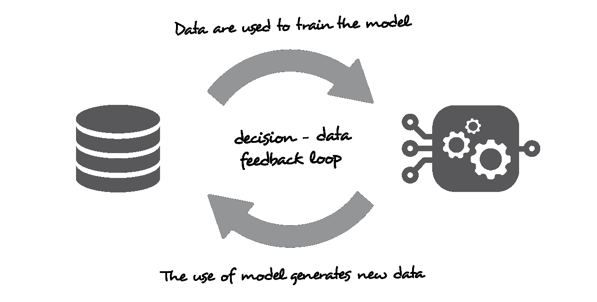

反馈回路设置。使用该模型时会收集新的数据，因此会更新该数据。为了确保数据的质量(代表性)以及模型的质量，可能需要进行探索。

事实上，如果没有探索，错误地预测广告表现不佳的模型(因为我们没有数据、数据不准确或该广告的数据过时)将不会有任何机会用新的观察来纠正自己，因为该广告将不再显示。考虑到一些探索将使尝试这个广告成为可能，并收集更多证明模型错误的数据并更新它。

一般来说，当没有足够的过去数据来训练可靠的模型时，通常需要这种在线学习过程**(**[**【冷启动问题】**](https://en.wikipedia.org/wiki/Cold_start_(recommender_systems)) **)** 或者当数据随时间演变时(非平稳问题)。在这两种情况下，从目前观察到的数据中获得的知识不允许我们绝对确定地确定要采取的最佳决策(在我们的示例中显示的最佳广告)。然后，我们必须在根据我们当前知识的最佳决策(开发)和任何其他可以通过更多信息显示为最佳的决策(探索)之间做出基本选择。

在介绍多武装匪徒的具体例子及其数学框架之前，我们可以提及一些易于理解的探索-开发困境的经典例子:

*   餐馆选择:去你最喜欢的餐馆(探索)或尝试一个不知名的餐馆(探索)
*   电影推荐:推荐用户的最佳电影类型(探索)或尝试另一种电影类型(探索)
*   石油钻探:在最著名的位置钻探(开采)或尝试新的位置(勘探)
*   临床试验:使用最著名的治疗方法(开发)或尝试一种新的实验方法(探索)

## 多兵种土匪框架

现在让我们呈现多臂(或 K 臂)bandit 框架，它将作为本文剩余部分的重复示例。K-武装匪徒问题模拟了这样一种情况:一个代理人连续几次面临 K 个相同的可能选择，每次都导致一个随机奖励，其分布是未知的。这个代理的目标是在给定的时间内最大化他得到的总回报。为了实现这个目标，在每一次迭代中，代理必须在获取更多关于 K 个选择中每一个的奖励分布的知识的需求(探索)和基于其当前知识优化奖励的需求(开发)之间进行平衡。

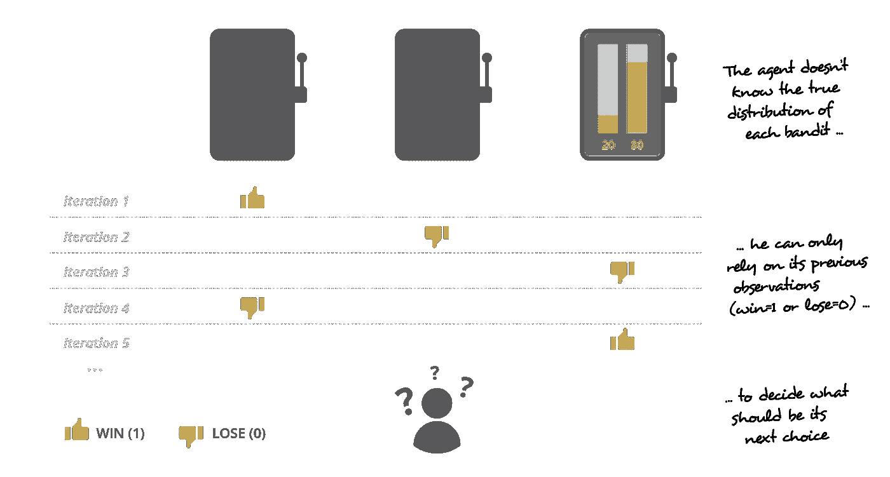

伯努利三臂强盗设定的说明:在每一次迭代中，代理人必须在探索和开发之间保持平衡。

按照设计，这个问题是**我们能想到的最直接的探索-开发困境的例子**，这就是为什么它被研究了这么长时间，并且仍然是科学界最感兴趣的问题。这些年来，在对这个相当自然的问题的研究中出现了几个重要的定理和算法，其中一些将在本文的下一节中介绍。在深入研究面对多支武装匪徒时可以使用的不同策略的细节之前，让我们定义一些有用的数学符号。

我们将在未来的例子中考虑**伯努利 K-武装匪徒问题**，这是 K-武装匪徒问题的一个特例，其中 K 奖励分布

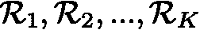

是伯努利分布。在这个非常特殊的例子中，当代理人选择行动 I 时，他得到的回报是

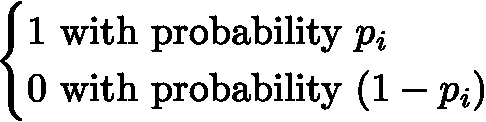

整个不确定性在于 p_i 的未知值。我们也表示

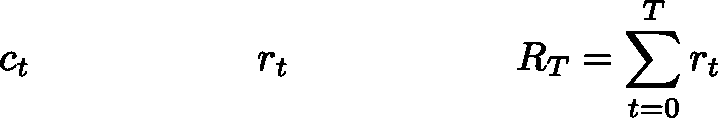

分别是迭代 t 时代理人的选择(属于{1，2，…，K})，代理人在迭代 t 时得到的报酬和从迭代 0 到迭代 t 的总报酬

最后，我们可以定义预期后悔和总预期后悔这两个重要的理论概念。**迭代 t 时的期望后悔被定义为最佳行动的期望回报与所选行动的期望回报 c_t** 之差。总的预期遗憾是不同迭代的预期遗憾的总和。在伯努利 K-武装匪徒问题的特殊情况下

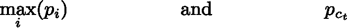

分别是最佳行动的期望回报和所选行动的期望回报 c_t。时间 t 的期望遗憾和总期望遗憾由以下公式给出

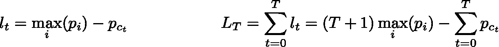

实际上，p_i 是未知的,(总)预期后悔是无法计算的。然而，这些度量在评估策略质量的模拟问题(其中 p_i 的值是众所周知的，尽管假设它们不是)中是有趣的:在每次迭代中，低预期遗憾指示选择接近最优，而高预期遗憾指示相反。一个好的策略是这样的，平均来说，它的遗憾迅速减少到零，表明最佳选择被迅速确定和利用。相反，一个糟糕的战略通常会有一个缓慢减少和/或不为零的遗憾，这表明最佳选择是在很长时间后确定的，根本没有确定或没有得到很好的利用。

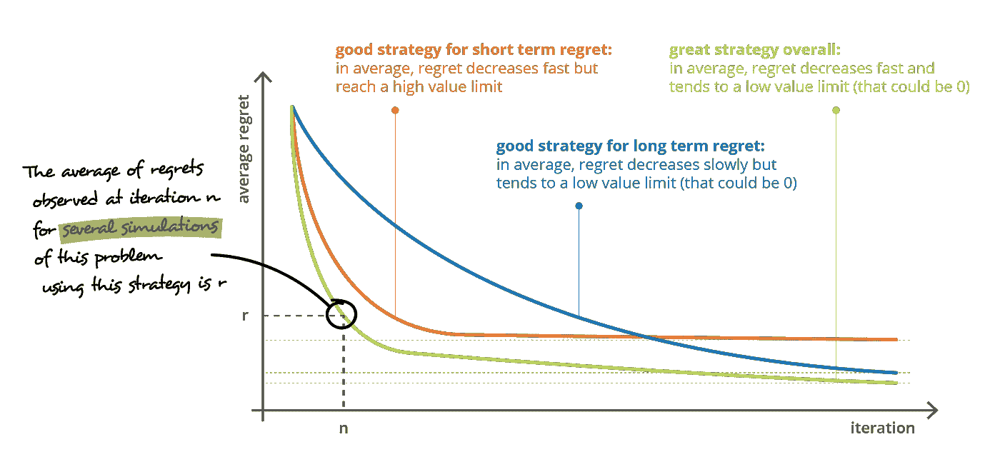

有效探索策略的平均后悔曲线快速向低值下降(尽可能快地确定最佳可能行动)。

# 贪婪的

> 选择在某些情况下被认为是最好的行动，否则随机探索

## 贪婪的

在介绍贪婪策略之前，让我们从贪婪策略的概念开始。**贪婪策略简单来说就是总是做出对当前知识来说最好的决定**。换句话说，这种方法是完全的剥削，没有探索。这种行为的主要缺点在于缺乏探索:如果我们的知识不够准确，我们可能会陷入困境，永远选择一个次优决策，而没有任何机会发现更好的选择。

让我们考虑一个伯努利三臂强盗问题来说明这一点

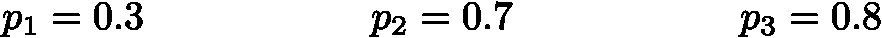

在我们接下来的例子中，3 个强盗的输赢概率。

我们还假设每个 p_i 值的先验知识设置为 0.5(我们在进行任何观察之前为 p_i 假设的值)。表示时间 t 时 p_i 的估计值

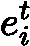

(在伯努利设置中，它也对应于预期回报的估计)，然后我们可以重写我们的先验知识

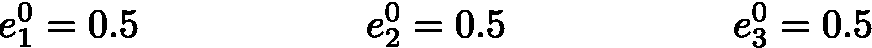

遵循一个贪婪的策略，代理人在时间 t=1 选择具有最高期望回报估计的行动。现在，由于所有的估计都相等，代理随机选择一个动作。假设 t=1 时第一个选择的行动是行动 2，观察到的随机回报是 1。有了这个新的观察，我们可以更新与行动 2 相关的估计，同时保持其他两个不变。如果我们考虑更新到目前为止观察到的所有奖励的平均值(假设所有行为的第一个“假”初始奖励为 0.5)，它给出

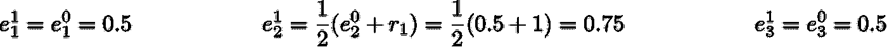

基于这些新的估计(不再相等)，代理将在时间 t=2 再次选择行动 2，因为它具有最高的预期回报估计。在这一点上，我们可以得到问题可能是什么的直觉:如果在连续迭代期间，行动 2 的预期回报的估计从未低于 0.5(这很可能发生，因为 p_2 的真实值是 0.7)，我们将永远不会尝试行动 3(也不会尝试行动 1，但这不是一个问题)，我们将永远错过最佳选择。我们还可以注意到，由于先前的估计值设置为 0.1 而不是 0.5，我们甚至可以观察到动作 1 的相同现象，尽管这是 3 个选项中最差的一个。

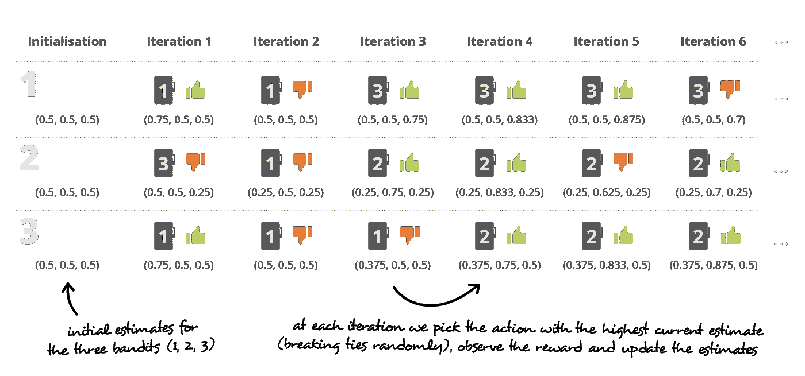

使用贪婪策略对我们的三臂伯努利问题进行三种不同模拟的第一次迭代。第一个模拟似乎是一个良好的开端，以确定采取的最佳行动，其他两个可能会因缺乏探索而停留在次优行动。

## 贪婪的

e-greedy 算法是最幼稚的(然而高效！)在决策过程中引入探索的方法。这个想法就是简单地采取概率为(1-e)的最优行动(开发)或概率为 e 的完全随机行动(探索)。然后，参数 e 平衡开发和探索，低的 e 值指示低程度的探索(e=0 是完全开发/贪婪，而 e=1 是完全探索/随机)。

让我们回到我们的伯努利 3 臂土匪的例子，并考虑 e=0.1(换句话说，我们采用一种策略，其中我们将为 10%的迭代选择一个随机动作)。感谢探索，我们概述的贪婪方法(永远错过最佳选择)的问题不会被观察到，并且我们确保识别出长期的最佳行动。然而，缺点是我们也保证继续探索，因此，潜在的穷人永远的选择。这种探索的成本可以用随机选择行动时的预期后悔来表示，在我们的例子中可以计算如下

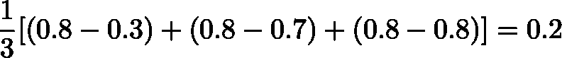

因此，过了一段时间，一旦确定了最佳行动，我们会有一个概率为 0.9 的 0 后悔，但我们也会有一个概率为 0.1 的 0.2 后悔。总的来说，这意味着平均遗憾可以减少到 0.02，但不能再低了

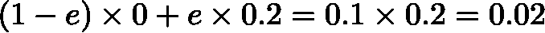

到目前为止，我们看到了两种策略。**贪婪策略，其长期遗憾与永远错过最佳行动的风险有关**，以及**贪婪策略，其长期遗憾与永远探索的低效率有关。**那么，最佳策略是什么？如何从后悔减少速度和长期后悔值两方面比较它们？事实上，在全球范围内比较两种策略是相当困难的:**一种策略在某些情况下可能更好，而另一种策略在其他情况下可能是更好的选择。**

然而，对于这种具有已知真实概率的明确定义的问题，一种常见的方法是对不同的策略进行一些模拟，并比较每次迭代的平均后悔图。这些图表给出了遗憾减少速度和长期遗憾的概述，并将在本文的剩余部分使用。然而，应该记住的是**一个比较适用于一个给定的特定问题**，而**策略几乎不可能在总体上进行比较**，只能讨论它们的优势和劣势。

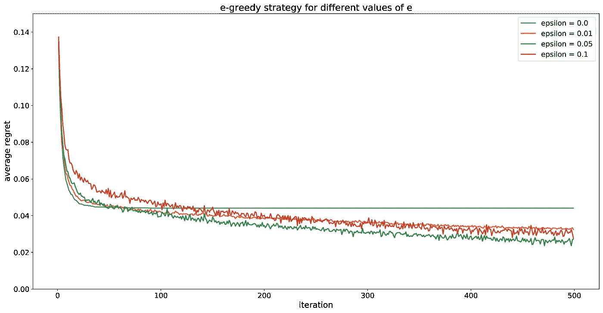

e-greedy 策略的平均后悔曲线应用于具有不同ε值的 3 臂 bandit 示例。

## 腐朽的电子贪婪

在前面的小节中，我们提到了贪婪策略是以一种简单的方式引入探索的好方法，但是永远保持探索是不相关的。**理想情况下，一旦我们确信已经确定了最佳方案，我们就会停止勘探**。然而，在实践中，这种最佳策略很难实现。模拟这种行为的一个简单的替代方法是使用一个 e-greedy 策略，该策略具有一个衰减值 e，而不是一个固定值。

事实上，正如我们之前看到的，高 e 值在过程的开始是好的，并允许快速找到最佳选项，但意味着长期的平均遗憾，这可能是重要的，取决于问题。另一方面，较低的 e 值需要更多的时间来确定最佳选择，但具有较低的长期平均遗憾。为了尝试获得两个世界的最佳效果，衰减 e-greedy 策略的思想是从给定的 e 值开始，并逐步降低它，假设我们越来越确定哪一个是最佳行动，因此，随着时间的推移，我们需要的探索越来越少。

如果这个想法看起来很有趣，一些限制仍然需要概述。首先，**最佳衰变纲图不是那么容易定义的**，它高度依赖于我们正在处理的特定问题(e 应该初始化为高还是低？应该减少得快还是慢？).第二，这种方法只与稳态问题相关，因为探索随着时间向 0 减少，不管可以观察到什么数据。

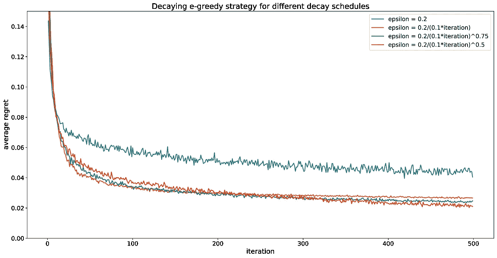

衰减 e-greedy 策略的平均后悔曲线应用于具有不同ε衰减时间表的 3 臂 bandit 示例。

# 乐观初始化

> 选择假设预期回报最佳的行动，直到事实证明并非如此

## 更智能的初始化，更好的探索

我们之前描述的 e-greedy 方法的一个主要缺点在于**探索的随机性**。事实上，在探索阶段，所有的行动都有相同的概率被选择，不管他们各自过去的回报观察。换句话说，这意味着当选择一个探索性的行动时，已经被证明具有高确定性的低回报的选择不幸地被认为与其他更不确定的可能导致更高回报的选择是一样的。虽然它们通常更复杂，但也存在其他策略，通过将探索集中在仍可能被证明是最佳的最相关的行动上，以更智能的方式**解决不确定性。这些策略中的一些以明确的方式处理不确定性，如 UCB 或汤普森采样，而其他一些策略则以更含蓄的方式处理不确定性，如乐观初始化。**

在上一节中，我们介绍了关于行动预期回报的先验知识的概念(Bernoulli bandit 的先验 p_i 估计),并提到了这种先验知识的重要性。乐观初始化方法的想法是**从我们能想到的最乐观的先验开始进行回报估计，以确保每个动作至少执行最小量的探索**。使用这种策略，所有的行动首先被认为是最优的，然后至少需要探索几次才能证明它们不是最优的(在次优行动的情况下)。

让我们用之前的 Bernoulli 3-armed bandit 示例来说明这个方法。在这种情况下，乐观初始化意味着我们开始时将所有行动的预期回报的先验估计值设置为 1，因为这是我们可以观察到的最佳回报(换句话说，所有 p_i 的先验估计值都设置为 1)

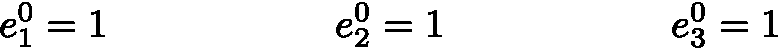

在每次迭代中，基于当前的估计选择最佳动作(随机地打破束缚)，收集新的观察结果，并且因此更新估计。假设更新非常慢(我们将在下一小节回到学习率的重要性)，三个动作的估计值逐渐减小(平均)，直到它们达到最高的 p_i 值(在本例中，p_3 = 0.8)。在这一点上，p_3 的估计值应该停止真正降低，并开始围绕 p_3 的真实值波动(波动是由于奖励的随机性质)。然后，动作 3 被越来越频繁地选择，并且一旦其他两个估计已经随着新的更新向它们各自的真实值降低了一点点，动作 3 就迅速成为唯一剩下的选择。

乐观初始化方法的说明。

## 学习率的影响

正如我们已经看到的，探索算法由两个主要部分组成:**探索策略(选择什么动作？)**和**更新策略(如何更新知识？)**。在大多数情况下，更新策略对全局流程有重大影响，因此应该仔细定义。在我们的第一个贪婪的例子中，一个动作的更新策略被简单地定义为到目前为止对这个动作观察到的所有奖励的平均值。更新的另一个可能的选择是使用当前预期回报估计值和新观察值之间的加权平均值。在这样的计算中，用 w 表示新观测值的权重，我们可以写出

参数 w 被称为学习率，**控制着我们吸收新信息的速度**。w 的高值意味着快速更新，但对来自奖励随机性的波动更敏感。w 值低得多是不明智的，但这是以更新缓慢为代价的。然后，必须根据问题的性质进行权衡。

让我们特别看看在处理乐观初始化时学习率的影响。我们看到，这种方法包括从行动预期回报的最大估计值开始，然后逐步更新这些估计值，直到其中一个值停止下降(平均)并高于所有其他值。当定义学习率值时，必须考虑两个相反的目标:快速识别最佳动作和准确识别最佳动作。

学习率的值必须在这两个相反的目标之间平衡选择。学习率的高值将产生快速更新:平均而言，估计值将快速降低，但我们有“超过”真实值的风险，并且由于随机性而“取消”错误动作。学习率的低值将产生缓慢的更新:平均而言，估计值将缓慢降低，但“过冲”风险降低，从而增加了确定最佳行动的概率。

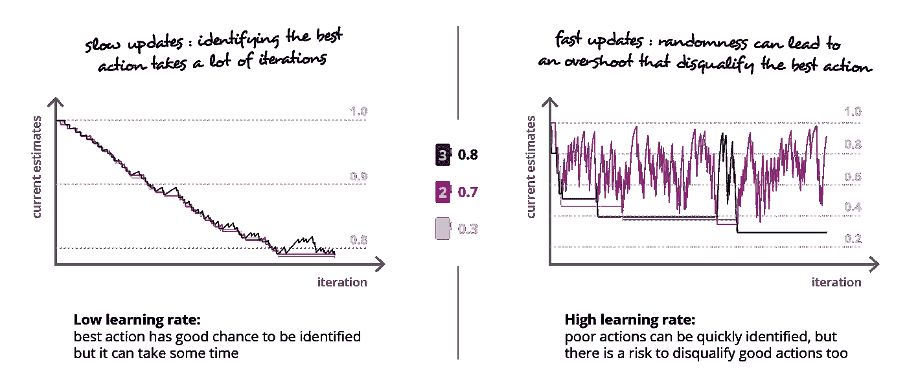

说明学习速度在探索过程中的重要性。

总结这一部分，我们可以概括出**如果奖励没有随机性，那么将学习率设置为 1** 将是最佳的:对每个动作进行一次尝试就足以知道确切的奖励值，然后永远选择到这一点为止的最佳动作。然而，在大多数情况下，奖励的随机性使得高学习率的使用非常危险:具有高预期奖励和高方差的动作可能在第一次迭代中产生低奖励，并且几乎被“取消资格”，因为它可能没有进一步的机会来证明它可以做得更好。

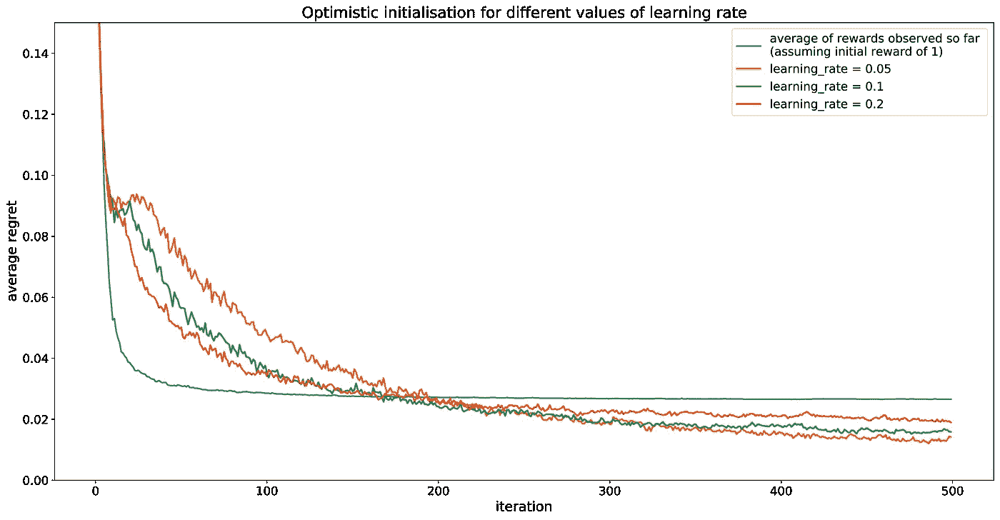

乐观初始化策略的平均后悔曲线应用于我们的具有不同学习率值的 3 臂 bandit 示例。

# 置信上限

> 选择奖励上限估计值最高的行动

## 不确定性的显式建模

在前面的章节中，我们看到了不需要明确建模或量化知识不确定性的不同探索方法(贪婪、乐观初始化)。人们确实可以观察到，在我们以前所有的班迪特例子中，我们在某一给定时间的知识总是由点估计来模拟的，而点估计决不能反映这个值的不确定性。另一种方法是**用置信区间或概率分布**对不确定性进行明确建模，并依靠这种包含我们当前知识(平均值)和相关不确定性(分布的方差，置信区间的大小)的建模来推动勘探过程。置信上限(UCB)和汤姆逊抽样(TS)都以不同的方式依赖于这个想法。

UCB 方法的总体思路是**用置信上限**(在给定的程度上)来替代每个行动的预期回报的“均值”估计。这种行为也被称为**“不确定性面前的乐观”**:对于每个行动，预期回报的不确定性被表示为一个置信区间，我们选择乐观的“最佳行动”，并假设这些区间的上限为真正的预期回报。这种方法确保了我们将继续探索行动，尽管这些行动没有被证明比其他行动回报更低。

让我们用之前的伯努利 3 臂土匪例子来说明 UCB 方法。在时间 t，假设关于每个行动 I 的预期回报的不确定性(关于真实未知概率 p_i 的不确定性)由贝塔概率分布 P_i 建模。因此，我们可以为每个行动计算 80%的上限(例如)**，这将代表我们对真实预期回报**的乐观猜测。然后，最佳“上限”指示要选择的行动，观察到新的回报，描述所选行动的预期回报的不确定性的概率分布可以更新，我们可以开始新的迭代。

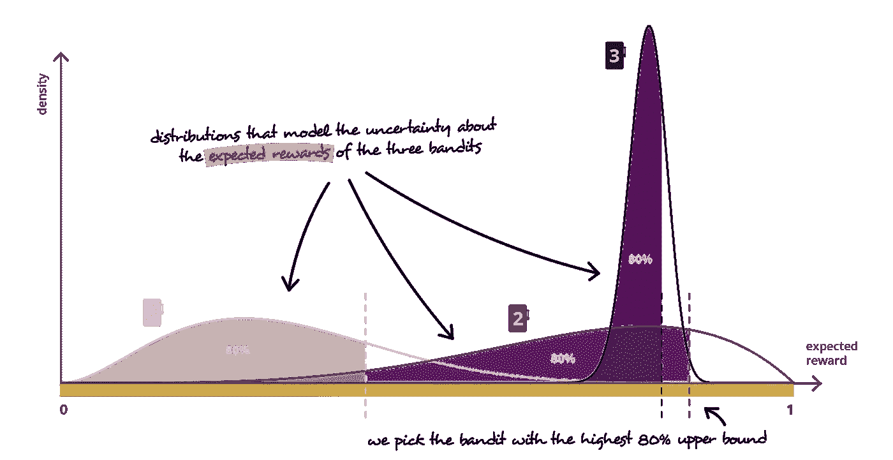

置信上限方法的说明。

## 有界变量和 Hoeffding 不等式

正如我们所见，UCB 方法依赖于计算每个行动预期回报的置信上限的能力。例如，当行为回报有界时，这样的边界可以从[赫夫丁不等式](https://en.wikipedia.org/wiki/Hoeffding%27s_inequality)中导出。赫夫丁不等式提供了有界独立随机变量之和偏离其期望值超过一定量的概率的上限，可以表述如下。让我们假设 K 个有界随机变量

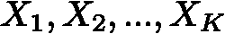

到这样的程度

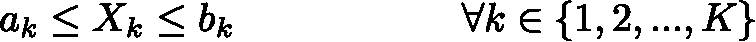

然后，表示

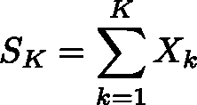

赫夫丁不等式给了我们

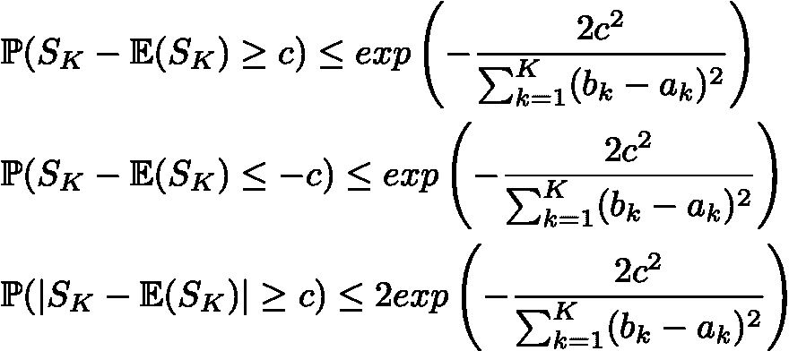

让我们在伯努利 3 臂强盗的例子中说明如何利用这个不等式来遵循 UCB 探索策略。对于每一个行为 I，我们已经观察到不同数量的 K_i 奖励可以被表示

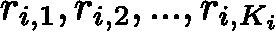

由于问题的性质，这些随机变量是独立同分布且有界的

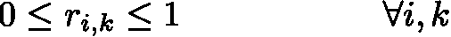

因此，表示观察到的平均值和真正未知的预期回报

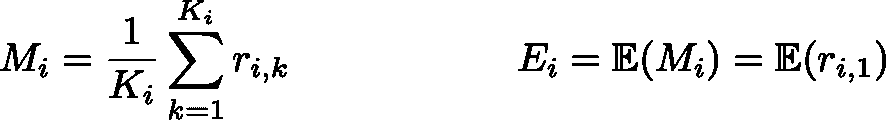

赫夫丁不等式告诉我们

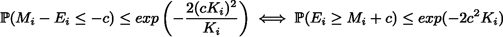

对于给定的置信水平，我们可以使用这个不等式来定义每个行动的预期回报的上限，并选择上限最高的行动。

## 贝叶斯框架

Hoeffding 不等式不适用于无界随机变量。在这种情况下，一种更通用的方法是做出一些假设，**用概率分布来模拟我们对预期回报的不确定性，这种概率分布将使用** [**贝叶斯规则**](https://en.wikipedia.org/wiki/Bayes%27_theorem) 逐步更新。这样做，我们就可以用任何时候的当前概率分布来计算运行 UCB 算法所需的上界。特别地，对于任何给定的行为，如果我们将 e 表示为该行为的真实预期报酬，r_1，r_2，… r_t 表示为迄今为止观察到的独立报酬，贝叶斯规则将 e 相对于观察值的概率分布表示如下

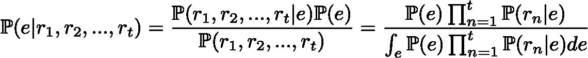

在哪里

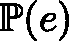

e 的[先验分布](https://en.wikipedia.org/wiki/Prior_probability)(关于预期报酬值的先验假设)和

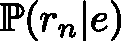

是报酬相对于 e 的[似然分布](https://en.wikipedia.org/wiki/Likelihood_function)(假设报酬概率分布由 e“参数化”)。

因此，想法是**贝叶斯框架可以用来初始化和更新概率分布**，而 **UCB 策略依靠这些分布来推动探索**。在每次迭代中，当前分布(基于先验和目前观察到的回报计算的后验概率)用于计算上限。然后，我们选择具有最高上限的动作，并为此动作观察到新的奖励。最后，使用贝叶斯规则更新与所选动作相关的概率分布，我们可以再次开始该过程。

在这一点上，非常重要的是概述一下**我们操纵的概率分布模拟了我们对预期回报的不确定性，而不是回报本身的随机性**。我们预计这些分布确实会随着时间的推移而变窄(如果数据是稳定的)，尽管事实上真实的报酬分布可能有很大的差异。

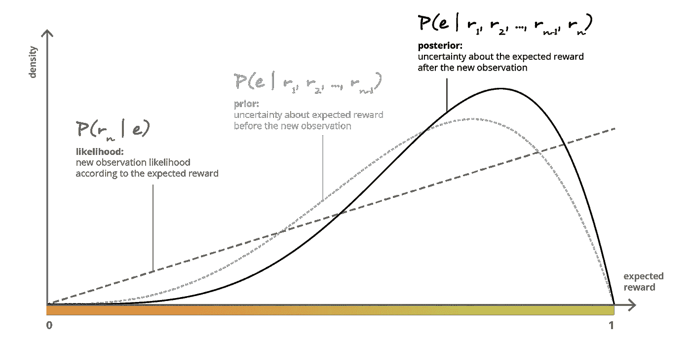

具有贝塔分布先验和伯努利观察的贝叶斯更新的图示。

当然，除了简单的理论想法，在贝叶斯更新和上限计算中还有一些实际困难。首先，根据问题和所做的假设，贝叶斯更新可以非常简单(共轭先验/似然，在一组参数上的封闭形式更新)或者几乎难以处理(大部分时间由于分母计算)。在下一节中，我们将简要地提到一些用近似法处理困难情况的方法。第二，一旦掌握了后验分布，计算期望的上限并不总是那么容易。在这种情况下，一种可能的选择是从分布中采样，并使用生成的样本估计上限(采样有时更容易，如果不是唯一可能的选择)。

现在让我们看一个不错的贝叶斯更新案例，以我们的 3 个武装匪徒为例。对于每个 bandit i，我们将用 beta 分布来表示我们对其预期回报(概率 p_i)的先验知识。贝塔分布在区间[0，1]上定义，取决于两个参数，并应被视为**当观察到给定数量的成功和失败时，未知成功概率的分布**(这两个参数与这些成功和失败的数量相关)。特别地，对于每个 bandit i，β分布密度可以表示为

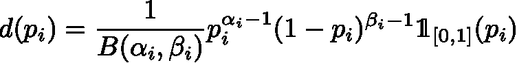

其中 B 是β函数，α_i 和β_i 是分布的两个参数(实际上，沿着更新，α_{i-1}和β_{i-1}分别是成功和失败的计数)。那么**贝塔分布的一个很好的共轭性质**告诉我们，如果我们用一个遵循伯努利分布的观测值“更新”这个先验，那么我们得到一个新的贝塔分布，它的参数已经以如下方式被更新

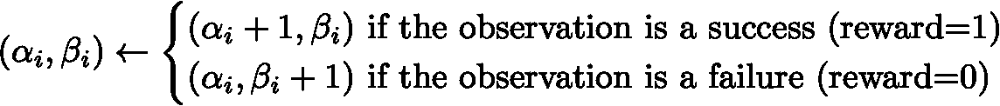

因此，举例来说，我们可以从每个动作的先验 Iβ分布开始，其中α_i = β_i= 1(使用这样的参数，我们得到在[0，1]上的均匀分布)。然后，在每次迭代中，我们将根据 UCB 方法选择一个行动(随机打破平局)，观察奖励，并在开始新的迭代之前，根据该奖励最终更新所选行动的 beta 分布参数。

UCB 策略的平均后悔曲线应用于我们的三臂土匪例子，具有不同的上限值。

# 汤普森取样

> 根据最佳概率随机选择一个行动

## 基于概率的探索

我们将在本文中讨论的最后一种探索策略叫做汤普森抽样(TS)。像 UCB 一样，**这种方法依赖于我们知识的概率表示来驱动探索过程。**然而，使用这些概率分布选择行动的方式是非常不同的:在每次迭代中，UCB 选择具有最高上限的行动，而 **TS 根据行动成为最佳**的概率随机选择行动。Thompson Sampling 将这种方式定义为一种非常自然和有效的策略，无论是在开发(大多数情况下选择最有可能成为最佳的动作)还是探索(几乎没有机会成为最佳的动作几乎从不被选择，以避免将时间花费在无用的探索上)。

在实践中，根据所有的分布计算每个行动成为最佳的概率是相当困难的。然而，**汤普森采样的一个很好的特性在于，我们不需要明确地计算这些概率**。相反，基于当前的概率分布，**我们可以为每一个行动画出其预期回报的估计，然后选择具有最高估计的行动**。很容易看出，这个简单的过程严格来说等同于根据一个行为获得最高预期回报的概率直接对其进行采样。

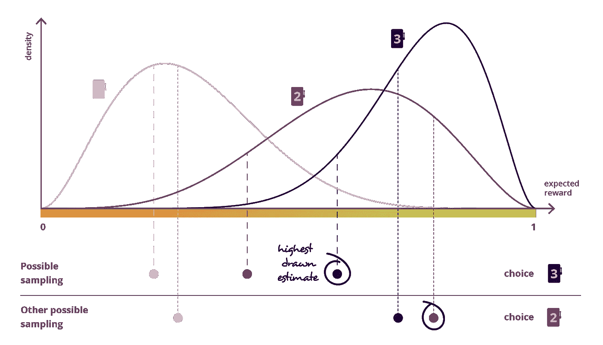

汤普森抽样方法图解。

让我们再一次以三臂伯努利强盗为例来说明 ts 是如何工作的。同样，对于每个动作 I，我们决定用 beta 分布来模拟未知 p_i 值的不确定性，beta 分布将使用 Bayes 规则通过 Bernoulli 观测值进行迭代更新。然后，在每次迭代中，我们可以从β分布中随机估计 p_i 的值，选择具有最高估计值的动作(在这种伯努利情况下，p_i 等于预期奖励)，观察奖励，最后根据奖励更新所选动作的β分布参数。

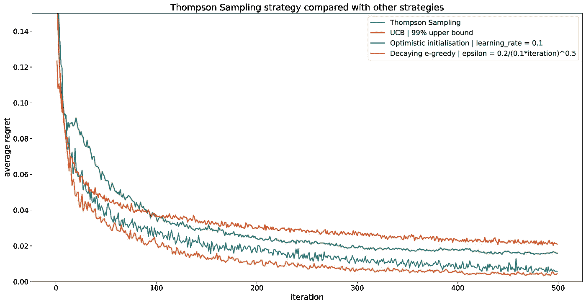

Thompson 采样策略的平均后悔曲线适用于我们的 3 臂土匪例子(与本文前面提到的其他策略相比)。

## 最短路径示例

我们的 bandit 示例实际上非常简单，并没有真正概括 Thompson 采样的优势。为了更好地理解这种方法的好处，现在让我们考虑一个更复杂的[最短路径问题](https://en.wikipedia.org/wiki/Shortest_path_problem)。在下图中，代理必须多次从节点 1 到节点 11。**沿着图的每条边行进所花费的时间是一个随机变量，对于代理**来说是未知的。在每次迭代中，代理都希望从 1 到 11 中选择最短路径。要做到这一点，他只能依靠他在之前的迭代中对每个边所做的观察，因此，他面临着一个探索-开发的困境。

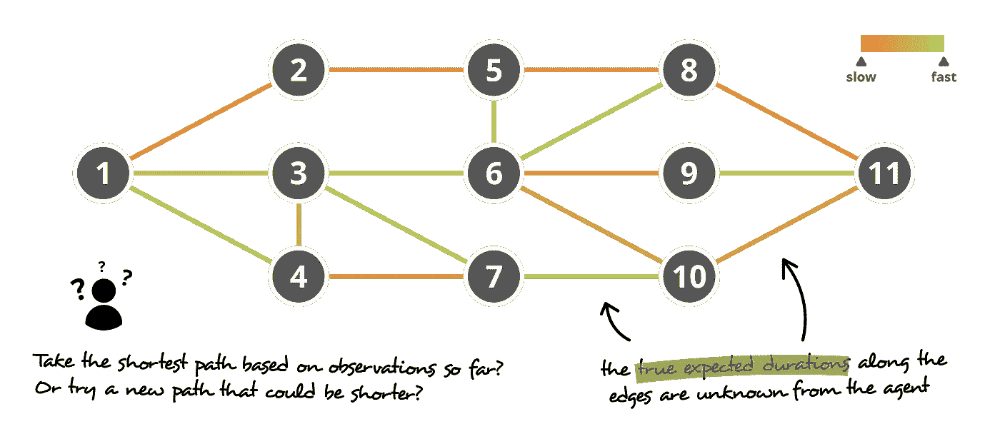

最短路径问题图解。代理从 1 到 11 要去好几次。沿着边缘的持续时间是随机变量，其分布对于代理是未知的(并且可以是相关的)。在每次迭代中，代理必须在开发(根据过去的观察选择最佳路径)和探索(尝试另一条路径)之间进行平衡。

如果以前的方法可以用来解决这个问题，它们可能会非常低效。尽管它们很容易理解，贪婪和乐观的初始化策略确实需要一些时间来收敛。此外，问题的性质和选择用来模拟沿边缘行驶时间的分布可能会使每条路径的“UCB”边界计算变得非常具有挑战性，**尤其是如果这些随机变量**之间存在一些相关性(注意，在这种情况下，我们将计算一个下限，因为我们正在寻找最短路径)。正如我们之前提到的，如果从分布中抽样是估计期望界限的一种选择， **Thompson Sampling 提供了一种更直接的方式来利用这种抽样**。

与 UCB 一样，Thompson 采样要求首先使用先验概率分布对沿每条边的预期行驶时间的不确定性进行建模，该概率分布将根据新的观测值逐步更新(贝叶斯更新，如 UCB)。然后，**在每次迭代中，代理根据分布**对图**上每个边的持续时间估计进行采样，并根据这些绘制的估计(使用专用算法)计算具有最短预期时间的路径**。然后，代理沿着这条路径行进，对每个被访问的边的持续时间进行一些新的观察，使用这些观察来更新相关的分布，并开始新的迭代。

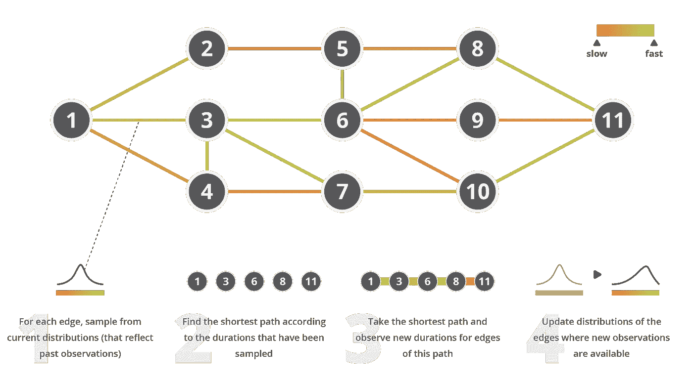

汤普森抽样方法应用于我们的最短路径问题的说明。

## 贝叶斯更新近似

至于 UCB，汤普森抽样过程中最复杂的部分仍然是连续的贝叶斯更新。**在许多情况下，后验分布的精确计算是难以处理的，必须使用依赖于某些近似的特定方法**。当然，深入探讨这些方法的细节已经远远超出了本文的范围，因为它值得用一整篇文章来讨论，但是让我们简要地提一下一些主要的观点，我们希望这些观点能够激发关于这个主题的进一步阅读。

我们可以首先提到与单个贝叶斯更新相关的潜在**困难。正如在以前的文章中所讨论的，通过计算归一化因子(Bayes 公式中的分母),采用积分的形式，这种更新确实很有挑战性。两大类方法经常被用来解决这个问题:抽样方法和近似方法。**

*   [马尔可夫链蒙特卡罗(MCMC)](/bayesian-inference-problem-mcmc-and-variational-inference-25a8aa9bce29) 方法的思想是依靠马尔可夫链从我们复杂的后验分布中抽取样本。这种方法非常适合于仅需要样本的 Thompson 采样，并且也可以用于 UCB 的上限估计。
*   [变分推断(VI)](/bayesian-inference-problem-mcmc-and-variational-inference-25a8aa9bce29) 方法的思想是在参数化的分布族中搜索我们复杂后验分布的最佳近似(只知道一个因子)。例如，拉普拉斯方法试图找到感兴趣的分布的最佳高斯近似。

除了在处理单个贝叶斯更新时已经出现的复杂性之外，在探索过程中的连续更新会使计算变得越来越重，即使使用前面提到的方法。事实上，如果找不到中间的封闭形式，我们将需要在每次迭代中考虑所有过去的观测值来进行计算(参见前面关于 p(e | r_1，r_2，…，r_t)的贝叶斯公式)，甚至对于近似方法也是如此。

为了**控制计算时间**，可以要求**考虑**之前提到的近似方法的增量变量。这种增量版本被设计成以固定的计算时间操作，例如通过迭代地更新以某种方式“总结”过去观察信息的一组参数。

# 外卖食品

这篇文章的主要观点是:

*   当没有足够的过去数据来训练一个可靠的模型(**冷启动问题**)或者当数据随着时间推移而演变(**非平稳问题**)时，可以使用“在线学习”:然后，通过使用收集的新数据不断更新模型，**意味着在数据收集和决策制定之间存在某种反馈循环**
*   这样的设置自然意味着**勘探-开发权衡**:我们应该相信我们的知识并根据当前模型(开发)做出最佳决策，还是应该挑战我们的知识并在收集更多数据时做出另一个可能更好的决策
*   探索-开发问题可以使用特定的算法来处理，这些算法通常由两个重要部分组成:**探索策略**(基于当前知识选择什么动作？)和**一个更新策略**(如何基于新的观察更新知识？)
*   更新策略主要取决于所选择的知识表示，从用于准时估计的简单加权平均值到用于概率分布的贝叶斯更新
*   存在几种探索策略，其中我们发现 **e-greedy** (选择在某些情况下被认为是最好的动作，否则随机探索)**乐观初始化**(选择对预期回报假设最好的动作，直到被证明不是这样)**置信上限**(选择具有最高回报上限估计的动作)和 **Thompson 抽样**(根据它们成为最佳的概率随机选择一个动作)

当然，**我们不能在不提及** [**强化学习**](https://en.wikipedia.org/wiki/Reinforcement_learning) 的情况下结束本文，强化学习通常被视为三种主要机器学习范例之一(有监督和无监督学习)，并且通常需要设计良好的探索策略。强化学习实际上考虑了一种设置，在这种设置中，代理可以与环境进行交互(采取行动并获得奖励),并且应该从这些交互中学习如何在进行过程中最佳地表现。然而，尽管**强化学习定义了一个遇到探索-利用权衡的典型设置**，但不应该总结到这一点。

最后，我们可以最后一次概述在在线学习环境中**小心处理决策数据反馈循环**的重要性，以及**定义一个非常适合的探索策略**的重要性。最后，如果可以使用不同的策略，人们应该记住，最终，主要是拥有高质量的数据来训练我们的模型……在数据科学中总是如此。

感谢阅读！

关于这个主题的更多阅读材料:

*   [汤普逊取样教程](https://web.stanford.edu/~bvr/pubs/TS_Tutorial.pdf)

用 [Baptiste Rocca](https://medium.com/u/20ad1309823a?source=post_page-----f5622fbe1e82--------------------------------) 写的其他文章:

 [## 马尔可夫链简介

### 定义、属性和 PageRank 示例。

towardsdatascience.com](/brief-introduction-to-markov-chains-2c8cab9c98ab)  [## 推荐系统简介

### 几种主要推荐算法综述。

towardsdatascience.com](/introduction-to-recommender-systems-6c66cf15ada)