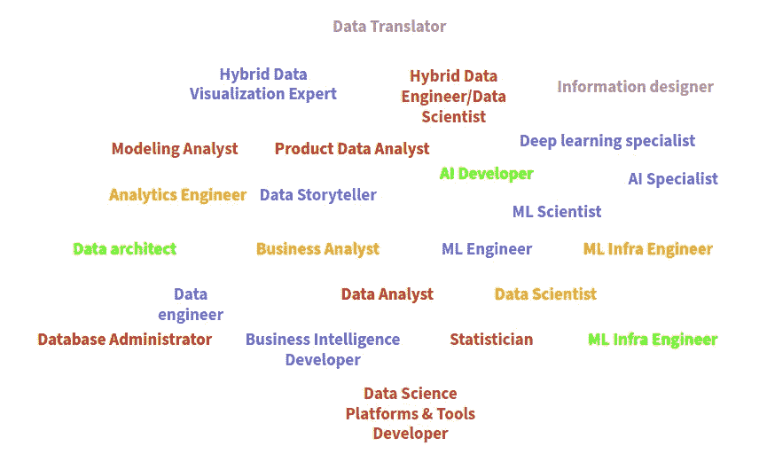
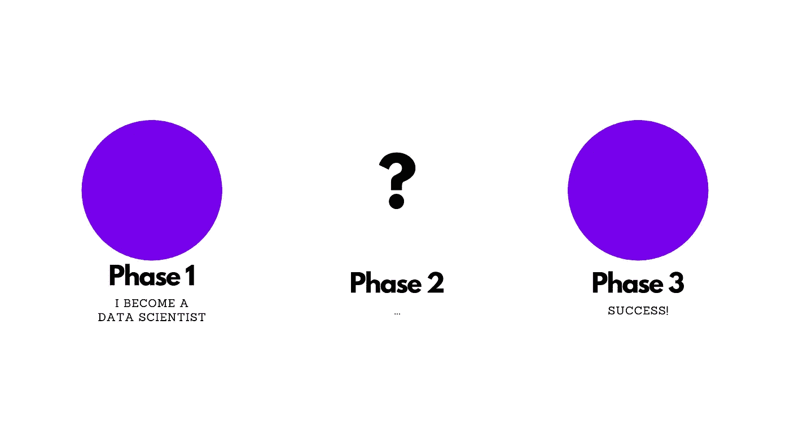

# 数据科学中角色的激增

> 原文：<https://towardsdatascience.com/the-explosion-of-roles-in-data-science-5963aa83e1c?source=collection_archive---------15----------------------->

## 如果您刚进入数据科学领域，这些课程可以为您提供帮助

[斯科特·格雷厄姆](https://unsplash.com/@homajob?utm_source=medium&utm_medium=referral)在 [Unsplash](https://unsplash.com?utm_source=medium&utm_medium=referral) 上拍照

自从**我想成为一名数据科学家**后不久。我对成为其中一员的可能性如此着迷，以至于我竭尽所能。幸运的是，我有了一个突破，改变了我对待事业的方式。

我意识到我在用我的角色定义自己。以至于我忽略了这个过程的重要性。我忘记了记住**你为什么在做你正在做的事情**的重要性。我也忘记了享受你正在做的事情的重要性。即使你正在做你不想做的事情。

我意识到这是许多人在开始他们的数据科学职业生涯时经历的事情。他们如此努力地定义自己的身份，以至于在这个过程中常常迷失了自我。

如果你在数据科学领域起步，很容易发现自己迷失在选择应该追求什么角色的过程中。 我们有数据科学家、数据分析师、数据工程师、机器学习工程师、分析工程师、商业智能工程师、数据架构师、数据说书人……你已经明白了，对吧？

**对于刚刚进入这个领域的人来说，角色*爆炸*势不可挡**。这篇文章旨在与你分享我在短暂的职业生涯中学到的一些经验。我认为它们可以对最近开始从事数据科学领域的人有所帮助。

> **TL；博士—** 从任何地方开始。记住，你不是一个角色。你是来解决问题的。你应该关注能力而不是角色。最后，不断学习，不断进步。
> 就这样。再见；)

# 语境

让我来定义一下在数据科学中*角色爆炸*的含义。

几年前，许多这样的角色还不存在。那时，你会有一个数据工程师、一个数据分析师和一个数据科学家。就这样。但是，在过去的几年里，情况相对发生了变化。

现在，我们有了更多的角色。我做了一点研究，突然意识到在不到 10 分钟的时间里，我在数据科学中找到了 24 个不同的角色。

我就像…真的吗？24?这是一种时尚还是专业化？我不太确定。但是，如果你开始你的职业生涯，你可能会被这么多的选择弄得有点不知所措。

这正是我意识到发生在一些刚刚开始职业生涯的人身上的事情。他们不知道从哪里开始。他们不知道自己应该追求什么。他们真的不知道这么多角色里有没有适合他们的。

数据科学中的 24 个角色——作者根据[[1](https://www.kdnuggets.com/2015/11/different-data-science-roles-industry.html)][[2](/10-different-data-science-job-titles-and-what-they-mean-d385fc3c58ae)][[3](/what-kind-of-data-science-role-is-right-for-you-9d2f4b117e81)][[4](https://www.forbes.com/sites/ganeskesari/2020/11/24/the-5-roles-that-every-data-science-team-must-hire/?sh=1b0de197904a)所做的图解

# 有点难懂

你知道…几年前我也在那里。我开始了我的软件开发职业生涯。我不确定这是不是我想要的。我只知道我想尝试一下这个叫做数据科学的新东西。但是，我真的不知道从哪里开始。

很想和大家分享一下我的故事。但是，首先我想和你分享一个来自 [*南方公园*](https://en.wikipedia.org/wiki/South_Park) 的故事。我认为它成功地说明了我的旅程。

所以，[这里](https://www.youtube.com/watch?v=a5ih_TQWqCA&ab_channel=SouthParkStudios)就是…

> 几个男孩去了一个满是侏儒的山洞。在那里，侏儒们正在经营他们的生意。他们收集和处理偷来的内裤。
> 
> 男孩们有点吃惊，问——“那么，你打算怎么处理你偷的内裤？”对此，一个侏儒回应道:“收集内裤只是第一阶段。”男孩们回答道——“那么……第二阶段是什么？”
> 【奥卡德沉默】
> 
> 侏儒对这个问题有点困惑，他问其他人:“嘿，第二阶段是什么？”另一个侏儒回应道:“第一阶段，我们收集内裤。”另一个人又回答道:“是啊，是啊。但是，第二阶段呢？”
> 另一个侏儒凝视着虚空，说道——“嗯……第三阶段是盈利。懂了吗？”一个男孩回答道:“我不明白”
> 
> 侏儒试图解释这个计划，他说:“你看…第一阶段，收集内裤。第二阶段，[沉默]。第三阶段，盈利！”

虽然你可能会觉得这个故事有点傻，但我认为在那样的情况下很容易被抓住。当你如此执着于某件事时，你甚至没有意识到你可能会迷失在其中。你可能没有意识到你可能会说的话。

这适用于生活中的任何事情。我认为这也很好地解释了**我们通常是如何专注于我们在公司中扮演的角色**。

对我来说，第一阶段是成为一名数据科学家。第二阶段…嗯，我不是很确定。但是，我很确定第三个是“成功”

我简单的故事——作者根据南方公园[一集](https://www.youtube.com/watch?v=a5ih_TQWqCA&ab_channel=SouthParkStudios)制作的插图

如果你正在开始你的数据科学职业生涯，这可能会发生在你身上。或者，也许，它已经发生了，而你没有意识到。

不管怎样，这里是我在这个过程中学到的一些经验。

# 课程

自从我开始从事数据科学以来，我已经经历了不同的角色。我做过数据分析师；一个古怪的数据科学家/机器学习工程师；现在是一名数据工程师/架构师。

我在四年里经历了这三个不同的角色。你可能认为我没有耐心。嗯，我认为这取决于你看问题的角度。

> "没有好坏之分，只是思维使然。"威廉·莎士比亚

不管怎样，在经历这个过程的时候，我学到了一些东西。所以，事不宜迟，他们来了。

## 从任何地方开始

如果你是刚起步，不要太担心选择哪个角色。你不需要在你的余生都在那个角色上努力。

你应该简单地选择更接近你已有知识的角色。试试吧，不喜欢就开始慢慢远离。**但是，不要着急，也不要太执着于想要改变它。即使是你不喜欢的东西，也要允许自己去学习。他们将来会有帮助的。**

当我们开始的时候，我想我们大多数人都想知道我们喜欢什么，我们想做什么。但是，知道我们不喜欢什么也是一种进步。

## 你不是你的角色

听起来很简单，你不是你的角色。但是，说起来容易，相信起来难。

记住，任何工作的目的都是为了解决问题。如果你是数据分析师，你就是在解决问题。你在用你的一些分析能力帮助别人。如果你是数据工程师，你也是在解决问题。你在用你的工程能力帮助人们。虽然，你可能更喜欢做数据分析师，而不是数据工程师。

关键是，除非你尝试过，否则你不会知道自己是否喜欢某样东西。所以，每个角色都尝试一点点，然后，当你觉得准备好了，选择一个，专攻它。

再者，不要让自己被一个角色定义所限制。我是一名数据分析师，从事数据工程师的工作。同时，我也是一名数据工程师，从事产品负责人的工作。就这样吧。我们是来解决问题的。

 [## 成为多面手如何有利于您的数据科学职业

### 尤其是如果你是从数据科学领域起步的话…

towardsdatascience.com](/how-being-a-generalist-can-benefit-your-data-science-career-cd23758a0780) 

## 关注能力而不是角色

如果说现在有什么复杂的东西需要定义的话，那就是数据科学中的角色。每个公司都在以自己喜欢的方式定义角色。

我在一些组织中自称是数据分析师，但实际上我是他们的数据工程师。此外，我在一些组织中自称是数据分析师，但他们称我为数据科学家。

不管怎样，这就是为什么关注能力比角色定义更好。知道如何做 ETL 在任何地方都是一样的。如果你称自己为数据工程师、数据分析师或数据科学平台和工具开发人员，那就独立吧。

你应该抓住机会学习新的能力。同样，不要因为这不是你作为数据工程师、数据分析师或其他任何人的职责，就停止学习。

## 不断学习，不断进步

如果你从来没有听说过，你怎么知道呢？我自己解决这个问题的方法是每天读一篇文章。我已经做了三年了。

不断学习，不断进步。这里没什么好补充的。每天读书，每天练习，对过程要有耐心。

今天，你可能是一名数据分析师。明天你可能会成为数据工程师。谁知道呢。你是来解决问题的。

感谢阅读！

*如果你想随时更新我的作品，* ***请加入我的*** [***简讯***](https://metadatacommunity.substack.com/) ***！*** *偶尔，我会和我的读者分享一些东西。如果你加入我会很感激的:)*