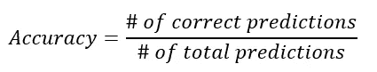
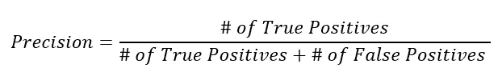
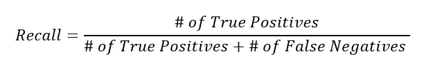
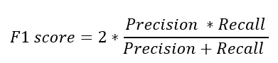
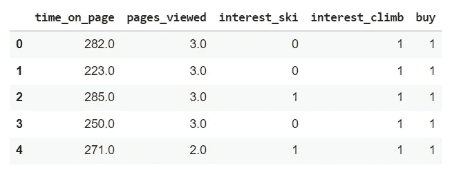
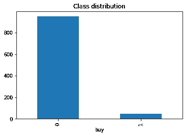

# F1 的分数

> 原文：<https://towardsdatascience.com/the-f1-score-bec2bbc38aa6?source=collection_archive---------0----------------------->

## 你所需要知道的关于机器学习中的 F1 分数。其中有一个在 Python 中应用 F1 分数的示例。

F1 分数。Jonathan Chng 在 [Unsplash](https://unsplash.com/?utm_source=unsplash&utm_medium=referral&utm_content=creditCopyText) 上拍摄的照片。

# 介绍 F1 分数

在这篇文章中，你会发现 F1 的分数。F1 分数是可以在分类模型中使用的机器学习度量。尽管分类模型有许多度量标准，但在本文中，您将发现 F1 分数是如何计算的，以及何时使用它有附加值。

f1 分数是对两个更简单的性能指标的改进。因此，在深入了解 F1 分数的细节之前，让我们先回顾一下 F1 分数背后的那些指标。

# 准确(性)

准确性是分类模型的一个度量标准，它将正确的预测数作为所做预测总数的百分比来衡量。举个例子，如果你的预测有 90%是正确的，那么你的准确率就是 90%。

准确度公式。作者配图。

只有当您的分类中有相等的类分布时，精确度才是一个有用的度量标准。这意味着，如果您在一个用例中观察到一个类的数据点比另一个类的数据点多，那么准确性就不再是一个有用的度量了。让我们看一个例子来说明这一点:

## 不平衡数据示例

*想象你正在处理一个网站的销售数据。你知道 99%的网站访问者不买东西，只有 1%的访问者买东西。你正在建立一个分类模型来预测哪些网站访问者是买家，哪些只是旁观者。*

现在想象一个不太好用的模型。它预测 100%的访问者只是旁观者，0%的访问者是买家。这显然是一个非常错误和无用的模型。

> 当你的班级不平衡时，准确性不是一个好的衡量标准。

如果我们在这个模型上使用精度公式会发生什么？你的模型只预测了 1%的错误:所有的购买者都被错误地归类为外貌特征。因此，正确预测的百分比是 99%。这里的问题是，99%的准确率听起来是一个很好的结果，而你的模型表现很差。总之:当你的班级不平衡时，准确性不是一个好的衡量标准。

## 通过重采样解决不平衡数据

解决类不平衡问题的一个方法是**在你的样本**上工作。使用特定的采样方法，您可以对数据集进行重新采样，使数据不再不平衡。然后，您可以再次使用准确性作为衡量标准。[在本文中，您可以了解如何使用欠采样、过采样和 SMOTE 数据扩充等方法。](/smote-fdce2f605729)

## 通过指标解决不平衡的数据

解决类别不平衡问题的另一种方法是使用**更好的准确性指标，如 F1 分数**，它不仅考虑了你的模型产生的预测错误的数量，还考虑了所产生的错误的类型。

# 精确度和召回率:F1 分数的基础

精确度和召回率是考虑类别不平衡的两个最常见的度量。**他们是**也是**F1 成绩**的基础！在下一部分**将精确度和召回率结合到 F1 分数**之前，让我们更好地了解一下精确度和召回率。

# 精确度:F1 分数的第一部分

精确度是 F1 分数的第一部分。它也可以用作单独的机器学习度量。它的公式如下所示:

精确公式。作者配图。

你可以这样解释这个公式。**在所有被预测为肯定的事物中，precision 计算正确的百分比:**

*   一个**不精确的模型**可能会发现很多阳性，但是它的选择方法是有噪音的:它也会错误地检测出很多实际上并不是阳性的阳性。
*   一个**精确的模型**是非常“纯粹”的:也许它没有找到所有的肯定，但是模型归类为肯定的那些很可能是正确的。

# 回忆:F1 分数的第二部分

回忆是 F1 分数的第二个组成部分，尽管回忆也可以用作单独的机器学习指标。召回的公式如下所示:

回忆公式。作者配图。

你可以这样解释这个公式。**在所有实际为正的事物中，模型成功找到了多少:**

*   具有**高召回率**的模型成功地在数据中找到所有**阳性病例**，即使它们也可能错误地将一些阴性病例识别为阳性病例。
*   具有**低召回率**的模型不能在数据中找到所有(或大部分)阳性病例。

# 精确度与召回率

为了澄清，想一想下面的例子，一家超市出售了有问题的产品，他们需要召回它:他们只对确保他们找到所有有问题的产品感兴趣。如果客户退回一些没有问题的产品，这对他们来说并不重要，所以超市对精确度不感兴趣。

## 精确召回权衡

理想情况下，我们希望两者兼而有之:一个模型是**识别我们所有的阳性病例**，同时**只识别阳性病例**。

不幸的是，在现实生活中，我们不得不处理所谓的**精确回忆权衡。**

精确度-召回率的权衡代表了这样一个事实，即在许多情况下，您可以调整模型以降低召回率为代价来提高精确度，或者另一方面以降低精确度为代价来提高召回率。

# F1 分数:精确度和召回率的结合

精确度和召回率是 F1 分数的两个组成部分。F1 分数的目标是**将精度和召回指标合并成一个指标。**与此同时，F1 的分数被设计为**在不平衡数据**上工作良好。

## F1 得分公式

F1 分数定义为精确度和召回率的调和平均值**。**

*简单提醒一下，* [*调和平均值*](https://en.wikipedia.org/wiki/Harmonic_mean) *是更常见算术平均值的替代指标。在计算平均比率时，它通常很有用。*

在 F1 的分数中，我们计算**的平均精确度和召回率**。它们都是比率，因此使用调和平均值是一个合理的选择。F1 得分公式如下所示:

这使得 F1 分数的公式如下:

F1 得分公式。作者配图。

由于 F1 分数是精确度和召回率的平均值，这意味着**F1 分数给予精确度和召回率同等的权重:**

*   如果精确度和召回率都很高，模型将获得高 F1 分数
*   如果精确度和召回率都低，模型将获得低 F1 分数
*   如果精度和召回率中的一个较低而另一个较高，模型将获得中等 F1 分数

# F1 分数应该取代其他指标吗？

在整篇文章中，您已经看到了许多定义。在开始用 Python 实现 F1 分数之前，让我们总结一下何时使用 F1 分数，以及如何根据其他指标对其进行基准测试。

## 准确度与精确度和召回率

准确度是最简单的分类标准。它只是衡量机器学习模型做出的正确预测的百分比。您已经看到，在不平衡数据的情况下，**准确性是一个糟糕的指标，因为它无法区分特定类型的错误(假阳性和假阴性)。**

精度和召回率是在数据不平衡时更适用的性能指标，因为它们允许考虑模型产生的错误类型(误报或漏报)。

## F1 分数与精确度和召回率

F1 分数将精确度和召回率结合成了**一个单一的指标**。在许多情况下，像[自动基准测试，或者网格搜索](/gridsearch-the-ultimate-machine-learning-tool-6cd5fb93d07)，只有一个性能指标比多个更方便。

## 你应该使用 F1 的分数吗？

总之，当你有可能这样做的时候，你绝对应该**查看你尝试的每个模型的多个指标**。每个指标都有优点和缺点，每个都会给你关于你的模型的优点和缺点的具体信息。

真正的选择困难发生在进行自动模型训练时，或者使用[网格搜索调整模型](/gridsearch-the-ultimate-machine-learning-tool-6cd5fb93d07)时。在这些情况下，您需要**指定一个您想要优化的指标**。

在这种情况下，我的建议是好好看看一个或几个样本模型的多个不同的度量。然后，当您**理解您的特定用例**的含义时，您可以选择一个指标进行优化或调整。

如果您**将您的模型投入生产**以供长期使用，您应该定期回来进行**模型维护**并验证模型是否仍能正常工作。

# Python 中的 F1 分数

现在让我们来看一个例子，在这个例子中，我们将了解 F1 分数的附加值。我们将使用一个包含大量网站访问者数据的示例数据集。

本练习的目标是建立一个简单的分类模型，该模型使用四个独立变量来预测游客是否会买东西。我们将看到如何使用不同的指标，我们将看到不同的指标将如何给我们不同的结论。

*在* [*中使用了相同的数据集，本文提出使用 SMOTE 上采样技术来提高模型性能*](/smote-fdce2f605729) *。*

我们在这里不使用 SMOTE，因为我们的目标是演示 F1 的分数。然而，如果您对处理不平衡的数据感兴趣，将这两种方法结合起来绝对是值得的。

## **数据**

您可以直接从 [GitHub](/all-you-need-to-know-before-starting-with-github-ada7cf62dae2) 将数据导入 Python。以下代码允许您直接读取原始文件:

F1 分数。导入数据

您将获得如下所示的数据帧:

F1 分数。数据集。作者配图。

在这个数据集中，我们有以下五个变量:

*   兴趣这个变量告诉我们游客是否最终购买了我们新的山地运动产品。
*   `time_on_page`:访问者在页面上花费的时间
*   `pages_viewed`:访问者浏览过我们网站的页数
*   `interest_ski`:客户关系数据库中的一个变量，告诉我们游客之前是否购买过任何与滑雪相关的物品。
*   `interest_climb``:客户关系数据库中的一个变量，告诉我们游客之前是否购买过任何与登山相关的物品。

## 验证类别不平衡

在我们的数据集中，我们只有很小比例的买家。如果您愿意，可以使用以下代码验证这一点:

用条形图验证类别分布

您将获得以下条形图:

F1 分数。验证数据确实不平衡。作者配图。

你可以在这里看到，与其他游客相比，买家非常少。这是为电子商务以及欺诈检测等其他类型的模型构建模型时经常发生的事情。这证实了 F1 的分数可能会派上用场。

## 列车测试分层

在构建任何模型之前，我们应该创建一个训练/测试分割。如果你不熟悉机器学习中的训练/测试方法，我建议你先看看这篇文章。

然而，**当存在严重的类别不平衡时，进行标准的随机训练/测试分割是有风险的。**由于阳性案例的数量非常少，您可能最终得到一个具有非常不同的类分布的训练集和测试集。您甚至可能在您的测试集中以接近零的阳性案例结束。

分层抽样是一种避免扰乱样本中类别平衡的抽样方法。它允许您使用与原始数据中完全相同的类平衡来生成训练和测试集。您可以使用以下代码在 scikitlearn 中执行分层训练/测试采样:

F1 分数。训练和测试数据的分层抽样。

如果您愿意，可以使用与前面相同的代码来生成显示类分布的条形图。它将确认总数据中的类别分布与训练集和测试集中的类别分布完全相同。

## 基线模型

作为基线模型，我们将创建一个非常糟糕的模型，预测没有人购买任何东西。这归结为生成一个全为 0 的预测列表。您可以这样做:

F1 分数。创建一个非常糟糕的基线模型。

虽然我们已经知道这个模型很糟糕，但是我们还是要试着找出这个模型的准确性。您可以按如下方式使用 scikitlearn 的精确度功能:

F1 分数。使用精确度来评估我们的不良基线模型。

**我们非常坏的模型准确率高的惊人:95%！如果你从一开始就跟着做，你可能会明白为什么。在测试数据中，我们知道买家很少。该模型预测没有人购买任何东西。因此，它只对购买者(数据集的 5%)是错误的。**

这正是我们需要担心召回率和精确度的确切原因。让我们使用下面的代码来计算这个模型的召回率和精确度:

F1 分数。使用精度和召回来评估我们的坏基线模型。

请记住，Precision 将告诉您正确预测的买家占预测买家总数的百分比。在这个非常糟糕的模型中，没有一个人被识别为买家，因此**精度为 0！**

另一方面，回忆告诉你在所有实际买家中你能找到的买家的百分比。由于你的模型还没有找到一个买家，**召回也是 0！**

让我们使用下面的代码来看看最终的 F1 分数是多少:

F1 分数。计算我们糟糕基线模型的 F1 分数。

结果并不令人惊讶。由于 F1 分数是精确度和召回率的调和平均值，因此 **F1 分数也是 0** 。

这个例子中的模型根本不是一个智能模型。然而，这个例子表明**在不平衡数据集**上使用准确性作为衡量标准是非常危险的。这个模型实际上根本不是性能型的，性能评估为 0 是唯一公平的评估。在这个例子中，精确度、召回率和 F1 分数都被证明是更好的例子。

## 更好的模型

由于上一个例子中的模型非常简单，让我们用一个真实的模型重做另一个例子。对于第二个例子，我们将使用逻辑回归模型。让我们使用以下代码构建模型，看看会发生什么:

让我们对预测做一个详细的检验。在二元分类中(如我们示例中的具有两种结果的分类)，您可以使用混淆矩阵来区分四种类型的预测:

*   真阳性(买家正确预测为买家)
*   误报(非买家被错误地预测为买家)
*   真实否定(非买家被正确预测为非买家
*   假阴性(买家被错误地预测为非买家)

您可以在 scikitlearn 中获得混淆矩阵，如下所示:

F1 分数。获得混淆矩阵。

结果如下:

*   真实底片:280 张
*   误报:5
*   假阴性:10
*   真阳性:5

这个模型评估数据非常详细。当然，将这一点纳入一个单一的性能指标会更容易。准确性是最简单的性能指标，因此让我们看看这个示例的准确性得分是多少:

F1 分数。在更好的模型上计算精度。

有趣的是，逻辑回归的准确率为 95%:与我们非常糟糕的基线模型完全相同！

让我们来看看 Precision 和 Recall 对此有何看法:

F1 分数。在较优模型上计算精度和召回率。

我们最终得到了以下精确度和召回率指标:

*   精度为:0.5
*   回忆是:0.33

让我们也使用 scikitlearn 的 f1 分数来检查 F1 分数:

F1 分数。在更好的模型上计算 F1 分数。

**得到的 F1 分是 0.4。**

## 哪个模型和度量更好？

因此，精确度告诉我们，逻辑回归与糟糕的基线模型一样好，但是精确度和回忆告诉我们，逻辑回归更好。让我们试着理解为什么:

*   两个模型的错误总数是一样的。因此**精度**是相同的。
*   第二个模型实际上能够找到(至少一些)正面案例(买家)，而第一个模型在数据中没有找到一个买家。因此，第二个模型的**召回**更高(逻辑回归为 0.33，而不是第一个模型的 0)。
*   第一个模型没有找到任何买家，因此精度自动为零。逻辑回归确实找到了一些买家，所以我们可以计算出一个精确度。**精度**显示了有多少预测的买家实际上是正确的。这个最后是 50%。
*   F1 分数**是我们真正感兴趣的指标。该示例的目标是展示其对于不平衡数据建模的附加价值。第一款车型**的 **F1 分数为 0:我们对这个分数很满意，因为这是一款非常糟糕的车型。**
*   第二款的 **F1 分为 0.4。这表明，第二个模型虽然远非完美，但至少是第一个模型的重大改进。这是有价值的信息，我们无法使用准确性作为衡量标准来获得，因为两个模型的准确性是相同的。**

# 结论

在本文中，F1 分数被显示为模型性能指标。当处理数据集不平衡的分类模型时，F1 值变得特别有价值。

您已经看到 F1 分数将精确度和召回率结合成一个指标。这使得在网格搜索或自动优化中使用它很容易。

在 Python 示例中，您已经看到了分类模型中不平衡数据集的情况。您已经看到了准确性是如何误导人的，因为它给了一个糟糕的模型一个很高的分数。在上一部分中，您已经看到 F1 分数在评估机器学习模型的性能方面效果更好。

我希望这篇文章对你有用。感谢阅读！