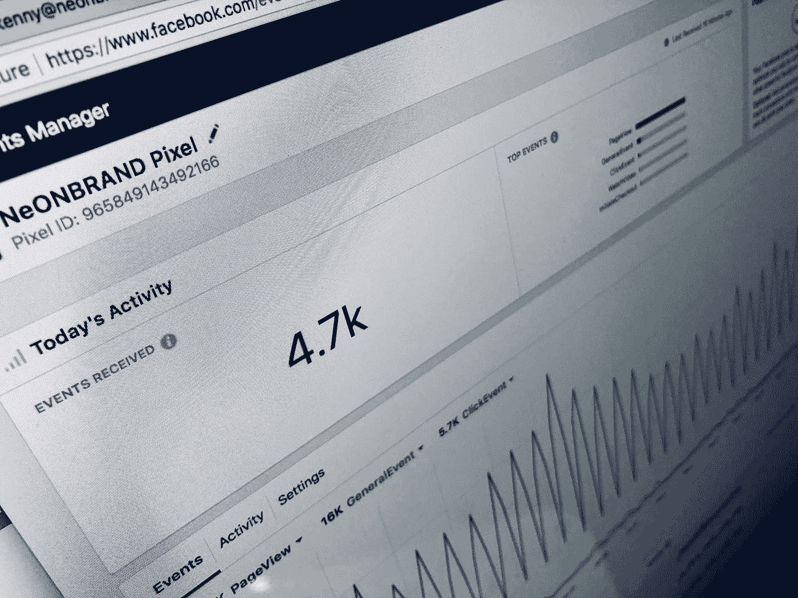
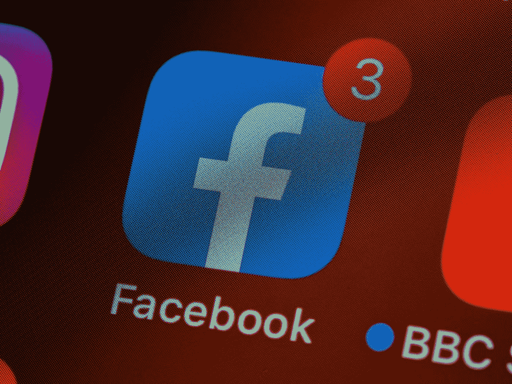

# 脸书数据科学，产品分析访谈

> 原文：<https://towardsdatascience.com/the-facebook-data-science-product-analytics-interview-852e50ded966?source=collection_archive---------2----------------------->

## 如何获得加入脸书数据科学团队的邀请

在过去的招聘周期中，我有幸参与了脸书 DS 从最初的电话筛选到录用的面试过程。以下是我的经验和一些建议，我会给那些在不久的将来(或者现在)经历这种漫长经历的人。)

在 [Unsplash](https://unsplash.com?utm_source=medium&utm_medium=referral) 上 [Magnet.me](https://unsplash.com/@magnetme?utm_source=medium&utm_medium=referral) 拍照

# 电话筛选#1:行为筛选

像大多数数据科学/分析师职位一样，第一个电话是招聘人员评估我的相关背景和技能。非常典型的问题，比如:

*   告诉我一个你最近参与的涉及机器学习的项目
*   你在[公司]的经历如何让你为这个角色做好准备？

# 电话屏幕#2:产品感测屏幕

与大多数数据科学/分析师职位不同，第二个电话**关注的是我将产品需求转化为数据进行跟踪和解释的能力**。在我第一次打电话结束时，我的招聘人员强调这不是数据科学家的典型技能，所以要为这一部分做更多准备。我从这种情绪中得出结论，对你进入下一轮比赛来说，这个电话筛选比行为筛选更重要，行为筛选是在相当短的时间内连续发生的。我得到的问题以及我练习的问题包括:

*   你如何决定 Messenger 是否应该成为自己的应用程序？
*   你如何决定发送哪些通知是个好主意？
*   我们如何增加观看脸书直播视频的人数？

虽然我不能评论脸书实际使用的标准，但下面是我进入下一轮的框架:

**定义“北极星”或业务 KPI。**这意味着找出回答产品问题的商业价值，然后将可量化的指标与商业价值联系起来。对于脸书来说，这是一个很好的机会，是一些类似于每日活跃用户(DAU)，平均帖子/评论/喜欢，发送的好友请求等。

**定义客户和他们的具体痛点** —为什么该产品应该/应该首先存在？产品的核心是解决客户问题，搞清楚这个产品是为谁做的，为什么做，会帮助你找到你的产品问题。

了解脸书为什么要制造一个产品对成功至关重要，这张采访照片由 [Unsplash](https://unsplash.com?utm_source=medium&utm_medium=referral) 网站 [NeONBRAND](https://unsplash.com/@neonbrand?utm_source=medium&utm_medium=referral) 拍摄

**用一个你可以在实验中测量的指标来定义你的产品问题。这是设计一个实验的冗长说法。你的假设是什么，成功/失败是什么样子的？理想情况下，你可以跟踪你的北极星指标，但只要你能证明你的因变量与你的产品问题相关，你就可以开始了(提示:这是脸书，进行 A/B 测试)**

谈论你将如何设置和评估这个实验。面试官问的很多后续问题都围绕这一部分。定义对达到这一点至关重要，但是你如何执行和解释实验可能会让你进入下一轮。谁在你的控制组里？你如何挑选他们？你做这个实验多久了？如何向产品经理解释统计测试？

过了这一点，就是实地采访了。在经典的大型科技时尚中，这些问题很难，值得练习，而且持续了一整天几乎不间断的面试(请某人重新发明科技面试)

# 面试#1:应用数据问题

现场产品访谈的一个主题是，它们都符合上述框架。这次面试的是一位资深技术人士，他问了更多关于建模和解释的直接问题。您可能会遇到需要复杂模型才能解决的问题:

*   我们如何减少脸书上的虚假账户数量，并衡量虚假账户对我们用户群的影响？
*   Instagram Explore 页面应该展示什么内容？

将一个复杂的商业问题转化为数据科学对于成功至关重要

**再次使用上述定义。**这些定义将再次帮助您确保以对业务有影响的方式正面解决问题。将数据科学转化为商业价值是本次访谈的核心

**沿途获得面试官的认同**。与我的第一次面试不同，这次面试更多的是对我的想法进行反馈。我多次停下我的思路与他们交流，并确保他们同意我的假设

**了解你选择的模式的优势和局限性**。选择一个你觉得舒服的建模方法来解释如何实现它。我的许多后续问题都围绕着一个模型将如何处理与我的实验相关的某些场景和边缘情况。

# 面试#2:产品解释

根据我在网上读到的，这个问题几乎总是以这样的形式出现:

*   你如何评估[脸书产品]的价值？

了解脸书的产品对成功至关重要，照片由 [Brett Jordan](https://unsplash.com/@brett_jordan?utm_source=medium&utm_medium=referral) 在 [Unsplash](https://unsplash.com?utm_source=medium&utm_medium=referral) 上拍摄

这次面试的是一个产品人，所以要求和提示略有不同

**调研&了解脸书的产品**。这也是我的招聘人员反复提到的事情，我很高兴我花了一些时间来熟悉他们的产品目前是如何运行的。这个问题需要你理解一个随机脸书特性的商业价值，有很多。我建议在心理上将某些特征归类到体验中(分享想法/感受的脸书 feed，寻找社区的群组，分享体验的 Instagram，等等)。)

准备好捍卫你的决定，否则就转向。这适用于所有的面试，尤其是这次。为了让你重新考虑，面试很可能会稍稍影响你的想法。理解他们是因为需要更多的信息还是因为你走错了路而退缩是一个棘手的情商问题，但在我看来，面试的目的。我喜欢集体讨论 2-3 个可能的解决方案，讨论每个方案的利弊，然后选择最佳方案。然后，在回应任何反对意见时，我可以捍卫我的选择，但与其他选项进行比较，或者意识到提供的额外信息会改变哪个选项是最佳的

说出你的思考过程。我发现我在这次面试中的成功很大程度上来自于说出我的假设和解读面试官的反应。从我的经验来看，作为一个产品人，这个人更善于表达和接受，能够引导你的思路朝着正确的方向发展

# 面试#3:技术分析

这是您经典的 SQL/Python 编码体验。已经有很多资源关注于了解 Groupbys、Joins 和 Sorting。问题大致如下:

*   联接这两个表，这样 X 列中的每个值都有一个不同的行
*   给定一个用户会话数据表，找出每个会话的平均长度

理解基本的数据库查询对于在 [Unsplash](https://unsplash.com?utm_source=medium&utm_medium=referral) 上的 [Caspar Camille Rubin](https://unsplash.com/@casparrubin?utm_source=medium&utm_medium=referral) 采访照片中取得成功至关重要

**做练习题。我总是发现准备代码面试的最好方法是编码。无论是做 HackerRank 题，还是带着问题上一门课，养成做 DS 题的习惯！**

先说后写。在实施解决方案之前，我总是喜欢用伪代码写出它，以确保捕捉到问题的预期结果。有时候(比如这次面试！)我的逻辑会有一个错误会在伪代码里出来，你可以早点发现。一旦我记下了伪代码，我会和面试官进行一个简短的对话，以确保我提出了正确的问题。说出你的思考过程总是一个好主意！

# 访谈#4 定量分析

最后面试重点是统计。老实说，这次面试是最难的，因为(1)这是一天中的最后一次，所以我很疲劳，而且(2)这与前几次面试中问的产品问题有很大的不同。我在网上找不到任何问题示例，但我得到的问题类似于:

*   假设一项医学测试产生 1%的假阳性率，而总体真阳性率为 5%，那么该测试产生真阳性的可能性是多少？

对概率的正确把握是成功的关键，这张采访照片由 [Edge2Edge Media](https://unsplash.com/@edge2edgemedia?utm_source=medium&utm_medium=referral) 在 [Unsplash](https://unsplash.com?utm_source=medium&utm_medium=referral) 上拍摄

**重新认识自己的基本概率定律。**尽管做了几年数据科学家，但记住条件概率的定义花了我一秒钟(很尴尬，我知道)。重温这些，并能够在业务层面上详细谈论它们，将有助于你轻松地通过面试。贝叶斯法则总是很有用:

用混淆矩阵重新认识你自己。如果 F1 分数和真阳性率没有立即作为这个问题的讨论点出现在你眼前，那么你可以好好复习一下混淆矩阵术语，并将它们转化为非统计示例。我相信我在这方面的专业知识挽救了我之前在面试中的失误

希望这是有帮助的！我知道没有很多技术代码+例子给我们看，但实际上真的没有涉及大量的技术筛选。另外，这个职位的明确目的是协助脸书的产品团队，所以他们绝对是在筛选产品意识而不是技术能力。

祝你好运！