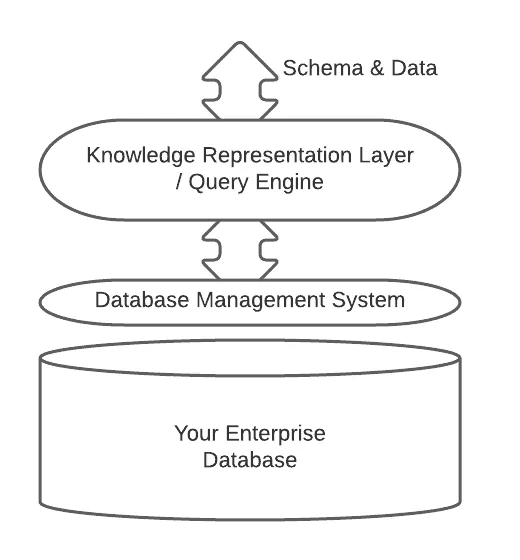

# 事实引擎架构

> 原文：<https://towardsdatascience.com/the-factengine-architecture-6d90ac09b8b8?source=collection_archive---------42----------------------->

## 你已经有了一个知识图表

知识表示层架构。图片作者。

FactEngine 计划(www.factengine.ai)旨在从根本上重新思考数据库的概念，并为您提供工具来使用您已经拥有的技术来构建您的知识图……因为您已经有一个了。

该体系结构是在现有数据库上建立知识表示模型的一种方法，不管该数据库是什么。通过这种方式，您可以保留现有的数据库，并使用表示知识图的模型，就像您已经迁移到一个专门构建的模型一样。这种类型的架构不是 FactEngine 所独有的，本文旨在提供对其实现方式的深入了解。

最近，一些公司试图向你出售专门的知识图表和专门的图表数据库。这很大程度上是因为说服你放弃金钱、时间和精力，投资新技术符合他们的目的。没必要这样。

## 范式转变

范式转变就是要认识到…

" ***并不是你的数据是如何存储的才形成了图形数据库或知识图……而是你对数据库拥有的模型、元模型和查询语言决定了你是否拥有图形数据库或知识图*** 。"

在之前的一篇文章中，我在[中介绍了这个概念“什么是图形数据库？”](/what-is-a-graph-database-249cd7fdf24d)。在这里，我重新介绍了一个[对象-角色模型](https://en.wikipedia.org/wiki/Object-role_modeling)变形为图形和实体关系模型的可视化:

对象-角色模型变形为属性图模式和实体关系图。图片作者。

本质上，如果您在数据库上应用知识表示/工程甚至推理模型，您感兴趣的不是数据如何存储的功能…而是您可以快速轻松地对数据库做什么。使用知识表示语言，如对象-角色建模，使您能够将数据库理解为基于关系或图的。

性能、可伸缩性等，您可以留给您的数据库供应商。如果可以的话，把热情和政治放在一边…关系/SQL 数据库 SQL Server，例如，声称是[最快的数据库，它是一个混合图形和关系数据库。所以，我觉得我们需要批评那些试图说服你需要一个专用的图形数据库来享受快速图形查询的图形数据库供应商。](https://cloudblogs.microsoft.com/sqlserver/2017/09/27/sql-server-2017-fast-faster-and-the-fastest-database-everywhere-you-need-it/)

我不想在这里写一篇关于对象-角色建模(ORM)的论文…我邀请你说服自己 ORM 是一种适合知识表示的语言。我在一篇关于数据科学的早期文章中介绍了一些概念，[“为什么要学习对象-角色建模？”](/why-learn-object-role-modelling-4eebd93dcda2#:~:text=The%20reasons%20for%20that%20are,to%20go%20the%20other%20way.)。

事实上，这篇文章宣扬了这样一种观点，即*关联数据*是市场上几乎所有数据库的权限，而不仅仅是专用的图形数据库。也就是说，有了正确的数据库架构，您可以享受图形数据库或专用知识图的所有好处…FactEngine 恰好实现了这种架构。

例如，GRAKN 数据库在 Cassandra 数据库[1]上使用知识表示，并且在名称上是一个数据库。同样，FactEngine 在任何兼容的数据库上使用知识表示。范例是现有数据库上的知识表示和一种节省时间的查询语言。

## 互联数据—您已经拥有了

如果你有一个关系数据库，你的数据已经被连接了…你想要的是一种用简单易用的图形查询语言来查询数据的方法。当您使用对象-角色建模作为数据库上的映射覆盖时…这很简单，因为:

关系数据库上的图形查询语言。图片作者。

## 不限于关系数据库

“现存数据库架构上的知识表示”不限于关系数据库，您同样可以将该架构应用于图形数据库。基本上，您需要做的就是将自然语言图形查询翻译成 SQL 或图形查询语言。FactEngine 的第一次迭代看到我们使用 ODBC 和 SQL，因为它涵盖了最广泛使用的数据库，以及经过数十年研究和开发的数据库，为您提供了您期望从专业数据库获得的所有东西(ACID 合规性、可伸缩性、数据类型、安全性、分片等)。

那些支持递归查询的关系数据库已经支持您想要执行的经典的“朋友的朋友的朋友”类型的查询，这些查询被错误地认为是适合专用图形数据库的领域。

## 两全其美

通常，当您购买专用的图形数据库时，您会被该数据库的特性所困扰，包括它的查询语言。这里展示的架构让您拥有两个世界的精华…您可以用图形查询语言和 SQL，或者您的数据库拥有的任何查询语言来查询您的数据库。

## 不可能那么容易！

这真的很简单…从概念上来说！一旦你进行了范式转换，用一种知识表示语言来可视化你的数据库，比如对你的数据库进行对象-角色建模，你所需要关注的就是你想如何查询数据库。如果可以选择图形查询，我觉得大多数人都会选择它。与 SQL 相比，图形查询很容易编写。

## 技术在哪里？

事实引擎架构已经成为现实。关系数据库上的直接图形查询是现实的。今年，FactEngine 团队将专注于递归查询和知识工程规则在数据库上的实现。

在这个阶段，我认为分享架构并围绕关系数据库和连接数据建立对话是很重要的。有一个很好的理由让你选择现有的数据库…如果没有必要，为什么要把婴儿和洗澡水一起倒掉，转到一个专用的图形数据库呢？

感谢您的阅读。如果时间允许，我会写更多关于对象角色建模、事实引擎和连接数据查询的内容。

1.  Messina A .等，2017 年 7 月，“BioGrakn:基于知识图的生物医学科学语义数据库”，智能系统与计算进展。

— — — — — — — — — — — — — — — — — — — — — — — — — — — — — — —