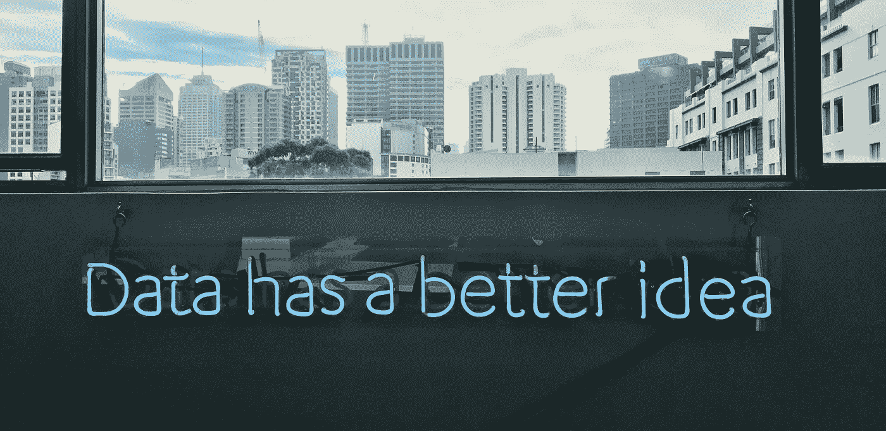

# 困扰人工智能的错误哲学

> 原文：<https://towardsdatascience.com/the-false-philosophy-plaguing-ai-bdcfd4872c45?source=collection_archive---------18----------------------->

## 埃里克·j·拉森和人工智能的神话

来源:[弗兰克·查马基](https://unsplash.com/@franki)转自 [Unsplash](https://unsplash.com/) 。

预言人工智能(AI)领域并不陌生。在 1960 年的福特杰出演讲上，经济学家希尔伯特·西蒙宣称，在 20 年内，机器将能够完成人类可以完成的任何任务。1961 年，信息论的创始人克劳德·香农[预言](https://www.youtube.com/watch?v=pHSRHi17RKM&ab_channel=IEEEInformationTheorySociety)科幻风格的机器人将在 15 年内出现。数学家 I.J. Good 构想了一个失控的“智能爆炸”，一个比人类更聪明的机器迭代提高自身智能的过程。古德在 1965 年写道，他预测爆炸将在二十世纪末到来。1993 年，Verner Vinge 创造了这个爆炸的开端“[奇点](https://edoras.sdsu.edu/~vinge/misc/singularity.html)”，并声称它将在 30 年内到来。雷·库兹韦尔后来宣布了一个历史定律， [*加速回归定律*](https://www.kurzweilai.net/the-law-of-accelerating-returns) ，预测奇点将在 2045 年到来。最近，埃隆·马斯克声称超级智能[离我们不到五年](https://www.cnbc.com/2020/07/29/elon-musk-deepmind-ai.html)，从斯蒂芬·霍金到尼克·博斯特罗姆的学者都警告我们流氓人工智能的危险。

炒作不仅限于少数公众人物。每隔几年就会有人工智能领域研究人员的调查，要求他们预测我们何时会实现人工*一般*智能(AGI)——机器具有一般用途，至少和人类一样智能。来自[这些调查](https://aiimpacts.org/ai-timeline-surveys/)的估计中值给出了在 21 世纪 20 年代的某个时候 AGI 有 10%的可能性，在 2035 年到 2050 年之间 AGI 有二分之一的可能性。该领域的主要研究人员也做出了惊人的预测。OpenAI 的首席执行官[写道](https://moores.samaltman.com/)在未来几十年，计算机“将做几乎所有的事情，包括做出新的科学发现，这将扩展我们的‘一切’概念，”谷歌 Deepmind 的联合创始人[说](https://future.fandom.com/wiki/Scenario:_Shane_Legg)“人类水平的人工智能将在 2020 年代中期被超越。”

这些预测是有后果的。一些人称 AGI 的到来是一种生存威胁，他们怀疑我们是否应该停止技术进步以避免灾难。其他人正投入数百万的慈善基金来避免 AI 灾难。例如，*机器智能研究所，*已经获得了[数百万](https://intelligence.org/topcontributors/)的资助，用于“确保比人类更聪明的人工智能产生积极影响。”

人类水平的人工智能即将到来的论点通常吸引了我们迄今为止在机器学习方面看到的进展，并假设它将不可避免地导致超级智能。换句话说，让现有的模型变得更大，给它们更多的数据，这就是 AGI。其他论点只是引用上述专家调查本身作为证据。例如，托比 for 在他的书《悬崖》中认为，AGI 对人类构成了生存威胁(他认为在未来 100 年内，毁灭人类的可能性为 1/10)。在讨论它将如何被创造时，他首先引用了在人工智能上发表的学术论文的数量和人工智能会议的出席人数(这两者在最近几年都出现了飙升)，然后写道

> 一般来说，专家们并不认为 AGI 是一个不可能实现的梦想，而是认为它在十年内有可能实现，在一个世纪内更有可能实现。因此，让我们以此为起点来评估风险，并考虑如果 AGI 被创造出来会发生什么。(第。142)

是什么让这些研究人员如此自信地认为目前人工智能的方法是正确的？或者在狭窄领域解决问题只是程度上的不同，而不是种类上的不同，与真正的通用智能不同？圣达菲研究所教授 Melanie Mitchell 最近称狭义人工智能——结构化环境中定义明确的任务，如预测肿瘤或下棋——的进展将我们推向 AGI，这是人工智能研究中最重要的谬误。她引用休伯特·德雷福斯的话，指出这类似于声称猴子爬树是登上月球的第一步。没有支持这种谬论的论据，只有对当前趋势的推断。但是 T2 有反对的理由。

机器学习工程师埃里克·j·拉森(Erik J. Larson)反对人工智能的正统观点。在 [*人工智能的神话*](https://smile.amazon.com/Myth-Artificial-Intelligence-Computers-Think/dp/0674983513?sa-no-redirect=1) 中，拉森加入了抗议人工智能领域正在追求一条无法通向广义智能的道路的一小部分声音。他认为，当前的方法不仅基于对知识创造的根本误解，而且还积极阻止进步——无论是在人工智能还是其他学科。

Larson 指出，当前的机器学习模型是建立在*归纳*的原则之上的:从特定的观察中推断模式，或者更一般地说，从经验中获取知识。这部分解释了当前对“大数据”的关注——观察越多，模型越好。我们给一个算法输入数以千计带标签的猫的图片，或者让它下数百万盘国际象棋，然后它将输入之间的哪些关系关联起来，从而产生最佳的预测准确度。一些模型比其他模型更快，或者在模式识别方面更复杂，但本质上它们都在做同样的事情:从观察中进行统计概括。

这种归纳方法对于在明确定义的输入上为特定任务构建工具很有用；例如，分析卫星图像、推荐电影和检测癌细胞。但是归纳法不能创造人类思维所体现的通用知识。人类发展出关于世界的一般理论，通常是关于我们没有直接经验的事物。归纳法意味着你只能知道你观察到的东西，而我们许多最好的想法并不是来自经验。事实上，如果他们这样做了，我们就永远无法解决新的问题，或创造新的东西。相反，我们解释恒星、细菌和电场的内部；我们创造计算机，建设城市，改变自然——人类创造力和解释力的壮举，而不仅仅是统计相关性和预测。拉森在讨论哥白尼时写道

> 只有首先忽略所有的数据或重新构思它，哥白尼才能拒绝地心说模型，并推断出一个激进的太阳系新结构。(请注意，这提出了一个问题:“大数据”会有什么帮助？这些数据都符合错误的模型。)

事实上，大多数科学都包括寻找理论来解释不被观测者所观测到的现象。我们用重力场解释苹果坠落，用大陆漂移解释山脉，用细菌解释疾病传播。与此同时，当前的人工智能系统受到它们所观察到的事物的限制，完全无法对未知事物进行理论化。

由归纳引起的困惑并不是什么新鲜事。大卫·休谟是第一个指出其明显的逻辑缺陷的人:没有有限数量的观察可以证明一个普遍的原则。无论我们见证了多少片绿叶，我们都不能断定*所有的*叶子都是绿色的。这在那些相信归纳是人类知识基础的人中间引起了轩然大波。例如，Bertrand Russell[哀叹道](https://plato.stanford.edu/entries/induction-problem/)如果休谟的问题不能解决，那么“理智和疯狂之间就没有智力上的区别。”

20 世纪的两位哲学家解决了这个问题，他们注意到人类不是通过归纳来创造知识的:查尔斯·桑德斯·皮尔士和卡尔·波普尔爵士。两人都注意到，我们的知识依赖于猜测和检验，依赖于不合理和不合理的直觉跳跃，依赖于反复试验。人类猜测一般，用观察来反驳我们的猜测。我们创造性地推测世界的各个方面是如何工作的(光速是恒定的，花生酱加青豆味道很好)，并用批评和观察来否定那些错误的想法。我们在秋天看到一片棕色的叶子，并断定不是所有的叶子都是绿色的。

> 大胆的想法、不合理的预期和思辨的思想是我们解释自然的唯一手段:我们唯一的工具，我们抓住自然的唯一工具。我们必须冒险让他们赢得我们的奖品。我们当中那些不愿意让自己的观点面临被反驳的危险的人，是不会参与科学游戏的。
> 
> ——卡尔·波普尔，*科学发现的逻辑*

皮尔士把猜测和检查的方法称为“溯因法”(尽管这个术语现在有各种各样的用法)。我们也没有好的绑架理论。要有一个，我们必须更好地理解人类的创造力。换句话说，在我们有可能产生真正的人工智能之前，我们需要一场解释绑架的哲学和科学革命。只要我们继续依赖归纳，人工智能程序将永远是预测机器，无可救药地受限于它们被输入的数据。

拉森将人工智能狭隘的解谜方法的焦点追溯到该领域的创始人艾伦·图灵:

> 图灵的伟大天才在于清除了理论上的障碍和对设计自主机器可能性的反对，但在这样做的时候，他缩小了智能本身的范围和定义。难怪人工智能开始生产狭隘的解决问题的应用程序，而且直到今天它仍在这样做。

图灵在他职业生涯的早期就认真对待创造力的问题。他称之为“直觉”，并想知道如何将它编入机器程序。然而，渐渐地，图灵开始用死记硬背解决定义明确的问题来识别智力。这正是机器擅长的领域——现在仍然如此。

对归纳的关注不仅阻碍了真正人工智能的发展，也开始影响其他科学领域。拉尔森特别提到了神经科学，认为许多研究人员已经忘记了理论在推进我们的知识中所扮演的角色，并希望通过更准确地绘制大脑地图来真正理解人脑。然而，假设这样的地图被开发出来——然后呢？只有当我们有一个理论要测试时，地图才有用。

把科学探究的焦点缩小到机械问题解决和信息处理的问题上，就是忘记了科学的主要作用是寻找好的解释。我们想知道*为什么是*，而不是简单地做预测。数据可以证实或证伪我们的理论，但理论重视数据，而不是相反。理论不会神奇地出现在越来越大的数据集中。他们创造性地推测。

人工智能的神话出现在贬低人类的创造力和知识创造能力成为智力时尚的时候。我们不断地被提醒，我们有偏见，不理性，容易被误导，固执，不讲道理。拉森提醒我们人类是特殊的。我们能够凭直觉发展疫苗，能够凭创造性的洞察力改善我们的环境，能够创造能够解释宇宙的深刻解释。而且没有太多的训练数据。